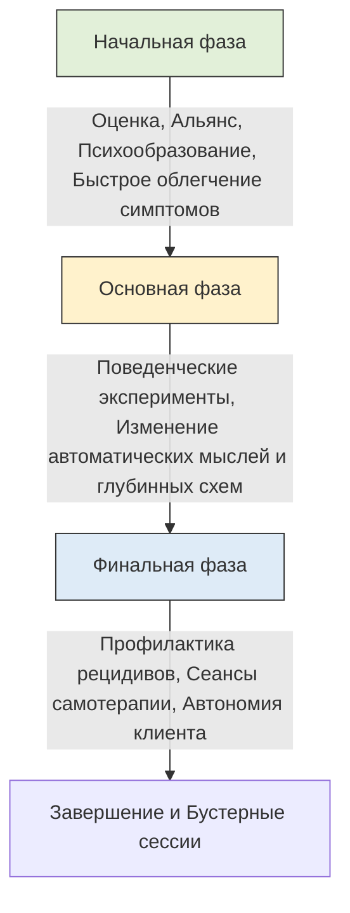
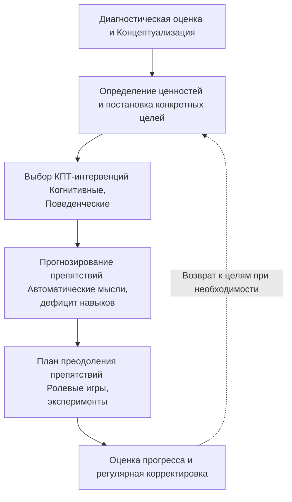

Когда человек сталкивается с тяжелыми эмоциональными состояниями, его жизнь часто начинает напоминать густой туман, в котором потеряны все ориентиры. Кажется, что хаос и непредсказуемость чувств управляют каждым днем, а выход из этого состояния скрыт за непреодолимой стеной. Когнитивно-поведенческая терапия (КПТ) предлагает не просто сочувствие, а четкую и научно обоснованную систему выхода из этого тумана.

Если представить процесс выздоровления как сложное путешествие, то психотерапия — это не блуждание наугад, а движение по выверенному маршруту. Основой этого пути служит **когнитивная концептуализация** (понимание того, как мысли и действия человека поддерживают его проблему), которая превращается в дорожную карту, ведущую к конкретным жизненным целям клиента *(Бек, 2021)*.

### Структура пути: Три этапа когнитивно-поведенческой терапии

Психотерапевтический процесс в КПТ не является бесконечным. Он разбит на три логических этапа, каждый из которых имеет свои уникальные цели и инструменты. Эта архитектура позволяет плавно перевести человека от состояния острого кризиса к полной автономии, когда он сам становится для себя эффективным терапевтом *(Бек, 2021)*.

#### 1. Начальная фаза: Стабилизация и построение альянса

Первые встречи направлены на то, чтобы «остановить кровотечение» — максимально быстро снизить остроту страданий и дать клиенту инструменты для самопомощи. На этом этапе терапевт проявляет высокую активность и директивность (направляет процесс).

* **Оценка и концептуализация:** Специалист собирает данные о жизни клиента, чтобы сформировать гипотезу о том, как именно **автоматические мысли** (мгновенные оценочные реакции на события) влияют на его состояние *(Добсон & Добсон, 2021)*.
* **Укрепление альянса и целеполагание:** Терапевт и клиент выстраивают **терапевтический альянс** (партнерские отношения, основанные на доверии) и определяют измеримые цели лечения *(Бек, 2021)*.
* **Психообразование (обучение принципам работы психики):** Человека знакомят с когнитивной моделью, объясняя, что нас расстраивают не сами события, а то, как мы их воспринимаем *(Добсон & Добсон, 2021)*.
* **Снятие острых симптомов:** Применяется **планирование активности** (составление графика дел, приносящих радость или чувство достижения), что особенно важно при борьбе с депрессией *(Бек, 2021)*.

#### 2. Основная фаза: Когнитивная реструктуризация и трансформация

Когда состояние стабилизируется, фокус работы смещается на изменение глубинных причин страданий. Это самый объемный этап, требующий активного сотрудничества.

* **Работа с мыслями:** Клиент учится выявлять негативные мысли, проверять их на соответствие реальности и формулировать более адаптивные ответы *(Добсон & Добсон, 2021)*.
* **Поведенческие эксперименты и экспозиция (намеренное столкновение со страхом):** Человек на практике проверяет свои пугающие убеждения, чтобы убедиться в их неточности и получить новый опыт *(Добсон & Добсон, 2021)*.
* **Изменение глубинных убеждений:** Работа с фундаментом — **схемами** (базовыми представлениями о себе и мире, например, «Я никчемен»). Терапевт помогает расшатать старые убеждения и укрепить новые, поддерживающие взгляды *(Бек, 2021)*.

#### 3. Финальная фаза: Автономия и профилактика рецидивов

Главная цель КПТ — сделать так, чтобы специалист стал больше не нужен. Клиент берет на себя роль лидера.

* **Постепенное снижение частоты встреч:** Сессии проводятся раз в две или четыре недели, чтобы человек мог тренировать навыки самостоятельного решения проблем *(Бек, 2021)*.
* **Разработка плана предотвращения рецидивов (повторных срывов):** Создается письменная инструкция: как заметить первые признаки ухудшения и какие шаги предпринять *(Бек, 2021)*.
* **Сеансы самотерапии:** Клиент самостоятельно проводит для себя полноценные сессии, выявляя трудности и планируя задания *(Бек, 2021)*.
* **Бустерные сессии:** Поддерживающие встречи через 3, 6 или 12 месяцев для проверки прогресса *(Бек, 2021)*.

### Фундамент изменений: Архитектура терапевтического плана

В КПТ план лечения никогда не строится на пустом месте или на основе одного лишь диагноза. Он всегда строго индивидуализирован. Грамотный терапевтический план опирается на диагностическую оценку, когнитивную формулировку проблемы, личные сильные стороны и ценности клиента, а также на анализ потенциальных препятствий, которые могут возникнуть на пути к этим целям *(Бек, 2021)*.

Суть лечения в рамках КПТ можно описать так: каждый день совершать небольшие, но целенаправленные изменения в своем мышлении и поведении, двигаясь по заранее намеченному маршруту *(Бек, 2021)*.

### Случай Стивена: Возвращение к осмысленной жизни

Рассмотрим пример плана терапии из практики канадских специалистов для клиента по имени Стивен Р. *(Добсон & Добсон, 2021)*.

**Контекст:** Стивен обратился за помощью по рекомендации врача. Он страдал от подавленного настроения, чувства вины, неконтролируемого беспокойства, раздражительности и трудностей в управлении гневом, на фоне чего у него увеличилось потребление алкоголя *(Добсон & Добсон, 2021)*. **Абстрактные цели клиента:** Стивен хотел успешно вернуться на работу, добавить структурированности в свои дни, научиться справляться с гневом и тревогой, а также освоить навыки разрешения конфликтов *(Добсон & Добсон, 2021)*.

Опираясь на эти данные, терапевт составил следующий поэтапный план лечения *(Добсон & Добсон, 2021)*:

1.  **Ориентация на модель КПТ:** Обучение клиента тому, как связаны его мысли, эмоции и поведение.
2.  **Создание альянса:** Укрепление терапевтических отношений, построенных на принципе сотрудничества.
3.  **Психообразование:** Предоставление информации о депрессии, тревоге и влиянии алкоголя.
4.  **Поведенческая активация:** Структурирование и планирование повседневных занятий (особенно тех, которые приносят чувство мастерства и достижения).
5.  **Профессиональная адаптация:** Прямая помощь и планирование шагов для успешного возвращения на работу.
6.  **Тренинг навыков:** Обучение коммуникативным навыкам для уверенного разрешения конфликтных ситуаций (чтобы снизить вспышки гнева).
7.  **Эмоциональная регуляция (умение справляться с чувствами):** Увеличение толерантности к неприятным эмоциям, особенно к злости.
8.  **Когнитивная работа:** Отслеживание автоматических мыслей и реструктуризация дисфункциональных убеждений.
9.  **Экспозиция:** Потенциальное применение техники намеренного столкновения со страхом для снижения социального беспокойства.

Этот план показывает, как общие жалобы клиента разбиваются на конкретные мишени (навыки общения, режим дня, отслеживание мыслей), с которыми можно работать от сессии к сессии.

### Случай Эйба: Преодоление изоляции и безработицы

Другой яркий пример детального планирования приводит доктор Джудит Бек в работе с клиентом по имени Эйб, страдающим от тяжелой депрессии. Общий план лечения для него звучал так: «Снизить депрессию, чувство безнадежности и тревогу; повысить оптимизм и чувство надежды» *(Бек, 2021)*.

Однако этот общий план был разбит на конкретные проблемы, терапевтические интервенции и способы преодоления препятствий *(Бек, 2021)*:

| Проблема / Цель клиента | Применяемые КПТ-интервенции (План действий) |
| :--- | :--- |
| **Безработица (найти работу)** | Изучение преимуществ и недостатков поиска работы. Оценка безнадежных мыслей («Я никогда не найду работу»). Тренировка прохождения собеседования с помощью ролевой игры *(Бек, 2021)*. |
| **Избегание (возвращение к активности)** | Планирование выполнения конкретных дел по дому по расписанию. Проведение поведенческих экспериментов для проверки мысли «У меня не хватит сил». Составление списка поощрений за выполненную работу *(Бек, 2021)*. |
| **Социальная изоляция (восстановить связи)** | Планирование встреч с семьей и друзьями. Оценка искаженных мыслей («Он не захочет со мной разговаривать»). Репетиция того, как объяснить другу свое долгое отсутствие *(Бек, 2021)*. |
| **Конфликт с бывшей женой (снизить вину)** | Обучение навыкам ассертивного (уверенного) общения. Составление «круговой диаграммы ответственности», чтобы реалистично оценить причины развода *(Бек, 2021)*. |

**Анализ препятствий:** Отличительной чертой хорошего плана в КПТ является предвосхищение трудностей *(Бек, 2021)*. Например, когда Эйб планировал пойти на собеседование, терапевт заранее определила потенциальное препятствие — автоматические мысли: «Я произведу плохое впечатление; Я все провалю» *(Бек, 2021)*. В ответ на это в план был добавлен пункт по преодолению препятствия: провести ролевую игру на сессии и целенаправленно поработать над установлением визуального контакта, твердым рукопожатием и уверенной улыбкой *(Бек, 2021)*.

### Гибкость в рамках структуры: Живой процесс

План лечения в КПТ — это не жесткий, высеченный в камне закон, а гибкий инструмент. Если на одной из сессий выясняется, что клиент не может приступить к поиску работы из-за сильной паники, терапевт может временно отойти от первоначального пункта и переключиться на работу с паническими атаками или эмоциональной регуляцией *(Бек, 2021)*. Психотерапевт постоянно наблюдает за прогрессом, собирает обратную связь и меняет маршрут, если видит, что клиент застрял или столкнулся с непредвиденным жизненным кризисом.

### Вывод и литература

Терапевтический план в КПТ — это надежный мост между текущим состоянием и той жизнью, которую человек хочет вести. Он превращает абстрактные желания («хочу быть счастливым») в набор конкретных, измеримых действий и навыков. Проходя через стадии стабилизации, трансформации и автономии, клиент перестает быть пассивной жертвой своих эмоций и становится активным строителем собственного благополучия *(Бек, 2021)*.

**Литература:**
- Бек, Дж. С. (2021). *Когнитивно-поведенческая терапия. От основ к направлениям* (3-е изд.). ООО "Прогресс книга".
- Добсон, Д., & Добсон, К. (2021). *Научно-обоснованная практика в когнитивно-поведенческой терапии*. Питер.

---

### Проверка понимания

**Микро-кейс:** Вы работаете с клиенткой Анной. Она поставила цель: «Начать ходить в спортзал 3 раза в неделю для борьбы с апатией». Однако спустя две недели Анна признается, что не сделала ни одного шага к залу. Причина — мысль: *«Все будут смотреть на меня и осуждать мою фигуру»*. Ей становится слишком стыдно, и она остается дома.

**Вопрос:** Опираясь на принципы КПТ (в частности, на необходимость анализа и преодоления потенциальных препятствий), как вы скорректируете план Анны? Какую конкретную когнитивную (работа с мыслями) или поведенческую (действие) интервенцию вы бы включили в обновленный план, чтобы помочь ей преодолеть это сопротивление?
