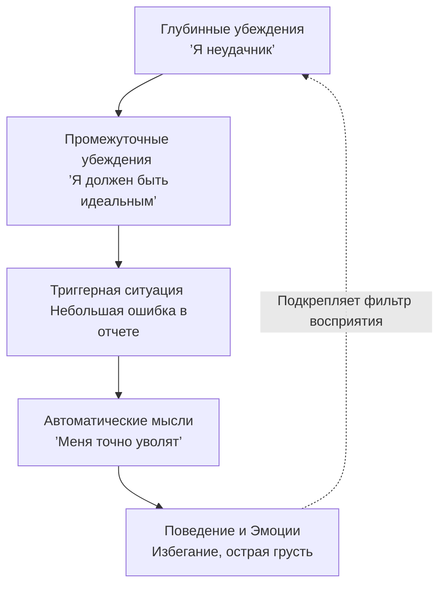
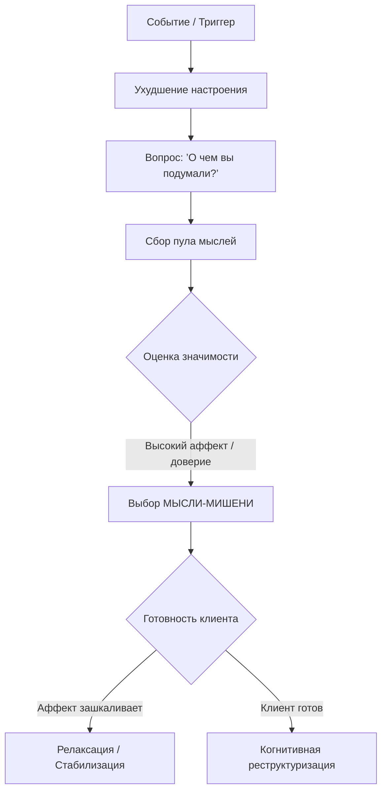

Каждый день мы сталкиваемся с огромным потоком информации и принимаем тысячи решений. В большинстве случаев наш мозг делает это на «автопилоте», мгновенно оценивая ситуации и подсказывая нам, как реагировать. Однако иногда этот внутренний автопилот дает сбой: мы можем внезапно почувствовать сильную тревогу из-за случайного взгляда коллеги или впасть в отчаяние из-за мелкой ошибки в работе.

Когнитивно-поведенческая терапия (КПТ) объясняет такие резкие перепады настроения действием мощного механизма — **автоматических мыслей**, которые вырастают из наших самых глубоких убеждений. Понимание этой связи — первый шаг к тому, чтобы перестать быть заложником собственных страхов и вернуть себе контроль над своим поведением *(Бек, 2021)*.

### Спонтанный внутренний голос: Природа автоматических мыслей

**Автоматические мысли** — это быстрые, мимолетные и зачастую неосознаваемые потоки идей или образов, которые непрерывно сопровождают наше основное, осознанное мышление *(Бек, 2021)*. Они возникают спонтанно, словно рефлекс, в ответ на любые внешние события или внутренние **триггеры** (стимулы, запускающие реакцию), такие как учащенное сердцебиение или воспоминание *(Wenzel, 2021)*.

Главная особенность автоматических мыслей заключается в том, что в моменты стресса человек принимает их за «чистую монету». Если в голове проносится мысль «Я ничего не могу сделать правильно», вы, скорее всего, поверите ей без критической оценки *(Бек, 2021)*. Часто мы даже не замечаем саму мысль, но зато очень ярко ощущаем эмоцию, которая за ней следует — например, острую грусть или тревогу *(Бек, 2021)*. У людей в состоянии депрессии этот внутренний голос искажается, становясь **дисфункциональным** (разрушительным или мешающим достижению целей) *(Бек, 2021)*.

### Иерархия смыслов: Взаимосвязь убеждений и мыслей

Почему в одной и той же ситуации два человека реагируют по-разному? Ответ кроется в архитектуре нашей психики. В КПТ мышление рассматривается как многоуровневая структура, где автоматические мысли — это лишь верхушка айсберга *(Wenzel, 2021)*.

1.  **Глубинные убеждения (Схемы):** Это фундамент — глобальные, жесткие представления человека о себе, других людях и мире *(Wenzel, 2021)*. Дисфункциональные убеждения обычно звучат как абсолютные приговоры: «Я беспомощен», «Меня невозможно любить», «Я никчемен» *(Бек, 2021)*.
2.  **Промежуточные убеждения:** Наши жизненные правила и допущения (например, «Если я не сделаю работу идеально, то все увидят, что я неудачник») *(Therapist Guide, n.d.)*.
3.  **Автоматические мысли:** Поверхностный уровень, возникающий здесь и сейчас в конкретной ситуации *(Бек, 2021)*.

Глубинные убеждения действуют как мощный **когнитивный фильтр** (линза, через которую мозг искажает восприятие реальности) *(Бек, 2020)*. Когда человек со схемой «Я некомпетентен» сталкивается с задачей, фильтр мгновенно генерирует мысль: «Я никогда с этим не справлюсь». Мозг начинает выхватывать только негатив, подтверждающий это убеждение, и полностью игнорирует позитивные факты *(Бек, 2021)*.

### Невидимый двигатель: Взаимосвязь поведения и оценки

Когнитивная модель утверждает, что именно наша автоматическая мысль напрямую определяет наши эмоции и, что самое важное, — наше поведение *(Бек, 2021)*. Рассмотрим клинический пример пациента, который думает об уборке:

* **Действие мысли:** Пациент думает: «Я слишком устал. Если я попытаюсь, я сделаю все плохо» *(Бек, 2021)*.
* **Результат:** Эта мысль вызывает апатию, что приводит к дисфункциональному поведению — пациент остается на диване (избегание) *(Бек, 2021)*.

Так рождается **самоисполняющееся пророчество** (ситуация, когда поведение, продиктованное страхом, приводит к подтверждению этого страха). Оставшись на диване, пациент замечает свое бездействие, что порождает новую мысль: «Я ни на что не годен» *(Бек, 2021)*. Избегая дел, он лишает себя возможности получить позитивный опыт успеха, что укрепляет его глубинное убеждение в беспомощности *(Лихи, 2021)*.

### Ловушки восприятия: Контраст реакций

| Уровень модели | Адаптивный (здоровый) цикл | Дисфункциональный цикл |
| :--- | :--- | :--- |
| **Глубинное убеждение** | «В целом я компетентен» *(Бек, 2021)*. | «Я абсолютно никчемен» *(Бек, 2021)*. |
| **Автоматическая мысль** | «Это сложно, но я справлюсь» *(Бек, 2021)*. | «Это катастрофа, я опозорюсь!» *(Бек, 2021)*. |
| **Поведенческая реакция** | Решение задачи, поиск помощи. | Избегание, отказ от попыток *(Бек, 2021)*. |

### Распознавание мыслей: Ловля фонового шума

Первый шаг к свободе — научиться «ловить» эти мысли. Самый эффективный способ — задать себе вопрос в момент резкого ухудшения настроения: **«О чем я подумал прямо сейчас?»** *(Бек, 2021)*.

Если поймать мысль сразу не удается, можно использовать техники визуализации (представить ситуацию в деталях) или ролевые игры *(Бек, 2021)*. Специалист может предложить клиенту намеренно противоположную мысль, чтобы спровоцировать внутренний отклик и выявить скрытое убеждение *(Бек, 2021)*.

### Выбор мишени: Приоритеты в когнитивном хаосе

Не все мысли одинаково важны. Чтобы терапия не превратилась в бесконечную дискуссию, необходимо выбрать **мысль-мишень** — наиболее важную («горячую») когницию, которая причиняет максимальную боль *(Therapist Guide, n.d.)*.

Для выбора мишени используется оценка от 0 до 100%:
* **Интенсивность эмоции**, связанной с мыслью.
* **Степень доверия** к самой мысли *(Therapist Guide, n.d.)*.

| Критерии слабой мысли | Критерии «горячей» мысли (Мишень) |
| :--- | :--- |
| Доверие менее 30% *(Бек, 2021)*. | Доверие 80–100% *(Бек, 2021)*. |
| Легкий дискомфорт. | Острая паника, гнев, стыд или отчаяние *(Бек, 2021)*. |
| Случайная и нетипичная. | Постоянно повторяется и блокирует цели *(Бек, 2021)*. |

### Терапевтический климат: Готовность к работе

Выбор мишени бесполезен, если уровень **аффекта** (сильного эмоционального возбуждения) слишком высок. В состоянии паники человек физически не может мыслить логически *(Бек, 2021)*. В таких случаях сначала применяются техники релаксации или осознанного дыхания *(Бек, 2021)*.

Кроме того, мишенью могут стать мысли о самой терапии. Если клиент думает: «Терапевт меня осудит», именно это **препятствующее терапии убеждение** должно обсуждаться в первую очередь *(Бек, 2021)*.

### Вывод и литература

> «То, что люди думают и чувствуют, определяется не ситуацией самой по себе, а тем, как конкретный человек истолковывает ее. Реакции людей всегда обретают смысл, если мы знаем, что они думают» *(Бек, 2021)*.

Автоматические мысли — это не истина, а лишь эхо ваших глубинных убеждений. Научившись находить «горячие» мысли и проверять их на достоверность, вы обретаете надежный щит против жизненных кризисов и возвращаете себе право управлять своими поступками.

**Литература:**
- Бек, Дж. С. (2020). *Когнитивная терапия для сложных случаев*. ООО "Диалектика".
- Бек, Дж. С. (2021). *Когнитивно-поведенческая терапия. От основ к направлениям* (3-е изд.). ООО "Прогресс книга".
- Добсон, Д., & Добсон, К. (2021). *Научно-обоснованная практика в когнитивно-поведенческой терапии*. Питер.
- Лихи, Р. (2021). *Преодоление сопротивления в когнитивной терапии*. Питер.
- Therapist Guide to Brief CBT Manual. (n.d.).
- Wenzel, A. (Ed.). (2021). *Handbook of Cognitive Behavioral Therapy*. American Psychological Association.

---

### Проверка понимания

**Микро-кейс:** Марку поручили важную презентацию. Как только он садится за работу, в его голове возникает мысль: *«Я обязательно запнусь, клиенты решат, что я бездарность, и меня с позором уволят»*. Марк чувствует удушающую тревогу, закрывает ноутбук и идет играть в видеоигры, в итоге срывая дедлайн.

Другой случай: Михаил на корпоративе чувствует панику и думает: *«Коллеги увидят мои дрожащие руки и поймут, что я слабый неудачник»* (Доверие — 90%, Эмоция — 95%). При этом он говорит терапевту: *«Вы наверняка думаете, что я сумасшедший»*.

**Вопрос:** Опираясь на принципы выбора мысли-мишени, объясните:
1. Какую именно мысль Михаила нужно выбрать как «горячую» мишень для работы?
2. Однако, прежде чем разбирать ситуацию на корпоративе, с какой «препятствующей» мыслью Михаила терапевт должен поработать прямо сейчас?
3. Как на примере Марка проявляется механизм «самоисполняющегося пророчества»? Как его поведение подкрепило его возможную глубинную схему «Я некомпетентен»?
