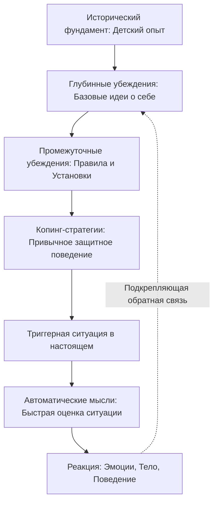

Представьте, что вы оказались в центре огромного, густого и совершенно незнакомого леса. У вас нет ни карты, ни компаса, ни понимания того, в какую сторону двигаться. Вы можете начать хаотично метаться среди деревьев, тратя последние физические силы и надеясь на случайное спасение. Однако наиболее мудрым решением будет остановиться, найти самую высокую точку, внимательно изучить рельеф местности и составить подробный маршрут. Для человека, который обращается за психологической помощью, его внутреннее состояние часто напоминает именно такой непроходимый лес, сотканный из болезненных эмоций, разрушительных поведенческих паттернов и запутанных социальных связей.

В когнитивно-поведенческой терапии (КПТ) роль такого навигатора и карты выполняет **когнитивная концептуализация**. Это не просто формальный документ, а живой, динамичный процесс, который превращает разрозненные жалобы пациента в логичную и понятную систему, давая человеку надежду и конкретные инструменты для трансформации своей жизни.

## Архитектор изменений: Определение и утилитарность метода

**Когнитивная концептуализация** — это набор обоснованных гипотез о том, почему у конкретного человека возникли психологические проблемы и какие именно внутренние и внешние факторы продолжают поддерживать их в настоящем моменте. Если мы рассматриваем психотерапию как путешествие, то концептуализация — это дорожная карта, а цели, поставленные клиентом, — конечный пункт назначения.

Главная задача этого инструмента заключается в упорядочивании колоссального объема информации. Он выполняет несколько критически важных функций:
1.  **Прогностическая функция:** Помогает терапевту понять уникальные уязвимости и сильные стороны клиента, предсказывая возможные реакции на те или иные вмешательства.
2.  **Реляционная функция:** Создает прочный фундамент для терапевтического альянса. Когда клиент видит, что его проблемы разложены по полочкам и имеют логическое объяснение, уровень доверия к специалисту и мотивация к работе возрастают.
3.  **Стратегическая функция:** Позволяет подобрать максимально точные и эффективные техники для лечения. Без этого фундамента терапия рискует превратиться в бессистемный и малоэффективный перебор случайных методик.

## Слои психики: Архитектура нашего восприятия

Фундаментом когнитивно-поведенческого подхода является **когнитивная модель**. Ее суть проста, но глубока: наши чувства, физиологические реакции и поступки определяются не самими жизненными событиями, а тем, как мы их воспринимаем и истолковываем. Процесс концептуализации позволяет разложить это восприятие на несколько структурных уровней, двигаясь от поверхности к глубине.

### 1. Глубинные убеждения (Корни системы)
В самом основании психики находятся **глубинные убеждения**. Это безусловные, жесткие и глобальные идеи о себе (например, «Я абсолютно никчемен», «Я беспомощна»), об окружающих людях («Никому нельзя доверять») или о мире в целом («Мир — это опасное место»). Эти убеждения формируются в раннем детстве под влиянием значимого жизненного опыта и воспринимаются человеком как абсолютная истина, не требующая доказательств.

### 2. Промежуточные убеждения (Каркас правил)
Над глубинными убеждениями надстраивается уровень **промежуточных убеждений**. Они состоят из жизненных правил, условных предположений и установок (например: «Если я не сделаю всё идеально, то окружающие увидят мою никчемность»). Эти правила создаются психикой как защитный механизм, позволяющий человеку справляться с болезненными глубинными убеждениями и адаптироваться к среде.

### 3. Автоматические мысли (Листья на ветвях)
Верхний, самый доступный для осознания уровень — это **автоматические мысли**. Это быстрые, непроизвольные оценочные суждения или образы, которые мгновенно вспыхивают в голове в ответ на конкретные внешние триггеры. Именно они запускают каскад эмоциональных и телесных реакций, заставляя человека действовать определенным образом.

**Механика процесса (Под капотом):** Глубинные убеждения работают как линзы искажающего фильтра. Чтобы выжить с ощущением «я плохой», психика вырабатывает промежуточные правила и стратегии совладания (**копинг-стратегии**), такие как перфекционизм или избегание. При возникновении стрессовой ситуации эта система генерирует автоматические мысли, которые подтверждают исходное убеждение, замыкая порочный круг.

## Дерево разума: Ментальные модели и границы метода

**Аналогия (Многолетнее дерево):** Для лучшего понимания можно сравнить структуру проблем человека с деревом. Глубинные убеждения — это корни, скрытые глубоко под землей; их не видно, но именно они определяют здоровье всего растения. Промежуточные убеждения и правила — это мощный ствол и ветви, формирующие каркас. Автоматические мысли — это листья, которые шелестят при каждом порыве ветра (текущих ситуаций). Пытаться «вылечить» дерево, просто обрывая засохшие листья, бесполезно — необходимо добираться до корней.

**Чем это не является:** Концептуализация — это не холодный медицинский диагноз и не статичный приговор. Крайне важно понимать различие между шаблонным и индивидуализированным подходом.

| Номотетический (Шаблонный) подход | Идиографический (Индивидуальный) подход |
| :--- | :--- |
| **Опора на диагноз:** Использует стандартные, готовые протоколы для конкретных расстройств (например, только протокол депрессии). | **Опора на личность:** Глубокая адаптация под уникальный жизненный опыт, историю и убеждения конкретного человека. |
| **Позиция терапевта:** Врач выступает как единственный эксперт, выдающий готовые вердикты и ярлыки. | **Совместный эмпиризм:** Терапевт и клиент работают как равноправные исследователи в одной команде. |
| **Применение:** Эффективен для типичных, неосложненных случаев. | **Применение:** Критически важен в сложных клинических случаях, когда стандартные решения не работают. |

## Практическое руководство: Совместное исследование

Процесс создания когнитивной концептуализации в КПТ — это не тайное действие специалиста. Напротив, это плод **совместного эмпиризма**, когда обе стороны участвуют в расследовании на равных.

### Алгоритм сбора информации: От поверхности к глубине
Процесс создания карты начинается с первой минуты знакомства и продолжается на протяжении всей терапии. Терапевт задает вопросы в строгой иерархической последовательности:

1.  **Первая сессия (Срез «Здесь и сейчас»):** Сбор объективных фактов о текущих симптомах, распорядке дня, триггерах и оценка безопасности клиента. На этом этапе ставятся первичные цели лечения.
2.  **Последующие сессии (Погружение в глубину):** Переход к поиску промежуточных и глубинных убеждений, а также изучению истории детства, чтобы понять, *почему* сформировались именно такие реакции.
3.  **Техника «Падающей стрелы»:** К выявленной автоматической мысли задается вопрос: «Если предположить, что это правда, что самого худшего это говорит о вас?». Это позволяет «спуститься» на более глубокие уровни психики.

### Клинический пример: Анализ случая Андреа
Рассмотрим классический пример из практики, иллюстрирующий, как исторические данные связываются с текущим поведением. Пациентка Андреа выросла в условиях бедности, в многодетной семье. Ее отец страдал алкоголизмом и применял физическое насилие, а мать была карающей и депрессивной. В детстве Андреа также пережила сексуальные домогательства.

Ниже представлена таблица ее Диаграммы когнитивной концептуализации (ДКК), которая показывает, как прошлое управляет ее реакциями в кабинете терапевта.

| Блок ДКК | Содержание (Кейс Андреа) |
| :--- | :--- |
| **Значимые данные из прошлого** | Бедность, 6 братьев и сестер. Насилие со стороны отца-алкоголика. Карающая мать. Сексуальные домогательства в детстве. |
| **Глубинные убеждения** | «Я ранимая», «Я беспомощная», «Я плохая». |
| **Промежуточные убеждения (Правила)** | «Если я дам психотерапевту неопределенный ответ, она не примет его, мне придется сосредоточиться на боли, и я буду ужасно себя чувствовать». «Если я не выполню задание, я потерплю неудачу. Но если я попытаюсь, я могу не справиться, и все увидят, какая я плохая». |
| **Копинг-стратегии (Защита)** | Дает неопределенные ответы («Я не знаю»), меняет тему. Избегает домашних заданий. Обвиняет терапевта или отвечает враждебно, чтобы прекратить обсуждение. |

**Анализ текущих реакций в настоящем:**

| Элемент анализа | Ситуация 1 | Ситуация 2 | Ситуация 3 |
| :--- | :--- | :--- | :--- |
| **Ситуация** | Терапевт спрашивает об отношениях с матерью. | Думает о выполнении задания. | Вспоминает о необходимости звонка сестре. |
| **Автоматическая мысль** | «Она делает это преднамеренно!». | «В чем смысл? Они всё равно не поверят мне». | «Я должна была позвонить еще на прошлой неделе». |
| **Значение мысли** | «Она причиняет мне вред». | «Я беспомощна». | «Я плохая». |
| **Эмоция и Поведение** | Гнев. Говорит враждебным тоном. | Безнадежность. Остается дома, ничего не делает. | Вина. Обвиняет сестру в том, что та звонила не вовремя. |

**Результат концептуализации:** Когда терапевт мягко представил Андреа эту схему в форме вопросов («Звучит ли это правдоподобно?»), ее враждебность и сопротивление обрели смысл. Она перестала считать себя «безнадежной» или «сумасшедшей», увидев конкретный механизм защиты раненой психики, который можно изменить.

## Ресурсный подход: От болезни к восстановлению

Современная когнитивная терапия, в частности **когнитивная терапия, ориентированная на восстановление (КТОВ)**, вносит важное дополнение в классическую модель. Она предписывает концептуализировать не только проблемы, но и **сильные стороны человека**.

В этом подходе специалист активно выявляет:
* Адаптивные (здоровые) убеждения клиента.
* Его скрытые таланты и навыки.
* Внутренние ресурсы и осмысленные жизненные устремления.

Вместо того чтобы годами копаться только в травмах, терапевт и клиент составляют план того, как использовать имеющиеся ресурсы для достижения желаемого будущего. При этом традиционные техники КПТ используются не как самоцель, а как средство для устранения препятствий на этом вдохновляющем пути.

## Совместная работа ради обретения контроля

Процесс построения концептуализации требует значительных усилий от обеих сторон. Специалисту необходима высочайшая степень эмпатии и ювелирное умение задавать сложные вопросы, не раня при этом клиента. От пациента же требуется мужество быть уязвимым и готовность честно исследовать свои самые мрачные автоматические мысли.

> **Критический терапевтический принцип:** Специалист никогда не должен показывать клиенту уже полностью заполненную форму ДКК в готовом виде. Это может лишить человека важного обучающего опыта или даже вызвать чувство обесценивания, будто его сложную жизнь просто втиснули в сухую таблицу.

Гипотезы должны предлагаться деликатно. Совместное рисование связей на доске или бумаге помогает клиенту увидеть логичную картину своей жизни. Как только человек понимает, *почему* он так реагирует, он перестает быть жертвой своих аффектов и становится активным архитектором собственного исцеления.

## Главный вывод и литература

Когнитивная концептуализация — это не статичная диагностическая таблица, а живой и динамичный компас. Она позволяет превратить хаос эмоциональной боли и жалоб в ясную, структурированную картину. Разложив историю пациента по полочкам от раннего детского опыта до автоматических реакций на вчерашнюю ссору, специалист и клиент получают четкий, пошаговый план лечения. Это превращает психотерапию из абстрактных бесед в прицельную, высокоэффективную работу по перестройке архитектуры человеческой психики.

**Литература:**
- Бек, Дж. С. (2020). *Когнитивная терапия для сложных случаев: что делать, когда простые решения не работают*. ООО "Диалектика".
- Бек, Дж. С. (2021). *Когнитивно-поведенческая терапия. От основ к направлениям (3-е изд.)*. ООО "Прогресс книга".
- Бурдин, М., & Пушкарев, Д. (2022). *Индивидуализированная концептуализация в условиях ограниченной рациональности когнитивно-поведенческого терапевта*. Ассоциация когнитивно-бихевиоральных терапевтов.
- Добсон, Д., & Добсон, К. С. (2021). *Научно-обоснованная практика в когнитивно-поведенческой терапии*. Питер.

---

### Проверка понимания (Микро-кейс)

Представьте молодого психолога, который после первой же ознакомительной сессии самостоятельно составил идеальную, подробную диаграмму концептуализации клиента. На второй встрече он торжественно кладет перед клиентом распечатанный лист и заявляет: *«Я всё проанализировал. Ваши проблемы в отношениях связаны с тем, что в детстве холодная мать вас отвергала, из-за чего у вас сформировалось жесткое убеждение "Я ничтожество". Вот подробная схема того, как вы защищаетесь с помощью агрессии. Ознакомьтесь, и мы немедленно начнем это исправлять»*. Клиент внезапно закрывается, начинает защищаться, спорить с выводами и после сессии принимает решение навсегда прервать терапию.

**Вопрос:** Опираясь на принципы построения когнитивной концептуализации, какую фундаментальную ошибку совершил терапевт? Какого ключевого принципа КПТ-процесса он не придержался и как именно ему следовало бы презентовать свои гипотезы, чтобы избежать сопротивления и выстроить доверие?
