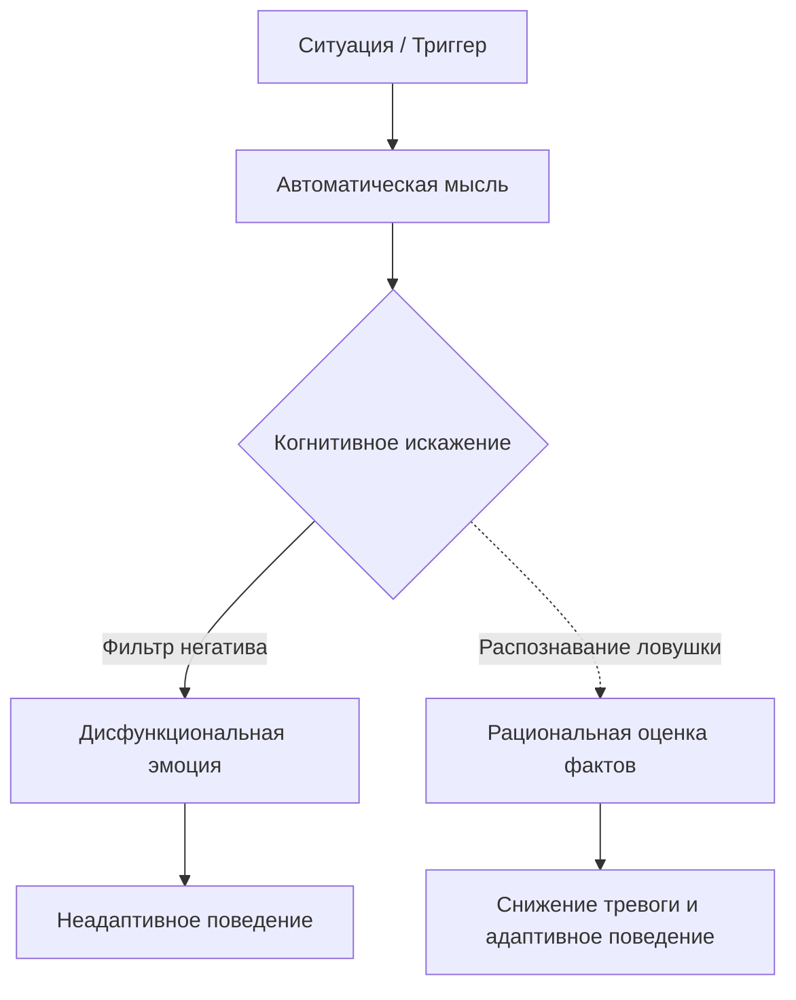

Мы все сталкивались с моментами, когда окружающий мир кажется враждебным, а собственные силы — ничтожными. В такие периоды тревога или подавленность накрывают с головой, заставляя нас верить в самые мрачные сценарии будущего. Однако часто корень проблемы кроется не в объективной реальности, а в том, как наш разум ее интерпретирует.

Когнитивно-поведенческая терапия предлагает конкретный инструмент для выявления и нейтрализации этих ментальных ловушек. Распознавание системных ошибок в мышлении помогает вернуть контроль над эмоциями и перестать слепо доверять каждой пугающей мысли, которая приходит вам в голову.

## Отделение фактов от фантазий: Суть и польза

**Когнитивные искажения** — это систематические ошибки в обработке информации, заставляющие человека видеть реальность через негативный фильтр *(Бек, 2021)*. В состоянии стресса мозг выбирает быстрые, но неточные пути оценки происходящего, что приводит к ошибочным выводам *(Лихи, 2018)*.

Главная утилитарная функция распознавания этих ошибок заключается в том, чтобы отделить реальные объективные факты от пугающих домыслов. Как только вы называете когнитивное искажение своим именем, оно теряет над вами власть. Это позволяет критически оценить мысли, снизить эмоциональный дистресс и выбрать адаптивное поведение вместо паники *(Лихи, 2021)*.

## Архитектура восприятия: Три шага обработки информации

Архитектура нашего восприятия опирается на три взаимосвязанных компонента:

1.  **Ситуация (Антецедент):** Объективное внешнее событие или триггер, с которым сталкивается человек.
2.  **Автоматические мысли:** Быстрые, непроизвольные идеи или образы, мгновенно оценивающие ситуацию. Именно на этом этапе возникают когнитивные искажения, подменяющие факты нашими страхами *(Бек, 2021)*.
3.  **Реакция:** Возникающая эмоция (тревога, гнев, грусть), физиологический отклик и последующее поведение *(Лихи, 2021)*.

**Механика работы (Под капотом):** Когнитивные искажения действуют как короткое замыкание в мозге. Они заставляют нас перепрыгивать к негативным выводам, игнорируя противоречащие им доказательства *(Лихи, 2018)*. Это усиливает изначальные страхи и постоянно закрепляет депрессивные или тревожные состояния, формируя замкнутый порочный круг *(Бек, 2021)*.

## Темные очки: Ментальные модели и границы

**Аналогия (Темные очки):** Представьте, что вы надели очки с сильно затемненными, искажающими линзами. В них даже яркий солнечный день покажется мрачным и пугающим. Вы можете искренне думать, что мир действительно потемнел, но на самом деле проблема заключается лишь в линзах *(Лихи, 2020)*. Когнитивные искажения — это те самые темные очки. Выявление искажений помогает «снять» фильтр и увидеть реальность в естественном свете.

**Чем это не является:** Наличие когнитивных искажений не означает, что вы глупы, нерациональны или сходите с ума. Это абсолютно нормальная особенность человеческой психики, которая в моменты сильных эмоций проявляется у каждого *(Лихи, 2021)*. Кроме того, далеко не каждая негативная мысль является искажением: иногда неприятные события действительно происходят, и тогда грусть или тревога абсолютно обоснованны *(Лихи, 2021)*. Мы не пытаемся внушить себе, что проблем не существует, мы лишь проверяем мысли на достоверность.

## Практическое руководство: Каталог ловушек и алгоритм работы

Рассмотрим, как это работает на практике. Студент получает среднюю оценку за тест. Его автоматическая мысль: «Я полный неудачник, я ничего не добьюсь». Результат: апатия, отчаяние и отказ от учебы *(Лихи, 2018)*. Ошибка здесь в слепом доверии негативной мысли. Здоровый подход требует отношения к мыслям как к гипотезам, требующим проверки *(Лихи, 2020)*.

**Алгоритм работы:**

1.  **Поймайте эмоцию:** Заметьте резкое ухудшение настроения *(Бек, 2021)*.
2.  **Запишите мысль:** Вынесите автоматическую мысль на бумагу *(Бек, 2021)*.
3.  **Категоризируйте:** Сверьте мысль с каталогом искажений ниже *(Лихи, 2021)*.
4.  **Оспорьте:** Найдите реальные доказательства «за» и «против», чтобы сформировать сбалансированный ответ *(Бек, 2021)*.

### Полный каталог когнитивных искажений (18 видов)

| Искажение | Суть ловушки | Примеры |
| :--- | :--- | :--- |
| **Чтение мыслей** (Mind reading) | Уверенность, что вы знаете мотивы других без фактов *(Лихи, 2018)*. | 1. «Он думает, что я неудачник» *(Лихи, 2018)*. 2. «Она считает меня скучным» *(Лихи, 2021)*. 3. «Начальник думает, что я ничего не смыслю в проекте» *(Beck, 2021)*. |
| **Предсказание будущего** (Предсказание судьбы) | Уверенность в негативном исходе грядущих событий *(Лихи, 2018)*. | 1. «Я не сдам этот экзамен» *(Лихи, 2018)*. 2. «Я не получу эту работу» *(Лихи, 2020)*. 3. «В итоге все закончится полным провалом» *(Лихи, 2018)*. |
| **Катастрофизация** (Catastrophizing) | Восприятие события как абсолютно невыносимого и разрушительного *(Бек, 2021)*. | 1. «Было бы ужасно, если бы я потерпел неудачу» *(Лихи, 2018)*. 2. «Тревога когда-нибудь убьет меня» *(Лихи, 2021)*. 3. «Будет просто ужасно, если у меня не получится» *(Лихи, 2020)*. |
| **Навешивание ярлыков** | Приписывание себе и другим глобальных негативных черт *(Лихи, 2018)*. | 1. «Меня тут не ждут» *(Лихи, 2018)*. 2. «Он отвратительный человек» *(Лихи, 2018)*. 3. «Я никчемный» *(Лихи, 2021)*. |
| **Обесценивание позитива** (Обесценивание положительных моментов) | Считаете незначительным все хорошее, что делаете вы или другие *(Лихи, 2018)*. | 1. «То, что она мила со мной, не считается, так ведут себя все жены» *(Лихи, 2018)*. 2. «Достичь этих успехов было легко – поэтому они не имеют значения» *(Лихи, 2018)*. 3. «Задание было легким, так что этот успех не в счет» *(Лихи, 2021)*. |
| **Отрицательный фильтр** (Избирательное абстрагирование) | Фокус исключительно на негативе с игнорированием хорошего *(Лихи, 2018)*. | 1. «Посмотрите на всех тех людей, которые меня не любят» *(Лихи, 2018)*. 2. «Я получил одну низкую оценку, значит, я плохо работаю» *(Beck, 2021)*. 3. «Только посмотрите, скольким людям я не нравлюсь\!» *(Лихи, 2020)*. |
| **Сверхобобщение** (Перегенерализация) | Выведение общих негативных правил из однократных событий *(Лихи, 2018)*. | 1. «Это вечно происходит со мной. Я обречен на провалы» *(Лихи, 2018)*. 2. «Мне было некомфортно на встрече, у меня нет того, что нужно для дружбы» *(Beck, 2021)*. 3. «Похоже, неудачи – мой конек» *(Лихи, 2021)*. |
| **Черно-белое мышление** (All-or-nothing, «Всё или ничего», Дихотомическое мышление) | Рассуждение крайностями: либо триумф, либо провал *(Лихи, 2018)*. | 1. «Меня отвергают все» *(Лихи, 2018)*. 2. «Это была пустая трата времени» *(Лихи, 2018)*. 3. «Я никому не нужен» *(Лихи, 2021)*. |
| **Долженствование** (Обязанности) | Требование невозможного от себя и реальности *(Лихи, 2018)*. | 1. «Я должен преуспеть, если я этого не сделаю, я неудачник» *(Лихи, 2018)*. 2. «Ужасно, что я сделал ошибку. Я должен всегда делать все возможное» *(Beck, 2021)*. 3. «Я должен справиться, в противном случае я никчемен» *(Лихи, 2021)*. |
| **Персонализация** | Чрезмерное взятие на себя ответственности за любые неприятности *(Лихи, 2018)*. | 1. «Мой брак распался, потому что я неудачник» *(Лихи, 2018)*. 2. «Мастер был резок ко мне, потому что я сделал что-то не так» *(Beck, 2021)*. 3. «У нее плохое настроение, потому что я сказал что-то глупое» *(Лихи, 2018)*. |
| **Обвинение** | Фокус на том, как другие ухудшают ваше состояние, отказ от своей ответственности *(Лихи, 2018)*. | 1. «Она виновата в том, что я чувствую сейчас» *(Лихи, 2018)*. 2. «Мои родители виноваты во всех моих проблемах» *(Лихи, 2018)*. 3. «Сейчас я так чувствую себя из-за нее» *(Лихи, 2020)*. |
| **Несправедливые сравнения** | Опора на нереалистичные стандарты, сравнение себя только с лучшими *(Лихи, 2018)*. | 1. «Она более успешна, чем я» *(Лихи, 2018)*. 2. «Другие сдали экзамен лучше меня» *(Лихи, 2018)*. 3. «Другие лучше меня справились с тестом» *(Лихи, 2020)*. |
| **Ориентация на сожаление** | Сосредоточенность на том, что в прошлом можно было бы сделать лучше *(Лихи, 2021)*. | 1. «Я мог бы иметь лучшую работу, если бы захотел» *(Лихи, 2021)*. 2. «Мне не следовало этого говорить» *(Лихи, 2021)*. 3. «Если бы я постарался, я мог бы сделать лучше» *(Лихи, 2020)*. |
| **Что, если…?** | Задавание тревожных вопросов, ответы на которые никогда не удовлетворяют *(Лихи, 2021)*. | 1. «Да, но вдруг я начну тревожиться?» *(Лихи, 2021)*. 2. «Что, если я не смогу восстановиться?» *(Лихи, 2021)*. 3. «А вдруг мне не удастся успокоить дыхание?» *(Лихи, 2020)*. |
| **Эмоциональное обоснование** (Эмоциональное рассуждение) | Вера в то, что субъективные эмоции отражают объективную реальность *(Лихи, 2021)*. | 1. «У меня депрессия, следовательно, мой брак – ошибка» *(Лихи, 2021)*. 2. «Я просто нервничаю, мне кажется, что это опасно» *(Лихи, 2018)*. 3. «Я чувствую себя подавленным – значит, мой брак ужасен» *(Лихи, 2020)*. |
| **Невозможность опровержения** (Неспособность к опровержению) | Отвержение любых доказательств, противоречащих негативным мыслям *(Лихи, 2021)*. | 1. «Это ненастоящая проблема» *(Лихи, 2021)*. 2. «Есть проблемы и похуже» *(Лихи, 2021)*. 3. «Дело не в этом. Есть более глубинные проблемы, другие факторы» *(Лихи, 2020)*. |
| **Фокус суждения** (Сосредоточенность на осуждении) | Постоянное измерение себя и других по произвольным стандартам *(Лихи, 2018)*. | 1. «Я не очень хорошо учился в колледже» *(Лихи, 2018)*. 2. «Если я займусь теннисом, я не буду успешен» *(Лихи, 2018)*. 3. «Посмотрите, насколько она успешна. А я ничего не добился» *(Лихи, 2018)*. |
| **Преувеличение / Минимизация** | Подчеркивание негативного или приуменьшение позитивного значения *(Therapist Guide)*. | 1. «Получение средней оценки доказывает, насколько я неадекватен» *(Beck, 2021)*. 2. «Получение высоких оценок не означает, что я умный» *(Beck, 2021)*. 3. «Профессор внес исправления, так что я наверняка провалю курс» *(Therapist Guide)*. |

## Ежедневная дисциплина ради ясного ума

Обретение эмоциональной свободы требует методичной работы. Наш разум склонен идти по пути наименьшего сопротивления, автоматически выбирая знакомые катастрофические сценарии или персонализацию событий *(Лихи, 2021)*. Чтобы научиться вовремя отлавливать эти ловушки, вам придется регулярно останавливаться в моменты сильного дистресса и беспристрастно анализировать свои реакции.

Те осознанные усилия, которые вы вложите в проверку своих автоматических мыслей, со временем окупятся радикальным повышением эмоциональной стабильности. Заменяя привычку слепо верить страхам на навык критического анализа, вы лишаете депрессию и тревогу их главного топлива *(Лихи, 2021)*. Эта практика постепенно станет вашей второй натурой, позволяя сохранять спокойствие даже в самых сложных жизненных обстоятельствах.

## Главный вывод и литература

> Ваши мысли — это всего лишь гипотезы, а не неоспоримые факты *(Лихи, 2020)*. Научившись распознавать когнитивные искажения, вы получаете надежный инструмент для управления собственным эмоциональным состоянием и поведением, заменяя панику взвешенным реализмом.

**Источники:**

  * *Бек, Дж. С. (2021). Когнитивно-поведенческая терапия. От основ к направлениям (3-е изд.). ООО "Прогресс книга".*
  * *Добсон, Д., & Добсон, К. (2021). Научно-обоснованная практика в когнитивно-поведенческой терапии. Питер.*
  * *Лихи, Р. (2018). Лекарство от нервов. Как перестать волноваться и получить удовольствие от жизни.*
  * *Лихи, Р. (2020). Техники когнитивной психотерапии. Питер.*
  * *Лихи, Р. (2021). Не верь всему, что чувствуешь. Как тревога и депрессия заставляют нас поверить тому, чего нет.*
  * *Beck, J.S. (2011). Cognitive therapy: Basics and beyond (2nd ed.). New York: Guilford Press.*
  * *Cully, J. A., Dawson, D. B., Hamer, J., & Tharp, A. L. (2020). A Provider’s Guide to Brief Cognitive Behavioral Therapy. Department of Veterans Affairs South Central MIRECC.*
  * *Brief CBT Manual (Therapist Guide).*

-----

### Проверка понимания (Микро-кейс)

Представьте, что вы отправили важное электронное письмо своему руководителю с предложением нового проекта. Проходит два дня, а ответа все нет. Вы чувствуете нарастающую тревогу и думаете: *"Он игнорирует меня, потому что моя идея просто ужасна. Я бездарность, и из-за этого провала мою карьеру в этой компании можно считать законченной\!"*

**Вопрос:** Опираясь на приведенный выше каталог, определите, какие три разные ошибки мышления (когнитивные искажения) присутствуют в этой реакции? Как бы звучал реалистичный, лишенный этих искажений ответ самому себе, основанный на поиске фактов?
