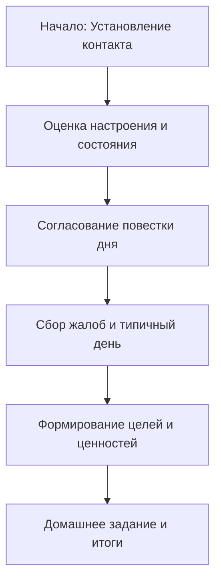

Когда вы впервые решаетесь переступить порог кабинета когнитивно-поведенческого терапевта, ваше воображение может рисовать картины из старых фильмов: кушетка, полумрак и бесконечные монологи о далеком детстве, пока врач молча делает пометки в блокноте. Однако реальность современной психотерапии выглядит совершенно иначе. Первая встреча — это не просто «задушевная беседа» или пассивная исповедь; это начало активного, высокоструктурированного сотрудничества, где вы и ваш специалист превращаетесь в команду исследователей, работающих над одной целью.

Этот материал поможет вам понять внутреннюю механику первой сессии. Мы разберем, зачем терапевту знать подробности вашего распорядка дня, как правильно ставить цели, которые действительно работают, и как отличить эффективную стратегию лечения от типичных ошибок. Первая встреча — это момент, когда неопределенность и страх перед будущим начинают трансформироваться в конкретный, научно обоснованный план действий, возвращающий вам чувство контроля над собственной жизнью.

## Фундамент доверия и надежды: Главная цель встречи

Основная задача первой терапевтической сессии заключается в том, чтобы вселить в человека реальную, обоснованную надежду на успех *(Бек, 2021)*. Люди, обращающиеся за помощью, часто чувствуют себя застрявшими в тупике, «сломленными» или окончательно запутавшимися в своих проблемах. Терапевт помогает преодолеть это состояние, объясняя, как именно методы когнитивно-поведенческой терапии (КПТ) помогут справиться с вашими конкретными трудностями, демонстрируя уверенность в успехе и проявляя искреннюю эмпатию (способность понимать и разделять чувства другого человека) *(Бек, 2021)*.

На этом этапе критически важно установить прочный **рабочий альянс** (доверительное партнерство между клиентом и терапевтом, направленное на решение общих задач) *(Dobson & Dobson, 2021)*. Чтобы вы чувствовали себя в безопасности, взаимодействие строится на принципе **коллаборативного эмпиризма** (совместного научного поиска, где терапевт и клиент на равных проверяют гипотезы о мыслях и поведении человека) *(Бек, 2021)*. Терапевт не выступает в роли судьи или всезнающего учителя; он становится вашим надежным союзником, помогая сориентироваться в пространстве ваших проблем и ресурсов.

## Архитектура старта: Пошаговый план первой сессии

Первая встреча обычно длится немного дольше стандартного приема (около часа) и подчиняется четкой, предсказуемой структуре *(Бек, 2021)*. Такое планирование времени помогает снизить естественную тревогу перед неизвестностью: вы сразу понимаете, чего ожидать от лечения и как будет распределяться время *(Dobson & Dobson, 2021)*.

| Этап сессии | Основная задача | Пояснение |
| :--- | :--- | :--- |
| **1. Оценка состояния** | Проверка настроения | Использование коротких опросников или шкал для понимания объективного уровня депрессии или тревоги на данный момент *(Бек, 2021)*.  |
| **2. Повестка дня** | Планирование маршрута | Совместное определение того, какие 1-2 самые важные темы будут обсуждаться сегодня *(Бек, 2021)*.  |
| **3. Психообразование** | Знакомство с методом | Объяснение связи между мыслями, эмоциями и поведением (когнитивная модель) простым языком *(Бек, 2021)*.  |
| **4. Постановка целей** | Определение вектора | Выяснение ценностей клиента и постановка конкретных целей, которых он хочет достичь в итоге *(Dobson & Dobson, 2021)*.  |
| **5. План действий** | Домашнее задание | Договоренность о посильных упражнениях, которые клиент выполнит до следующей встречи *(Бек, 2021)*.  |
| **6. Обратная связь** | Проверка связи | Вопрос терапевта в конце встречи: "Было ли сегодня что-то непонятное или неприятное?" *(Бек, 2021)*.  |

## Механика процесса: Детальный разбор ключевых элементов

### 1. Оценка текущих проблем и симптомов
Для терапевта важно не просто услышать список жалоб, а понять контекст вашей ситуации. На этом этапе задаются два фундаментальных вопроса:
* **«С чем вы сегодня пришли? Что побудило вас искать помощи именно сейчас?»** *(Dobson & Dobson, 2021)*. Этот вопрос помогает понять триггеры (внешние или внутренние события, запускающие реакцию) и остроту проблемы.
* **«Какие проблемы вы хотели бы решить с моей помощью в первую очередь?»** *(Бек, 2021)*. Это позволяет расставить приоритеты и сфокусироваться на самом главном.

### 2. Оценка рисков и безопасности
В КПТ безопасность всегда стоит на первом месте. Терапевт обязан задать прямые вопросы для оценки вашего состояния:
* «Приходили ли вам в голову мысли о том, чтобы как-то себе навредить?» *(Dobson & Dobson, 2021)*.
* «Бывают ли у вас настолько плохие дни, что кажется, будто такой жизнью и жить не стоит? Что удерживает вас в эти моменты?» *(Dobson & Dobson, 2021)*.
Эти вопросы — не проявление недоверия, а профессиональный стандарт, обеспечивающий вашу поддержку в критические моменты.

### 3. Анализ типичного дня (Оценка функционирования)
Выявление скрытых механизмов проблемы часто происходит через разбор рутины. Терапевт просит: **«Пожалуйста, опишите ваш типичный день, начиная с момента пробуждения и до отхода ко сну»** *(Бек, 2021)*.
Такой подробный отчет помогает обнаружить:
* **Дефицит активности:** отсутствие моментов радости или достижений.
* **Паттерны избегания:** ситуации или места, которых вы стараетесь избегать из-за страха.
* **Уровень социальной изоляции:** насколько часто вы контактируете с другими людьми *(Бек, 2021)*.

### 4. Выявление триггеров и реакций
Специалист анализирует конкретные ситуации, где проблема проявляется острее всего *(Dobson & Dobson, 2021)*. Терапевта интересует:
* Что вы чувствовали на уровне эмоций?
* Что происходило на уровне физиологии (сердцебиение, ком в горле, дрожь)?
* О чем вы думали до, во время и после этой ситуации? *(Dobson & Dobson, 2021)*.
* Что вы обычно делаете в такие моменты (ваше поведение)?

### 5. Ценности и цели
Психотерапия — это не только избавление от боли, но и движение к осмысленной жизни. Вопросы терапевта помогают определить направление движения:
* «Что для вас самое важное в жизни? Какими бы вы хотели видеть свои отношения, карьеру, здоровье?» *(Бек, 2021)*.
* «Как вы поймете, что достигли своих целей и психотерапию можно заканчивать?» *(Бек, 2021)*.

## Границы метода: Норма против Ошибок

При проведении первой сессии специалисты должны четко отличать терапевтические задачи от непродуктивного поведения.

| Эффективная стратегия (Цель первой сессии) | Дисфункциональная стратегия (Ошибка терапевта) |
| :--- | :--- |
| **Фокус на надежде и целях:** Помощь клиенту в визуализации позитивного будущего и выявление ценностей *(Бек, 2021)*.  | **Погружение в безнадежность:** Позволение клиенту весь час бесконтрольно жаловаться на жизнь без попытки структурировать проблему.  |
| **Структурированность:** Четкое следование повестке дня, объяснение формата работы *(Бек, 2021)*.  | **Пассивное слушание:** Отсутствие направляющих вопросов и психообразования (объяснения того, как работает психика).  |
| **План действий (Домашнее задание):** Назначение простого, выполнимого задания для поддержания связи до следующей встречи *(Бек, 2021)*.  | **Отсутствие закрепления:** Завершение сессии формальным прощанием без выводов и плана действий на неделю.  |

> Главная победа первой сессии — это момент, когда клиент выходит из кабинета с мыслью: «Моя проблема имеет название, мы знаем, как она работает, и у нас есть конкретный план, как ее решить».

## Вывод и литература

Первая сессия в когнитивно-поведенческой терапии — это критически важный этап, где неопределенность сменяется ясностью. Благодаря четкой структуре, оценке безопасности и анализу типичного функционирования, вы и ваш терапевт закладываете фундамент для долгосрочных изменений. Главным результатом этой встречи становится не просто облегчение от возможности выговориться, а формирование рабочего альянса и конкретного плана действий. Когда вы понимаете механизмы своих трудностей и имеете четко сформулированные цели, путь к выздоровлению становится управляемым и понятным процессом.

**Литература:**
* *Бек, Дж. С. (2021). Когнитивно-поведенческая терапия. От основ к направлениям (3-е изд.). ООО "Прогресс книга".*
* *Dobson, D., & Dobson, K. S. (2021). Evidence-based practice of cognitive-behavioral therapy (2nd ed.). The Guilford Press.*

---

### Проверка понимания

**Микро-кейс:**
К вам на первую сессию пришел клиент, который в течение первых 40 минут непрерывно и эмоционально рассказывает о своих обидах на родителей десятилетней давности. Вы замечаете, что еще не обсудили цели терапии, не оценили текущую безопасность и не составили повестку дня.

**Вопрос:** Опираясь на принципы структурированности и коллаборативного эмпиризма, как вы должны поступить в этой ситуации? К каким негативным последствиям может привести продолжение «пассивного слушания» до конца сессии? Сформулируйте мягкую фразу-переход, которая поможет вернуть сессию в конструктивное русло, не нарушая доверия клиента.
