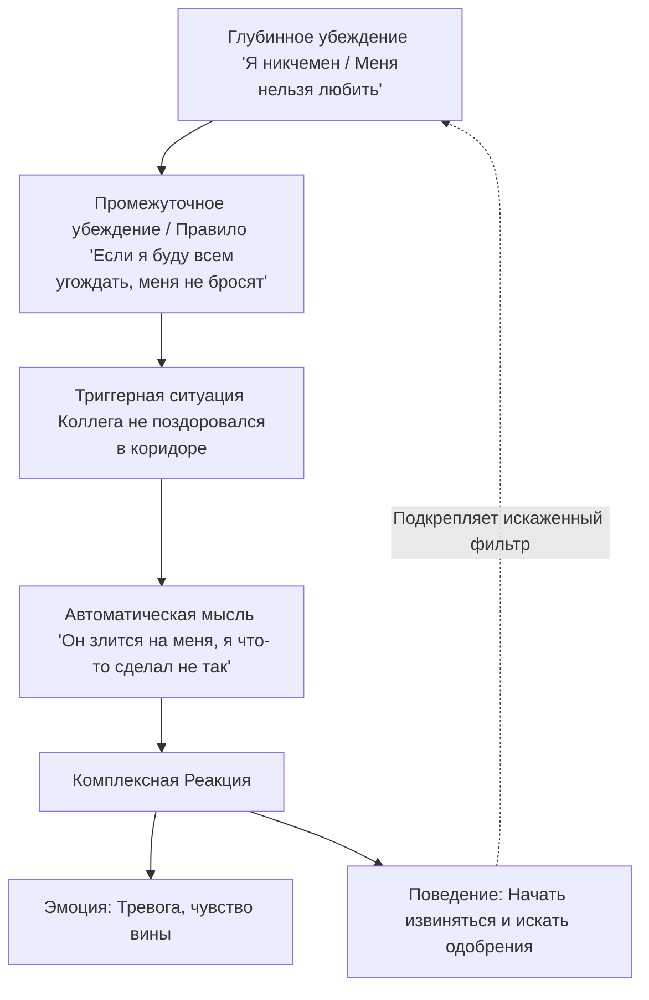

Каждый человек смотрит на мир через свои собственные, уникальные «очки». Иногда эти линзы помогают нам видеть мир полным возможностей, а иногда они настолько затемнены, что даже безобидная шутка друга кажется жестоким оскорблением. Почему так происходит? Ответ кроется в невидимом механизме нашего разума. Когнитивно-поведенческая терапия (КПТ) объясняет это наличием у каждого из нас сложной системы **убеждений** (невидимого фундамента, который ежесекундно диктует нам, как понимать себя, окружающих людей и мир в целом) *(Бек, 2021)*.

Чтобы перестать быть заложником болезненных эмоций и **дезадаптивного** (мешающего приспособлению к жизни) поведения, необходимо спуститься на более глубокие уровни психики. Понимание того, как устроены наши глубинные и промежуточные установки, позволяет нам вернуть себе контроль над собственным состоянием. В этой статье мы подробно разберем иерархию убеждений и узнаем, как именно они управляют нашей реальностью.

### Фундамент психики: Сущность и формирование глубинных убеждений

**Глубинные убеждения** представляют собой ядро нашей когнитивной системы. Это самые глубокие, фундаментальные и глобальные идеи человека о себе, других людях и мире *(Бек, 2021)*. Они не возникают мгновенно; они начинают формироваться с самого раннего детства под влиянием значимых жизненных событий, взаимодействия с семьей и сверстниками *(Бек, 2021)*.

Главная особенность этих убеждений заключается в том, что человек воспринимает их не как гипотезы или предположения, которые можно проверить, а как абсолютную, непререкаемую истину — «именно так все и есть на самом деле» *(Бек, 2021)*. У психологически здоровых людей преобладают **адаптивные** (помогающие эффективно жить и развиваться) убеждения *(Бек, 2021)*. Однако в состоянии сильного стресса или депрессии у человека активизируются «спящие» дисфункциональные схемы, которые искажают восприятие реальности *(Бек, 2021)*.

### Темная триада уязвимости: Категории дезадаптивных убеждений

Дезадаптивные (негативные) глубинные убеждения — это жесткие и категоричные идеи, которые заставляют человека видеть мир исключительно в мрачных тонах *(Бек, 2021)*. В КПТ эти болезненные идеи классифицируются по трем масштабным категориям *(Бек, 2021)*:

| Категория | Суть убеждения | Все примеры формулировок из практики |
| :--- | :--- | :--- |
| **Беспомощность** | Идеи о собственной неэффективности, слабости и неспособности контролировать свою жизнь и справляться с ней *(Бек, 2021)*. | «Я некомпетентен», «Я слаб», «Я неудачник», «Я не справлюсь», «Я неэффективен», «Я слаб и уязвим» *(Бек, 2021, 2020)*. |
| **Непривлекательность / Непринятие** | Глубокая уверенность в том, что человек лишен качеств, необходимых для того, чтобы быть любимым, желанным и принятым другими *(Бек, 2021)*. | «Я уродлив», «Меня отвергнут», «Я никому не нужен», «Меня обязательно бросят», «Я скучный», «Я лишен качеств, чтобы меня любили» *(Бек, 2021, 2020)*. |
| **Никчемность** | Ощущение собственной аморальности, испорченности, опасности или токсичности для окружающих *(Бек, 2020, 2021)*. | «Я отброс», «Я токсичен», «Я не заслуживаю жизни», «От меня один вред», «Я опасен», «Я аморален», «Я испорчен» *(Бек, 2020, 2021)*. |

### Фундамент устойчивости: Категории адаптивных убеждений

В противовес болезненным схемам существуют **адаптивные (позитивные) глубинные убеждения**. У психологически благополучных людей именно они составляют здоровый «режим» работы психики *(Бек, 2021)*. Эти сбалансированные и реалистичные представления позволяют человеку сохранять устойчивость даже в сложные времена.

| Категория | Суть убеждения | Все примеры формулировок из практики |
| :--- | :--- | :--- |
| **Схемы эффективности** | Человек верит в свои силы, компетентность и способность успешно справляться с жизненными задачами *(Бек, 2021)*. | «Я достаточно компетентен», «В целом я владею ситуацией», «Я способен справляться с большинством задач», «Когда нужно, я могу за себя постоять» *(Бек, 2021)*. |
| **Схемы привлекательности** | Здоровое принятие своей социальной ценности и уверенность в праве на любовь и уважение *(Бек, 2021)*. | «Обычно я нравлюсь людям», «Я достоин любви и уважения», «У меня есть близкие люди, которым я дорог», «В целом я нравлюсь людям» *(Бек, 2021)*. |
| **Схемы достоинства** | Ощущение собственной ценности как личности, право на существование и счастье независимо от внешних обстоятельств *(Бек, 2021)*. | «У меня много достоинств», «Я хороший человек», «Я имею право на существование и счастье», «Я ценен как личность» *(Бек, 2021)*. |

### Жизненные правила: Как работают промежуточные убеждения

Если глубинные убеждения — это фундамент, то **промежуточные убеждения** — это «несущие стены» нашей психики. Они располагаются между глубокими схемами и нашими мгновенными автоматическими мыслями *(Бек, 2021)*. Их главная функция заключается в том, чтобы помочь человеку адаптироваться к миру и защитить его от невыносимой боли, которую несет негативное глубинное убеждение *(Бек, 2020)*.

Промежуточные убеждения всегда состоят из трех компонентов *(Бек, 2021)*:

1.  **Отношения (Оценки):** Эмоционально окрашенные стандарты и оценки реальности (например, «Как же ужасно потерпеть неудачу» или «Плохо быть слабым») *(Бек, 2021)*.
2.  **Правила (Долженствования):** Жесткие императивы и требования к себе или окружающему миру (например, «Я должен всегда все делать идеально», «Я никогда не должен огорчать других людей») *(Бек, 2021)*.
3.  **Условные предположения:** Логические конструкции в формате «Если..., то...», связывающие поведение с глубинным убеждением (например, «Если я буду упорно трудиться, то никто не поймет, что я неудачник. Но если я дам слабину, все увидят мою некомпетентность») *(Бек, 2021)*.

Эти установки напрямую диктуют человеку его **копинг-стратегии** (защитное поведение) *(Бек, 2020)*. Например, чтобы не столкнуться с пугающим ощущением своей «непривлекательности», человек может выработать стратегию угодничества и следовать правилу «Я должен всегда соглашаться с окружающими», чтобы избежать любого риска отвержения *(Бек, 2020)*.

### Искажающая линза: Механика обработки информации

Многих интересует вопрос: почему человек продолжает верить в то, что он неудачник, даже если объективные факты говорят об обратном (например, он получает повышение на работе или комплименты от друзей)? Ответ кроется в механизме работы психического фильтра *(Бек, 2021)*.

Активированное глубинное убеждение работает как жесткий экран *(Бек, 2021)*:

* **Негативная информация**, подтверждающая старую схему (например, «Я допустил опечатку»), проходит через этот фильтр мгновенно и без препятствий, делая убеждение еще сильнее *(Бек, 2021)*.
* **Позитивная информация**, которая противоречит схеме (например, «Начальник похвалил мой проект»), сталкивается с преградой. Человек либо полностью игнорирует этот факт, либо мгновенно его обесценивает, искажая суть: «Начальник похвалил меня только из жалости, на самом деле я бездарность» *(Бек, 2021)*.

В результате даже самый успешный позитивный опыт парадоксальным образом подпитывает негативное убеждение, так как мозг «переводит» его на язык привычной боли.

### Сравнение уровней убеждений: Границы и специфика

Для глубокого понимания структуры КПТ важно четко различать эти два уровня убеждений.

| Характеристика | Глубинные убеждения | Промежуточные убеждения |
| :--- | :--- | :--- |
| **Суть** | Абсолютные, жесткие и глобальные идеи о себе, людях и мире *(Бек, 2021)*. | Жизненные правила, оценки и условные предположения *(Бек, 2021)*. |
| **Формулировка** | «Я...» (например, «Я плохой», «Я беспомощный», «Я неудачник») *(Бек, 2020)*. | «Если..., то...» или «Я должен...» (например, «Я должен всегда всё делать идеально») *(Бек, 2021)*. |
| **Гибкость** | Ригидные (жесткие), с трудом поддаются изменениям и часто не осознаются человеком *(Бек, 2021)*. | Более гибкие, легче осознаются клиентом в процессе работы и быстрее модифицируются *(Бек, 2021)*. |
| **Связь с поведением** | Задают общую, фундаментальную оценку личности и реальности *(Бек, 2021)*. | Напрямую диктуют конкретные поведенческие копинг-стратегии для защиты личности *(Бек, 2021)*. |

### Путь к изменениям: От осознания к когнитивной гибкости

Хотя глубинные убеждения формируются годами и могут казаться человеку бетонной стеной, важно помнить: они являются лишь усвоенными идеями, а не непреложными фактами *(Бек, 2021)*. Работа с ними в психотерапии направлена на развитие когнитивной гибкости.

Процесс трансформации начинается с формулирования и осознания этих установок через **технику «падающей стрелы»** (когда специалист задает последовательные вопросы: «Если эта мысль верна, что это означает для вас?», «А что это говорит о вас?»), пока не будет достигнут уровень глубинной схемы *(Бек, 2021)*.

В дальнейшем терапевт помогает человеку расшатать эту железобетонную конструкцию через следующие шаги *(Бек, 2021)*:
* **Анализ исторического опыта:** Поиск событий в прошлом, которые противоречат негативной схеме.
* **Поиск доказательств:** Методичный сбор фактов в настоящем, опровергающих старое убеждение.
* **Поведенческие эксперименты:** Намеренное нарушение старых правил (например, «попросить о помощи»), чтобы проверить, действительно ли за этим последует катастрофа, предсказанная убеждением («меня сочтут слабым») *(Бек, 2021)*.

Постепенно на месте старых дезадаптивных схем выстраиваются новые, более адаптивные и реалистичные убеждения, которые позволяют человеку жить более полной жизнью.

### Вывод и литература

Ваши убеждения — это не врожденные характеристики вашей личности, а приобретенные в прошлом шаблоны восприятия мира. Здоровая психика опирается на адаптивные концепты собственной компетентности, привлекательности и ценности, в то время как депрессия подменяет их идеями беспомощности и никчемности. Методичная работа по выявлению жестких правил долженствования и укреплению позитивных схем дарит подлинную эмоциональную свободу. Изменив свои внутренние установки, вы сможете снять «темные очки» и начать воспринимать себя и мир вокруг с позиции уверенности и объективности *(Бек, 2021)*.

**Литература:**

- Бек, Дж. С. (2020). *Когнитивная терапия для сложных случаев: что делать, когда простые решения не работают*. ООО «Диалектика».
- Бек, Дж. С. (2021). *Когнитивно-поведенческая терапия. От основ к направлениям* (3-е изд.). ООО «Прогресс книга».

---

### Проверка понимания (Микро-кейс)

Представьте клиента по имени Игорь. Его глубинное убеждение относится к категории **беспомощности** («Я неудачник»). Чтобы защититься от боли, которую приносит эта мысль, Игорь выработал промежуточное убеждение: *«Если я буду работать по 14 часов в сутки и не допускать ни одной ошибки, никто не догадается, что я ни на что не годен»*.

**Вопросы для анализа:**

1.  Опираясь на таблицы в статье, определите, к какой категории дезадаптивных убеждений относится фраза Игоря «Я ни на что не годен»?
2.  Какую **копинг-стратегию** (защитное поведение) выбрал Игорь для борьбы со своим ощущением беспомощности?
3.  Представьте, что Игорь допустил случайную опечатку в письме коллеге. Опираясь на механизм «искажающего фильтра», объясните, почему Игорь проигнорирует тот факт, что за последний год он успешно выполнил 100 сложных проектов без единой помарки?
4.  Какую роль в возникновении его тревоги играет компонент «Правило (Долженствование)» в его промежуточном убеждении?
5.  Как специалист по КПТ может использовать технику поведенческого эксперимента, чтобы помочь Игорю проверить реалистичность его убеждения о 14-часовом рабочем дне?
