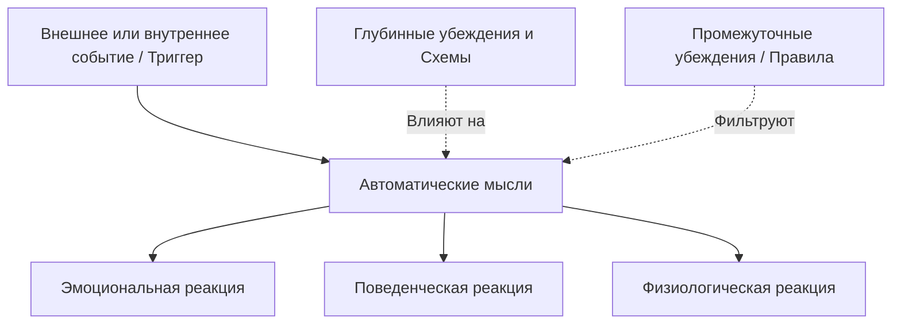
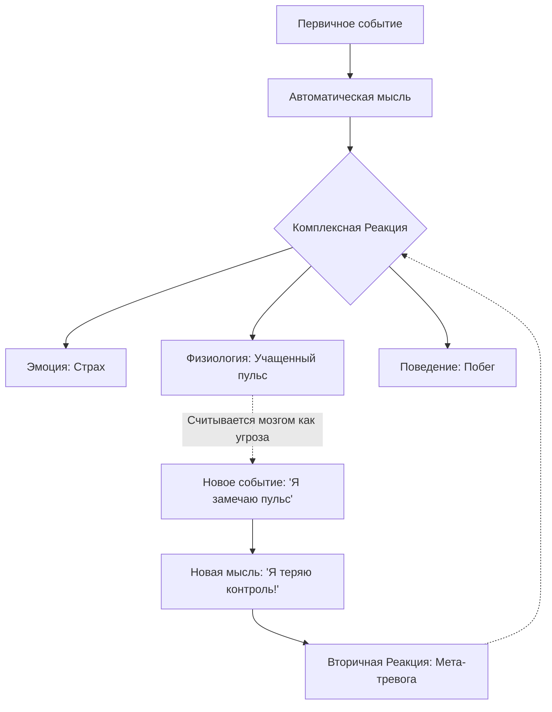

Каждый день люди сталкиваются с десятками неоднозначных ситуаций: от неожиданного письма руководителя до холодного взгляда случайного прохожего. Почему одно и то же событие у одного человека вызывает лишь легкую досаду, а у другого — глубокую депрессию или приступ паники? Ответ на этот вопрос кроется не в самих внешних обстоятельствах, а в невидимом механизме их обработки нашим разумом.

В рамках когнитивной-поведенческой терапии этот механизм описывается **когнитивной моделью** (научно обоснованной концепцией о том, что наши чувства определяются восприятием ситуации). Это фундаментальная теория, которая доказала, что ключи к нашему эмоциональному благополучию находятся не во внешнем мире, а в нашем собственном мышлении *(Бек, 2021)*. Понимая этот процесс, человек перестает быть пассивной жертвой обстоятельств и обретает инструменты для управления своей жизнью.

### Восприятие как активный фильтр: Сущность когнитивной модели

В своей самой элегантной форме когнитивная модель утверждает: то, что люди чувствуют и как они действуют, определяется не самой ситуацией, а тем, как они ее воспринимают и истолковывают *(Бек, 2021)*. Этот подход является глубоко **конструктивистским** (подход, согласно которому наш разум активно «конструирует» реальность на основе прошлого опыта, а не просто отражает её).

Мы часто верим, что события напрямую вызывают наши чувства. Однако современная обобщенная когнитивная модель (Generic Cognitive Model, GCM) гласит, что люди часто обрабатывают информацию через призму специфических жестких убеждений *(Wenzel, 2021)*. Если эти убеждения искажены, риск развития депрессии или тревоги резко возрастает. На самом деле, **дисфункциональное** (вредное или мешающее достижению целей) мышление является общим знаменателем практически для всех психологических трудностей *(Бек, 2021)*.

### Архитектура смыслов: Три уровня нашего мышления

Когнитивная модель раскладывает наше мышление на три понятных структурных элемента. Чтобы понять, почему мы реагируем именно так, нужно проследить путь мысли от самого фундамента до поверхности:

1.  **Глубинные убеждения или Схемы:** Это самый глубокий уровень — абсолютные, часто неосознаваемые идеи о себе, других и мире (например, «Я никчемен» или «Мир опасен») *(Wenzel, 2021)*. Они формируются годами и работают как постоянный фильтр восприятия.
2.  **Промежуточные убеждения:** Это правила, отношения и допущения, которые вытекают из схем (например, «Если я буду идеальным, меня не отвергнут»).
3.  **Автоматические мысли:** Самый поверхностный уровень. Это быстрые, спонтанные идеи или визуальные образы, которые мгновенно возникают в голове в ответ на конкретный триггер (событие-раздражитель) *(Бек, 2021)*.

### Фоновый радиоэфир: Природа и характеристики автоматических мыслей

**Автоматические мысли** — это передний край нашей психики. Их можно сравнить с невидимым переводчиком-синхронистом, который сидит в мозгу и переводит события внешнего мира на язык наших эмоций. Если переводчик объективен, мы адаптируемся. Если же он напуган или подавлен, даже нейтральная фраза прохожего будет переведена как оскорбление.

Эти мысли обладают уникальными свойствами:
* **Рефлекторность:** Они возникают мгновенно, без сознательного логического анализа, как рефлекс *(Therapist Guide, b.d.)*.
* **Скрытность:** Часто люди не замечают саму мысль, но отчетливо ощущают резкое изменение настроения — всплеск гнева или укол грусти *(Therapist Guide, b.d.)*.
* **Безусловное доверие:** В момент стресса мы склонны верить этим мыслям как абсолютной истине, не подвергая их сомнению *(Бек, 2021)*.

Специалисты по терапии принятия и ответственности (ACT) часто называют эти мысли «историями», которые наш разум безостановочно рассказывает нам, пытаясь объяснить происходящее *(Хэррис, 2022)*.

### Триада последствий: Как мысли запускают комплексную реакцию

Согласно **гипотезе медиации** (теории посредничества), автоматические мысли выступают мостом между миром и нашими ответами на него *(Dobson & Dobson, 2021)*. Если мысль носит искаженный характер, она запускает цепную реакцию на трех уровнях одновременно *(Бек, 2021)*:

* **Эмоциональный уровень:** чувства (например, острая тревога или стыд).
* **Поведенческий уровень:** конкретные действия (например, избегание работы или уход в себя).
* **Физиологический уровень:** телесные отклики (например, учащенное сердцебиение, мышечное напряжение или бессонница).

> **Важное наблюдение:** Реакции человека всегда обретают четкий смысл, если мы знаем, какая именно автоматическая мысль промелькнула у него в голове за секунду до их появления *(Бек, 2021)*.

### Замкнутые круги и мета-нарушения

Важнейшим открытием является то, что наши собственные реакции (тело или эмоции) могут мгновенно становиться новыми триггерами. Например, человек замечает учащенный пульс (физиологическая реакция) и оценивает его мыслью: «У меня сердечный приступ!» *(Бек, 2021)*. Эта новая мысль вызывает еще более сильную панику.

В рационально-эмотивно-поведенческой терапии (РЭПТ) это называют **вторичными эмоциональными проблемами** (ситуация, когда человек начинает тревожиться из-за самой тревоги или злиться на свой гнев) *(ДиДжузеппе и др., 2021)*.

### Модель АВС: Практический инструмент перемен

В клинической практике когнитивная модель воплощается в **модель АВС**, разработанную Альбертом Эллисом. Она учит разделять поток опыта на категории:
* **A (Activating event):** Активирующее событие или триггер.
* **B (Belief/Thoughts):** Автоматические мысли и система убеждений человека.
* **C (Consequence):** Следствия — возникшие эмоции, телесные реакции и поведение *(ДиДжузеппе и др., 2021)*.

Главная идея заключается в том, что именно **В** определяет **С**, а не событие **А** напрямую *(ДиДжузеппе и др., 2021)*. Терапия не стремится к «позитивному мышлению», которое отрицает реальность. Она настаивает на **реалистичной** обработке информации, где мысли проверяются как гипотезы, а не принимаются на веру как факты *(Бек, 2021)*.

| Компонент модели (ABC) | Адаптивная (здоровая) цепочка | Дисфункциональная (искаженная) цепочка |
| :--- | :--- | :--- |
| **A (Ситуация)** | Допущена ошибка в важном отчете. | Допущена ошибка в важном отчете. |
| **B (Автоматическая мысль)** | «Это неприятно, но я могу это исправить. Все ошибаются». | «Я безнадежный глупец, меня обязательно уволят!» *(Катастрофизация)* |
| **C (Реакция)** | *Эмоция:* Легкая досада. *Поведение:* Исправление отчета. | *Эмоция:* Паника. *Поведение:* Прокрастинация или увольнение. |

### Лингвистическая ловушка: Мысли vs Чувства

Часто люди путают свои мысли с чувствами, используя фразы вроде «Я чувствую, что я неудачник». Однако это не чувство, а жесткое оценочное убеждение *(ДиДжузеппе и др., 2021)*. Настоящая эмоция всегда выражается одним словом (грусть, гнев, радость). Пока человек не научится отделять свои телесные и эмоциональные реакции от породивших их мыслей, он не сможет разорвать цепочку дистресса *(Бек, 2021)*.

### Вывод и литература

Когнитивная модель — это научно обоснованное доказательство того, что вы не являетесь заложником обстоятельств. Ваши чувства — это продукт ваших мыслей. Хотя люди часто не могут контролировать события вокруг себя, они обладают властью над тем, какое значение они им придают. Ообретая **когнитивную гибкость** (способность менять «линзы», через которые мы смотрим на мир), мы напрямую меняем свою эмоциональную реальность.

**Литература:**
- Бек, Дж. С. (2021). *Когнитивно-поведенческая терапия. От основ к направлениям* (3-е изд.). ООО "Прогресс книга".
- ДиДжузеппе, Р., Дойл, К., Драйден, У., & Бакс, У. (2021). *Рационально-эмотивно-поведенческая терапия*.
- Добсон, Д., & Добсон, К. (2021). *Научно-обоснованная практика в когнитивно-поведенческой терапии*. Питер.
- Лихи, Р. (2021). *Не верь всему, что чувствуешь*.
- Хэррис, Р. (2022). *Когда жизнь сбивает с ног*.
- Wenzel, A. (Ed.). (2021). *Handbook of Cognitive Behavioral Therapy*. American Psychological Association.
- Therapist Guide to Brief CBT Manual. (n.d.).

---

### Проверка понимания

**Микро-кейс:** Представьте ситуацию. Вы идете по улице и видите своего знакомого на другой стороне дороги. Вы машете ему рукой, но он проходит мимо, не ответив.

**Задание:** Используя модель АВС, опишите два разных сценария развития этой ситуации.
1. В первом сценарии вы испытываете **острую тревогу и стыд**. Какая автоматическая мысль (B) могла привести к этой реакции?
2. Во втором сценарии вы остаетесь **спокойны**. Какая альтернативная интерпретация события (B) позволила вам сохранить равновесие?

Как это упражнение иллюстрирует идею о том, что автоматические мысли являются «медиаторами» нашего состояния?
