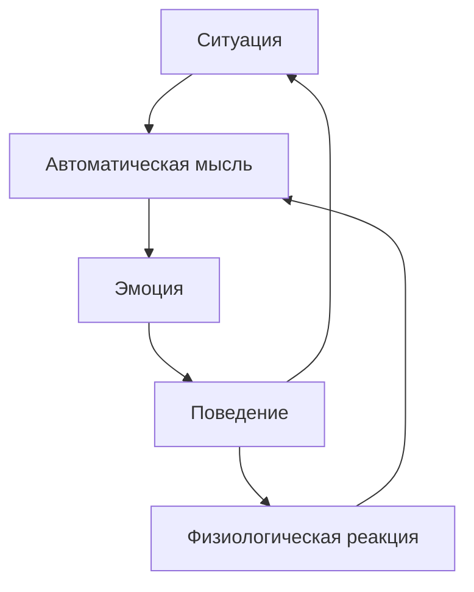

Более 2000 клинических исследований и 269 метаанализов подтверждают эффективность когнитивно-поведенческой терапии. В отличие от психоанализа, КПТ не ищет первопричины в детстве, а обучает клиента быть терапевтом самому себе. Как устроен этот метод, на каких механизмах строится и почему его называют «золотым стандартом» психотерапии — разберем в статье.

## Когнитивная модель: как мысли формируют реальность

В основе КПТ лежит когнитивная модель. Ее главный принцип: не сами события вызывают эмоции, а то, как человек их воспринимает и оценивает.

Центральная схема работы психики в КПТ выглядит так:

**Ситуация → Автоматическая мысль → Реакция (эмоция, поведение, физиология)**

Мысли, чувства и поведение образуют непрерывный цикл. При психологических расстройствах этот цикл становится порочным кругом:

1. **Мысли определяют чувства.** Если перед сложной задачей человек интерпретирует ситуацию мыслью «Я не справлюсь», он испытывает страх или тревогу.
2. **Чувства определяют поведение.** Тревога заставляет избегать пугающей ситуации, грусть снижает активность, злость ведет к агрессии.
3. **Поведение подкрепляет мысли.** Избегая задачи из-за страха неудачи, человек не получает опыта ее преодоления. Убеждение «Я не справлюсь» укрепляется.

**Пример.** Два студента читают один и тот же сложный учебник по КПТ. Первый думает: «Трудный материал, нужно перечитать абзац». Он чувствует интерес и продолжает работу. Второй думает: «Это не для среднего ума. Я слишком глупая, из меня не выйдет психолога». Эта мысль вызывает грусть и отчаяние. В результате она закрывает книгу и включает телевизор. Из-за ошибки в мышлении второй студент лишает себя шанса стать специалистом.

**Пример порочного круга.** Эйб пережил развод и потерю работы. Он сидит дома и видит на столе неоплаченные счета. У него возникает мысль: «У меня не хватит денег. Я ничего не могу сделать правильно». Эйб испытывает острую тревогу и грусть. Вместо того чтобы оплатить счета, он ложится на диван и откладывает дела. Счета остаются неоплаченными, растут пени. Эйб получает доказательство своей исходной мысли: «Я действительно неудачник». Круг замыкается.

## Уровни мышления: от автоматических мыслей к глубинным убеждениям

КПТ работает не только с ситуативными мыслями, но и с более глубокими структурами психики. Когниции рассматриваются на трех уровнях:

1. **Автоматические мысли.** Поверхностный уровень. Оценки и идеи, которые спонтанно возникают в ответ на конкретную ситуацию.
2. **Промежуточные убеждения.** Правила жизни, отношения и условные предположения. Например: «Если я не буду идеальным, меня отвергнут».
3. **Глубинные убеждения (схемы).** Самый глубокий фундамент. Абсолютизированные, укоренившиеся и часто неосознаваемые представления о себе, других людях и устройстве мира. Например: «Я никчемный», «Мир опасен», «Людям нельзя доверять».

Дезадаптивные глубинные убеждения отличаются ригидностью. Когда они активизируются (особенно в состоянии депрессии или тревоги), человек начинает искаженно обрабатывать информацию: фиксируется на негативе, подтверждающем его установку, и игнорирует позитивный опыт.

**Пример.** Эйб реагирует на счета тревогой, потому что его мышление работает на всех трех уровнях:
- Глубинное убеждение: «Я некомпетентен».
- Промежуточное убеждение: «Если я не буду ни о чем просить, никто не узнает, какой я некомпетентный».
- Автоматическая мысль: когда Эйбу нужно попросить сына помочь составить резюме, появляется мысль «Я должен справиться сам. Обращаться за помощью — признак слабости». В итоге он не звонит сыну и не ищет работу.

## Поведенческая основа: от рефлексов к функциональному анализу

Современная КПТ выросла из слияния двух подходов: бихевиоризма и когнитивизма. Поведенческая составляющая опирается на механизмы научения.

**Классическое обусловливание** (Иван Павлов, Джон Уотсон). Биологически заданная реакция (например, выделение слюны на еду) может связаться с нейтральным стимулом (звуком колокольчика). После закрепления ассоциации нейтральный звук становится условным стимулом и автоматически запускает реакцию без участия еды.

**Оперантное обусловливание и модель А‑В‑С.** Простая схема «стимул — реакция» не объясняет сложные добровольные действия. Поведение контролируется его последствиями. В КПТ используют функциональную модель А‑В‑С:
- **Антецедент (A).** Предшествующий фактор среды, который дает сигнал к действию. Это может быть внешний стимул (звонок телефона) или внутренний процесс (мысль, эмоция, физиологическое ощущение).
- **Поведение (B).** Конкретное целенаправленное действие человека (снять трубку).
- **Последствие (C).** Результат, который закрепляет или устраняет поведение.

**Виды последствий:**
- **Позитивное подкрепление.** Добавление желаемого последствия (похвала, деньги, социальное взаимодействие) увеличивает частоту поведения.
- **Негативное подкрепление.** Устранение неприятного стимула (снятие головной боли таблеткой, избегание пугающей ситуации) также увеличивает частоту поведения.
- **Наказание.** Добавление неприятного последствия или удаление желаемого снижает частоту поведения.

**Пример поведенческого механизма в КПТ.** Человек боится летать и на борту впадает в панику. Чтобы снизить страх, он вцепляется в подлокотники до побеления костяшек. Самолет благополучно приземляется. Мозг получает ложное подкрепление: «Мы выжили только потому, что я крепко держался». Это охранительное поведение не спасает от страха, а консервирует его.

## Ориентация на настоящее: почему КПТ не копается в прошлом

КПТ сфокусирована на решении актуальных трудностей в настоящем времени. Прошлое уже случилось, будущее еще не наступило — действовать, решать проблемы и что-то менять человек может только здесь и сейчас.

Чрезмерное погружение в прошлое не помогает улучшить ситуацию. Когда люди застревают в поиске оправданий или сожалениях о прошлых ошибках, они концентрируются на причинах своего состояния, что делает их беспомощными. Мы не можем изменить прошлое, но можем изменять будущее, фокусируясь на конструктивных шагах в настоящем.

Смещение фокуса внимания на текущий момент — ключевой инструмент для снижения тревоги и депрессии. Большинство людей, склонных к пессимизму, живут в гипотетическом будущем, постоянно задаваясь вопросом «а что, если?». Вопрос «Что полезного я могу сделать прямо сейчас?» смещает фокус с пугающего далекого будущего на настоящее и позволяет разорвать цикл тревоги.

**Когда обращение к прошлому необходимо.** Акцент на настоящем не означает полного игнорирования прошлого. К прошлому обращаются в трех случаях:
1. Клиент сам настойчиво хочет обсудить прошлый опыт.
2. Работа, направленная на текущие проблемы, не приносит результатов.
3. Нужно понять, когда возникли и чем подпитываются ключевые дисфункциональные убеждения и поведенческие стратегии.

Даже после экскурса в прошлое терапевт обсуждает с клиентом, как он оценивает эти события сегодня и как можно использовать новое понимание в настоящем.

## Изменение убеждений: как происходит модификация

Модификация только поверхностных автоматических мыслей дает ситуативное облегчение. Изменение лежащих в их основе промежуточных и глубинных убеждений приводит к устойчивым трансформациям и предотвращает рецидивы.

Изменение убеждений — это не внушение позитивного мышления и не повторение аффирмаций. Это структурированный процесс, опирающийся на несколько принципов.

**Совместный эмпиризм и направляемое открытие.** Терапевт не спорит с клиентом и не доказывает, что его мысли ошибочны. Прямое оспаривание нарушает терапевтический альянс и заставляет клиента чувствовать, что его обесценивают. Вместо этого терапевт выступает партнером-исследователем. С помощью Сократовского диалога он помогает клиенту самостоятельно собрать доказательства за и против старой схемы, найти логические противоречия и сделать собственные открытия.

**От интеллекта к эмоциям.** Убеждения сначала меняются на интеллектуальном уровне, и лишь затем — на эмоциональном. Клиент может умом понимать, что он не неудачник, но продолжать чувствовать себя таковым. Для перехода на эмоциональный уровень требуются экспериенциальные методики, поведенческие эксперименты, ролевые игры и метафоры.

**Конструирование новой реальности.** Процесс не ограничивается разрушением старого. Психотерапевт помогает клиенту сформулировать новое, более функциональное и адаптивное убеждение. Оно не обязательно должно быть радикально противоположным (например, переход от «Я полное ничтожество» к «Я нормальный человек со своими сильными и слабыми сторонами»).

**Инструменты модификации:**
- **Техника «падающая стрела» (вертикальный спуск).** Последовательные вопросы о значении каждой автоматической мысли позволяют докопаться до глубинного убеждения.
- **Сократовский диалог.** Система вопросов, помогающая критически оценить свои установки.
- **Анализ преимуществ и недостатков.** Изучение цены, которую клиент платит за сохранение дисфункционального убеждения, мотивирует к изменениям.
- **Поведенческие эксперименты.** Проверка истинности негативных ожиданий на реальном опыте (намеренно столкнуться с пугающей ситуацией, чтобы убедиться, что катастрофы не произойдет).
- **Когнитивный континуум.** Техника для разрушения категоричного дихотомического мышления «все или ничего» путем введения системы градаций и оттенков.

## Золотой стандарт: доказательная база и долгосрочная эффективность

КПТ — самый исследованный метод психотерапии. Статус «золотого стандарта» отражает эмпирическую, научно обоснованную природу подхода.

**Масштаб доказательной базы.** Фундамент заложен в 1977 году, когда Аарон Бек и Джон Раш опубликовали результаты рандомизированного контролируемого исследования. Работа впервые доказала, что разговорная когнитивная терапия столь же эффективна в лечении депрессии, как антидепрессант имипрамин.

С тех пор проведено более 2000 клинических исследований, подтверждающих действенность метода. Для глобальной оценки результативности КПТ ученые проанализировали 269 независимых метаанализов.

**Спектр применения.** КПТ — терапия первого выбора для многих состояний:
- все виды фобий, паническое расстройство, генерализованное тревожное расстройство;
- большое депрессивное расстройство и биполярное аффективное расстройство (в качестве дополнения к медикаментам);
- посттравматическое стрессовое расстройство (ПТСР), обсессивно-компульсивное расстройство (ОКР);
- расстройства пищевого поведения (например, нервная булимия), расстройства сна (инсомния);
- зависимости, психосоматические нарушения (синдром раздраженного кишечника), агрессивное поведение.

**Сравнение с медикаментозным лечением.** В краткосрочной перспективе КПТ сопоставима с фармакотерапией по эффективности купирования симптомов. В долгосрочной — значительно превосходит ее.

Исследования показывают: среди пациентов, успешно завершивших лечение депрессии, рецидивы в течение последующих двух лет случаются примерно у трех четвертей (75%) тех, кто получал только медикаментозное лечение. Среди пациентов, прошедших курс КПТ, рецидивы наблюдаются лишь у трети (около 33%).

**Образовательная функция.** Суть КПТ — не просто избавить человека от симптомов здесь и сейчас, а сделать терапевтический процесс понятным и научить клиента быть терапевтом самому себе. Обучение навыкам реструктуризации мыслей и изменения поведения формирует устойчивые изменения, которые работают как прививка от будущих жизненных кризисов.

**Социально-экономический контекст.** Метод структурирован, проблемно-ориентирован и ограничен по времени (обычно 6–20 сессий). Это позволяет систематически измерять и оценивать результаты. По сравнению с длительными неструктурированными формами терапии КПТ требует меньших временных и финансовых затрат, обеспечивая при этом более высокую или сопоставимую результативность. Использование стандартизированных клинических протоколов позволяет надежно воспроизводить успешные результаты в реальной практике.

## Запомнить

- **Когнитивная модель КПТ:** не события определяют эмоции, а их интерпретация. Цикл «мысль → эмоция → поведение → подкрепление мысли» лежит в основе как нормальных реакций, так и психологических расстройств.
- **Уровни мышления:** автоматические мысли (поверхностный слой), промежуточные убеждения (правила жизни) и глубинные убеждения (схемы, сформированные в детстве). Устойчивые изменения требуют работы на всех уровнях.
- **Поведенческие механизмы:** классическое и оперантное обусловливание объясняют, как формируются и закрепляются дезадаптивные реакции. Модель А‑В‑С (антецедент — поведение — последствие) используется для функционального анализа.
- **Ориентация на настоящее:** КПТ фокусируется на текущих проблемах. Обращение к прошлому возможно только в исключительных случаях и всегда служит задачам настоящего.
- **Изменение убеждений:** происходит через совместный эмпиризм, Сократовский диалог, поведенческие эксперименты и другие техники. Ключевой принцип — клиент сам приходит к новым выводам, а не получает готовые ответы.
- **Доказательная база:** более 2000 исследований, 269 метаанализов. КПТ признана «золотым стандартом» психотерапии, эффективна при широком спектре расстройств и превосходит фармакотерапию в предотвращении рецидивов.
