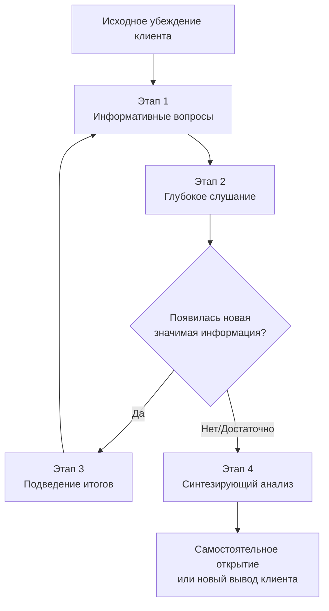

Сократический диалог — не просто техника задавания вопросов в терапии. Это принципиальная позиция, определяющая, является ли терапия совместным эмпирическим поиском или директивным исправлением «неправильных» мыслей. Центральный конфликт метода лежит в вопросе о его цели: изменить убеждение клиента или направить его к самостоятельному открытию.

## Исторические корни и классические принципы

**Сократический диалог** как метод ведения беседы восходит к практике древнегреческого философа Сократа (V век до н.э.), чьи идеи сохранились в сочинениях его ученика Платона. Суть метода заключалась в том, что собеседник (ученик или оппонент) самостоятельно приходил к выводу или решению проблемы через серию целенаправленных вопросов «учителя». Вместо прямого наставления Сократ побуждал к размышлениям, умозаключениям и выявлению противоречий в собственных суждениях. Целью была не демонстрация своей правоты, а помощь в самостоятельном приближении к пониманию сути вещей.

Этот метод построения рассуждения вышел далеко за рамки философии. Сегодня его принципы применяются в образовании для развития критического мышления, в психотерапии для изучения и изменения мышления и поведения, в коучинге и менеджменте.

Классическая структура диалога включает несколько этапов:
1.  **Формулировка тезиса или проблемы** (например, «Что такое добродетель?»).
2.  **Уточняющие вопросы** ведущего (Сократа) для выявления исходных определений и понятий собеседника (ученика). На этом этапе часто вскрываются логические противоречия.
3.  **Переосмысление** исходных посылок через вопрос «Почему ты так считаешь?».
4.  **Самостоятельная формулировка вывода** учеником — новой, более обоснованной и менее противоречивой гипотезы.

Главные принципы такого диалога:
*   **Активное участие собеседника.** Ведущий только направляет беседу, истину находит ученик.
*   **Уточняющий характер вопросов.** Вопросы типа «Что ты имеешь в виду?», «Почему это важно?», «Как это соотносится с твоим предыдущим утверждением?».
*   **Критическое осмысление каждого утверждения.** Уточняющие вопросы служат инструментом для непредвзятого взгляда на свои идеи.
*   **Отказ ведущего от позиции «носителя истины».** Сократовское «Я знаю, что ничего не знаю» подчеркивает важность признания ограниченности своих познаний для открытости новым аргументам и корректировки позиции.

## Сократический диалог в когнитивной терапии: два подхода

В когнитивной терапии метод стал краеугольным камнем терапевтического процесса. Кристин Падески в своей лекции выделяет два принципиально разных подхода к его использованию, которые определяют природу терапевтических отношений.

### Изменение убеждений

В этом подходе терапевт заранее знает «правильный» ответ или желаемое изменение в убеждении клиента. С помощью серии вопросов он подводит клиента к заранее определенному выводу, часто — к осознанию логической ошибки. Цель — быстро и эффективно скорректировать «неадаптивное» убеждение.

**Пример диалога (изменение убеждения):**
Клиент (С): «Я полный неудачник во всех отношениях».
Терапевт (Т): «Вы говорите, что никогда ничего не сделали хорошо?»
С: «Ничего значимого».
Т: «Как насчет помощи детям на этой неделе? Это было для них важно?»
С: «Думаю, да».
Т: «То, что вы сделали что-то важное для семьи, сопоставимо с утверждением "я полный неудачник"?»
С: «Пожалуй, нет. Наверное, я чувствую себя получше».

В этом примере терапевт ведет клиента по продуманному маршруту к цели — смягчению глобального негативного убеждения. Клиент пассивен, его ответы служат подтверждению логики терапевта.

### Направляемое открытие

Альтернативный подход, который Падески считает истинной сутью метода в когнитивной терапии. Здесь терапевт не знает финального ответа. Его роль — с искренним любопытством задавать вопросы, которые помогают клиенту исследовать свою ситуацию, собрать новую информацию и самостоятельно прийти к уникальным для него выводам.

**Пример диалога (направляемое открытие):**
С: «Я полный неудачник во всех отношениях».
Т: «Что вы имеете в виду, говоря "никчемны"?»
С: «Я все провалил. Моя семья несчастна из-за моей депрессии».
Т: «Что бы вы делали иначе, если бы были, по вашим представлениям, лучшим отцом?»
С: «Больше бы общался, смеялся, воодушевлял их».
Т: «А могли бы вы попробовать делать это, даже находясь в депрессии? Как бы вы могли это проверить?»
С: «Мог бы попробовать неделю... и посмотреть, станут ли дети счастливее».

Здесь терапевт не оспаривает убеждение, а исследует его смысл и возможные действия. Клиент самостоятельно приходит к плану поведенческого эксперимента. Решение принадлежит ему, а не терапевту.

## Четыре этапа направляемого открытия по Падески

Для реализации подхода направляемого открытия Падески предлагает структуру из четырех последовательных этапов.

### Этап 1: Информативные вопросы

Хороший терапевтический вопрос соответствует критериям:
*   **Ответимость:** Клиент может ответить на него, основываясь на своем опыте и знаниях. Вопрос «Что я (терапевт) собираюсь сказать?» нарушает этот принцип.
*   **Релевантность:** Вопрос привлекает внимание к информации, важной для проблемы, но находящейся вне текущего фокуса клиента (например, к забытому позитивному опыту во время депрессии).
*   **Движение от частного к общему:** Диалог начинается с конкретики («Что случилось в тот вечер?»), переходит к обобщениям («Что значит быть хорошим отцом?») и возвращается к конкретному плану («Что сделать на следующей неделе?»).

### Этап 2: Глубокое слушание

При направляемом открытии каждый ответ клиента — ценная информация, а не просто шаг к цели. Терапевт должен быть открыт неожиданностям.
*   Отсутствие удивления от ответов клиента — сигнал о шаблонности вопросов или прекращении настоящего слушания.
*   Важно слышать не только содержание, но и уникальные формулировки, метафоры, эмоциональные оттенки речи. Отражение этих особенностей («Вы сказали "как будто меня стерли в порошок"») углубляет контакт и ведет к базовым схемам.

### Этап 3: Регулярное подведение итогов

В процессе диалога возникает много разрозненных данных. Клиент может быть эмоционально перегружен.
*   Терапевту необходимо резюмировать ключевые моменты обсуждения каждые 10-15 минут.
*   Это проверяет взаимопонимание, связывает факты в единую картину и позволяет клиенту увидеть новую информацию целостно. Важные итоги стоит записывать.

### Этап 4: Синтезирующий анализ

Финальный, критически важный этап — помочь клиенту связать новое знание с исходной проблемой.
*   Синтезирующий вопрос: «Как все, что мы обсудили, соотносится с вашей первоначальной мыслью о том, что вы неудачник?»
*   Этот вопрос часто приводит к самым неожиданным и глубоким открытиям, которые полностью принадлежат клиенту.

## Практическое применение: от терапии к самопомощи

Принципы сократического диалога эффективны не только в кабинете терапевта, но и как методика самостоятельной работы с тревожными, депрессивными или навязчивыми мыслями.

### Алгоритм сократического диалога с самим собой

**Шаг 1: Конкретная формулировка проблемы.**
Избегайте общих фраз («Мне плохо», «Я в стрессе»). Сфокусируйтесь на конкретной мысли или ситуации.
*   *Пример:* «Я боюсь, что меня уволят, если я сделаю ошибку в отчете».

**Шаг 2: Составьте список вопросов к себе.**
Используйте разные типы вопросов для всестороннего анализа:
1.  **Уточняющие:** «Что именно в этой ситуации вызывает наибольший страх?», «На каких конкретных фактах или событиях основана моя тревога?»
2.  **Проверка предпосылок и логики:** «Откуда я взял уверенность, что ошибка обязательно приведет к увольнению?», «Есть ли реальные доказательства, подтверждающие этот сценарий? А опровергающие его?»
3.  **Альтернативные точки зрения:** «Как посмотрел бы на эту ситуацию мой коллега, известный своим спокойствием?», «Что сказал бы мой близкий друг, услышав мои опасения?»
4.  **Прогнозирование последствий:** «Что самое худшее может случиться в реальности? Насколько это вероятно?», «Как я смогу смягчить последствия, если худшее все же произойдет?»
5.  **«Переворот» ситуации:** «А если моя тревога преувеличена? Как бы я тогда воспринимал эту задачу?», «Может ли эта потенциальная ошибка быть просто этапом обучения, а не катастрофой?»

**Шаг 3: Запишите ответы и проведите анализ.**
Разделите лист бумаги на две колонки: «Аргументы в пользу моей тревожной мысли» и «Аргументы против нее». Внесите туда все, что пришло в голову в ответ на вопросы.
*   *Пример:* С одной стороны — «Я новичок в этой задаче», с другой — «У меня есть методичка, и я могу спросить у наставника».

**Шаг 4: Подумайте о своих ресурсах.**
Вспомните, как вы справлялись с похожими трудностями в прошлом. Определите, к кому можно обратиться за помощью или советом.

**Шаг 5: Определите практические шаги.**
Составьте конкретный список действий, которые снизят риск или помогут подготовиться.
*   *Пример:* «Изучить методичку до конца дня», «Запланировать консультацию с наставником на завтра», «Сделать черновик отчета и отправить на предварительную проверку».

## Значение для долгосрочных результатов терапии

Ключевая задача когнитивной терапии — не сиюминутное улучшение настроения, а обучение клиента методу оценки своих мыслей, поведения и эмоций. **Сократический диалог как направляемое открытие** — основной инструмент этого обучения.

Исследования outcomes показывают, что профилактика рецидивов при депрессии связана не с фактом изменения конкретного убеждения, а с усвоением навыка его исследования и пересмотра. Клиент, который научился с помощью системы вопросов анализировать свои автоматические мысли, получает инструмент на всю жизнь.

Существует принципиальная разница между двумя результатами:
1.  Клиент говорит: «Мне стало лучше, потому что терапевт показал, что мое мышление было негативным».
2.  Клиент говорит: «Я научился самостоятельно замечать, когда мое мышление становится негативным и искаженным, задавать себе вопросы, искать доказательства и принимать более взвешенные решения».

Первый результат — следствие подхода «изменение убеждений». Второй — результат подхода «направляемое открытие».

## Риски и будущее метода

Падески выражает обеспокоенность тем, что под давлением требований к краткосрочности и экономической эффективности терапии (особенно в системах здравоохранения Великобритании и США) происходит упрощение метода. Сократический диалог рискует выродиться в технику быстрого «исправления» мыслей, что ведет к потере глубины, сотрудничества и, как следствие, долгосрочной эффективности.

Без четкого определения и эмпирического изучения компонентов «хорошего» сократического диалога, направленного на открытие, невозможно доказать его преимущества перед простым изменением убеждений. Дальнейшие исследования должны быть направлены на выделение ключевых составляющих метода, которые обеспечивают устойчивые результаты и профилактику рецидивов.

## Запомнить

*   **Историческая основа** метода — диалоги Сократа, записанные Платоном. Ключевые принципы: активность ученика, уточняющие вопросы, критическое осмысление, позиция «не-знания» ведущего.
*   **В когнитивной терапии** существуют два подхода: **изменение убеждений** (терапевт ведет к заранее известному ответу) и **направляемое открытие** (терапевт с любопытством помогает клиенту самостоятельно исследовать проблему).
*   **Этапы направляемого открытия по Падески:** 1) задавание информативных вопросов, 2) глубокое слушание, 3) регулярное подведение итогов, 4) синтезирующий анализ.
*   **Хороший терапевтический вопрос** — тот, на который клиент может ответить; который привлекает внимание к релевантной, но упускаемой информации; который движется от частного к общему.
*   **Метод эффективен для самопомощи.** Алгоритм включает: конкретизацию проблемы, задавание себе серии вопросов разных типов (уточняющие, на проверку логики, альтернативные взгляды, прогноз последствий), анализ аргументов за и против, планирование конкретных действий.
*   **Долгосрочный эффект** терапии обеспечивается не сменой убеждений, а обучением клиента методу исследования собственного мышления через диалог.
*   **Главный риск** — упрощение метода до техники быстрого убеждения под давлением требований к краткосрочности терапии, что ведет к потере его сути и эффективности.
