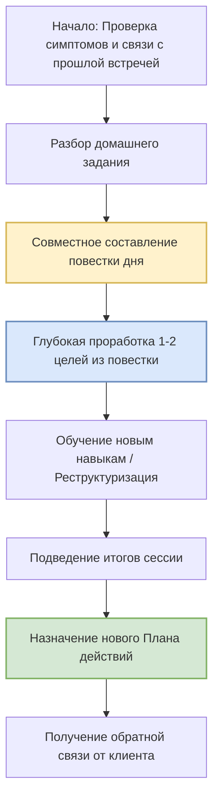

Когда человек обращается за психологической помощью, он часто представляет себе киношный образ: пациент ложится на кушетку и долго, хаотично жалуется на жизнь, пока психоаналитик молча делает пометки. Однако в современной когнитивно-поведенческой терапии (КПТ) процесс выглядит совершенно иначе. Если первая встреча посвящена знакомству и построению общей карты лечения, то все последующие — это само путешествие, где каждая минута подчинена строгой логике и направлена на конкретный результат.

Чтобы справиться с тревогой, депрессией или жизненным кризисом, недостаточно просто «выговориться» — необходима четкая система действий. В этой статье мы подробно разберем внутреннее устройство типичной сессии КПТ. Вы узнаете, почему предсказуемость формата снижает уровень тревоги, как правило «10–30–10» помогает успеть главное и каким образом домашние задания становятся мостом между кабинетом психолога и вашей реальной жизнью.

## Надежный компас: Зачем психотерапии нужна жесткая структура

Главное отличие КПТ от многих других подходов — это её высокая предсказуемость. Структурированность сессий сама по себе обладает мощным терапевтическим эффектом, так как она снижает тревогу клиента: человек всегда понимает, чего ждать от встречи и как именно будет распределяться его рабочее время *(Добсон и Добсон, 2021)*. Предсказуемый формат не ограничивает свободу, а напротив — служит надежным каркасом безопасности, гарантирующим, что терапия не превратится в бесцельное блуждание по эмоциям и жалобам *(Бек, 2021)*.

Отказ от бесконтрольных разговоров не означает отсутствие сочувствия. Напротив, следование четкому плану — это проявление уважения к ресурсам клиента. Структура помогает рационально использовать короткое время часа, предотвращая «затопление» в потоке жалоб, и направляет все усилия на реальное решение проблем *(Бек, 2021)*. Она выступает в роли «дорожной карты», которая гарантирует, что к концу встречи вы почувствуете не просто эмоциональную разрядку, но и получите конкретные инструменты для работы над собой *(Бек, 2021)*.

## Анатомия исцеления: Правило «10–30–10»

Чтобы избежать спешки и качественно проработать наиболее важные вопросы, специалисты делят стандартную 50-минутную сессию на три функциональных блока по правилу **«10–30–10»** *(Добсон и Добсон, 2021)*.

| Этап сессии | Продолжительность | Фокус внимания | Ключевой процесс |
| :--- | :--- | :--- | :--- |
| **1. Вводная часть** | ~10 минут | Настоящее и недавнее прошлое | Оценка настроения, проверка домашнего задания, составление повестки дня *(Бек, 2021)*. |
| **2. Основная часть** | ~30 минут | Фокус на выбранной проблеме | Когнитивная реструктуризация, поиск решений, обучение новым навыкам *(Бек, 2021)*. |
| **3. Завершение** | ~10 минут | Будущая неделя | Финальное резюме, новое домашнее задание, сбор обратной связи *(Бек, 2021)*. |

### 1. Вводная часть: Сверка координат
Сессия никогда не начинается со случайных тем. Первые минуты посвящены оценке вашего состояния и наведению мостов между встречами.
* **Проверка настроения:** Терапевт просит вас объективно оценить состояние (например, по шкале от 0 до 10) *(Бек, 2021)*.
* **Обзор прошедшей недели:** Вы обсуждаете значимые события, произошедшие с момента прошлой встречи.
* **Разбор домашнего задания:** Это критический этап. Уделять время тому, что получилось, а что нет (и почему) — обязательная часть КПТ *(Добсон & Добсон, 2021)*.
* **Составление повестки дня:** Терапевт и клиент совместно решают, какие 1–2 конкретные проблемы важнее всего обсудить именно сегодня *(Бек, 2021)*.

### 2. Основная часть: Активная проработка
Это ядро терапевтического часа, где происходит глубокая работа над выбранными пунктами повестки. Терапевт применяет методику **направляемого открытия** (**сократовский диалог** — систему уточняющих вопросов, помогающую клиенту самому прийти к важным выводам), чтобы помочь вам оценить свои мысли и найти здоровые альтернативы *(Бек, 2021)*.

В процессе работы специалист периодически подводит **промежуточные итоги**, чтобы убедиться, что вы правильно друг друга понимаете и сохраняете фокус на цели *(Бек, 2021)*. Здесь вы учитесь новым способам мышления и находите действия, в которых будете практиковаться дома.

### 3. Завершение: Интеграция и закрепление
В конце встречи необходимо собрать все инсайты (внезапные озарения или понимания) воедино:
* **Финальное резюме:** Обобщаются главные выводы сегодняшней встречи *(Добсон и Добсон, 2021)*.
* **Новый План действий:** Вы договариваетесь о том, какие навыки будете тренировать в реальном мире до следующей встречи *(Бек, 2021)*.
* **Обратная связь:** Терапевт обязательно спрашивает: «Было ли сегодня что-то непонятное или неприятное?». Это укрепляет **раппорт** (состояние доверия и взаимопонимания) и позволяет скорректировать подход *(Бек, 2021)*.

## Ключевые двигатели прогресса: Повестка, Практика и Честность

В структуре сессии есть три абсолютных столпа, без которых терапия теряет свою эффективность.

**1. Повестка дня: Защита от потери курса.** Она защищает сессию от превращения в светскую беседу или дрейфа от одной тревожной темы к другой *(ДиДжузеппе и др., 2021)*. Установление повестки учит клиента брать ответственность за свое лечение и концентрироваться на главном.

**2. Домашние задания: Мост в реальную жизнь.** Истинные изменения происходят не в кресле специалиста, а в реальном мире. 50 минут в кабинете — это капля в море по сравнению со всей остальной жизнью *(Босуэлл и Константино, 2023)*. Исследования подтверждают: клиенты, систематически выполняющие задания (ведущие дневники мыслей, проводящие эксперименты), достигают успеха значительно быстрее *(Бек, 2021)*.

**3. Обратная связь: Проверка связи.** Запрос мнения клиента в конце каждой встречи — это не просто вежливость. Это способ вовремя устранить любое недопонимание, если терапевт, например, был слишком директивен (навязчив в руководстве) *(Бек, 2021)*.

> Структура КПТ-сессии — это не жесткие рамки, а надежные строительные леса. Следуя проверенному алгоритму, вы превращаете терапию из абстрактных бесед в прозрачный, измеримый процесс.

## Постепенная передача руля: Динамика целей от сессии к сессии

Хотя структура встреч остается неизменной, их содержание трансформируется по мере вашего прогресса *(Бек, 2021)*.

* **Ранняя фаза:** Цель — снижение острых симптомов (паники, апатии). Терапевт более директивен и берет на себя лидерство в структурировании сессий *(Бек, 2021)*.
* **Средняя фаза:** Фокус смещается с поверхностных мыслей на **глубинные убеждения** (схемы) и жесткие правила жизни. Клиент становится более активным, самостоятельно находит когнитивные ошибки *(Бек, 2021)*.
* **Завершающая фаза:** Главная цель — автономия и профилактика рецидивов (возврата симптомов). Клиент фактически становится терапевтом для самого себя: сам задает повестку и назначает себе задания *(Бек, 2021)*.

## Глубокое погружение: Инструменты последующих сессий

По мере укрепления доверия терапевт переходит к выявлению скрытых механизмов проблемы, используя специальные техники:

1. **Выявление промежуточных убеждений:** Перевод поведения в условные правила («Если я не сделаю это идеально, то я неудачник») *(Бек, 2021)*.
2. **Техника «Падающей стрелы»:** Поиск корневого убеждения о себе через вопрос: «Если эта мысль верна, что это говорит о вас как о личности?» *(Бек, 2021)*.
3. **Изучение истории формирования:** Понимание того, какие события в детстве или в школе заставили вас поверить в свою неполноценность или уязвимость *(Бек, 2021)*.
4. **Анализ стратегий совладания (**копинг-стратегий**):** Изучение того, как вы защищаете себя от боли (например, через перфекционизм или избегание) *(Бек, 2021)*.
5. **Поиск сильных сторон:** Обязательное включение ресурсов и адаптивных (здоровых) убеждений в карту вашего разума *(Бек, 2021)*.

## Вывод и литература

Типичная сессия в когнитивно-поведенческой терапии — это высокоорганизованный процесс, направленный на достижение конкретных жизненных изменений. Благодаря правилу «10–30–10», совместному составлению повестки дня и обязательному разбору домашних заданий, терапия превращается из хаотичного обсуждения чувств в прозрачный и управляемый алгоритм. Постепенно осваивая эту структуру, вы обучаетесь применять её самостоятельно, обретая навыки психологической устойчивости, которые останутся с вами на всю жизнь. Главная победа каждой сессии — это момент, когда вы уходите с четким планом действий и пониманием, как работает ваш разум.

**Литература:**
* Бек, Дж. С. (2021). *Когнитивно-поведенческая терапия. От основ к направлениям (3-е изд.)*. ООО "Прогресс книга".
* Босуэлл, Дж. Ф., & Константино, М. Дж. (2023). *Преднамеренная практика в когнитивно-поведенческой терапии*. Науковий Світ.
* ДиДжузеппе, Р., Дойл, К., Драйден, У., & Бакс, У. (2021). *Рационально-эмотивно-поведенческая терапия*.
* Добсон, Д., & Добсон, К. С. (2021). *Научно-обоснованная практика в когнитивно-поведенческой терапии*. Питер.

---

### Проверка понимания

**Микро-кейс:**
Клиент Марк приходит на свою 5-ю сессию КПТ. Едва сев в кресло, он начинает эмоционально и без остановок рассказывать о ссоре с начальником, которая произошла вчера. Начинающий психотерапевт, боясь показаться неэмпатичным, внимательно слушает Марка 45 минут, изредка кивая и сочувствуя. За 5 минут до конца времени терапевт говорит: *"Я вижу, вам было очень тяжело. К сожалению, наше время истекло. Давайте вы просто продолжите вести свой дневник мыслей, как и на прошлой неделе, и мы увидимся в следующий вторник"*.

**Вопрос:** Опираясь на стандарты структуры типичной сессии (правило «10–30–10»), назовите как минимум ТРИ обязательных этапа, которые терапевт полностью проигнорировал. Как такое отсутствие структуры в среднесрочной перспективе повлияет на эффективность лечения Марка и его отношение к домашним заданиям? Сформулируйте одну фразу, которой терапевт мог бы мягко остановить Марка в начале встречи, чтобы направить сессию в конструктивное русло.
