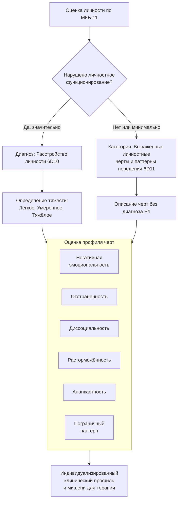

Личностные черты в МКБ-11 представляют собой фундаментальный сдвиг от категориальной диагностики к размерному (дименсиональному) описанию человека. Это не самостоятельные диагнозы, а набор измеряемых характеристик, отражающих глубинную структуру личности. Они находятся в одном континууме — одни и те же черты в разной степени выраженности присутствуют как у людей с расстройствами личности (РЛ), так и у условно здоровых. Новый подход позволяет создать индивидуализированный профиль пациента: описать, какие черты выражены, как они сочетаются и насколько нарушено общее личностное функционирование. Это ключ к переходу от наклеивания ярлыков «параноид» или «истерик» к пониманию уникальной конфигурации проблем и ресурсов конкретного человека, что напрямую определяет стратегию психотерапевтического вмешательства.

## 1. Концепция личностных черт в новой парадигме

В МКБ-11 личностные черты рассматриваются как устойчивые паттерны восприятия, отношения к миру и мышления, которые проявляются в широком диапазоне личных и социальных ситуаций. Они являются **квалификаторами**, которые добавляются к диагнозу «Расстройство личности» (код 6D10) или могут быть указаны отдельно как «Выраженные личностные черты и паттерны поведения» (код 6D11), если нарушения функционирования не достигают порога расстройства.

**Ключевые принципы работы с чертами:**
*   **Континуальность:** Черты — это измерения, а не категории «есть/нет». Их выраженность может варьироваться от минимальной до крайней.
*   **Множественность:** Для описания одного человека может использоваться столько квалификаторов, сколько необходимо. Часто встречаются комплексные профили (например, сочетание негативной эмоциональности и ананкастности).
*   **Связь с тяжестью:** Как правило, чем тяжелее расстройство личности, тем больше выраженных черт наблюдается. Однако возможны и исключения: при тяжелом расстройстве может доминировать всего одна, но крайне выраженная черта (например, глубокая отстранённость).
*   **Фокус на изменяемое:** Эти черты становятся объектом психотерапевтической работы. Их оценка позволяет выявить мишени для коррекции — те устойчивые паттерны, которые причиняют страдание и нарушают адаптацию.

## 2. Домен 1: Негативная эмоциональность (6D11.0)

**Центральная характеристика:** Склонность к переживанию широкого спектра негативных эмоций (тревога, беспокойство, депрессивный аффект, уязвимость, страх, гнев, враждебность, вина, стыд) с частотой и интенсивностью, непропорциональными ситуации.

Этот домен описывает **фон** эмоциональной жизни человека. Эмоции не просто сильные, но и плохо регулируемые, долго длящиеся, легко возникающие по незначительным поводам.

**Типичные проявления у лиц с РЛ:**

1.  **Эмоциональная лабильность и слабая регуляция:**
    *   Частые, резкие колебания настроения.
    *   Склонность легко и глубоко расстраиваться.
    *   Медленное возвращение к эмоциональному равновесию после стресса.

2.  **Низкая самооценка и неуверенность в себе:**
    *   Избегание вызовов и сложных задач из-за восприятия их как непосильных.
    *   Постоянный поиск поддержки, советов, разубеждений от других.
    *   Зависть к успехам окружающих.
    *   В тяжёлых случаях — чувство никчёмности, неспособности что-либо сделать, суицидальные мысли.

3.  **Негативные установки:**
    *   Глобальный пессимизм и негативный прогноз.
    *   Автоматическое отклонение предложений и советов («это слишком сложно», «это не сработает», «будет только хуже»).

4.  **Мнительность:**
    *   Подозрение, что у других есть скрытые дурные намерения.
    *   Частая негативная интерпретация нейтральных слов или действий.
    *   Недоверие к хорошим поступкам других (поиск скрытых мотивов).
    *   Ожесточение и цинизм («весь мир против меня», «всё подстроено»).

**Клиническое значение:** Этот домен часто является ядром для тревожного (избегающего), зависимого расстройств личности, а также существенным компонентом пограничного и истерического расстройств. В терапии работа идёт над **навыками эмоциональной регуляции**, **когнитивной реструктуризацией** автоматических негативных мыслей и **повышением толерантности к дистрессу**.

## 3. Домен 2: Отстранённость (6D11.1)

**Центральная характеристика:** Склонность к сохранению дистанции — как социальной (ограничение контактов), так и эмоциональной (сдержанность в чувствах).

Этот домен отражает фундаментальное снижение мотивации и способности к вовлечённости в межличностный мир.

**Типичные проявления у лиц с РЛ:**

1.  **Социальная отстранённость:**
    *   Активное избегание социальных взаимодействий, кроме самых необходимых.
    *   Минимальное количество друзей, знакомых, отсутствие близких доверительных связей.
    *   Избегание физической и эмоциональной близости, включая сексуальные отношения.

2.  **Эмоциональная отстранённость:**
    *   Сдержанность, холодность, формальность в общении.
    *   Ограниченное выражение эмоций вербально и невербально («уплощённый аффект»).
    *   В крайних формах — почти полное отсутствие эмоционального отклика как на негативные, так и на позитивные события (эмоциональная тупость).
    *   Сниженная способность испытывать удовольствие (ангедония).

**Клиническое значение:** Отстранённость — центральный домен для **шизоидного** и **шизотипального** расстройств личности, а также значимый компонент параноидного (как защита от perceived threat). Терапия с такими пациентами сложна из-за низкой мотивации к изменениям и установлению контакта. Работа может быть направлена на **постепенное, дозированное расширение социальных навыков**, **понимание выгод и потерь от изоляции**, а также на развитие альтернативных, не связанных с людьми, источников смысла и удовлетворения.

## 4. Домен 3: Диссоциальность (6D11.2)

**Центральная характеристика:** Пренебрежение правами и чувствами других, включающее два ключевых компонента: **эгоцентризм** и **отсутствие эмпатии**.

Этот домен описывает паттерн, при котором другие люди рассматриваются исключительно как инструменты для удовлетворения собственных потребностей или как препятствия.

**Типичные проявления у лиц с РЛ:**

1.  **Эгоцентризм:**
    *   Убеждённость в собственном исключительном праве на особое обращение и привилегии.
    *   Ожидание и требование восхищения от окружающих.
    *   Поведение, направленное на то, чтобы быть в центре внимания; гнев и разочарование, если это не удаётся.
    *   Убеждённость в своих выдающихся способностях и будущем величии.
    *   Уверенность, что другие должны считаться с их потребностями, желаниями и комфортом.

2.  **Дефицит эмпатии:**
    *   Безразличие к тому, как их действия влияют на других, причиняют ли они неудобство или вред.
    *   Склонность к обману и манипуляциям для эксплуатации людей и ситуаций в личных целях.
    *   Готовность к агрессии (вербальной, физической) как к инструменту достижения цели.
    *   В крайних проявлениях — **бессердечие**: отсутствие эмоциональной реакции на страдания других, безжалостность, возможность получать удовольствие от причинения боли или вреда.

**Клиническое значение:** Диссоциальность составляет ядро **антисоциального (диссоциального)** и **нарциссического** расстройств личности. Терапия с выраженной диссоциальностью крайне сложна, так как сам пациент часто не видит проблем в своём поведении. Работа может фокусироваться на **анализе долгосрочных негативных последствий** их действий для них самих (а не для жертв), развитии **просоциальных навыков** как более эффективного способа достижения целей в долгосрочной перспективе, а также на формировании хоть какого-то понимания причинно-следственных связей в социальном мире.

## 5. Домен 4: Расторможённость (6D11.3)

**Центральная характеристика:** Устойчивая склонность действовать импульсивно в ответ на внутренние или внешние стимулы, без учёта потенциальных негативных последствий.

Этот домен описывает дефицит «тормозов» — как в поведении, так и в когнитивной сфере (неспособность удержать фокус внимания).

**Типичные проявления у лиц с РЛ:**

1.  **Импульсивность:** Склонность к опрометчивым действиям, подвергающим риску себя и других. Трудности с отсрочкой удовлетворения, стремление к немедленному вознаграждению.
2.  **Отвлекаемость:** Трудности с концентрацией на рутинных, скучных или сложных задачах. Быстрое возникновение фрустрации и переключение на более приятные занятия.
3.  **Безответственность:** Ненадёжность, невыполнение рабочих заданий, обязательств и обещаний. Систематические опоздания, пропуски встреч.
4.  **Безрассудство:** Недооценка опасности, переоценка своих возможностей. Склонность к опасному вождению, рискованным видам спорта или деятельности без должной подготовки.
5.  **Дефицит планирования:** Предпочтение спонтанности любым планам. Фокусировка на сиюминутных ощущениях в ущерб краткосрочным и долгосрочным целям. Даже при составлении планов — неспособность их выполнить.

**Клиническое значение:** Расторможённость — центральная черта **импульсивного типа эмоционально неустойчивого РЛ**, а также значимый компонент антисоциального и пограничного расстройств. Терапия направлена на развитие **навыков остановки** (паузы между импульсом и действием), **тренировку планирования**, **улучшение концентрации внимания** и **повышение толерантности к фрустрации** от рутинных задач.

## 6. Домен 5: Ананкастность (6D11.4)

**Центральная характеристика:** Сфокусированность на жёстких стандартах совершенства, правилах, а также на контроле собственного поведения, поведения других людей и ситуаций для обеспечения соответствия этим стандартам.

Этот домен описывает личность, запертую в клетке собственных правил и ожиданий, где спонтанность и гибкость воспринимаются как угроза.

**Типичные проявления у лиц с РЛ:**

1.  **Перфекционизм:**
    *   Озабоченность социальными правилами, нормами, обязательствами.
    *   Скрупулёзное, дотошное внимание к деталям, часто в ущерб общей цели задачи.
    *   Ригидное, систематическое планирование даже обыденных дел.
    *   Требование от окружающих тех же стандартов, что и от себя, что вызывает конфликты в отношениях.

2.  **Эмоциональные и поведенческие ограничения:**
    *   Жёсткий контроль над выражением эмоций (считаются опасными или неуместными).
    *   Дефицит спонтанности, нежелание менять планы.
    *   Избегание любого риска, отказ от деятельности с потенциально негативными последствиями.
    *   Ригидное упрямство, трудности с переключением с задачи, которая «ещё не доведена до совершенства».
    *   Трудности в принятии решений из-за опасения, что не все аспекты учтены.

**Клиническое значение:** Ананкастность — основа **обсессивно-компульсивного (ананкастного) расстройства личности**. Важно отличать её от обсессивно-компульсивного расстройства (ОКР) как заболевания оси I, где присутствуют истинные навязчивые мысли и ритуалы. Терапия направлена на **снижение перфекционизма**, **развитие гибкости**, **обучение принятию неопределённости** и **ослабление чрезмерного контроля** через поведенческие эксперименты и когнитивную реструктуризацию иррациональных убеждений о катастрофичности ошибок.

## 7. Пограничный паттерн (6D11.5)

**Особый статус:** В МКБ-11 пограничный паттерн выделен отдельным квалификатором из-за его клинической значимости и специфичности, хотя его проявления пересекаются с другими доменами (негативная эмоциональность, расторможённость).

**Ключевая характеристика:** Повторяющийся паттерн нестабильности в **межличностных отношениях**, **образе «Я»**, **эмоциях**, а также **выраженная импульсивность**. В основе часто лежит травматический опыт.

**Диагностические индикаторы (присутствие пяти или более):**
1.  Отчаянные усилия избежать реального или воображаемого одиночества, отвержения.
2.  Паттерн нестабильных, интенсивных, конфликтных межличностных отношений с циклами идеализации и обесценивания.
3.  Нарушение идентичности: выраженная и нестабильная самооценка, чувство «Я».
4.  Импульсивность в потенциально саморазрушающих сферах (финансы, секс, ПАВ, рискованное поведение).
5.  Эмоциональная нестабильность из-за выраженной лабильности настроения.
6.  Неуместный, интенсивный гнев или трудности с контролем гнева.
7.  Склонность действовать опрометчиво в состоянии сильного негативного аффекта.
8.  Повторяющееся суицидальное поведение, самоповреждения.
9.  Хроническое чувство опустошённости.
10. Преходящие диссоциативные симптомы или параноидные идеи в состоянии стресса.

**Клиническое значение:** Выделение этого паттерна улучшает клиническую полезность диагностики, так как чётко указывает на пациентов, которым могут быть особенно эффективны специфические виды психотерапии, такие как **диалектико-поведенческая терапия (ДПТ)**, **ментализация-базированная терапия**, **схема-терапия**. Работа идёт над **стабилизацией аффекта**, **развитием навыков регуляции**, **укреплением идентичности** и **коррекцией паттернов отношений**.

## 8. От оценки к терапии: как черты определяют лечение

Новый подход МКБ-11 делает диагностику прямым руководством к действию. Оценка личностных черт не является абстрактной — она отвечает на вопрос **«что менять?»**.

*   **Тяжесть расстройства** (лёгкая, умеренная, тяжёлая) определяет **интенсивность, частоту, тип и уровень помощи**. Тяжёлое РЛ требует длительной, интенсивной, часто мультимодальной терапии, возможно, с элементами социальной реабилитации.
*   **Констелляция (сочетание) личностных черт** определяет **выбор конкретных стратегий и техник**. Терапевт подбирает методы, исходя из профиля:
    *   При **негативной эмоциональности** — техники регуляции эмоций, когнитивная терапия.
    *   При **отстранённости** — дозированная и осторожная работа над социальными навыками, мотивационное интервьюирование.
    *   При **диссоциальности** — фокус на последствиях поведения, просоциальном обучении, установлении чётких границ.
    *   При **расторможённости** — тренировка навыков остановки, планирования, повышения фрустрационной толерантности.
    *   При **ананкастности** — работа с перфекционизмом, когнитивной ригидностью, обучение гибкости.
    *   При **пограничном паттерне** — комплексная программа, направленная на стабилизацию, часто с использованием специализированных протоколов (ДПТ).

Таким образом, диагноз по МКБ-11 из формального заключения превращается в **индивидуальную карту терапии**, где указаны как области глобальной дисфункции (тяжесть), так и конкретные мишени для психотерапевтического вмешательства (домены черт).

## Запомнить

*   **Личностные черты в МКБ-11** — это **измеряемые дименсии**, а не категории. Они описывают устойчивые паттерны восприятия, мышления и поведения, общие для всех людей, но в разной степени выраженности.
*   **Пять основных доменов черт:**
    1.  **Негативная эмоциональность:** Фон интенсивных, плохо регулируемых негативных эмоций (тревога, гнев, стыд).
    2.  **Отстранённость:** Снижение мотивации и способности к социальным и эмоциональным контактам.
    3.  **Диссоциальность:** Пренебрежение чувствами других, эгоцентризм, отсутствие эмпатии.
    4.  **Расторможённость:** Импульсивность, безответственность, дефицит планирования и контроля.
    5.  **Ананкастность:** Перфекционизм, ригидность, потребность в контроле.
*   **Пограничный паттерн** выделен отдельно как комплексный квалификатор, включающий нестабильность в отношениях, образе «Я», аффектах и импульсивность.
*   **Выраженность черт** используется как **квалификатор** к диагнозу «Расстройство личности» (6D10) или как самостоятельная запись «Выраженные личностные черты» (6D11), если нарушений функционирования недостаточно для диагноза РЛ.
*   **Клиническое значение** подхода огромно: оценка профиля черт **напрямую указывает на мишени психотерапии**. Тяжесть расстройства определяет интенсивность помощи, а специфические черты — выбор терапевтических техник (навыки регуляции эмоций, развитие эмпатии, тренировка самоконтроля, снижение перфекционизма и т.д.). Это делает диагностику по МКБ-11 практико-ориентированной и персонализированной.
