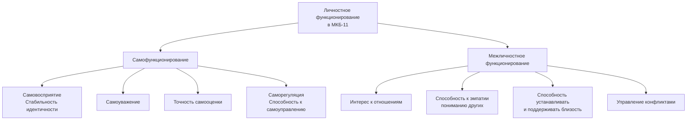

Международная классификация болезней 11-го пересмотра (МКБ-11) представляет собой революционный шаг в диагностике расстройств личности (РЛ). Она отказывается от традиционной категориальной системы, представленной в МКБ-10 и DSM-5, где диагноз ставился на основе соответствия набору критериев для одного из 8-10 специфических «типов». Новый подход основан на **размерной (дименсиональной) модели**, которая оценивает личность по двум осям: 1) **тяжесть нарушения личностного функционирования** и 2) **выраженность определённых проблемных черт (доменов)**. Этот сдвиг призван решить хронические проблемы психиатрической диагностики: высокую коморбидность, низкую надёжность диагнозов «смешанного типа» и слабую связь между диагнозом и планом лечения. Понимание этого подхода — обязательное условие для современного клинического психолога, работающего в парадигме доказательной практики.

## 1. Концептуальные основы: от статичного типа к динамическому функционированию

В основе нового подхода лежит переопределение того, что именно считается нарушением личности. Если ранее акцент делался на описании статичных, стереотипных поведенческих паттернов («параноидный», «истерический»), то теперь центральным объектом оценки становится **личностное функционирование** — динамическая способность человека адаптивно взаимодействовать с собой и миром.

### 1.1. Личность и её расстройство: новое определение
МКБ-11 предлагает следующие рабочие определения:
*   **Личность** — характерный для индивидуума **паттерн поведения, отношения к жизни, восприятия и понимания** себя, других людей, событий и ситуаций.
*   **Расстройство личности** — **стойкое нарушение (длящееся более 2 лет)**, которое характеризуется **выраженным нарушением функционирования** в двух ключевых сферах: в отношении **себя** (самофункционирование) и в отношении **других** (межличностное функционирование). Эти нарушения проявляются в **дезадаптивных эмоциональных, когнитивных и поведенческих паттернах**.

Таким образом, диагноз перестаёт быть ярлыком («шизоид»), а становится описанием **структуры нарушений и их тяжести**.

### 1.2. Две оси оценки: функционирование и черты
Диагностический процесс в МКБ-11 двухэтапный:
1.  **Оценка нарушений личностного функционирования.** Определяется **степень тяжести** расстройства (лёгкая, умеренная, тяжёлая).
2.  **Идентификация выраженных личностных черт.** Описывается **профиль** пациента по одному или нескольким из пяти ключевых доменов (например, высокая негативная аффективность и выраженная отстранённость).

Это позволяет создать индивидуализированный клинический портрет, например: «**Умеренное расстройство личности с выраженными чертами негативной аффективности и пограничного паттерна**».

## 2. Ось I: Оценка нарушений личностного функционирования

Это ядро нового подхода. Функционирование личности оценивается в двух взаимосвязанных сферах, каждая из которых включает несколько компонентов.

### 2.1. Самофункционирование (Self Functioning)
Эта сфера описывает, как человек относится к самому себе, насколько целостно и реалистично его «Я».
*   **Самовосприятие (идентичность):** Способность формировать стабильное, последовательное и целостное чувство собственного «Я». При нарушениях идентичность может быть **диффузной** («Я не знаю, кто я»), **нестабильной** (резко меняющейся в зависимости от ситуации или настроения) или **чрезмерно ригидной и суженной** (ограниченной одной-двумя социальными ролями).
*   **Самоуважение:** Способность поддерживать в целом позитивное и стабильное чувство собственного достоинства. Нарушения проявляются в хроническом самоуничижении, ненависти к себе или, наоборот, в хрупкой, неустойчивой грандиозности, требующей постоянного внешнего подтверждения.
*   **Точность самооценки:** Реалистичное восприятие своих способностей, сильных и слабых сторон. Нарушения — это либо их глобальное обесценивание, либо тотальное преувеличение.
*   **Целеполагание и саморегуляция (самоуправление):** Способность ставить реалистичные, просоциальные жизненные цели и последовательно достигать их, регулируя свои импульсы, эмоции и поведение. Нарушения ведут к хаотичной жизни, импульсивным действиям, прокрастинации или полному отсутствию направленности.

### 2.2. Межличностное функционирование (Interpersonal Functioning)
Эта сфера описывает качество отношений человека с окружающим миром.
*   **Интерес к отношениям:** Базовая мотивация к установлению и поддержанию связей с другими. Может быть патологически снижена (отстранённость) или, наоборот, чрезмерно напряжена и зависима.
*   **Понимание других (эмпатия):** Способность распознавать, понимать и учитывать мысли, чувства и намерения других людей. Нарушения варьируются от полного игнорирования перспективы другого («ментальная слепота») до её искажённого, параноидного или чрезмерно сфокусированного на себе восприятия.
*   **Близость:** Способность формировать и поддерживать глубокие, взаимно удовлетворяющие, стабильные и безопасные отношения. Нарушения проявляются в паттернах избегания, хаотичной интенсивности (циклы идеализации-обесценивания), хронической зависимости или эксплуатации.
*   **Управление конфликтами:** Способность конструктивно разрешать межличностные разногласия. При РЛ конфликты либо тотально избегаются, либо эскалируют до агрессии, либо человек занимает пассивно-агрессивную позицию.

**Тотальность нарушений** означает, что эти проблемы не ограничены одной конкретной ситуацией или отношениями (например, только с начальником), а прослеживаются в большинстве личных и социальных контекстов.

## 3. Градация тяжести расстройства личности

На основе оценки нарушений в само- и межличностном функционировании определяется степень тяжести РЛ. Это ключевой диагностический вывод, определяющий прогноз и объём необходимой помощи.

### 3.1. Лёгкое расстройство личности (6D10.0)
Нарушения носят парциальный и ситуативный характер.
*   **Функционирование:** Проблемы затрагивают лишь некоторые аспекты личностного функционирования (например, трудности с саморегуляцией при относительно сохранной идентичности) и проявляются не во всех, а в специфических стрессовых ситуациях.
*   **Социальная адаптация:** Есть проблемы в некоторых сферах (например, романтические отношения или профессиональные конфликты), но пациент способен поддерживать отдельные стабильные отношения и выполнять социальные роли.
*   **Дистресс и риск:** Связано со значительным субъективным дистрессом, но, как правило, не связано с причинением серьёзного вреда себе или другим.
*   **Клиническая картина:** Проявления личностных нарушений (эмоциональные вспышки, избегание, ригидность) имеют лёгкую степень выраженности.

### 3.2. Умеренное расстройство личности (6D10.1)
Нарушения более распространённые и выраженные.
*   **Функционирование:** Нарушения затрагивают многие области личностного функционирования (например, и идентичность, и способность к близости, и контроль импульсов). Однако в некоторых сферах функционирование может оставаться относительно сохранным.
*   **Социальная адаптация:** Заметные проблемы возникают в **большинстве** межличностных отношений и при выполнении **большинства** социальных ролей. Отношения часто характеризуются хроническим конфликтом, избеганием, отстранённостью или выраженной зависимостью.
*   **Дистресс и риск:** Связано с **заметным нарушением** в важных сферах жизни (работа, семья). **Иногда** может сопровождаться причинением вреда себе или окружающим (самоповреждения, суицидальные мысли, агрессивные вспышки).
*   **Клиническая картина:** Специфические проявления (например, эмоциональная лабильность, подозрительность, перфекционизм) носят выраженный, устойчивый характер.

### 3.3. Тяжёлое расстройство личности (6D10.2)
Нарушения носят тотальный, всепроникающий характер и серьёзно инвалидизируют личность.
*   **Функционирование:** **Тяжёлые нарушения самофункционирования**. Идентичность может быть крайне диффузной («я не понимаю, кто я») или ригидной до полной социальной изоляции. Самооценка характеризуется глубоким само-презрением, хрупкой грандиозностью или эксцентричными убеждениями. Способность к саморегуляции критически нарушена.
*   **Социальная адаптация:** Проблемы в межличностном функционировании затрагивают **практически все без исключения отношения**. Способность выполнять социальные и профессиональные роли отсутствует или серьёзно нарушена (инвалидность, полная социальная дезадаптация).
*   **Дистресс и риск:** **Часто связано с причинением вреда** себе или другим (регулярные самоповреждения, суицидальные попытки, агрессия). Дистресс носит постоянный, мучительный характер.
*   **Клиническая картина:** **Грубые проявления** личностных нарушений, затрагивающие все сферы жизни. Поведение часто кажется непредсказуемым, деструктивным и плохо поддающимся контролю.

Оценка тяжести — это не просто классификация, а **основной ориентир для лечения**. Пациенту с лёгким РЛ может быть достаточно краткосрочной поддерживающей или когнитивно-поведенческой терапии. Пациент с тяжёлым РЛ нуждается в длительной, комплексной, часто мультидисциплинарной помощи (например, программа диалектико-поведенческой терапии, поддерживающая психотерапия, социальная реабилитация).

## 4. Ось II: Домены личностных черт в МКБ-11

После определения тяжести описывается качественное своеобразие личности через выраженность одного или нескольких из пяти доменов черт, а также отдельного пограничного паттерна. Это позволяет «раскрасить» клиническую картину и выявить мишени для психотерапевтической работы.

### 4.1. Пять ключевых доменов
1.  **Негативная эмоциональность (6D11.0):** Склонность к переживанию широкого спектра негативных эмоций с высокой интенсивностью: тревога, печаль, гнев, чувство вины, стыд, уязвимость. Пациенты легко расстраиваются, трудно успокаиваются, склонны к катастрофизации и хроническому беспокойству. Этот домен является общим фоном для многих РЛ предыдущих классификаций (избегающее, зависимое, частично пограничное).
2.  **Отстранённость (6D11.1):** Склонность к сохранению межличностной дистанции, эмоциональной и социальной отгороженности. Проявляется в отсутствии интереса к близости, предпочтении одиночества, эмоциональной холодности, ангедонии. **Основной домен для шизоидного и шизотипального паттернов.**
3.  **Диссоциальность (6D11.2):** Пренебрежение правами и чувствами других. Включает **эгоцентризм** (неспособность встать на точку зрения другого), **отсутствие эмпатии**, готовность к манипуляциям, обману, эксплуатации для личной выгоды. **Ядро антисоциального/диссоциального и нарциссического расстройств.**
4.  **Расторможённость (6D11.3):** Склонность действовать импульсивно в ответ на внутренние или внешние стимулы, не задумываясь о последствиях. Характерны плохой контроль побуждений, безрассудство, неспособность планировать. **Ключевая черта импульсивного типа эмоционально неустойчивого РЛ, а также некоторых проявлений антисоциального.**
5.  **Ананкастность (6D11.4):** Сфокусированность на перфекционизме, ригидных стандартах, потребности в контроле над собой, другими и окружающей обстановкой. Проявляется в педантичности, упрямстве, скрупулёзности, негибкости, озабоченности порядком и деталями. **Основной домен обсессивно-компульсивного (ананкастного) РЛ.**

### 4.2. Пограничный паттерн (6D11.5)
Выделен отдельно как особенно сложный и специфический паттерн, хотя его проявления могут пересекаться с другими доменами. Ключевые признаки:
*   **Нестабильность в отношениях:** Интенсивные, хаотичные отношения с циклами идеализации и обесценивания.
*   **Нарушение идентичности:** Выраженная и болезненная неустойчивость образа Я.
*   **Импульсивность:** Саморазрушительное поведение в сферах, связанных с финансами, сексом, употреблением ПАВ.
*   **Аффективная неустойчивость:** Резкие перепады настроения (дисфория, раздражительность, тревога).
*   **Хроническое чувство опустошённости.**
*   **Неадекватный, интенсивный гнев.**
*   **Диссоциативные симптомы или параноидные идеи** в ситуации стресса.

Этот паттерн может быть диагностирован как отдельная выраженная черта (6D11.5) или, при наличии нарушений функционирования, как расстройство личности той или иной степени тяжести с пограничным паттерном.

## 5. Практическое применение в психологическом консультировании и терапии

Новый подход МКБ-11 не является чисто теоретическим упражнением. Он напрямую трансформирует клиническое мышление и практику.

### 5.1. Диагностическая оценка и формулировка случая
Психолог перестаёт задаваться вопросом «Под какой тип DSM/МКБ-10 подходит мой клиент?». Вместо этого процесс идёт по чёткому алгоритму:
1.  **Оценить функционирование:** Через клиническое интервью, наблюдение, возможно, стандартизированные шкалы (например, опросник уровня личностного функционирования — LPFS) оценить нарушения в сфере **идентичности, самооценки, саморегуляции, эмпатии, близости и управления конфликтами**.
2.  **Определить тяжесть:** На основе этой оценки сделать вывод о **лёгкой, умеренной или тяжёлой** степени нарушения. Это — главный ответ на вопрос «Что происходит?».
3.  **Описать профиль черт:** Выявить, какие из пяти доменов черт (и/или пограничный паттерн) наиболее выражены у клиента. Это ответ на вопрос «Как именно это проявляется?».

**Итоговая формулировка** звучит, например, так: «**У клиента отмечается умеренное расстройство личности с выраженными чертами негативной эмоциональности и ананкастности**». Такая формулировка несёт неизмеримо больше клинической информации, чем старый диагноз «F60.5 Ананкастное расстройство личности».

### 5.2. Планирование психотерапии и выбор мишеней
Новая система напрямую указывает на цели терапии:
*   **Тяжесть расстройства** определяет **интенсивность, формат и длительность** терапии. Тяжёлое РЛ требует длительной, структурированной, часто поддерживающей терапии с фокусом на безопасности и стабилизации. Лёгкое РЛ допускает более краткосрочные, проблемно-ориентированные подходы.
*   **Нарушенные аспекты функционирования** становятся **прямыми мишенями работы**. Если нарушена **идентичность** (клиент не понимает, кто он) — терапия будет направлена на её исследование и интеграцию. Если проблема в **установлении близости** — работа будет вестись над паттернами привязанности, страхом отвержения, границами.
*   **Выраженные домены черт** задают **фокус психотерапевтических техник**. Например:
    *   При **негативной эмоциональности** — применяются техники эмоциональной регуляции, когнитивной переоценки, mindfulness для снижения интенсивности и продолжительности негативных аффектов.
    *   При **отстранённости** — работа над постепенным снижением социальной тревоги, развитием навыков общения, эксперименты с безопасным самораскрытием.
    *   При **диссоциальности** — развитие эмпатии через анализ последствий действий для других, работа над моральным сознанием, укрепление просоциальных целей.
    *   При **расторможённости** — тренировка навыков остановки («стоп-сигнал»), развитие способности к планированию и оценке последствий.
    *   При **ананкастности** — работа над гибкостью, снижением перфекционизма, принятием неопределённости, обучение распределению контроля.

### 5.3. Работа с «Выраженными личностными чертами» (6D11)
Важная категория — это состояние, когда проблемные черты присутствуют и создают трудности, но **нарушения личностного функционирования не достигают порога расстройства**. Это современный аналог **акцентуаций характера** (Z73.1 в МКБ-10). Работа с такими клиентами часто носит психокоррекционный или коучинговый характер, направленный на смягчение дезадаптивных проявлений черт и усиление адаптивных механизмов, не затрагивая глубинные структуры личности.

## Запомнить

*   **МКБ-11 вводит радикально новый, размерный подход** к диагностике расстройств личности, отказываясь от типов (параноидный, истерический и т.д.) в пользу оценки **тяжести нарушений функционирования** и **профиля личностных черт**.
*   **Ядро диагностики — оценка личностного функционирования** в двух сферах: **Самофункционирование** (идентичность, самооценка, саморегуляция) и **Межличностное функционирование** (эмпатия, близость, управление конфликтами).
*   **Степень тяжести РЛ градируется как Лёгкое, Умеренное или Тяжёлое (6D10.0-6D10.2).** Эта оценка является **ключевой для прогноза и определения объёма помощи**.
*   **Качественное своеобразие личности описывается через 5 доменов черт:** **Негативная эмоциональность**, **Отстранённость**, **Диссоциальность**, **Расторможённость**, **Ананкастность**, а также отдельно **Пограничный паттерн (6D11.5)**.
*   **Категория «Выраженные личностные черты» (6D11)** используется для проблемных, но не достигающих уровня расстройства особенностей, заменяя понятие акцентуаций.
*   **Для практики психолога** новый подход означает переход от «наклеивания ярлыков» к **индивидуализированной формулировке случая**, где диагноз сам по себе указывает на **мишени терапии** (нарушенные аспекты функционирования) и **фокус техник** (ведущие проблемные черты). Это делает диагностику более клинически полезной и соответствующей принципам современной, основанной на доказательствах, психотерапии личностных расстройств.
