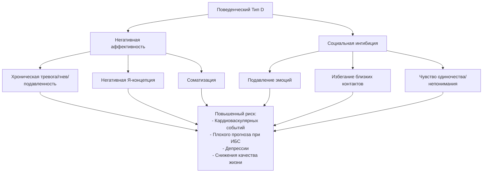

## Введение
Изучение связи между устойчивыми паттернами поведения, эмоционального реагирования и соматического здоровья является одной из центральных тем клинической психологии и психосоматической медицины. Начавшись с наблюдений кардиологов за пациентами с ишемической болезнью сердца, это направление эволюционировало в сложную систему знаний о поведенческих типах, их нейрофизиологических коррелятах и роли в генезе заболеваний. Понимание этих типов, таких как A и D, а также связанных с ними феноменов вроде алекситимии, становится для психолога-консультанта важным инструментом диагностики, прогноза и планирования психотерапевтического вмешательства. Эта статья систематизирует ключевые концепции, опираясь на классические и современные исследования.

## Поведенческий тип A: история, характеристики и клиническое значение
Концепция поведенческого типа A (ПТА) была впервые систематически описана кардиологами М. Фридманом и Р. Розенманом в 1959 году. В результате их исследования была выдвинута гипотеза о наличии психологической предрасположенности к ишемической болезни сердца.

### Характерные черты типа A
Авторы выделили специфический симптомокомплекс, наиболее часто встречавшийся у пациентов с сердечно-сосудистой патологией. К его ключевым компонентам относятся:
-   **Стремление к высоким достижениям и хроническая нехватка времени.** Постоянное ощущение цейтнота, нетерпеливость, торопливость.
-   **Агрессивная конкурентность.** Устойчивая тенденция к соперничеству, часто в ущерб кооперации.
-   **Враждебность и раздражительность.** Склонность к гневу, агрессивному отстаиванию своей позиции.
-   **Высокая речевая и двигательная активность.** Быстрая речь, энергичные жесты, неспособность к бездеятельности.

Изначально считалось, что наличие ПТА является независимым фактором риска раннего развития атеросклероза и инфаркта миокарда. Исследования показывали, что у пациентов с типом A в 84% случаев отмечалось стойкое повышение артериального давления.

### Критика и современный взгляд
Последующие лонгитюдные исследования внесли коррективы в изначальную теорию.
1.  **Гендерный аспект.** Выявлено преобладание характеристик ПТА преимущественно у мужчин, в то время как у женщин связь менее однозначна.
2.  **Ключевой компонент.** Современные данные (включая масштабное исследование L. Sirri et al., 2012) свидетельствуют, что не весь комплекс ПТА, а именно компонент **враждебности** и **циничной неприязни** является наиболее прогностически значимым для сердечно-сосудистого риска.
3.  **Распространенность.** Тип A выявляется примерно у трети пациентов с гипертонией и ИБС.

Таким образом, в клинической практике важно не просто маркировать клиента как «тип A», а проводить дифференцированную оценку отдельных компонентов его поведения, уделяя особое внимание враждебности и манере справляться с гневом.

## Дистресс-личность (Тип D): психология хронического неблагополучия
В 1990-е годы Я. Деноллет (J. Denollet) описал так называемый **«тип личности D»** (от «distressed» — страдающий, находящийся в дистрессе). Эта концепция расширила понимание психосоматического риска за рамки агрессивно-активного паттерна типа A.

### Два основных компонента типа D
Тип D характеризуется стабильным сочетанием двух черт:
1.  **Негативная аффективность** — устойчивая тенденция испытывать и «застревать» на негативных эмоциях (подавленность, тревога, раздражительность, гнев). Мир воспринимается через призму угрозы и неблагополучия.
2.  **Социальная ингибиция** — склонность подавлять выражение эмоций и поведенческих реакций в социальном взаимодействии из-за страха неодобрения или отвержения. Такие люди чувствуют себя социально неловкими, напряженными и незащищенными.

### Клинические импликации типа D
Люди с типом D составляют группу повышенного риска по ряду параметров:
-   **Сердечно-сосудистые заболевания.** У них выше риск развития ИБС, хуже прогноз после инфаркта миокарда, чаще возникают повторные события.
-   **Депрессия и тревога.** Сочетание негативных эмоций и социальной изоляции является плодотворной почвой для развития аффективных расстройств.
-   **Низкая приверженность лечению.** Из-за социальной ингибиции они реже обращаются за помощью, а из-за негативной аффективности — пессимистично оценивают эффективность лечения.
-   **Связь с алекситимией.** Для типа D характерны трудности в идентификации и вербализации собственных эмоциональных состояний, что создает дополнительные барьеры в терапии.

Работа с клиентом типа D требует от психолога особой чувствительности к созданию безопасной, принимающей атмосферы, где клиент может постепенно научиться распознавать и выражать свои переживания без страха осуждения.

## Алекситимия: когда эмоции не находят слов
Алекситимия («а» — отрицание, «lexis» — слово, «thymos» — чувство) — это психологическая характеристика, обозначающая **затруднения в идентификации, описании и различении собственных эмоций**.

### Основные признаки алекситимии
В структуру алекситимии входят следующие особенности (по материалам файла и данным клинической психологии):
-   **Трудности в вербализации эмоций.** Человеку сложно назвать, что он чувствует («плохо», «не по себе» вместо «я чувствую грусть и беспомощность»).
-   **Смешение эмоций и телесных ощущений.** Эмоциональное напряжение автоматически интерпретируется как физический симптом («у меня сжалось в груди» вместо «я испугался»). Эта черта особенно выражена после психологических травм.
-   **Ограниченность воображения и символического мышления.** Скудность фантазийной жизни, прагматичный, утилитарный стиль мышления.
-   **Фокусировка на внешних событиях.** Внимание направлено вовне, в ущерб рефлексии внутренних переживаний.

### Диагностика и значение в клинической практике
«Золотым стандартом» диагностики алекситимии является **Торонтская алекситимическая шкала (TAS-26)**, разработанная G. Taylor и адаптированная в Институте им. В.М. Бехтерева. Её применение доказало надежность и валидность.

Алекситимия не является самостоятельным диагнозом, но выступает важным **предиктором и поддерживающим фактором**:
-   **Психосоматических расстройств.** Неспособность переработать эмоции на психическом уровне ведет к их «соматическому выражению» (например, гипертония, синдром раздраженного кишечника).
-   **Трудностей в психотерапии.** Клиенту с алекситимией сложно работать в традиционных вербально-ориентированных подходах. Требуются методы, направленные на телесное осознавание, арт-терапию, обучение навыкам эмоциональной грамотности.
-   **Низкой эффективности лечения.** Алекситимия связана с плохим распознаванием симптомов болезни и низкой мотивацией к психологической работе.

## Психосоматическая медицина: современные задачи и направления
Современная психосоматика, опираясь на исследования поведенческих типов и алекситимии, вышла за рамки поиска прямых причинно-следственных связей («стресс → язва»). Её ключевые направления сегодня включают:

### 1. Формирование телесности в онтогенезе
Изучается, как ранний детский опыт, качество привязанности и взаимодействия с матерью формируют базовое отношение к собственному телу, способность распознавать его сигналы и регулировать аффекты. Нарушения на этом этапе могут закладывать основу для будущей алекситимии и психосоматической уязвимости.

### 2. Внутренняя картина болезни (ВКБ)
Это комплекс представлений, переживаний и эмоциональных реакций пациента на свое заболевание. Исследование ВКБ (активно развивавшееся в школе А.Р. Лурии) позволяет понять:
-   Как пациент субъективно воспринимает симптомы.
-   Какие смыслы и страхи он с болезнью связывает.
-   Как его личностные особенности (тип A/D, алекситимия) влияют на восприятие болезни и приверженность лечению.

Работа с ВКБ — важная часть психологической реабилитации при хронических заболеваниях (онкологических, кардиологических), что отражено в работах Ю.П. Зинченко и Е.И. Первичко.

### 3. Междисциплинарность и психология здоровья
Психосоматика сегодня — это поле взаимодействия клинических психологов, психиатров, неврологов и врачей соматического профиля. Её цель — не только лечение, но и **профилактика**, формирование здорового поведения и повышение психологической устойчивости.

## Практические выводы для психолога-консультанта
1.  **Оценка как часть диагностики.** В ходе клинической беседы полезно обращать внимание на стиль коммуникации, способы реагирования на стресс, привычные копинг-стратегии. Это позволяет гипотетически определить склонность к тому или иному поведенческому паттерну.
2.  **Работа с алекситимией.** При подозрении на алекситимию необходимо адаптировать методы работы: смещать фокус с прямого вербального отчета о чувствах на техники телесно-ориентированной терапии, ведение дневников наблюдений за связью «ситуация — мысль — телесное ощущение — возможная эмоция».
3.  **Учет типа D.** Создание безопасного терапевтического альянса — первостепенная задача при работе с социально ингибированными клиентами. Важно мягко поощрять выражение эмоций, не форсируя процесс.
4.  **Профилактическая направленность.** Знания о поведенческих типах позволяют проводить психообразовательную работу, помогая клиентам осознать связь между их привычными паттернами, эмоциональным состоянием и физическим здоровьем, мотивируя к изменению дезадаптивных стилей поведения.

## Запомнить
-   **Поведенческий тип A** (соревновательность, враждебность, спешка) исторически связывался с риском ИБС. Ключевым токсичным элементом сегодня считается **враждебность**.
-   **Тип D (дистресс-личность)** — комбинация **негативной аффективности** (хронические негативные эмоции) и **социальной ингибиции** (подавление эмоций при общении). Является фактором риска сердечных заболеваний, депрессии и низкой приверженности лечению.
-   **Алекситимия** — трудности в осознании и описании своих эмоций, их смешение с телесными ощущениями. Частый спутник психосоматических расстройств и серьезное препятствие для вербальной психотерапии. Диагностируется шкалой TAS-26.
-   **Современная психосоматика** фокусируется на **формировании телесности**, **внутренней картине болезни** и **междисциплинарной профилактике**. Это позволяет перейти от модели «психика вызывает болезнь» к комплексной биопсихосоциальной модели здоровья и болезни.
-   **Задача психолога** — интегрировать эти знания для тонкой диагностики, построения индивидуального терапевтического маршрута и проведения эффективной психопрофилактической работы.
