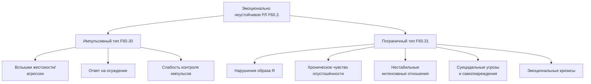

Расстройства личности (РЛ) представляют собой одну из наиболее сложных и дискуссионных категорий в клинической психологии и психиатрии. Это тяжёлые нарушения характерологической конституции и поведенческих тенденций, затрагивающие несколько сфер личности: аффективность, контроль побуждений, стиль мышления и отношения к другим. Их диагностика и классификация исторически были связаны с двумя основными системами: Международной классификацией болезней (МКБ) и Диагностическим и статистическим руководством по психическим расстройствам (DSM). В Российской Федерации до сих пор официально действует **МКБ-10**, в то время как в мировом профессиональном сообществе всё большее распространение получает **МКБ-11**, вносящая революционные изменения в понимание РЛ. Этот переход от жёсткой типологии к размерной модели, фокусирующейся на уровне нарушения функционирования и выраженности отдельных черт, знаменует новый этап в доказательной диагностике и планировании терапии.

## 1. Классификация расстройств личности в МКБ-10: типологический подход

В МКБ-10 расстройства личности кодируются в рубрике **F60-F69 «Расстройства личности и поведения в зрелом возрасте»**. Специфические расстройства личности выделены в блоке **F60**. Ключевыми диагностическими принципами являются:
*   **Хроничность:** Аномальный стиль поведения возникает в позднем детстве или подростковом возрасте, стабильно проявляется в зрелости и не ограничивается эпизодами других психических болезней.
*   **Тотальность:** Нарушения являются всеобъемлющими, затрагивая широкий диапазон личных и социальных ситуаций.
*   **Дезадаптация:** Стиль поведения отчётливо нарушает адаптацию, приводя к субъективному дистрессу или социальной дезадаптации.
*   **Культуральный контекст:** При диагностике необходимо учитывать социальные нормы конкретной культуры.

Диагноз конкретного РЛ по МКБ-10 ставится при наличии не менее трёх из перечисленных для каждого типа характерологических признаков.

### 1.1. Специфические расстройства личности (F60.0 – F60.7)
Классификация включает восемь основных типов, многие из которых имеют параллели в DSM-5, но с определёнными терминологическими и критериальными нюансами.

#### F60.0 Параноидное (параноическое) расстройство личности
Характеризуется устойчивой недоверчивостью и подозрительностью. К диагностическим критериям относятся:
*   Чрезмерная чувствительность к неудачам и отказам.
*   Тенденция постоянно быть недовольным кем-то, злопамятность.
*   Подозрительность и искажённое восприятие нейтральных или дружеских действий как враждебных или презрительных.
*   Воинственное отношение к вопросам, связанным с правами личности.
*   Недоброжелательные интерпретации скрытых значений в событиях.
*   Чрезмерная самооценка, сочетающаяся с отнесением ответственности за собственные неудачи на других.

Паттерн основан на механизме **проекции**: собственные неприемлемые агрессивные и недоброжелательные импульсы приписываются окружающим, что создаёт устойчивое чувство угрозы извне.

#### F60.1 Шизоидное расстройство личности
Основная черта — отстранённость от социальных отношений и ограниченный диапазон эмоциональной экспрессии. Критерии включают:
*   Немногое доставляет удовольствие, если вообще доставляет.
*   Эмоциональная холодность, отчуждённость или уплощённый аффект.
*   Ограниченная способность выражать тёплые или гневные чувства к другим.
*   Внешнее безразличие к похвале или критике.
*   Предпочтение уединённой деятельности.
*   Поглощённость фантазиями и интроспекцией.
*   Отсутствие близких друзей или доверительных отношений.

Шизоидные личности живут богатой внутренней жизнью, но их внешний мир минималистичен и лишён эмоционального resonance.

#### F60.2 Диссоциальное расстройство личности
Эквивалент антисоциального РЛ в DSM-5. Центральный признак — грубое и устойчивое пренебрежение социальными нормами и правами других. Критерии:
*   Бессердечное равнодушие к чувствам других.
*   Грубая и устойчивая безответственность, игнорирование социальных норм и обязанностей.
*   Неспособность поддерживать устойчивые взаимоотношения.
*   Очень низкая толерантность к фрустрации и низкий порог разряда агрессии.
*   Отсутствие чувства вины и неспособность извлекать пользу из жизненного опыта.
*   Склонность обвинять других или выдвигать правдоподобные рационализации своего асоциального поведения.

Важный этиологический фактор — наличие расстройства поведения в детском и подростковом возрасте.

#### F60.3 Эмоционально неустойчивое расстройство личности
Это расстройство в МКБ-10 разделено на два типа, что отражает спектр нарушений от импульсивности до тотальной нестабильности личности.

*   **F60.30 Импульсивный тип.** Доминируют эмоциональная неустойчивость и отсутствие контроля над импульсами. Характерны вспышки жестокости или угрожающего поведения, особенно в ответ на осуждение. Включает такие устаревшие термины, как «возбудимое», «эксплозивное», «агрессивное» РЛ.
*   **F60.31 Пограничный тип.** Помимо эмоциональной неустойчивости, присутствуют глубокие нарушения **образа Я**, намерений и внутренних предпочтений. Характерно хроническое чувство опустошённости. Личность склонна вовлекаться в интенсивные, нестабильные отношения, что приводит к повторяющимся эмоциональным кризисам и суицидальному поведению (угрозы, самоповреждения). Этот тип практически идентичен пограничному РЛ в DSM-5.

#### F60.4 Истерическое расстройство личности
Характеризуется театральностью, самодраматизацией, преувеличенным выражением эмоций и поиском внимания. Критерии включают:
*   Самодраматизация, театральность, преувеличенное выражение эмоций.
*   Внушаемость, легкая подверженность влиянию других или обстоятельств.
*   Поверхностность и лабильность аффекта.
*   Постоянное стремление к возбуждению, признанию со стороны окружающих.
*   Неуместная соблазнительность во внешнем виде и поведении.
*   Чрезмерная озабоченность физической привлекательностью.

В отличие от пограничного типа, истерическое РЛ базируется на более зрелом уровне личностной организации с преобладанием вытеснения и сексуализации как защитных механизмов.

#### F60.5 Ананкастное (обсессивно-компульсивное) расстройство личности
Основная черта — предрасположенность к сомнениям, перфекционизму, чрезмерной добросовестности, контролю и упрямству в ущерб гибкости и эффективности. Критерии:
*   Чрезмерная склонность к сомнениям и осторожности.
*   Озабоченность деталями, правилами, списками, порядком.
*   Перфекционизм, мешающий завершению задач.
*   Чрезмерная добросовестность и педантичность, игнорирующая удовольствие и межличностные связи.
*   Ригидность и упрямство.
*   Требование, чтобы другие подчинялись установленным правилам.
*   Появление настойчивых, нежелательных мыслей или влечений (без выраженных ритуалов, как при ОКР).

Важно дифференцировать это расстройство личности от обсессивно-компульсивного расстройства (F42), которое является отдельным заболеванием с истинными обсессиями и компульсиями.

#### F60.6 Тревожное (уклоняющееся, избегающее) расстройство личности
Доминируют чувство напряжённости, страх негативной оценки и избегание социального взаимодействия. Критерии:
*   Постоянное общее чувство напряжённости и тяжёлые предчувствия.
*   Представление о себе как о социально неспособном, непривлекательном, приниженном.
*   Повышенная озабоченность критикой и непринятием.
*   Нежелание вступать в отношения без гарантий понравиться.
*   Ограничение жизненного уклада из-за потребности в физической безопасности.
*   Избегание профессиональной или социальной деятельности, связанной с тесными межличностными контактами.

В отличие от социальной фобии (F40.1), избегание при РЛ носит тотальный, всепроникающий характер, являясь частью самой личности.

#### F60.7 Расстройство типа зависимой личности
Характеризуется пассивным поведением, позволением другим брать на себя ответственность за ключевые области жизни и подчинением собственных потребностей потребностям других. Критерии:
*   Стремление переложить важные решения на других.
*   Подчинение своих потребностей потребностям людей, от которых зависит индивидуум.
*   Нежелание предъявлять разумные требования тем, от кого зависим.
*   Чувство беспомощности в одиночестве из-за страха неспособности к самостоятельной жизни.
*   Страх быть покинутым.
*   Ограниченная способность принимать повседневные решения без советов.

Эта структура часто формируется в результате гиперопеки и блокировки развития автономии.

### 1.2. Другие и смешанные категории (F60.8, F60.9, F61)
*   **F60.8 Другие специфические расстройства личности.** Сюда включены расстройства, не соответствующие критериям вышеперечисленных типов: эксцентричное, расторможенное («неустойчивое»), инфантильное, нарциссическое, пассивно-агрессивное, психоневротическое (невропатия). Примечательно, что **нарциссическое РЛ** в МКБ-10 не имеет отдельной рубрики и попадает в эту категорию.
*   **F60.9 Расстройство личности неуточнённое.**
*   **F61 Смешанные расстройства личности.** Диагноз ставится, когда присутствуют признаки нескольких расстройств из F60, но без доминирования симптоматики, позволяющей поставить более специфический диагноз. На практике смешанные формы встречаются очень часто.

### 1.3. Стойкие изменения личности (F62)
Эта важная рубрика выделяет изменения личности, которые развиваются **не вследствие врождённой предрасположенности, а после переживания катастрофических событий или тяжёлых психических заболеваний**.
*   **F62.0 Стойкое изменение личности после переживания катастрофы** (концентрационного лагеря, стихийного бедствия, длительной экстремальной ситуации).
*   **F62.1 Стойкое изменение личности после психического заболевания** (например, после перенесённого психотического эпизода, даже при ремиссии симптомов).

Эти изменения носят постоянный характер, нарушают привычный стереотип жизни и должны быть чётко связаны с патогенным переживанием.

### 1.4. Акцентуированные личностные черты (Z73.1)
В классе **Z73 «Проблемы, связанные с трудностями поддержания нормального образа жизни»** находится категория **Z73.1 «Акцентуированные личностные черты»**. Сюда же отнесена **модель поведения типа А** (соревновательность, нетерпение, враждебность, потребность в высоких достижениях). Эта рубрика используется для обозначения выраженных, но не достигающих уровня расстройства черт, которые, однако, могут влиять на здоровье и требуют внимания. Это важный диагностический мост между нормой и патологией.

## 2. Новый подход МКБ-11: радикальный сдвиг от типов к уровням функционирования

МКБ-11, действующая в большинстве стран мира, совершает революционный пересмотр диагностики расстройств личности. Отказ от традиционной типологии в пользу **размерной (дименсиональной) модели** призван решить главные проблемы МКБ-10/DSM-5: высокий уровень коморбидности, низкую диагностическую надёжность и неудовлетворительную клиническую полезность.

### 2.1. Общая структура в МКБ-11
В МКБ-11 рубрика «Расстройства личности» **(6D10)** и «Выраженные личностные черты и паттерны поведения» **(6D11)** выделены в отдельную главу.
*   **6D10 Расстройство личности** — диагностируется на основе **тяжести нарушения личностного функционирования**.
*   **6D11 Выраженные личностные черты и паттерны поведения** — используется, когда есть проблемные черты, но критерии расстройства личности не выполняются (аналог акцентуаций).

### 2.2. Диагностика расстройства личности (6D10): ключевые инновации
Для постановки диагноза необходимо наличие **проблем в функционировании личности**, которые проявляются в двух областях:
1.  **Функционирование «Я» (Self functioning):**
    *   **Идентичность:** Ослабленное, плохо развитое или неустойчивое представление о себе.
    *   **Самонаправленность:** Неспособность строить последовательные жизненные цели, просоциальные внутренние стандарты.
2.  **Межличностное функционирование (Interpersonal functioning):**
    *   **Эмпатия:** Неспособность понимать и учитывать точку зрения и чувства других.
    *   **Близость:** Неспособность формировать и поддерживать близкие, взаимно удовлетворяющие отношения.

Второй обязательный компонент диагностики — наличие одной или нескольких **проблемных черт личности (дименсиональные области)**, которые являются устойчивыми и проявляются в различных ситуациях. МКБ-11 выделяет пять ключевых областей черт:
1.  **Негативная аффективность** (Negative Affectivity): Склонность к переживанию широкого спектра негативных эмоций (тревога, грусть, гнев, вина, стыд).
2.  **Отстранённость** (Detachment): Тенденция сохранять межличностную и социальную дистанцию, эмоциональную холодность.
3.  **Диссоциальность** (Disinhibition): Пренебрежение социальными конвенциями и импульсивность.
4.  **Расторможённость** (Dissociality): Готовность манипулировать другими, обман, агрессия, отсутствие сочувствия.
5.  **Ананкастность** (Anankastia): Перфекционизм, ригидность, сверхконтроль, озабоченность порядком.
6.  **Пограничный паттерн** (Borderline Pattern): Отдельно выделенный паттерн, характеризующийся нестабильностью в отношениях, образе Я, аффектах и выраженной импульсивностью.

Третий шаг — оценка **степени тяжести** нарушения:
*   **6D10.0 Лёгкое расстройство личности:** Проблемы в функционировании и черты присутствуют, но приводят к нарушениям только в специфических стрессовых ситуациях.
*   **6D10.1 Умеренное расстройство личности:** Существенные проблемы в нескольких сферах жизни (работа, отношения).
*   **6D10.2 Тяжёлое расстройство личности:** Всепроникающие и тяжёлые нарушения, затрагивающие большинство сфер жизни, часто с серьёзными социальными последствиями и сопутствующими проблемами (самоповреждения, суицидальность).

### 2.3. Выраженные личностные черты и паттерны поведения (6D11)
Эта категория предназначена для случаев, когда **проблемные черты личности присутствуют и вызывают трудности, но уровень нарушения функционирования «Я» и межличностного функционирования не достигает порога для диагноза расстройства личности**. Коды соответствуют тем же областям черт: негативная эмоциональность, отстранённость, диссоциальность, расторможённость, ананкастность, пограничный паттерн. Это современная замена понятию «акцентуации характера».

## 3. Практическое значение для психологической диагностики и терапии

Переход от МКБ-10 к МКБ-11 имеет фундаментальные последствия для работы клинических психологов и психотерапевтов.

### 3.1. Диагностические преимущества нового подхода
*   **Снижение коморбидности:** Вместо множественных диагнозов («смешанное РЛ») клиницист оценивает профиль по нескольким независимым областям черт. У пациента могут быть высокие показатели как по «негативной аффективности», так и по «отстранённости», что создаёт уникальный клинический профиль.
*   **Клиническая полезность:** Оценка **тяжести** (лёгкая, умеренная, тяжёлая) напрямую указывает на объём необходимой помощи, прогноз и риск. Оценка **областей черт** даёт мишени для психотерапевтического вмешательства.
*   **Гибкость и индивидуальность:** Дименсиональная модель лучше улавливает уникальную конфигурацию проблем каждого пациента, уходя от наклеивания ярлыков «параноид» или «истерик».

### 3.2. Влияние на планирование психотерапии
*   **Тяжесть расстройства** определяет формат работы: при лёгком РЛ может быть достаточно краткосрочной фокусной терапии, при тяжёлом — необходима длительная, комплексная программа (например, диалектико-поведенческая терапия для пациентов с выраженным пограничным паттерном).
*   **Мишени по чертам:**
    *   При высоких показателях **негативной аффективности** — терапия будет направлена на регуляцию эмоций, снижение тревоги и самокритики.
    *   При доминировании **отстранённости** — работа над формированием доверия, снижением социальной тревоги, развитием навыков общения.
    *   При **диссоциальности/расторможённости** — фокус на развитии эмпатии, контроле импульсов, понимании последствий своих действий.
    *   При **ананкастности** — работа над гибкостью, перфекционизмом, страхом ошибок и контролем.
*   **Фокус на функционировании:** Упор на восстановление целостности идентичности, способности ставить цели, строить и поддерживать близкие отношения смещает терапию с купирования симптомов на развитие личности.

### 3.3. Работа в переходный период
Поскольку в РФ официально действует МКБ-10, психологам необходимо владеть обеими системами. Клиническое мышление должно эволюционировать: даже ставя диагноз по МКБ-10 (например, F60.31), полезно мысленно оценивать тяжесть нарушения и профиль ведущих проблемных черт по логике МКБ-11 для составления индивидуального плана коррекции.

## Запомнить

*   **МКБ-10** использует **типологический подход**, выделяя 8 специфических расстройств личности (F60.0-F60.7). Диагноз ставится при наличии не менее 3 из перечисленных для каждого типа критериев. Ключевые принципы — хроничность, тотальность и дезадаптация.
*   **Структура МКБ-10** включает также **смешанные РЛ (F61)**, **стойкие изменения личности после травм или болезней (F62)** и **акцентуированные черты (Z73.1)**, что создаёт диагностический континуум.
*   **МКБ-11** совершает радикальный переход к **размерной (дименсиональной) модели**. Диагноз «Расстройство личности» **(6D10)** основывается на: 1) оценке тяжести нарушений в функционировании «Я» и межличностной сфере; 2) выявлении выраженных проблемных черт из 5 областей (Негативная аффективность, Отстранённость, Диссоциальность, Расторможённость, Ананкастность + Пограничный паттерн).
*   **Тяжесть РЛ в МКБ-11** градируется как **лёгкое, умеренное или тяжёлое**, что напрямую определяет прогноз и объём необходимой помощи.
*   **Выраженные личностные черты (6D11)** — новая категория для проблемных, но не достигающих уровня расстройства черт, заменяющая понятие акцентуаций.
*   **Для практики психолога** понимание обеих систем критически важно. МКБ-11 предлагает более **клинически полезный и индивидуализированный подход**, позволяющий чётче планировать психотерапию, выбирая мишени для работы на основе оценки тяжести и профиля личностных черт, а не просто типа расстройства. Этот подход лучше соответствует постнеклассической парадигме в клинической психологии, ориентированной на уникальность личности и её ресурсы.
