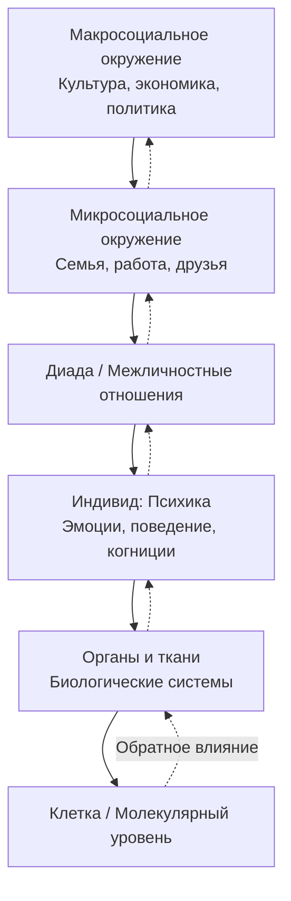

Реабилитация в современной медицине и психологии давно перестала быть синонимом простого восстановления функций после болезни. Это сложный, активный и целенаправленный процесс, в центре которого — личность пациента, вынужденная заново выстраивать свою жизнь в условиях, навязанных заболеванием. Концептуальной основой для такого подхода служит биопсихосоциальная модель, которая рассматривает человека как целостную систему, где неразрывно связаны биологическое, психологическое и социальное. Роль клинического психолога в реабилитационном процессе становится одной из ключевых, трансформируясь из вспомогательной в интегрирующую. Эта статья рассматривает теоретические основы реабилитации и детально разбирает конкретные задачи, которые решает психолог в междисциплинарной команде.

## Биопсихосоциальная модель: фундамент современного понимания болезни и здоровья
В 1977 году психиатр Джордж Энгель (George Engel) предложил биопсихосоциальную модель как альтернативу господствовавшей биомедицинской парадигме. Модель постулирует, что для понимания причин болезни, ее течения и организации эффективной помощи необходимо учитывать взаимодействие факторов на всех уровнях: от молекулярного до социального.

### Уровни модели и их взаимосвязь
Модель можно представить как систему вложенных уровней, каждый из которых влияет на другой:
-   **Биологический уровень:** гены, клетки, органы и ткани. Это область традиционной медицины.
-   **Психологический уровень:** психические процессы, эмоции, мотивация, поведение, личностные особенности. Это сфера компетенции клинического психолога.
-   **Социальный уровень:** микроокружение (семья, друзья), макроокружение (культура, экономика, система здравоохранения).

Эта схема, конкретизирующая идеи культурно-исторической психологии Л.С. Выготского, показывает, что даже телесные функции социально опосредованы. Способы удовлетворения базовых потребностей, восприятие боли, реакция на симптомы — все это формируется в культурном контексте.

### Практический пример: тревога и соматический симптом
Во время пандемии COVID-19 службы скорой помощи столкнулись с волной ложных вызовов. Люди с симптомами нейрогенной гипервентиляции (одышка, чувство удушья), возникающими на фоне острой тревоги и паники, принимали свое состояние за коронавирусную инфекцию. Этот пример иллюстрирует модель в действии:
1.  **Социальный уровень:** пандемия, информационный шум, страх заражения.
2.  **Психологический уровень:** развитие тревожного расстройства, панические атаки.
3.  **Биологический уровень:** активация вегетативной нервной системы, приводящая к учащенному дыханию (гипервентиляции), которое, в свою очередь, вызывает головокружение, тахикардию, боли в груди.

Дыхательная система — единственная среди вегетативных, которой человек может управлять произвольно. Через дыхание мы можем косвенно влиять на сердечный ритм и состояние тревоги. Игнорирование этой психосоматической связи делает лечение неполным. Без учета психологического аспекта лечить таких пациентов — значит бороться со следствиями, не понимая причин.

## Реабилитация как системный и активный процесс
В рамках биопсихосоциальной модели реабилитация приобретает новое содержание. Это не просто набор процедур для восстановления функции поврежденного органа. Согласно М.М. Кабанову, а впоследствии Ю.П. Зинченко, Е.И. Первичко и А.Ш. Тхостову, реабилитация — это **системная деятельность, направленная на восстановление личного и социального статуса больного**.

### Ключевые принципы современной реабилитации
1.  **Активность и партнерство пациента.** Пациент перестает быть пассивным объектом лечения («потребителем»), становясь активным субъектом и партнером в реабилитационном процессе. Его мотивация, цели и понимание болезни становятся центральными элементами работы.
2.  **Опосредование через личность.** Все лечебно-восстановительные воздействия пропускаются через призму личности пациента: его ценности, установки, психологические защиты. Одна и та же процедура может иметь разный эффект в зависимости от того, как ее воспринимает человек.
3.  **Создание условий для развития.** Целью является не просто возврат к «доболезненному» состоянию, а создание психологически обоснованных условий для развития личности в новых, ограниченных болезнью обстоятельствах. Речь идет о поиске новых смыслов, адаптации идентичности, построении иного качества жизни.
4.  **Неразрывная связь с профилактикой.** Реабилитация и профилактика — две стороны одной медали. Эффективная реабилитация предотвращает рецидивы и инвалидизацию, а профилактика, особенно на ранних этапах, снижает потребность в сложной реабилитации. Профилактика дешевле лечения, но ее сложность — в работе с людьми, у которых еще нет опыта болезни и дефицита здоровья (дети, подростки).

Исторический контекст 1950-60-х годов, указанный в материалах, когда внимание сместилось с лечения шизофрении на проблемы зависимости и посттравматических состояний (например, у ветеранов Вьетнамской войны), показал, что без реабилитационного, биопсихосоциального подхода лечение малоэффективно. Даже 8% успеха в терапии зависимостей считается отличным результатом, что подчеркивает важность превентивных и реабилитационных стратегий.

## Задачи клинического психолога в реабилитационной команде: от диагностики до поддержки коллег
Роль клинического психолога в реабилитации многогранна и простирается далеко за рамки психодиагностики. На основе систематизации, предложенной Ю.П. Зинченко, Е.И. Первичко и А.Ш. Тхостовым (2014), можно выделить несколько ключевых блоков задач.

### Блок 1: Диагностико-аналитическая работа
Эта работа формирует основу для индивидуального реабилитационного плана.
-   **Диагностика внутренней картины болезни (ВКБ).** Это центральная задача. Психолог исследует, как пациент субъективно воспринимает свою болезнь: какие объяснительные модели он строит, какие эмоции (страх, гнев, отрицание) ее сопровождают, как болезнь встраивается в его жизненный narrative. ВКБ напрямую влияет на приверженность лечению (комплаенс).
-   **Оценка реабилитационного потенциала.** Выявление сохранных звеньев мотивационной сферы и личностно значимых целей пациента. Что для него важно? Работа, семья, творчество? Эти «точки опоры» становятся рычагами для мотивации.
-   **Анализ социальной сети и поддержки.** Диагностика качества семейных отношений, наличия друзей, коллег. Кто может быть опорой? Часто болезнь меняет динамику в семье, и требуется работа с родственниками.
-   **Диагностика когнитивной сферы.** Перенесенные заболевания (инсульт, ЧМТ), да и сам хронический стресс от болезни могут влиять на память, внимание, исполнительные функции. Это необходимо учитывать при планировании занятий и даче рекомендаций.
-   **Выявление патологических личностных реакций.** Корригирование целей, ведущих к «уходу в болезнь» (например, когда болезнь становится способом манипулирования близкими или избегания ответственности) или патологическому развитию личности.

### Блок 2: Психотерапевтическая работа и консультирование
-   **Определение форм и методов психотерапии.** Выбор подхода (когнитивно-поведенческая терапия, терапия принятия и ответственности, экзистенциальные методы и др.) строго индивидуален и зависит от диагноза, личности пациента, особенностей ВКБ.
-   **Психотерапевтическое сопровождение.** Долгосрочная поддержка в процессе адаптации к болезни, работе с утратами, страхами (включая страх рецидива), построению нового образа «Я».
-   **Психологическая поддержка членов семьи.** Семья — часть реабилитационной системы. Консультирование родственников помогает им справиться со своим стрессом, избежать созависимости, научиться эффективно поддерживать пациента.
-   **Работа с умирающими больными (паллиативная помощь).** Психологическое сопровождение в терминальной стадии болезни, помощь в завершении жизненных дел, обеспечение достойного качества жизни до конца, поддержка семьи в горе.

### Блок 3: Организационно-коммуникативные задачи
Психолог выступает связующим звеном и модератором внутри команды.
-   **Взаимодействие с лечащим врачом и командой.** Совместное определение целей реабилитации с учетом психологического состояния пациента. Перевод «языка симптомов» на «язык переживаний» для врача и наоборот.
-   **Помощь в установлении терапевтического альянса (комплаенса).** Психолог помогает врачу и пациению найти общий язык, преодолеть недоверие, объяснить необходимость процедур с точки зрения психологии пациента.
-   **Помощь врачу при сообщении «трудных» диагнозов.** Психолог может присутствовать на такой беседе, обеспечивая эмоциональную поддержку пациенту и помогая врачу донести информацию в доступной, щадящей форме.
-   **Командообразование и профилактика выгорания.** Работа в реабилитации эмоционально затратна. Психолог проводит супервизии, тренинги сплоченности, помогает коллегам распознавать и преодолевать симптомы профессионального выгорания и деформации.

## Практические шаги: от теории к кабинету психолога
Интеграция этих задач в ежедневную практику требует от психолога системного мышления.

**На этапе первичного контакта** ключевым является установление доверия и оценка ВКБ. Можно использовать полуструктурированное интервью, задавая вопросы: «Что для Вас значит этот диагноз?», «Как, по-Вашему, болезнь изменила Вашу жизнь?», «На что Вы надеетесь в процессе лечения?».

**В процессе реабилитации** психолог постоянно балансирует между поддержкой и активизацией пациента. Важно, опираясь на сохранные цели (реабилитационный потенциал), постепенно расширять зону самостоятельности пациента, избегая как гиперопеки, так и безразличия. Работа с семьей часто включает в себя образовательные беседы о болезни и обучение навыкам эффективной коммуникации.

**Взаимодействие с командой** должно быть регулярным и структурированным: совместные обходы, консилиумы, ведение единой документации, где психологические наблюдения соседствуют с медицинскими показателями.

## Запомнить
-   **Биопсихосоциальная модель Дж. Энгеля** — обязательная основа для современной реабилитации. Она рассматривает болезнь как результат взаимодействия биологических, психологических и социальных факторов. Лечение, игнорирующее любой из этих уровней, неполноценно.
-   **Реабилитация — это системный и активный процесс**, где пациент является партнером. Ее цель — создать условия для развития личности в новых условиях, навязанных болезнью, а не просто восстановить утраченную функцию.
-   **Внутренняя картина болезни (ВКБ)** — ключевой объект диагностики для психолога. Субъективное восприятие болезни пациентом определяет его поведение, приверженность лечению и эмоциональное состояние.
-   **Задачи клинического психолога в реабилитации структурно делятся на три блока:** диагностико-аналитический (оценка ВКБ, потенциала, социальной поддержки), психотерапевтический (сопровождение пациента и семьи) и организационно-коммуникативный (работа в команде, налаживание комплаенса, профилактика выгорания).
-   **Психолог выступает интегратором и переводчиком** между миром субъективных переживаний пациента и объективных медицинских данных. Его работа напрямую влияет на качество терапевтического альянса и общую эффективность реабилитационных мероприятий.
-   **Профилактика выгорания реабилитационной команды** — не второстепенная, а стратегическая задача, от которой зависит устойчивость и качество оказываемой помощи в долгосрочной перспективе.
