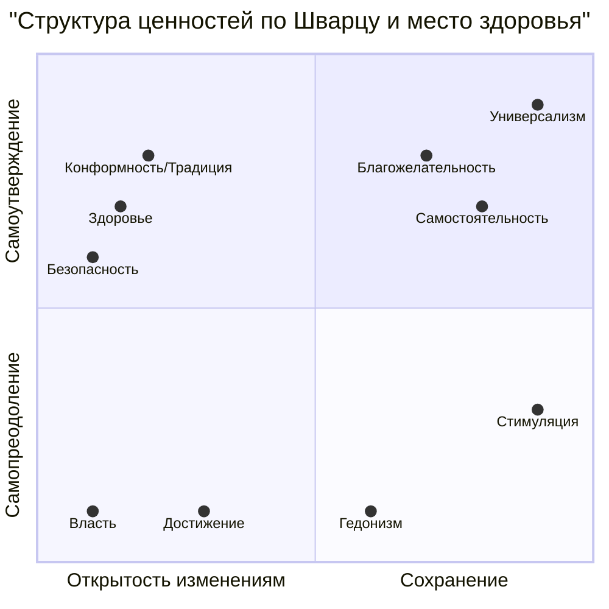

Понятие внутренней картины болезни (ВКБ) прочно вошло в арсенал клинической психологии, помогая понять субъективный мир пациента. Однако здоровье — это не просто отсутствие болезни. Это самостоятельный, активный и сложно организованный психологический конструкт, регулирующий поведение человека. **Внутренняя картина здоровья (ВКЗ)** — это функциональный орган, который управляет отношением личности к своему благополучию. Ее формирование начинается в младенчестве, а структура включает не только мысли, но и ощущения, эмоции и глубинные ценности. Понимание ВКЗ позволяет психологу работать не только с последствиями заболевания, но и с фундаментальными механизмами, определяющими здоровый или болезненный образ жизни, что особенно критично в профилактике и реабилитации.

## Что такое внутренняя картина здоровья? От определения к структуре
В.Е. Каган в 1986 году дал одно из первых определений ВКЗ, описав ее как **особое отношение личности к своему здоровью, выражающееся в осознании его ценности и активно-позитивном стремлении к его совершенствованию**. Это обобщенный, субъективно переживаемый образ своего нормального (или ненормального) состояния, осознание своих душевных и физических ресурсов.

С современной точки зрения, ВКЗ — это **сложноструктурированное психологическое образование, которое регулирует соответствующее здоровьесберегающее или здоровьеразрушающее поведение**. ВКБ (внутренняя картина болезни) является ее частным случаем, активирующимся в ситуации уже возникшего заболевания.

Структура ВКЗ четырехкомпонентна и отражает иерархию от базовых телесных процессов к высшим личностным смыслам:

1.  **Сенсорный уровень** (уровень ощущений).
2.  **Эмоциональный уровень** (аффективные установки, тревога).
3.  **Когнитивный уровень** (представления, знания, убеждения).
4.  **Ценностно-мотивационный уровень** (ценность здоровья, мотивы).

Работа с любым нарушением здоровья (как психического, так и соматического) требует от клинического психолога анализа всех этих уровней в их взаимосвязи.

## Сенсорный уровень ВКЗ: онтогенетический фундамент телесности
Этот уровень является базовым и онтогенетически первичным. Его становление встроено в общее сенсорно-перцептивное развитие ребенка и закладывает основу будущего психосоматического единства или разлада.

### Формирование в диаде «мать-дитя»
Первичная дискриминация телесных сигналов у младенца происходит по ключевым для выживания параметрам: **голод/сытость, тепло/холод, сухость/влага**. Плач — первый сигнал неудовольствия. Однако на этом этапе интерцептивные (внутренние) ощущения и эмоциональные процессы не дифференцированы.

Критическую роль играет мать, которая выполняет функцию **означивания**:
-   Она **расшифровывает** сигналы ребенка (виды плача, позы).
-   Она **задает приемлемые способы выражения** состояния (например, успокаивая или стимулируя).
-   Она **создает сенсорно богатую среду**, удовлетворяя потребности (кормление, сухие пеленки, тепло), что стимулирует дифференциацию и интеграцию ощущений.

Нарушения на этом этапе имеют долгосрочные последствия. Например, использование памперсов, которое отдаляет формирование связи между телесным позывом (наполнение мочевого пузыря) и его последствиями (мокрота), может способствовать более позднему формированию навыков саморегуляции. Исследования, упомянутые в материалах, указывают, что такой опыт может коррелировать с большей выраженностью депрессивной симптоматики во взрослом возрасте.

**Клиническое значение:** Дисгармоничное развитие сенсорного уровня (например, опыт интенсивной хронической боли в детстве, гипер- или гипоопека со стороны матери) создает дефицитарную основу для ВКЗ. Здоровье может стать для человека идеализированным, оторванным от реальных телесных ощущений и малодостижимым образом, что лежит в основе ипохондрических или, наоборот, игнорирующих здоровье установок.

## Эмоциональный и когнитивный уровни ВКЗ: тревога, знания и контроль

### Эмоциональный уровень: аффективные аттитюды и тревога о здоровье
Этот уровень включает:
-   **Аффективные аттитюды** — устойчивые положительные или отрицательные чувства по отношению к объектам, связанным со здоровьем (например, к табаку, спорту, врачам).
-   **Тревогу о здоровье** — состояние, связанное с неверной катастрофической интерпретацией нормальных или незначительных телесных ощущений как угрожающих (Asmundson et al., 2010).

Повышенный уровень такой тревоги является ядром **соматоформных расстройств** (расстройство соматических симптомов) и **ипохондрии**. Человек с нарушенным эмоциональным уровнем ВКЗ живет в постоянном сканировании тела на предмет «опасных» сигналов, что само по себе поддерживает стресс и вегетативную дисфункцию.

### Когнитивный уровень: представления, теории и локус контроля
Это уровень мыслей, суждений и убеждений о здоровье. Сюда относятся:
-   **Представления о здоровье/болезни** (что это такое, каковы причины).
-   **Когнитивные аттитюды** — оценочные суждения о пользе/вреде чего-либо.
-   **Локус контроля здоровья (ЛКЗ)** — атрибуция ответственности за свое здоровье. **Внутренний ЛКЗ** (здоровье зависит от моих действий) связан с более здоровым поведением и приверженностью лечению. **Внешний ЛКЗ** (здоровье зависит от врачей, судьбы, случая) коррелирует с рисковым поведением и пассивностью.

Зарубежные исследования породили ряд теорий, объясняющих когнитивные аспекты (модель убеждений в здоровье, теория запланированного поведения и др.). Специфика подхода ВКЗ в том, что **когнитивный уровень изучается не изолированно, а во взаимодействии с сенсорным, эмоциональным и ценностным**.

## Как формируются представления о здоровье? Критика и синтез теорий
Исследования развития когнитивного уровня прошли несколько этапов, что крайне важно для психолога, работающего с детьми и подростками.

1.  **Теория стадий когнитивного развития (Пиаже).** Долгое время доминировала точка зрения, что представления о здоровье жестко следуют общим стадиям интеллектуального развития. Считалось, что маленькие дети не могут быть надежными источниками информации о своем здоровье — нужно спрашивать родителей.
2.  **Критика и теория врожденного понимания.** Эмпирические исследования (Koocher, 1985; Maddux et al., 1986) показали, что дети способны описывать свои переживания и поведение. Возникла теория о **врожденном, интуитивном знании** о здоровье и болезни (Kalish, 1996). Например, исследование с использованием имплицитного ассоциативного теста (Cheetham et al., 2015) доказало, что уже **дети 4-5 лет неосознанно прочнее связывают понятие «стресс» с «болезнью», чем со «здоровьем»**. К 11 годам эта ассоциация усиливается.
3.  **Теория когнитивных схем.** Современный синтез предполагает, что представления формируются как схемы под влиянием комплекса факторов:
    -   **Субъективный опыт болезни.** Дети с хроническими заболеваниями имеют более детализированные и сложные представления о болезни и ее причинах (Bearison, Pacifici, 1989).
    -   **Социальные факторы (теория социального научения).** Дети копируют родительские представления и поведение, связанное со здоровьем (Bandura, 1977). Лонгитюдные исследования показывают, что это копирование часто идет от родителя своего пола (Patock-Peckham et al., 2001). В семьях, где повышенно внимание к недомоганиям, у детей чаще формируются необъяснимые боли (Walker, Greene, 1989).
    -   **Личностные факторы.** Ведущую роль играет формирующийся **локус контроля здоровья**.

Таким образом, представления о здоровье — это динамическая система, на которую влияют и когнитивная зрелость, и уникальный жизненный опыт, и социальная среда.

## Ценностно-мотивационный уровень: место здоровья в иерархии смыслов
Это глубинное ядро ВКЗ. **Ценность здоровья** — это устойчивая мотивационная диспозиция к сохранению физического и психического благополучия. Ключевой вопрос: **насколько эта ценность «встроена» в общую систему ценностей личности и как она с другими ценностями соотносится?**

Для анализа используется **теория базовых ценностей Ш. Шварца**. Согласно ей, ценности образуют круговую структуру, где соседние ценности совместимы, а противоположные — конфликтны.

**Здоровье** в этой модели находится в секторе **Сохранения**, рядом с ценностями **Безопасности** и **Конформности**. Это имеет прямое клиническое значение:

-   **В детстве** ценность здоровья — чаще усвоенная, внешняя (от родителей).
-   **В подростковом возрасте** происходит ключевой **ценностный конфликт**: ценности **Открытости изменениям** (Самостоятельность, Стимуляция) и **Самоутверждения** (Гедонизм) вступают в противоречие с ценностью здоровья, воспринимаемой как скучная «Конформность» и ограничение свободы. Это одна из глубинных причин рискового поведения подростков.
-   **Динамика ценностей.** Переживание серьезной угрозы (тяжелая болезнь, травма, война) сдвигает структуру ценностей: значимость **Безопасности** и **Здоровья** резко возрастает, а значимость **Открытости новому** снижается (Bardi et al., 2014).

Понимание этого конфликта позволяет психологу не бороться с подростковыми ценностями, а помогать в их переосмыслении, поиске здоровых способов удовлетворения потребностей в самостоятельности, стимуляции и гедонизме.

## Практическое применение ВКЗ в работе клинического психолога
1.  **Диагностика.** Оценка ВКЗ должна быть комплексной:
    -   **Сенсорный уровень:** Опрос об осознанности телесных сигналов, раннем опыте болезней.
    -   **Эмоциональный уровень:** Шкалы тревоги о здоровье (например, WI), анализ аффективных реакций на тему здоровья.
    -   **Когнитивный уровень:** Исследование представлений о причинах здоровья/болезни, ЛКЗ (опросники Wallston), анализ «народных» и медицинских моделей.
    -   **Ценностный уровень:** Методики ценностных опросников (Шварца), беседа о приоритетах и конфликтах.

2.  **Коррекция и психотерапия:**
    -   При **тревоге о здоровье** работа идет на стыке уровней: обучение дифференциации ощущений (сенсорный), когнитивная реструктуризация катастрофических интерпретаций, снижение общей тревожности (эмоциональный).
    -   При **рисковом поведении** (у подростков, пациентов с зависимостями) — исследование ценностного конфликта, поиск и укрепление внутренней, а не навязанной ценности здоровья, смещение локуса контроля внутрь.
    -   В **реабилитации** — помощь в интеграции опыта болезни в обновленную ВКЗ, где здоровье приобретает новую, более осознанную ценность, а не просто становится отсутствием болезни.

3.  **Профилактика и работа с родителями:** Просвещение родителей о критической роли раннего диадического опыта в формировании здоровой телесности, о важности согласованных действий и трансляции непротиворечивых ценностей.

## Запомнить
-   **ВКЗ — это функциональный психологический орган**, регулирующий поведение человека в сфере здоровья. Она имеет четыре уровня: сенсорный, эмоциональный, когнитивный и ценностно-мотивационный.
-   **Фундамент ВКЗ закладывается в младенчестве** в диаде с матерью, которая «означивает» телесные сигналы ребенка. Нарушения здесь могут привести к дефицитарной ВКЗ и психосоматическим проблемам.
-   **Тревога о здоровье** (эмоциональный уровень) — ключевой компонент соматоформных расстройств, связанный с катастрофизацией телесных сигналов.
-   **Представления о здоровье** (когнитивный уровень) формируются не только по мере когнитивного взросления, но и под влиянием личного опыта болезни, социального научения (копирование родителей) и личностных особенностей (локус контроля). Даже дети 4-5 лет имеют имплицитные представления о связи стресса и болезни.
-   **Ценность здоровья** находится в секторе «Сохранение» в структуре Шварца и в подростковом возрасте вступает в острый конфликт с ценностями «Открытость изменениям» (стимуляция, самостоятельность) и «Самоутверждение» (гедонизм), что объясняет рисковое поведение.
-   **Задача клинического психолога** — проводить комплексную диагностику ВКЗ и осуществлять интервенции, направленные на гармонизацию взаимодействия между ее уровнями: от обучения осознанию телесных ощущений до помощи в разрешении глубинных ценностных конфликтов, связанных со здоровьем.
