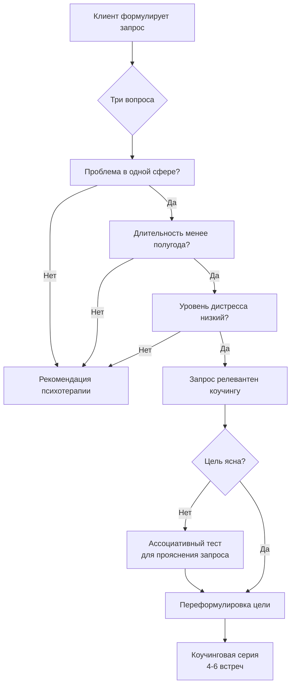

Граница между коучингом и психотерапией проходит не по набору техник, а по **состоянию клиента и структуре запроса**. Один и тот же человек может в понедельник работать с коучем над стратегией выхода на новый рынок, а во вторник — с психотерапевтом исследовать повторяющийся сценарий в отношениях с партнером. Проблема возникает, когда специалист на стороне коучинга получает запрос, требующий терапевтического вмешательства, но не распознаёт этого.

В материале собраны инструменты, которые позволяют принять обоснованное решение о релевантном формате работы ещё на этапе первичного интервью. Дополнительно рассмотрены два подхода к работе с сопротивлением — гуманистический и психодинамический, — а также взгляды ключевых фигур институционализации коучинга на природу профессиональной помощи.

## Три вопроса для дифференциальной диагностики

Таблица, приведённая в исходном материале, содержит три бинарных критерия. Они не заменяют клинического интервью, но достаточны для того, чтобы с высокой вероятностью отнести запрос к коучинговой или психотерапевтической оптике.

| № | Вопрос | Ответ для коучинга | Ответ для психотерапии |
|---|--------|---------------------|------------------------|
| 1 | Эта проблема проявляется только в этой области жизни? | **Да** | **Нет** (захватывает две и более сфер) |
| 2 | Как давно появилась эта проблема? | **Меньше полугода** | **Больше полугода** |
| 3 | Оцените уровень дистресса, вызываемый проблемой | **Низкий** (сохраняется работоспособность, сон, аппетит) | **Умеренный и выше** (нарушения сна, аппетита, концентрации, социального функционирования) |

### Обоснование критериев

**Локализация.** Коучинг исходит из предпосылки, что трудность связана с конкретным контекстом: проектом, ролью, задачей. Если клиент конфликтует с руководителем, но успешно выстраивает отношения с коллегами, подчиненными, друзьями и семьёй — перед нами контекстуальная проблема. Если конфликтный паттерн воспроизводится во всех иерархических отношениях, причина, скорее всего, находится в структуре личности, и запрос требует терапевтической проработки.

**Длительность.** Полгода — эмпирически найденная граница, отделяющая ситуационную трудность от укоренившегося паттерна. Кратковременные стрессоры (переезд, смена работы, кризис в проекте) обычно успешно обрабатываются в коучинговом формате. Хронические состояния требуют психотерапии, даже если клиент отрицает их тяжесть.

**Дистресс.** Низкий уровень дистресса означает, что клиент жалуется на дискомфорт, но сохраняет способность работать, отдыхать, заботиться о себе. Любые признаки нарушения базовых функций — бессонница, потеря аппетита, неспособность сконцентрироваться, суицидальные мысли — являются сигналом для направления к психотерапевту или психиатру. Коуч не имеет компетенций для работы с клиническими состояниями.

**Пример.** Руководитель отдела жалуется, что «выгорел»: потерял интерес к задачам, раздражается на подчиненных, с трудом просыпается по утрам.
Коуч задаёт три вопроса.
1. Проблема только на работе или ещё дома? — «Дома я нормальный, с детьми играю, с женой отношения хорошие». → Да.
2. Как давно это началось? — «Месяца три, после запуска того большого проекта». → Меньше полугода.
3. Насколько тяжело? Спите хорошо? — «Сплю, но просыпаюсь уставшим. Аппетит нормальный». → Низкий дистресс.

Вывод: запрос релевантен коучингу. Коуч и клиент исследуют, какие именно аспекты работы истощают, что можно делегировать, как восстановить энергию.

Если бы клиент ответил: «Жена говорит, я и дома стал злым», «Проблемы со сном уже год», «Иногда не хочется вставать и жить» — коуч обязан предложить обратиться к психотерапевту.

## Ассоциативный тест Юнга в коучинге

Второй инструмент, описанный в материале, — адаптация классического **ассоциативного эксперимента Карла Густава Юнга**. В оригинале тест использовался для выявления комплексов — эмоционально заряженных бессознательных образований. В коучинге он служит иной цели: **свернуть размытое смысловое поле в точку**, за которой стоит истинная потребность клиента.

### Инструкция для клиента

1. Выберите область жизни или конкретную задачу, которая вызывает у вас вопросы. Назовите её (например, «карьера», «проект N», «отношения с партнёром», «деньги»).
2. Возьмите лист бумаги и ручку. В левой части листа запишите в столбик **16 любых слов**, которые ассоциируются у вас с этой областью. Пишите быстро, не оценивая и не отбирая «подходящие».
3. Объедините слова попарно: 1-е со 2-м, 3-е с 4-м и так далее. Для каждой пары придумайте **одно слово или короткую фразу** — ассоциацию, которая связывает оба слова. У вас получится список из 8 пунктов.
4. Повторите операцию: объедините 8 слов в 4 пары, найдите ассоциацию для каждой.
5. Продолжайте, пока не останется **одно слово**.

**После получения финального слова коуч задаёт три вопроса:**
* Какие чувства у вас вызывает это слово?
* Какие мысли возникли при виде этого слова?
* Что вам захотелось сделать в связи с этим?

### Психологический механизм

В процессе свободных ассоциаций клиент оперирует преимущественно правополушарными, образными связями. Логический контроль снижен. Повторное свёртывание заставляет каждый раз искать более абстрактный или глубинный инвариант. Финальное слово часто оказывается неожиданным для самого клиента и прямо указывает на **неосознаваемый мотив или ограничение**, лежащее в основе запроса.

В материале приведена аналитическая рамка для интерпретации промежуточных результатов — таблица с пятью «уровнями» (реальность, разум, чувства, корень проблемы, бессознательное). Однако в коучинге **интерпретация не проводится**. Коуч не говорит: «Ваше бессознательное выдало страх отвержения». Вместо этого он использует результат как материал для **прояснения желаемого состояния**.

**Пример.** Клиентка, владелица салона красоты, выбрала тему «маркетинг». Ассоциативный ряд: инстаграм, бюджет, конкуренты, усталость, блогеры, скидки, клиенты, подарки, время, страх, креатив, команда, отзывы, сайт, реклама, деньги.
После четырёх циклов свёртывания осталось слово **«стыдно»**.

Коуч (не интерпретируя): «Какие чувства у вас вызывает это слово?»
Клиентка: «Ком в горле. Я понимаю, что мне стыдно просить деньги за свои услуги».
Коуч: «Что вы хотите вместо этого?»
Клиентка: «Спокойно и уважительно называть свои цены».

Запрос переформулирован: не «увеличить выручку», а «научиться спокойно назначать цену». Это цель, достижимая в коучинге, хотя она затрагивает самооценку. Коуч не лечит «стыд» — он помогает клиентке выработать новые речевые паттерны, ролевые модели, поведенческие эксперименты.

### Когда тест не нужен

Тест не следует применять, если клиент находится в остром эмоциональном состоянии, если он только что пережил травму или если между коучем и клиентом нет базового доверия. Также он неэффективен при запросах, уже сформулированных предельно конкретно («хочу разработать план выхода на IPO дочерней компании»).

## Гуманистический и психодинамический коучинг: два взгляда на конфликт

В материале зафиксировано принципиальное различие внутри самого коучинга, редко обсуждаемое в популярной литературе. Речь идёт о **позиции коуча по отношению к сопротивлению клиента**.

**Гуманистический коучинг** (основанный на традициях Роджерса, Маслоу, Уитмора) предполагает безусловное принятие, эмпатию и безоценочность. Если клиент защищается, уходит от темы, рационализирует — коуч сохраняет партнёрскую позицию и продолжает «держать зеркало». Сопротивление рассматривается как сигнал, но не как материал для прямой конфронтации.

**Психодинамический коучинг** исходит из того, что у клиента всегда есть **«защитное Я»**, которое препятствует изменениям. Это Я сформировалось как адаптация к прошлому опыту, но в текущей ситуации оно мешает. Задача коуча — отследить момент, когда клиент предъявляет защиту, и **не идти у неё на поводу**. Если коуч поддаётся, он становится «подельником» защитного Я и перестаёт поддерживать **«развивающееся Я»**.

В этой модели **конфликт неизбежен и необходим**. Коуч вступает в противостояние с защитными паттернами клиента, не переходя при этом в психотерапевтическую интерпретацию их генеза. Конфликт остаётся в поле «здесь и сейчас» и касается только поведения, убеждений, выбора.

**Пример из материала.** Клиентка не знает, как начать частную практику. Пробовала вести соцсети — не получается. В гуманистическом подходе коуч, вероятно, исследовал бы её опыт: «Что именно не получалось?», «Что ты пробовала ещё?». В приведённом примере коуч действует иначе: «А если просто помечтать? Что ещё возможно в этой жизни?». Он мягко обходит защиту («соцсети — это сложно») и открывает пространство для новых вариантов. Это не конфронтация в жёстком смысле, но и не следование за сопротивлением.

Разные школы отвечают на этот вопрос по-разному. Выбор подхода зависит от философии коуча, его собственной терапии и контекста работы. Важно, что оба подхода остаются в рамках коучинга: ни один не предполагает интерпретации раннего опыта, переноса или работы с бессознательными конфликтами в психоаналитическом значении.

## Томас Леонард: коуч как зеркало и свидетель

Томас Дж. Леонард (1955–2003) — основатель Международной федерации коучинга (ICF), человек, который превратил коучинг из маргинальной практики в глобальную профессию. В 2001 году ICF насчитывала несколько сотен членов; к 2025 году — более 50 000 сертифицированных коучей в 149 странах. Леонард не только создал организационную инфраструктуру, но и сформулировал этические и философские основания профессии.

В материале приведены пять высказываний Леонарда, которые часто цитируются в программах подготовки коучей.

* «Коучи не решают проблем; они лишь оказывают поддержку тем, кто готов взять свою жизнь под контроль».
* «Моя работа как коуча состоит в том, чтобы увидеть, что таится у вас внутри, и помочь вам проявить это».
* «Мои клиенты уже содержат все ответы в себе, моё дело — лишь держать перед ними зеркало».
* «Умение слушать — это наиболее ценное и наиболее трудноприобретаемое качество для коуча».
* «Большинство людей знают решение проблемы заранее, однако им необходим коуч для того, чтобы убедить их в том, что они правы».

Эти тезисы фиксируют **нормативную модель коучинга**, которая до сих пор доминирует в ICF и во многих других школах. Ключевые элементы:
- клиент активен и ответственен;
- коуч не даёт советов;
- основной инструмент — слушание и вопросы;
- результат уже содержится в клиенте, задача коуча — помочь его извлечь.

Леонард сознательно дистанцировал коучинг от консультирования, терапии и наставничества. Его формулировки стали основой для сертификационных экзаменов и этического кодекса.

## Эмоциональный интеллект и коучинг лидерства

Книга Дэниела Гоулмана «Эмоциональный интеллект» (1995) вышла за пять лет до массового распространения коучинга в корпоративном секторе, но её идеи оказались настолько созвучны практике управления, что быстро интегрировались в коучинговые программы для руководителей.

Гоулман утверждал, что для успешной управленческой работы эмоциональный интеллект (EQ) важнее коэффициента интеллекта (IQ) — по его данным, **на 85% против 15%**. Эти цифры многократно критиковались за отсутствие строгой методологии, однако они выполнили важную популяризаторскую функцию: бизнес поверил, что «мягкие навыки» измеримы и развиваемы.

Четырёхкомпонентная модель Гоулмана (в более поздних версиях — пятикомпонентная) включает:

* **Самосознание** — понимание собственных эмоций, сильных и слабых сторон, ценностей и мотивов.
* **Самоконтроль** — управление импульсами, способность оставаться спокойным в стрессовых ситуациях, открытость изменениям.
* **Осознание других (эмпатия)** — способность улавливать эмоциональное состояние окружающих, интересоваться их чувствами.
* **Социальные умения** — влияние, коммуникация, управление конфликтами, лидерство.

В материале подчёркивается важная иерархия: **начало любых изменений — в самосознании**. Без него невозможен ни самоконтроль, ни подлинная эмпатия, ни социальные навыки. Коучинг, ориентированный на развитие лидеров, всегда стартует с вопросов, повышающих самоосознание: «Что ты сейчас чувствуешь?», «Как ты обычно реагируешь на критику?», «В какой момент ты понял, что проект под угрозой?».

**Эмпирический результат**, зафиксированный в файле: внедрение коучингового стиля управления в компании часто **не даёт немедленного роста финансовых показателей**, но **улучшает эмоциональный климат**. Сотрудники начинают больше доверять руководителю, реже увольняются, проявляют инициативу. В долгосрочной перспективе это конвертируется в прибыль, но измерять эффект коучинга только квартальными отчётами — ошибка.

## Михаил Бахтин и «вненаходимость» в коучинге

Имя Михаила Михайловича Бахтина — философа, теоретика диалога — редко встречается в учебниках по коучингу. Тем не менее, его понятие **«вненаходимость»** прямо описывает метапозицию, которую коуч должен удерживать на протяжении всей сессии.

Бахтин утверждал: другого человека невозможно познать методом **«вчувствования»** (эмпатии). Когда я пытаюсь «влезть в шкуру» другого, я на самом деле проецирую на него свои собственные переживания. Я чувствую не его боль, а свою версию его боли. Чтобы увидеть **другого как другого**, необходимо занять позицию **вне** него — сохранять дистанцию, быть «автором» по отношению к «герою».

«Лицом к лицу лица не увидать. Большое видится на расстоянии», — писал Бахтин. В коучинге эта дистанция достигается за счёт:
- удержания структуры сессии;
- отказа от слияния с клиентом;
- способности замечать собственные проекции и отделять их от реальности клиента;
- рефлексивных пауз («Я сейчас замечу то, что происходит между нами...»).

Без вненаходимости коуч рискует стать не зеркалом, а подпоркой. Он начинает не отражать, а поддакивать; не задавать вопросы, а искать подтверждение своим догадкам. Эмпатия необходима, но недостаточна. Только в паре с дистанцией она становится профессиональным инструментом.

С этим же связано практическое правило, упомянутое в материале: **заменять «Да, но...» на «Да, и...»**. Первая конструкция отрицает сказанное клиентом, ставит коуча в позицию «сверху». Вторая — присоединяется и добавляет новое измерение, сохраняя партнёрство.

## Доказательный коучинг и статус НЛП

Понятие **evidence-based practice** пришло в коучинг из медицины. В 1996 году канадский врач Дэвид Сакетт предложил трёхкомпонентную модель принятия решений, которая сегодня является стандартом доказательной медицины:

1. **Научные доказательства** (результаты систематических обзоров, метаанализов, рандомизированных контролируемых исследований).
2. **Клинический опыт специалиста**.
3. **Ценности и обстоятельства пациента**.

В коучинге эта модель трансформировалась в:

* **строгие научные доказательства** эффективности методов;
* **профессиональный опыт коуча**;
* **личность и обстоятельства клиента**.

Доказательный коучинг — не список разрешённых техник, а **подход к принятию решений**. Коуч, работающий доказательно, не использует метод только потому, что «так делают все» или «мне это интуитивно нравится». Он знаком с исследованиями, критически оценивает их качество, адаптирует интервенции под конкретного клиента и собирает обратную связь для проверки результата.

**НЛП (нейролингвистическое программирование)** в этом контексте находится за пределами доказательной практики. В России и большинстве развитых стран НЛП официально признано **лженаукой**. Ни одно из базовых положений НЛП (метамодель, якоря, субмодальности, рефрейминг) не получило убедительного эмпирического подтверждения в дизайнах, исключающих эффект плацебо и внушения.

В материале приведён важный эпистемологический аргумент: «Мария Кюри открыла радиоактивность, до этого считалось, что металлы на людей не влияют». Этот аргумент часто используют сторонники НЛП: «Отсутствие доказательств не означает, что метод не работает». Однако доказательный подход требует **позитивных свидетельств**, а не отсутствия опровержений. Пока НЛП не предъявит воспроизводимых эффектов, превышающих плацебо, оно остаётся за рамками доказательной практики. При этом отдельные элементы НЛП (например, точность формулировок, работа с сенсорными предикатами) могут использоваться эклектически — как ремесленные приёмы, а не как научно обоснованная система.

## Coaching Psychology: научная база профессии

Энтони Грант (University of Sydney) — самый цитируемый исследователь коучинга в мире. Именно он в начале 2000-х годов оформил **психологию коучинга (Coaching Psychology)** как академическую субдисциплину.

Грант определяет коучинг как **«кросс-дисциплинарное занятие, охватывающее поведенческие науки, бизнес и экономику, обучение взрослых и философию»**. При этом **психология выступает ключевым корпусом знаний**. Без понимания механизмов мотивации, когнитивных искажений, саморегуляции и групповой динамики коучинг остаётся набором бессистемных приёмов.

**Психология коучинга** — это «область академической и прикладной психологии, которая фокусируется на изучении психологических механизмов и коучинговых инструментов повышения эффективности, развития и благополучия людей».

Работы Гранта, его коллег и последователей (Майка Кавана, Стивена Палмера, Кристиана ван Нивербурга, Татьяны Бахаревой) заложили основу для **доказательного коучинга**. Они показали, что коучинг эффективен благодаря конкретным факторам:

* постановка целей (goal-setting);
* развитие осознанности (awareness);
* формирование привычек (habit formation);
* повышение самоэффективности (self-efficacy);
* поддержка автономии и компетентности (self-determination theory).

Эти факторы изучаются экспериментально, результаты публикуются в рецензируемых журналах (International Journal of Evidence Based Coaching and Mentoring, The Coaching Psychologist, Coaching: An International Journal of Theory, Research and Practice). Коучинг перестаёт быть «искусством» и становится **прикладной поведенческой наукой**.

Ниже представлена схема принятия решения о формате работы на первичной встрече.

## Запомнить

* **Три вопроса** (локализация, длительность, дистресс) — быстрый скрининг для отделения коучингового запроса от психотерапевтического. Требуют честных ответов клиента и готовности коуча передать человека другому специалисту.
* **Ассоциативный тест Юнга** в коучинге используется не для диагностики комплексов, а для перевода размытого запроса в конкретную цель. Работает за 10–15 минут, финальное слово почти всегда указывает на истинную потребность.
* **Гуманистический и психодинамический коучинг** по-разному работают с сопротивлением. Первый сохраняет безоценочное принятие, второй допускает конфронтацию с защитным Я. Оба подхода остаются в рамках коучинга, если не переходят к интерпретации прошлого.
* **Томас Леонард** закрепил нормативную модель коучинга: клиент знает ответы, коуч задаёт вопросы, слушание — главный инструмент. Эта модель лежит в основе сертификации ICF.
* **Эмоциональный интеллект** по Гоулману начинается с самосознания. Коучинг развивает лидеров именно через эту точку входа.
* **Бахтинская «вненаходимость»** — необходимое дополнение к эмпатии. Без дистанции коуч теряет профессиональное видение и перестаёт быть «автором» процесса.
* **Доказательный коучинг** требует опоры на три источника: научные данные, опыт специалиста, особенности клиента. НЛП официально признано лженаукой и не может служить обоснованием для интервенций.
* **Психология коучинга** (Энтони Грант) превращает коучинг из ремесла в академическую дисциплину с собственным предметом исследования.
