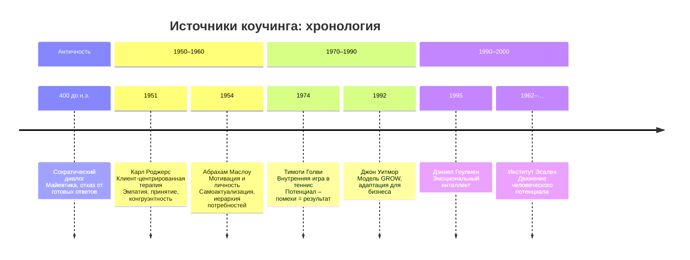

Коучинг не был изобретён в лаборатории или консалтинговой компании. Его инструменты, этические установки и представление о человеке сложились под влиянием трёх различных традиций: античной философии, гуманистической психологии середины XX века и практики спортивных тренеров. Позже к ним добавились идеи движения человеческого потенциала и концепция эмоционального интеллекта.

В профессиональной литературе обычно выделяют пять основных источников коучинга:

* сократический метод диалога;
* гуманистическую психологию (Карл Роджерс, Абрахам Маслоу) и отдельные школы психотерапии (Зигмунд Фрейд, Карл Юнг, Альфред Адлер);
* методики эффективных спортивных тренеров (Тимоти Голви, Джон Уитмор);
* движение развития человеческого потенциала (институт Эсален);
* работы в сфере эмоционального интеллекта (Дэниел Гоулмен).

Однако прямое, документально зафиксированное влияние на коучинг как профессиональную практику оказали главным образом сократический диалог, триада Карла Роджерса и теория самоактуализации Абрахама Маслоу. Остальные источники либо развивают эти идеи, либо работают на смежных полях.

## Сократический диалог: искусство не давать ответов

Сократ (469–399 гг. до н. э.) не оставил письменных трудов. О его методе известно из диалогов Платона. Принцип, который Сократ называл **майевтикой** (повивальным искусством), состоял в том, чтобы с помощью вопросов помочь собеседнику «родить» истину, которая уже содержится в его сознании, но не осознаётся.

**Сократ никогда не предъявлял знание в готовой форме.** Он считал, что единственный способ привести человека к подлинному пониманию — организовать диалог, в котором собеседник самостоятельно пересматривает свои взгляды.

В современном коучинге этот принцип реализуется через тотальный отказ от советов и готовых решений. Коуч не говорит клиенту, что делать. Он задаёт вопросы, которые позволяют клиенту:

* уточнить формулировку цели;
* обнаружить противоречия в собственных рассуждениях;
* найти ресурсы, о которых он не подумал;
* принять решение и взять за него ответственность.

**Парадокс зеркала и спора.** В материале, посвящённом источникам коучинга, зафиксирован важный методический вопрос: «Коуч должен быть зеркалом, но как тогда ставить под сомнение убеждения клиента?». Если коуч только отражает, он не помогает клиенту увидеть ошибочность некоторых допущений.

Ответ содержится в структуре платоновских диалогов. Сократ не просто повторяет слова собеседника. Он задаёт вопросы, которые обнажают внутреннюю непоследовательность. Например: «Ты говоришь, что справедливость — это отдавать долги. Но если друг одолжил у тебя меч, а теперь сошёл с ума, справедливо ли вернуть ему меч?».

В коучинге этот приём используется в виде **провокативных вопросов**, которые остаются в рамках недирективного подхода. Коуч не утверждает, что клиент неправ. Он лишь просит проверить, всегда ли работает убеждение клиента.

> Клиент: «Я не могу выступать на публике, потому что я интроверт».
> Коуч: «Откуда вы знаете, что именно интроверсия мешает? Были ситуации, когда вы выступали и это проходило успешно?».

Вопрос не оспаривает факт интроверсии, но ставит под сомнение причинно-следственную связь. Это и есть сократический диалог, адаптированный под задачи коучинга.

## Гуманистическая психология: от терапевтического альянса к коучинговому партнёрству

В 1950–1960-е годы в США формируется «третья сила» в психологии — **гуманистическая психология**. Её основатели (Карл Роджерс, Абрахам Маслоу, Ролло Мэй) предложили рассматривать человека не как набор реакций на стимулы (бихевиоризм) и не как поле борьбы бессознательных влечений (психоанализ), а как уникальное целое, обладающее врождённой тенденцией к росту и самореализации.

### Триада Карла Роджерса: эмпатия, безоценочность, конгруэнтность

Карл Роджерс разработал **клиент-центрированный подход** в психотерапии. Он эмпирически показал, что эффективность консультирования зависит не столько от техник, сколько от установки терапевта. Эта установка описывается тремя условиями:

1. **Эмпатия** — точное сопереживание чувствам и смыслам клиента, умение смотреть на ситуацию его глазами и сообщать об этом понимании.
2. **Безоценочное принятие** (безусловное позитивное внимание) — отношение к клиенту как к личности, достойной уважения, независимо от его поступков, мыслей или чувств.
3. **Конгруэнтность** (подлинность, искренность) — совпадение того, что специалист чувствует, говорит и выражает невербально.

В коучинге эти три условия стали **нормой профессиональной позиции**.

* **Эмпатия** позволяет коучу точно формулировать вопросы, опираясь на реальный запрос, а не на свою проекцию.
* **Безоценочное принятие** создаёт у клиента ощущение безопасности: он может говорить о неудачах, страхах и «непопулярных» желаниях, не опасаясь критики.
* **Конгруэнтность** проявляется в том, что коуч не прячется за маской нейтральности, а честно сообщает о своих наблюдениях: «Я замечаю, что когда вы говорите об этом проекте, ваш голос становится тише. Это связано с чем-то?».

**Пример.** Клиент рассказывает, что сорвал дедлайн. В директивном подходе следовала бы критика или инструкция. В коучинге, основанном на триаде Роджерса, коуч не оценивает действие, а исследует ситуацию: «Как вы сами оцениваете этот результат? Что для вас было самым сложным в этой задаче?».

Роджерс перенёс акцент с **диагноза и интерпретации** на **создание условий для самостоятельных открытий клиента**. Именно этот сдвиг сделал его идеи востребованными в коучинге, где диагноз и интерпретация принципиально исключены.

### Абрахам Маслоу и самоактуализация как цель

Если Роджерс дал коучингу **метод работы** (эмпатическое слушание и безоценочность), то Абрахам Маслоу предложил **онтологию** — ответ на вопрос, зачем вообще нужен коучинг.

**Иерархия потребностей Маслоу** (1943, позднее уточнялась) чаще всего изображается в виде пирамиды:

1. Физиологические потребности.
2. Потребность в безопасности и защите.
3. Потребность в принадлежности и любви.
4. Потребность в самоуважении (признание, статус).
5. Потребность в самоактуализации.

Маслоу определял **самоактуализацию** как «желание человека стать тем, кем он может стать» (Maslow, 1987). Это не конечное состояние, а процесс реализации своих талантов, способностей и потенциала.

К концу XX века, по выражению Д. А. Леонтьева, самоактуализация стала **«неотъемлемой частью интеллектуального ландшафта Запада»**. Леонтьев отмечал: «Не стремиться к самореализации — это дурной тон, почти за гранью приличий». Коучинг предложил инструментарий, с помощью которого это стремление можно реализовать практически, не прибегая к длительной терапии.

**Исследование самоактуализирующихся людей (1950).** Маслоу выбрал 48 человек, разделённых на три группы: «весьма определённые случаи», «вероятные» и «потенциальные». Среди «весьма определённых» оказались Уильям Джеймс, Альберт Эйнштейн, Томас Джефферсон, Авраам Линкольн, Элеонора Рузвельт. Методами были наблюдение, анализ биографий, интервью и проективные тесты.

В результате Маслоу составил список из **15 характеристик** самоактуализирующихся людей:

1. Объективное восприятие реальности.
2. Принятие себя, других и природы.
3. Непосредственность, простота, естественность.
4. Центрированность на проблеме (в противоположность центрированности на себе).
5. Независимость: потребность в уединении.
6. Автономия: независимость от культуры и окружения.
7. Свежесть восприятия (способность удивляться).
8. Вершинные, или мистические, переживания.
9. Общественный интерес.
10. Глубокие межличностные отношения.
11. Демократический характер.
12. Разграничение средств и целей.
13. Философское чувство юмора.
14. Креативность.
15. Сопротивление окультуриванию (трансценденция конкретной культуры).

Этот список часто воспроизводится в литературе по коучингу как описание **идеального результата** — состояния, к которому коуч помогает клиенту приблизиться.

**Критика исследования.** Методология Маслоу неоднократно подвергалась сомнению.

* **Субъективность отбора.** Выборку формировал сам автор, исходя из собственных представлений о том, кого считать самоактуализировавшимся.
* **Невоспроизводимость.** Другие исследователи не смогли в точности повторить результаты.
* **Нормативность.** Список качеств отражает скорее ценности западного интеллектуала середины XX века, чем универсальные характеристики здоровой психики.
* **Причинность.** Неясно, являются ли эти черты следствием самоактуализации или, напротив, предпосылками для неё.

Тем не менее, для коучинга важна не столько эмпирическая строгость этого списка, сколько сам **принцип**: коучинг работает с людьми, которые уже удовлетворили базовые потребности, и помогает им двигаться к более полной реализации своего потенциала. Именно этот принцип отделяет коучинг от социальной работы, медицины и кризисной психотерапии.

## Спортивный коучинг: внутренняя игра и снятие помех

Тимоти Голви, тренер по теннису и автор книги «Внутренняя игра в теннис» (1974), обнаружил, что главный противник спортсмена — не соперник на другой стороне корта, а **внутренние помехи**: сомнения, страх ошибки, избыточный самоконтроль. Он сформулировал уравнение:

**Производительность = Потенциал − Помехи**.

Голви разработал технику недирективного наблюдения: вместо инструкций («выше ракетку», «бей по линии») он предлагал игроку просто замечать, как летит мяч, как движется тело. Осознанность без оценки снижала помехи, и результат улучшался сам собой.

Джон Уитмор, британский автогонщик и ученик Голви, перенёс этот подход в бизнес-среду. В книге «Коучинг высокой эффективности» (1992) он описал **модель GROW** (Goal, Reality, Options, Will) — одну из первых формализованных структур коучинговой сессии.

Вклад спортивного коучинга в методологию:

* **Фокус на осознанности, а не на исправлении ошибок.** Коуч не говорит «делай так», он помогает клиенту заметить, как он делает сейчас.
* **Идея «помех» вместо «недостатков».** У клиента уже есть потенциал, задача — убрать то, что мешает его проявить.
* **Эксперимент как способ обучения.** Голви предлагал игрокам пробовать разные варианты подачи и просто сравнивать результаты, без оценок «правильно/неправильно».

## Движение человеческого потенциала и эмоциональный интеллект

**Институт Эсален** (Esalen, Калифорния), основанный в 1962 году, стал площадкой, где встречались психологи, философы, телесные терапевты и духовные учителя. Именно там популяризировались идеи гуманистической психологии, гештальт-терапии, биоэнергетики. Через Эсален прошли многие ключевые фигуры, повлиявшие на коучинг (включая самого Голви). Движение человеческого потенциала закрепило установку, что **развитие — это естественный процесс**, а не исправление дефектов.

**Дэниел Гоулмен** в 1995 году опубликовал книгу «Эмоциональный интеллект». Он показал, что для успеха в управлении и лидерстве коэффициент интеллекта (IQ) менее важен, чем способность понимать свои и чужие эмоции, управлять импульсами, сохранять мотивацию. Эта концепция быстро вошла в арсенал бизнес-коучей. От клиента всё чаще ждут не только стратегического мышления, но и развитого эмоционального интеллекта; коучинговые программы включают диагностику и развитие EQ.

## Другие психотерапевтические влияния

В списке источников иногда упоминают Зигмунда Фрейда, Карла Юнга и Альфреда Адлера. Прямого влияния этих авторов на технику коучинга не прослеживается. Скорее, коучинг заимствовал у психотерапии **общие этические нормы** (конфиденциальность, уважение к клиенту, отказ от оценочных суждений) и отдельные концепты:

* из адлерианской психологии — идея телеологии (поведение определяется не прошлым, а будущими целями);
* из юнгианского анализа — интерес к архетипам и личностному росту во второй половине жизни;
* из психоанализа — внимание к переносу и контрпереносу (хотя в коучинге эти явления не интерпретируются терапевтически, а учитываются как фактор взаимодействия).

Однако эти влияния остаются фоновыми и не формируют специфику коучингового метода.

## Критическая рефлексия: как избежать мифологизации источников

В популярной коучинговой литературе ссылки на Сократа, Роджерса и Маслоу часто становятся ритуальными. Сами по себе эти имена не гарантируют качества работы. Анализ источников полезен для понимания границ метода, но не заменяет исследований эффективности.

**Две опасности упрощения.**

1. **Сведение сократического диалога к технике открытых вопросов.** Сократ не просто спрашивал — он провоцировал когнитивный конфликт. Без этого конфликта диалог остаётся поверхностным.
2. **Идеализация самоактуализации.** Исследование Маслоу, при всех его достоинствах, не является репрезентативным. Коучинг, который обещает привести любого клиента к 15 пунктам из списка Маслоу, продаёт недоказуемую гарантию.

Современный **доказательный подход (evidence-based coaching)** предлагает рассматривать исторические источники как гипотезы, которые необходимо проверять в контролируемых исследованиях. Например, эффективность эмпатии подтверждена сотнями экспериментов, а список черт самоактуализирующейся личности — нет.

Ниже представлена упрощённая хронология основных влияний, которые сформировали современный коучинг.

## Запомнить

* Коучинг заимствовал **метод постановки вопросов** из сократического диалога, но адаптировал его под недирективную позицию. Ключевой элемент — не просто рефлексия, а мягкое оспаривание ограничивающих убеждений клиента.
* **Триада Карла Роджерса** (эмпатия, безоценочное принятие, конгруэнтность) стала профессиональным стандартом коучинговой позиции. Коуч не интерпретирует, а создаёт условия для самостоятельного поиска решений.
* **Теория самоактуализации Маслоу** задала ценностную рамку: коучинг предназначен для людей, чьи базовые потребности удовлетворены, и помогает реализовать потенциал. Однако эмпирическая база самого Маслоу остаётся предметом критики.
* Спортивный коучинг (Голви, Уитмор) ввёл понятие **внутренних помех** и показал, что осознанность без оценки эффективнее директивных указаний.
* Движение человеческого потенциала и эмоциональный интеллект расширили контекст применения коучинга и добавили инструменты работы с переживаниями.
* Знание исторических источников необходимо, но не заменяет проверку методов в исследованиях. Доказательный коучинг опирается на те элементы наследия, которые подтвердили свою эффективность.
