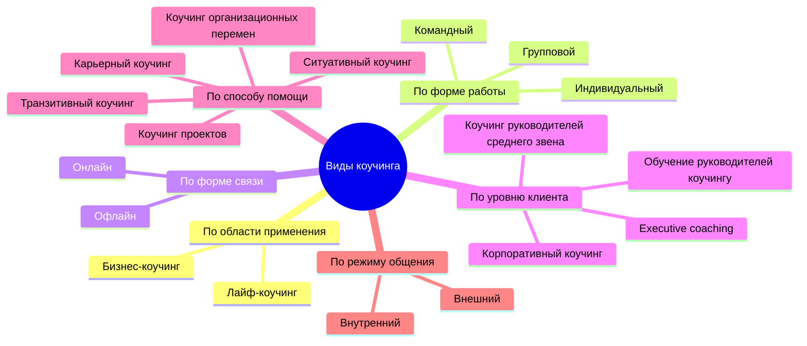

Штирлиц проснулся среди ночи от звонка в дверь.
«Кто там?» — поинтересовался Штирлиц.
«Здесь мы задаём вопросы», — ответили из-за двери.
«Коучи…», — подумал Штирлиц.

В этой шутке схвачена суть профессиональной идентичности. Коуч — это специалист, который **задаёт вопросы** и почти никогда не даёт ответов. Однако за внешней простотой скрывается сложная система компетенций: какие именно вопросы задавать, в какой момент, с какой интонацией и, главное, как удерживать позицию, исключающую советы, обучение и оценивание.

## Что делает коуч три базовые функции

Ответ на вопрос «что делает коуч?» в исходном материале дан предельно лаконично. Коуч выполняет три действия.

**1. Задаёт вопросы.**
Это не любые вопросы, а только те, которые расширяют картину мира клиента, проясняют его цели, обнаруживают ресурсы и переводят размышления в плоскость конкретных действий.

**2. Сохраняет коуч-позицию.**
Коуч-позиция включает четыре компонента:
- нейтральность (отсутствие эмоциональных оценок);
- безоценочность (ничего из сказанного клиентом не квалифицируется как «хорошо» или «плохо»);
- искренний интерес к личности и ситуации клиента;
- веру в то, что у клиента уже есть все необходимые ресурсы для достижения целей.

**3. Исключает советы, рекомендации и обучение.**
Коуч не говорит: «Я бы на вашем месте…», «Вам стоит…», «Есть проверенный метод…». Он также не передаёт знания в готовой форме. Даже если коуч владеет уникальной экспертизой, он не использует её для прямых инструкций. Максимум — запрашивает разрешение поделиться информацией, сохраняя за клиентом право выбора, использовать её или нет.

Эти три пункта образуют **нормативный минимум**. Любое отклонение — совет, скрытая оценка, потеря нейтральности — выводит специалиста за границы коучинга в смежные практики: консультирование, наставничество или психотерапию.

## Искусство задавать вопросы от «неправильных» к «рабочим»

В материале приведён разбор семнадцати вопросов, разделённых на «норм» (приемлемые) и «стрём» (требующие переформулировки). Анализ этих примеров позволяет вывести правила конструирования коучингового вопроса.

### Ошибка 1: вопрос содержит готовое решение
**Неправильно:** «Не следует ли тебе посоветоваться со своим начальником, прежде чем ты начнёшь действовать?»
**Почему плохо:** вопрос подсказывает конкретное действие и оценивает его как желательное. Коуч присваивает ответственность за выбор.
**Лучше:**
- «Что тебе важно сделать, чтобы начать действовать?»
- «Что бы ты сам себе посоветовал?»
- «Если бы ты сам был своим коучем, какой вопрос ты бы себе задал?»
- «С кем тебе важно посоветоваться?»

**Принцип:** вопрос не должен содержать скрытой директивы.

### Ошибка 2: вопрос сужает варианты до одного
**Неправильно:** «У тебя есть другой вариант?» (вопросительная конструкция, предполагающая ответ «да/нет»).
**Лучше:** «Какие ещё варианты у тебя есть?», «Что ещё можно сделать?».

**Принцип:** открытые вопросы (с вопросительными словами «что», «как», «какие») предпочтительнее закрытых, особенно когда речь идёт о генерации альтернатив.

### Ошибка 3: вопрос фиксирует внимание на препятствии
**Неправильно:** «Что мешает тебе приступить к решению задачи прямо сейчас?»
**Почему плохо:** фокус на «мешает» усиливает ощущение барьера.
**Лучше:** «Что тебе поможет приступить к решению прямо сейчас?»

**Принцип:** формулировка вопроса должна направлять внимание на ресурсы и возможности, а не на дефициты.

### Ошибка 4: вопрос содержит оценку
**Неправильно:** «Разве это не отговорка?»
**Почему плохо:** прямая квалификация слов клиента как неискренних или незрелых.
**Лучше:**
- «Что вы думаете на самом деле?»
- «Что за этим стоит?»
- «От чего это защищает?»
- «Если бы страх был твоим другом, на что он обращает твоё внимание?»

**Принцип:** коуч не оценивает, а исследует. Даже если клиент явно избегает темы, задача — не уличить, а понять функцию защиты.

### Ошибка 5: вопрос содержит скрытое давление
**Неправильно:** «Мы потратили достаточно времени, работая над этим в последние несколько недель: теперь ты готов принять решение?»
**Почему плохо:** манипуляция чувством вины за потраченное время.
**Лучше:**
- «Что ещё тебе важно прояснить, прежде чем ты примешь решение?»
- «Что именно тебе поможет принять решение?»
- «Насколько ты готов принять решение прямо сейчас по шкале от 1 до 10?»

**Принцип:** коуч не подгоняет клиента, а создаёт условия для осознанного выбора темпа.

### «А ещё?» — лучший вопрос коучинга
Особо отмечен вопрос «А ещё?». Анна Лебедева, известный российский коуч, называет его своим любимым. Этот вопрос:
- стимулирует продолжение мысли;
- сигнализирует, что первый ответ не исчерпывает тему;
- не содержит оценки;
- работает одинаково хорошо на этапе поиска решений и на этапе уточнения цели.

## Что коучинг помогает сделать клиенту

В материале перечислены четыре результата, которые клиент получает в процессе коучинговой работы. Каждый из них может быть измерен и верифицирован.

**1. Прояснить свои цели, увязывая их с более глубокими потребностями, ценностями, смыслами жизни.**
Коуч не принимает первую формулировку цели как окончательную. С помощью вопросов он помогает клиенту опуститься на уровень ниже: «Для чего тебе это?», «Что это даст?», «Что ты почувствуешь, когда достигнешь цели?». Связь цели с ценностями повышает внутреннюю мотивацию и устойчивость при столкновении с трудностями.

**2. Найти множество решений для одной цели, расширяя вариативность видения, стратегий и действий.**
Мозговой штурм в условиях безоценочности позволяет клиенту выйти за рамки привычных паттернов. Коуч фиксирует все варианты, не отсеивая «нереалистичные». Позже клиент сам выбирает те, которые готов реализовать.

**3. Прояснить и принять конкретные шаги и сроки для их исполнения.**
Коучинг всегда завершается планом действий. Вопросы «Что именно ты сделаешь?», «Когда?», «Как поймёшь, что сделал?» переводят инсайты в поведенческие акты.

**4. Продумать, как застраховаться от возможных препятствий на этом пути.**
Коуч предлагает клиенту заранее смоделировать риски: «Что может помешать?», «Как ты с этим справишься?», «Кто или что может поддержать?». Это снижает вероятность откладывания и повышает реалистичность плана.

## Виды коучинга шесть классификационных осей

Современный коучинг представлен множеством форматов. В материале приведены шесть независимых классификаций. Ниже они сведены в единую схему.

**Командный и групповой коучинг: принципиальное различие.**
В групповом коучинге участники решают **индивидуальные задачи**, находясь в одном пространстве. Каждый работает над своей целью, коуч поочерёдно взаимодействует с разными членами группы. В командном коучинге у всех участников **общая цель**, и они связаны совместной деятельностью. Коуч работает с командой как с единым организмом, фокусируясь на взаимодействиях, ролях и коллективных результатах.

**Внешний и внутренний коучинг.**
Внешний коуч — приглашённый консультант, не включённый в организационную структуру. Внутренний коуч — сотрудник компании, часто занимающий позицию HR или руководителя, прошедший специальную подготовку. Внутренний коучинг экономит бюджет, но требует высокой этической культуры: необходимо разделять роли коуча и администратора.

## Теоретические подходы в коучинге

Материал перечисляет одиннадцать теоретических подходов. Важно понимать, что это не просто модные ярлыки, а полноценные методологии, каждая из которых опирается на определённую модель личности, теорию изменений и протокол интервенций.

**Психодинамический коучинг** — работает с защитными механизмами, сопротивлением, переносом. Допускает конфронтацию с «защитным Я». Акцент на неосознаваемых паттернах, мешающих достижению целей.

**Когнитивно-бихевиоральный коучинг** — выявляет дисфункциональные убеждения и автоматические мысли, заменяет их на более адаптивные. Использует домашние задания, поведенческие эксперименты, шкалирование.

**Сфокусированный на решении коучинг (SF)** — практически не обсуждает проблему. Всё внимание уделяется конструированию желаемого будущего и поиску исключений (случаев, когда проблема отсутствовала или была менее выражена).

**Человеко-центрированный коучинг** — базируется на триаде Роджерса: эмпатия, безоценочное принятие, конгруэнтность. Максимальная недирективность.

**Гештальт-коучинг** — фокус на осознавании текущего опыта («здесь и сейчас»), работе с фигурами и фоном, полярностями, незавершёнными ситуациями.

**Экзистенциальный коучинг** — обращение к конечным данностям существования: смерть, свобода, изоляция, бессмысленность. Помогает клиенту принять ответственность за свой выбор в условиях неопределённости.

**Онтологический коучинг** — исходит из того, что язык конструирует реальность. Работает с речевыми паттернами, телесностью, эмоциями как способами бытия.

**Нарративный коучинг** — рассматривает жизнь клиента как набор историй. Помогает переписать проблемно-насыщенную историю в альтернативную, более ресурсную.

**Коучинг позитивной психологии** — опирается на исследования счастья, благополучия, сильных сторон характера. Развивает то, что уже хорошо работает.

**НЛП-коучинг** — использует моделирование успешных стратегий, работу с субмодальностями, якорение. Несмотря на то, что НЛП признано лженаукой, отдельные техники применяются эклектически.

Выбор подхода зависит от запроса клиента, контекста и предпочтений коуча. Профессионал, владеющий несколькими подходами, может гибко переключаться между ними в рамках одной сессии.

## Зачем нужно разнообразие подходов

Опора на конкретную теорию даёт коучу системное видение. Модель личности объясняет, почему клиент действует так, а не иначе. Методология подсказывает, на какие именно рычаги воздействовать. Принципы подхода удерживают от хаотичных интервенций.

Без теоретической базы коучинг превращается в набор разрозненных техник. С ней — становится профессиональной практикой, которая может быть передана, изучена и усовершенствована.

## Коучинг в контексте общества достижений

В финале материала приведена цитата из книги Бён-Чхоль Хана «Общество усталости». Её включение не случайно. Коучинг как профессия и как культурный феномен возник именно на переломе от **дисциплинарного общества** к **обществу достижений**.

Дисциплинарное общество (по Фуко) управляло людьми через внешние запреты, нормы, приказы. Человек был должен соответствовать. Его свобода ограничивалась извне.

Общество достижений управляет иначе. Оно не говорит «ты должен» — оно говорит «ты можешь». Внешнее принуждение заменяется **самопринуждением**. Человек сам ставит себе цели, сам отвечает за результат, сам винит себя в неудаче. «Принуждение к свободе» — парадоксальная формула Хана — точно описывает это состояние.

Коучинг идеально вписывается в общество достижений. Его язык — это язык возможностей, ресурсов, целей, эффективности. Коуч не заставляет, не запрещает, не приказывает. Он лишь сопровождает. Но именно эта «мягкая» поддержка иногда усиливает внутреннее давление: клиент начинает требовать от себя постоянного роста, оптимизации, результата.

В этом заключается двойственность профессии. С одной стороны, коучинг помогает людям вырваться из позиции жертвы, взять ответственность и реализовать потенциал. С другой — он рискует стать инструментом «изнуряющего усилия над самим собой».

Осознание этой двойственности — часть профессиональной рефлексии. Коуч, работающий в обществе усталости, должен не только развивать эффективность клиента, но и помогать ему замечать границы, уважать усталость, отличать подлинные желания от интроецированных требований.

## Запомнить

- **Коуч делает три вещи:** задаёт вопросы, удерживает нейтральную безоценочную позицию, исключает советы и обучение.
- **Вопросы не должны содержать:** готовых решений, оценок, фокуса на препятствиях, скрытого давления.
- **«А ещё?»** — самый универсальный и эффективный вопрос в коучинге. Он расширяет поле поиска и не оценивает предыдущий ответ.
- **Клиент в коучинге** проясняет цели, генерирует множественные варианты, планирует конкретные шаги и страхует себя от рисков.
- **Коучинг классифицируется** по шести независимым осям: область применения, форма работы, форма связи, уровень клиента, способ помощи, режим общения.
- **Командный коучинг** отличается от группового наличием общей цели и совместной деятельности участников.
- **Теоретические подходы** (психодинамический, когнитивно-бихевиоральный, экзистенциальный и др.) — не бренды, а системы, каждая со своей моделью личности и методологией изменений.
- **Коучинг** — дитя общества достижений. Он отвечает на запрос «ты можешь», но не должен превращаться в инструмент бесконечного самосовершенствования без права на остановку.
