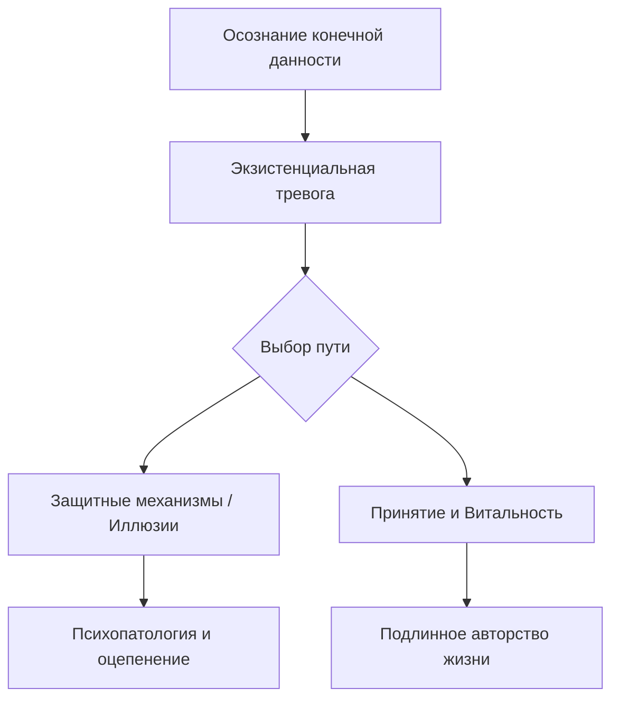

Бывало ли у вас чувство, что вы живете по чужому сценарию или просто плывете по течению? Иногда человека охватывает необъяснимая тревога, когда он задумывается о будущем или смысле своих действий. Кажется, что мы — пассивные жертвы обстоятельств, которые не могут ничего изменить.

Экзистенциальный анализ — это направление психотерапии. Оно помогает людям, которым кажется, что они потеряли ориентиры или живут в состоянии внутренней пустоты. Этот подход возвращает человеку авторство его судьбы и позволяет проживать каждый день с глубоким ощущением подлинности.

### Универсальная матрица: Четыре данности человеческого бытия

Ирвин Ялом предложил систему универсальных факторов существования. Эти факторы называют конечными данностями бытия. Конфронтация с ними составляет основу развития каждого человека *(Ялом, 2020)*. Данная концепция помогает вскрыть скрытые корни тревоги. Через осознание этих вызовов личность преодолевает страх и переходит к подлинному творчеству своей жизни.

Если человек полностью вытесняет эти данности, он тратит огромную энергию на поддержание иллюзий. В таком случае терапия остается на уровне простого снятия симптомов. Психотерапевт помогает человеку осознать диалектическое напряжение жизни. Мы часто пытаемся выстроить защиты от ужаса небытия. Но целительные моменты прозрения возвращают нам чувство реальности и витальности *(Ялом, 2020)*.

### Архитектура тревоги: Как смерть активирует жизнь

**Смерть** является центральной осью всей экзистенциальной динамики. Она выступает первичным источником тревоги, который всегда присутствует на краю нашего сознания *(Ялом, 2020)*. Без признания перспективы конца жизнь может обесцениться и стать пустой игрой без ставок. Однако здесь кроется главный парадокс. Физически смерть разрушает человека, но сама идея смерти спасает его *(Ялом, 2020)*.

Осознание конечности времени работает как мощный катализатор. Оно вытряхивает человека из банальности повседневности. Эта «пограничная ситуация» заставляет нас понять, что существование не может быть отложено. Люди, столкнувшиеся с близостью гибели, часто переживают радикальное духовное пробуждение. Они начинают острее ценить простые моменты жизни, такие как полет птицы или созерцание неба *(Ялом, 2020)*.

### Свобода и ответственность: Тяжкое бремя выбора

**Свобода** в экзистенциальном смысле означает отсутствие внешней структуры. В этой зоне человек сталкивается с пугающей «беспочвенностью». Это означает, что в мире нет заранее заданных гарантий или готовых чертежей для нашей жизни *(Ялом, 2020)*. Мы сами являемся единственными творцами своего мира. Мы наделяем вещи красотой и смыслом своим присутствием и оценкой *(Ялом, 2020)*.

Принятие абсолютного авторства неизбежно порождает страх. Чтобы избежать ответственности, люди часто винят в своих бедах обстоятельства, других людей или прошлые травмы. Экзистенциальный анализ помогает человеку перестать быть «невинной жертвой». Терапевт возвращает клиенту его волю. Это позволяет личности принимать решения на основе собственных ценностей, а не из страха или конформизма *(Ялом, 2020)*.

> Свобода требует от человека стать абсолютным автором своей судьбы. Принятие этой ответственности — единственный путь к подлинному существованию.

### Изоляция и Бессмысленность: Между одиночеством и вовлеченностью

**Изоляция** — это непреодолимая пропасть между «Я» и миром. Речь идет не о простом одиночестве, а о понимании того, что мы рождаемся и умираем абсолютно одни *(Ялом, 2020)*. Попытки избежать этого факта часто толкают людей в зависимые отношения. Они пытаются «раствориться» в другом или «поглотить» партнера. Только встретив свою изоляцию, человек может выстроить отношения на основе подлинной любви, не используя другого как щит от тревоги *(Ялом, 2020)*.

**Бессмысленность** возникает из конфликта между нашей потребностью в смысле и равнодушной вселенной. Мы биологически нуждаемся в порядке, но мир не предоставляет нам готовых ответов *(Ялом, 2020)*. Главным ответом на этот вызов становится механизм «вовлеченности». Это активное и страстное погружение в поток жизни. Когда человек искренне занят творчеством, любовью или помощью другим, вопрос о глобальном смысле перестает быть парализующим *(Ялом, 2020)*.

### Механика исцеления: От теории к практике

Логотерапия — это практический метод лечения. Он помогает человеку найти смысл в конкретных ситуациях *(Франкл, 1959)*. Терапевт выступает в роли «катализатора». Он помогает клиенту активировать две важные способности:

* **Самодистанцирование** позволяет человеку посмотреть на себя со стороны. Мы учимся занимать позицию по отношению к своим страхам и настроениям *(Франкл, 1959)*.
* **Самотрансценденция** помогает выйти за пределы своего «Эго». Человек направляет внимание на другого человека или на задачу, которую нужно выполнить *(Франкл, 1959)*.

### Вывод и литература

Экзистенциальный подход напоминает нам, что человек обладает свободой воли при любых обстоятельствах. Жизнь не может быть отложена на потом. Конфронтация с данностями бытия — это не признак болезни, а суть человеческой ситуации. Принимая свою смертность, свободу и одиночество, мы перестаем быть марионетками судьбы. Мы обретаем мужество быть авторами своей жизни, находя смысл в каждом осознанном действии.

**Литература:**
- Бьюдженталь, Дж. (2020). *Искусство психотерапевта*. Питер.
- Франкл, В. (1959). *Человек в поисках смысла*.
- Ялом, И. (2020). *Экзистенциальная психотерапия*. Римис.

---

### Проверка понимания

**Микро-кейс для практики:**
Пациентка Фрэн долгое время жила в несчастливом браке. Она чувствовала себя в ловушке, но боялась перемен. После того как врачи обнаружили у нее серьезное заболевание, ее состояние резко изменилось. Она внезапно нашла в себе силы развестись и начать новую карьеру, о которой мечтала десять лет. Она сказала: «Только теперь я поняла, что у меня нет времени на страх».

**Задания:**
1. Какую «пограничную ситуацию» пережила Фрэн согласно теории Ирвина Ялома? *(Ялом, 2020)*.
2. Объясните, как осознание данности **Смерти** в данном случае помогло Фрэн справиться с параличом воли перед данностью **Свободы**?
3. Каким образом этот пример иллюстрирует переход от «забвения бытия» к подлинному авторству своей жизни? *(Ялом, 2020)*.
