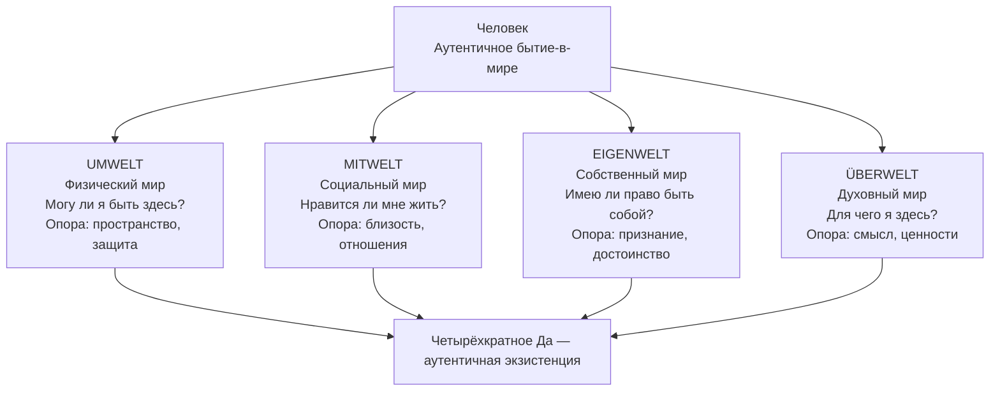

Человек нередко чувствует, что страдает сразу «везде»: в теле, в отношениях, в самооценке и в ощущении смысла жизни. Это затрудняет понимание, откуда именно исходит боль и какой ресурс действительно нужен. Экзистенциальный анализ предлагает точный ответ: каждый человек одновременно существует в четырёх измерениях бытия, и дефицит в каждом из них порождает специфическую форму страдания.

Феноменологическая традиция — от Людвига Бинсвангера и Ролло Мэя до Альфрида Лэнгле и Виктора Франкла — разработала карту этих четырёх миров. Она позволяет увидеть человека не как набор симптомов, а как целостное существо, непрерывно созидающее свою жизнь в диалоге с физической реальностью, другими людьми, собственным «я» и объективными смыслами.

### Umwelt: физический мир как первое «да» бытию

**Umwelt** — буквально «мир вокруг» — это первое и наиболее очевидное измерение бытия-в-мире *(Бинсвангер, Мэй)*. Оно охватывает биологическую реальность: законы природы, циклы сна и бодрствования, физиологические потребности, телесность, рождение, болезнь и смерть. Человек «вброшен» в этот мир без своего согласия и вынужден к нему приспосабливаться. Сюда же относятся конкретное физическое пространство и здоровье собственного тела.

Альфрид Лэнгле описывает Umwelt через Первую фундаментальную мотивацию. Она звучит как базовый экзистенциальный вопрос: **«Я есть — могу ли я быть в этом мире?»** Чтобы ответить на него утвердительно, человеку необходимы три опоры: *пространство* (возможность занять место в мире), *защита* (безопасность от угроз) и *опора* (прочность земли, законов природы, здоровья). Успешный контакт с физическим миром формирует то, что Лэнгле называет **«фундаментальным доверием»** к бытию.

> Если в физическом измерении возникает дефицит, человек сталкивается с базисной тревогой — ощущением, что само существование находится под угрозой.

### Mitwelt: социальный мир и теплота жизни

**Mitwelt** — «с-мир», мир ближних — это второе измерение бытия-в-мире *(Бинсвангер, Мэй)*. Оно не сводится к стадному инстинкту. У человека социальный мир имеет сложную структуру значений, которая создаётся в живом взаимодействии людей друг с другом. Сюда входят отношения с родителями, друзьями, партнёрами, коллегами и обществом в целом.

Лэнгле формулирует Вторую фундаментальную мотивацию как вопрос: **«Я живу — нравится ли мне жить?»** Чтобы жизнь ощущалась как ценная и желанная, человеку необходимы *близкие отношения*, *время* (уделяя время другому, мы повышаем его ценность) и *эмоциональная близость*. Глубинный опыт этих связей формирует **«фундаментальную ценность»** жизни.

Нарушение контакта с социальным миром — утрата близости, хроническое одиночество, отсутствие теплоты в отношениях — экзистенциальный анализ связывает с депрессией: человек живёт, но не чувствует, что жизнь ему нравится.

### Eigenwelt: собственный мир и право быть собой

**Eigenwelt** — «собственный мир» — это третье измерение: интимное пространство отношений человека с самим собой *(Бинсвангер, Мэй)*. Этот мир присутствует исключительно у человека и предполагает наличие самоосознания. Eigenwelt — это ядро «я», которое не сводится к усвоенным культурным нормам. Именно в нём человек определяет, что та или иная вещь, событие или другой человек значат *для него лично*.

Лэнгле описывает этот мир через Третью фундаментальную мотивацию: **«Я есть я — имею ли я право быть таким?»** Чтобы человек мог обнаружить и отстаивать себя, ему необходимы *уважительное внимание* со стороны других, *справедливое отношение* и *признание его уникальной ценности*. Справедливое отношение укрепляет чувство собственного достоинства. Персональное признание формирует здоровую **самоценность** — ощущение, что быть собой разрешено.

Игнорирование Eigenwelt приводит к утрате витальности и потере чувства реальности собственных переживаний. Хронический дефицит в этом измерении экзистенциальный анализ связывает с отчуждением от своего «я», а в клинической картине — с истерическими и нарциссическими тенденциями.

### Überwelt: духовный мир и поиск смысла

**Überwelt** — «сверх-мир» — это четвёртое измерение бытия: мир смыслов, транссубъективных ценностей и высших связей *(Франкл)*. Виктор Франкл подчёркивал, что именно это духовное (ноэтическое) измерение делает человека человеком. Оно не управляется природными или психодинамическими закономерностями — оно представляет собой то, что «свободно» в человеке.

Четвёртая фундаментальная мотивация по Лэнгле звучит как: **«Я здесь — для чего я должен быть здесь? В чём смысл?»** Чтобы жизнь обрела смысл, необходимы *поле деятельности*, *контекст связей* (понимание своего места в широких взаимосвязях) и *направленность на ценность в будущем*. Смысл находится не внутри замкнутой психики, а во внешнем мире.

Франкл выделил три пути к смыслу через **ценности** трёх типов:

- **Ценности творчества** — то, что человек создаёт и привносит в мир.
- **Ценности переживания** — то, что он принимает от мира: любовь, созерцание красоты, встреча с другим человеком.
- **Ценности отношения** — позиция, которую человек занимает по отношению к неизбежному страданию. Это мужество, достоинство и принятие того, что невозможно изменить.

Утрата связи с духовным измерением порождает то, что Франкл назвал **«экзистенциальным вакуумом»** — ощущение пустоты и бессмысленности. В клинической практике этот вакуум нередко заполняется конформизмом, зависимостями или может приводить к суицидальности.

### Интеграция: четырёхкратное «да» аутентичному бытию

Четыре мира не существуют изолированно. Человек живёт в них одновременно — они взаимосвязаны и обусловливают друг друга. Экзистенциальный анализ описывает аутентичную жизнь как состояние, в котором человек способен к **«четырёхкратному внутреннему согласию»**:

1. **Да — миру:** принятие физических условий и ограничений бытия.
2. **Да — жизни:** принятие своих эмоций и ценности межличностных отношений.
3. **Да — бытию собой:** принятие своей уникальной личности и права на неё.
4. **Да — смыслу:** готовность действовать и выходить за пределы себя ради будущих ценностей.

Эта феноменологическая карта показывает человека не как набор биологических реакций, а как целостное существо, непрерывно ведущее диалог сразу на четырёх уровнях реальности.

| Измерение | Ключевой вопрос | Необходимые опоры | Дефицит приводит к |
| :--- | :--- | :--- | :--- |
| **Umwelt** — физический | Могу ли я быть в этом мире? | Пространство, защита, опора | Базисной тревоге |
| **Mitwelt** — социальный | Нравится ли мне жить? | Отношения, время, близость | Депрессии |
| **Eigenwelt** — личный | Имею ли я право быть собой? | Уважение, справедливость, признание | Отчуждению от «я» |
| **Überwelt** — духовный | Для чего я здесь? | Деятельность, смысловые связи, ценности | Экзистенциальному вакууму |

### Заключение и Литература

Модель четырёх миров — это рабочий диагностический инструмент, а не просто философская схема. Когда клиент не может сформулировать, откуда исходит его страдание, терапевт может мысленно «пройтись» по четырём измерениям: есть ли у человека базовое доверие к физическому миру, ощущает ли он тепло жизни в отношениях, чувствует ли право быть собой и слышит ли голос смысла. Дефицит в каждом из миров указывает на специфическую точку терапевтического входа — и на специфический ресурс, который предстоит найти или восстановить.

- Бинсвангер, Л. Феноменологические концепции бытия-в-мире: *Umwelt*, *Mitwelt*, *Eigenwelt*.
- Лэнгле, А. Четыре фундаментальных мотивации экзистенциального анализа.
- Мэй, Р. Феноменологическая модель трёх форм мира.
- Франкл, В. Ноэтическое измерение, самотрансценденция и три категории ценностей.

---

Клиентка 34 лет обращается с жалобами на «ощущение пустоты и бессмысленности». Она говорит, что материально обеспечена, работа стабильная, с мужем отношения ровные, здоровье в норме. Тем не менее каждое утро она просыпается с ощущением, что «не понимает, зачем всё это».

Опираясь на модель четырёх миров, определите: в каком из измерений бытия расположен главный дефицит этой клиентки? Объясните, какие из четырёх опор в этом измерении предположительно отсутствуют. Какой из трёх типов ценностей по Франклу мог бы стать точкой терапевтического входа — и почему именно он, а не другие?
