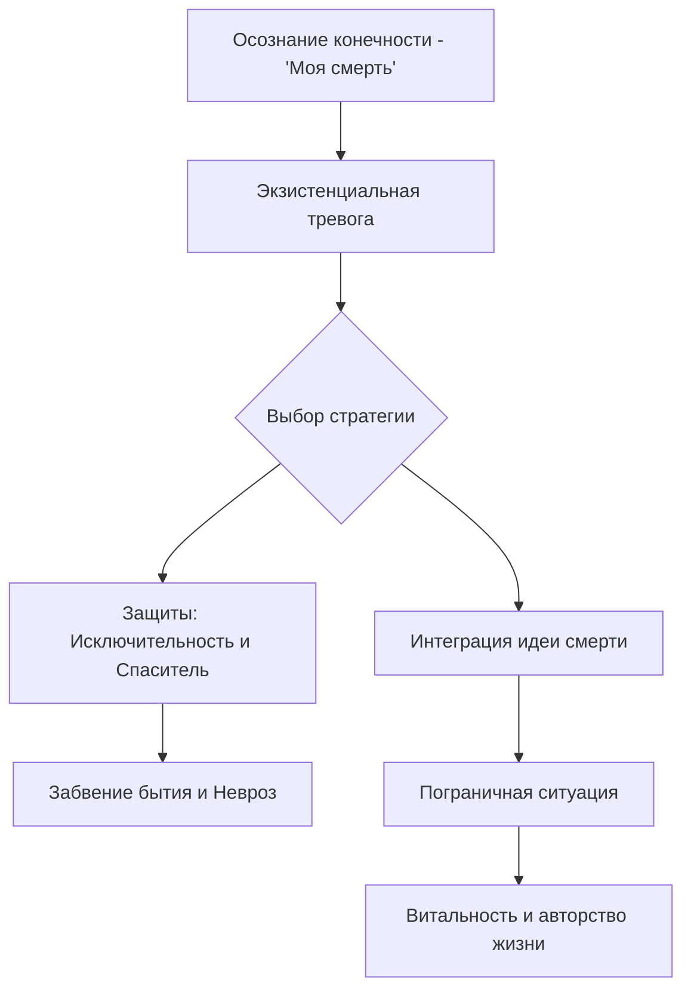

Большинство людей проживают свои дни так, будто впереди у них вечность. Мы откладываем важные разговоры, терпим нелюбимую работу и прячемся за бесконечной рутиной, надеясь, что «настоящая» жизнь начнется когда-нибудь позже. Однако в глубине души каждый из нас чувствует смутное беспокойство, напоминающее о том, что время уходит безвозвратно. Это беспокойство не случайно: оно указывает на самую мощную и неизбежную границу нашего существования.

Смерть — это не только физический конец жизни, но и фундаментальная граница, которая служит главным мерилом ценности человеческого пути. Экзистенциальный анализ рассматривает её не как повод для уныния, а как мощный стимул. Понимание того, что наше время ограничено, способно вырвать нас из состояния оцепенения и вернуть нам чувство реальности. В этой статье мы разберем, как осознание финала помогает обрести подлинную жизненную силу и почему идея смерти может спасти человека от бессмысленного прозябания.

### Граница, пробуждающая жизнь: Сущность и назначение данности

Смерть — это наиболее очевидная и неизбежная конечная данность нашего бытия. Под данностью здесь понимается факт существования, который невозможно изменить или обойти. Она представляет собой первичный источник **экзистенциальной тревоги** (глубинного беспокойства, вызванного самим фактом нашего существования). Эта тревога незримо присутствует на краю нашего сознания подобно гулу дремлющего вулкана. Она сопровождает нас всю жизнь, даже если мы стараемся её не замечать.

В контексте психотерапии концепция смерти существует для того, чтобы служить **пограничной ситуацией**. Это событие-катализатор, которое вытряхивает человека из привычной рутины. Ялом называет это состояние «забвением бытия», когда мы погружаемся в суету и мелочи, забывая о главном. Пограничная ситуация переводит нас в состояние аутентичной осознанности. Человек начинает понимать, что его жизнь уникальна и не может быть отложена ни на секунду.

> Физически смерть разрушает человека, но сама идея смерти спасает его.

Если бы смерти не существовало, человеческая жизнь обесценилась бы. Представьте мир, где время бесконечно: в таком случае любое решение можно откладывать вечно. Жизнь превратилась бы в пустую «игру без ставок», лишенную остроты и смысла. Мы бы никогда не чувствовали необходимости действовать сейчас, а наше существование напоминало бы бесконечную репетицию перед спектаклем, который никогда не начнется. Именно конечность времени делает каждый наш выбор значимым.

### Архитектура тревоги: Структурная логика осознания

Центральной осью всей человеческой психики выступает осознание собственной конечности. Экзистенциальный подход предлагает радикально иную схему понимания проблем человека по сравнению с классическим психоанализом. Если раньше считалось, что в основе проблем лежат подавленные инстинкты, то современная модель выглядит иначе: осознание конечной данности вызывает тревогу, которая заставляет мозг выстраивать защитные механизмы.

Когда эти защиты становятся слишком жесткими или внезапно рушатся, у человека возникают психологические трудности — неврозы, депрессия или апатия. Напротив, успешная встреча со своей смертностью и её интеграция в жизнь ведут к радикальному личностному росту. Мы начинаем жить более полно, осознавая, что «тайм-аутов не бывает».

**Отношение человека со смертью можно разделить на три уровня:**

* **Бессознательный ужас исчезновения.** Это примитивный, животный страх того, что нас больше не будет.
* **Невротическое отрицание.** Это попытки достичь иллюзорного бессмертия через накопление власти, трудоголизм или болезненное слияние с другим человеком.
* **Аутентичное принятие.** Это переход от страха к ответственности за качество того времени, которое нам осталось.

### Защитные механизмы: Как мы прячемся от реальности

Чтобы справиться с ужасом небытия, люди выстраивают мощные иллюзорные защиты. Ирвин Ялом выделяет два основных механизма, которые помогают нам сохранять спокойствие, но одновременно лишают нас подлинности:

1.  **Исключительность.** Мы верим, что смерть — это то, что случается с другими людьми, но не с нами. Лев Толстой ярко описал это в повести «Смерть Ивана Ильича». Герой понимал логику, что «все люди смертны», но отказывался применять её к себе, к своему уникальному опыту и чувствам. Вера в свою исключительность заставляет нас рисковать безрассудно или тратить время на пустяки.
2.  **Вера в конечного спасителя.** Это надежда на то, что существует некая высшая сила — Бог, лидер или даже врач, — который в последний момент вырвет нас из лап смерти. Мы делегируем свою ответственность за жизнь этой фигуре, надеясь на чудо.

Если человек панически отрицает смерть, он расплачивается за это «психическим оцепенением». Пытаясь избежать мыслей о конце, он отказывается полноценно жить, сужая свои горизонты до безопасного минимума.

### Векторы осмысления: От космического трагизма к личной радости

Процесс осмысления смерти в терапии движется в двух противоположных направлениях. Это помогает человеку соединить масштабные философские идеи с конкретными делами сегодняшнего дня.

**Первый вектор: Сверху вниз (от космического безразличия к выбору).** На этом уровне человек осознает свою «заброшенность» в равнодушную вселенную. Мы понимаем, что наше физическое уничтожение неизбежно и космос этого не заметит. Этот масштабный ужас парадоксально дарит нам абсолютную свободу. Если мир не диктует нам правил и всё равно закончится, мы вольны выбирать свои смыслы прямо сейчас, не откладывая их на потом.

**Второй вектор: Снизу вверх (от конкретной боли к инсайту).** Иногда путь начинается с маленькой утраты. Ялом приводит пример пациентки, которая умирала от рака и больше не могла глотать твердую пищу. Эта крошечная, болезненная деталь заставила её осознать ценность других возможностей: видеть небо, слышать звуки, любить. Локальная боль вознесла её к пониманию того, что именно на темном фоне смерти жизнь начинает сверкать во всей чистоте. Это принцип «подсчета своих сокровищ».

### Пять столпов исследования конечности

Чтобы эффективно работать с темой смерти, важно понимать её внутренние механизмы:

* **Конечная цель.** Интеграция идеи смерти нужна не для пессимизма, а для спасения личности. Она помогает перейти в более высокий модус существования, где жизнь проживается с максимальным удовольствием.
* **Суть.** Смерть — это пробуждающий опыт. Она выводит человека из состояния апатии и безразличия.
* **Обоснование.** Жизнь и смерть существуют одновременно. Ограничение возможности наслаждаться радикально повышает ценность самого момента. Как в кино: качество фильма зависит не от его длины, а от смысла каждой сцены.
* **Механизм.** Изменения запускаются через сдвиг перспективы. Встреча со смертью напоминает, что тривиальности не имеют значения, и дает мужество для реальных поступков — разрыва плохих отношений или смены профессии.
* **Искажения.** При паническом отрицании человек может стать трудоголиком, пытаясь «обогнать время», или впасть в состояние, когда он «убивает» свои чувства, чтобы больше ничего не бояться.

### Клиническая реальность: Примеры трансформации

Клиническая практика подтверждает, что близость смерти способна исцелять застарелые душевные раны.

* **Случай Кэти.** Пациентка Ялома годами страдала от тяжелых фобий. Однако столкнувшись с болезнью почек и близостью смерти, она заявила: «Чтобы начать жить, я должна была увидеть смерть глаза в глаза». Близость финала излечила её невроз быстрее, чем годы обычной терапии.
* **Выжившие на мосту «Золотые ворота».** Люди, которые пытались покончить с собой, но выжили, сообщали о невероятном духовном пробуждении. Близость гибели подарила им способность обостренно ценить жизнь — например, просто наблюдая за полетом птицы.
* **Метафора кинопленки.** Элизабет Лукас и Виктор Франкл сравнивали жизнь с фильмом. Качество кино не зависит от его хронометража. Каждая секунда, когда она прожита со смыслом, «выжигается на пленке прошлого» и становится самой надежной формой нашего бытия. Она уже случилась, и её никто не может отнять.

### Вывод и литература

Смерть — это не враг жизни, а её необходимое условие. Именно осознание конца заставляет нас проснуться и начать действовать. Жизнь, лишенная границ, превращается в бесконечное ожидание, тогда как принятие своей конечности возвращает нам чувство **витальности** (жизненной силы). Интеграция идеи смерти позволяет нам перестать тратить время на иллюзии и начать строить подлинное авторство своей жизни.

**Литература:**
* Бьюдженталь, Дж. (2020). *Искусство психотерапевта*. Питер.
* Бьюдженталь, Дж. *Наука быть живым. Диалоги между терапевтом и пациентами*.
* Лукас, Э. (2019). *Источники осознанной жизни. Преврати проблемы в ресурсы*.
* Мэй, Р. *Любовь и воля*.
* Франкл, В. *Человек в поисках смысла*.
* Ялом, И. *Экзистенциальная психотерапия*.

---

### Проверка понимания

**Микро-кейс для практики:**
Пациентка Фрэн долгое время не могла решиться на развод с мужем, хотя отношения приносили ей только страдание. Она боялась одиночества и осуждения. Однако, когда у неё обнаружили рак костей, её поведение радикально изменилось. Она быстро оформила развод и начала путешествовать, заявив: «Я поняла, что часы идут без остановок. У меня больше нет времени на страх».

**Задание:**
1. Какую роль в жизни Фрэн сыграла её болезнь согласно концепции «пограничной ситуации»?.
2. Объясните парадокс: почему физическое разрушение (болезнь) в данном случае привело к спасению личности Фрэн?.
3. Какой механизм защиты («Исключительность» или «Конечный спаситель») рухнул у Фрэн в момент постановки диагноза, и как это повлияло на её волю к действию?.
4. Представьте, что вы проводите с Фрэн технику «Линия жизни». Как изменится её восприятие оставшегося отрезка времени по сравнению с тем периодом, когда она считала себя здоровой?.
