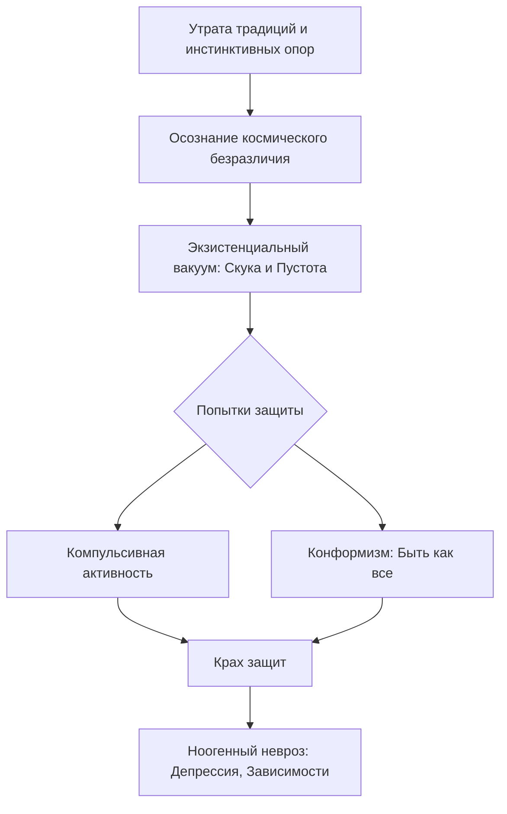
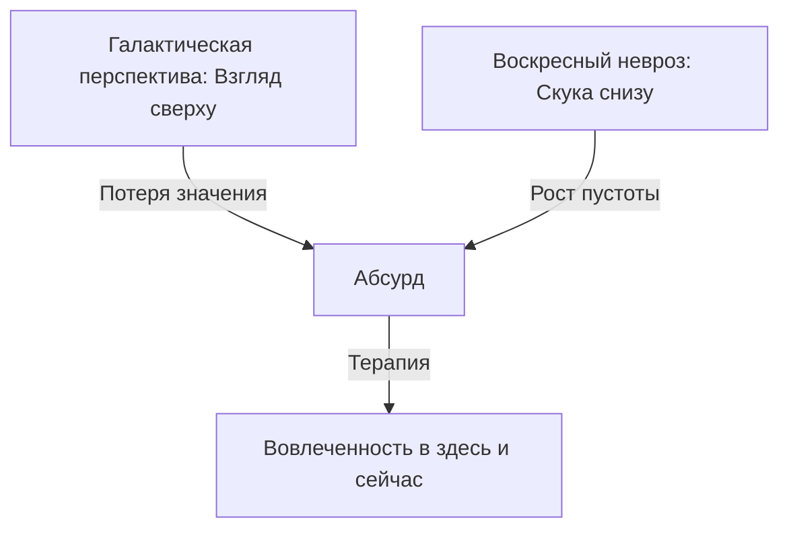

Бывало ли у вас чувство, что все ваши ежедневные дела лишены глубокого значения, а жизнь похожа на бег в колесе без видимой цели? В моменты тишины или после достижения крупных успехов человек часто сталкивается с пугающим вопросом «зачем?». Кажется, что мы лишь крошечные песчинки в равнодушной вселенной, и это осознание может привести к парализующему ощущению пустоты.

Экзистенциальный анализ помогает людям, которые столкнулись с кризисом бессмысленности и потерей жизненных ориентиров. Данный подход рассматривает отсутствие предначертанного плана жизни как одну из неизбежных данностей нашего существования. Понимание того, как устроен этот конфликт, позволяет человеку перестать искать готовые ответы и начать самостоятельно конструировать свою уникальную и наполненную жизнь *(Ялом, 2020)*.

### Панорама бессмысленности: Конфликт человека и равнодушной вселенной

Бессмысленность — это четвертая конечная данность нашего существования. Она представляет собой фундаментальную дилемму. Человек по своей природе является существом, которое везде ищет смысл. Однако мы заброшены в абсолютно равнодушную вселенную. В этом мире изначально нет объективного замысла или заранее написанного для нас сценария *(Ялом, 2020)*.

Смысл выполняет важнейшую организующую функцию для нашей психики. Он позволяет человеку объединять хаотичные события в понятные шаблоны. Это дает нам ощущение контроля над реальностью и избавляет от тяжелых переживаний. На основе смысла строятся ценности. Это наши внутренние законы, которые помогают понять, как следует жить в этом мире *(Ялом, 2020)*.

Если человек утрачивает систему смыслов, он проваливается в состояние «остановки жизни». Возникает глубокая апатия и паралич воли. Без ответа на вопрос «зачем?» становится невозможно принимать даже простые повседневные решения и двигаться вперед *(Ялом, 2020)*. Мы отчаянно нуждаемся в абсолютных идеалах, но вынуждены признать, что единственным абсолютным фактом является их отсутствие. Индивид должен сам стать творцом своего жизненного замысла *(Ялом, 2020)*.

### Архитектура смыслоутраты: Путь к экзистенциальному вакууму

Фундаментом этого кризиса является концепция свободы и отсутствия почвы под ногами. Человек сам создает свой мир. Если нет внешнего высшего плана, то ничто не имеет значения, кроме того значения, которое порождаем мы сами *(Ялом, 2020)*.

Современный человек часто теряет опору на традиции и инстинкты. Это приводит к осознанию космического безразличия мира. В результате возникает **экзистенциальный вакуум**. Это состояние внутренней пустоты и скуки *(Франкл, 1990)*. Сначала люди пытаются защититься от него через суету или попытки быть «как все». Если эти защиты рушатся, развивается **ноогенный невроз**. Это духовный кризис, который проявляется через депрессию, зависимости или агрессию *(Ялом, 2020)*.

### Категории смыслов: Космический и Земной уровни

Для того чтобы разобраться в своих ориентирах, важно разделять два типа смыслов. Они помогают человеку по-разному смотреть на свою роль в мире *(Ялом, 2020)*.

* **Космический смысл** связан с верой в духовное упорядочивание вселенной. Человек верит, что ему предначертана определенная роль в Божественном или магическом плане *(Ялом, 2020)*.
* **Земной смысл** — это личные цели человека. Они оправдывают жизнь в настоящем моменте. К ним относятся творчество, альтруизм (помощь другим) и самоактуализация (реализация своих талантов) *(Ялом, 2020)*.

### Векторы осмысления: Галактическая перспектива против вовлеченности

Проблема бессмысленности рассматривается в терапии с двух сторон. Эти векторы помогают человеку соединить философские размышления с реальностью дня.

#### Движение сверху вниз: От центра туманности к жизни
На этом уровне наш разум способен отстраниться от реальности. Человек смотрит на свою жизнь с «галактической перспективы». С точки зрения бесконечной вселенной и распада звезд все человеческие дела кажутся микроскопическими и абсурдными *(Ялом, 2020)*. Однако терапия возвращает нас на землю. Философский факт о безразличии космоса не отменяет того, что «здесь и сейчас» отношения, любовь и творчество имеют для нас огромное значение. Этого достаточно для полноценной жизни *(Ялом, 2020)*.

#### Движение снизу вверх: От скуки выходного дня к кризису
Часто человек замечает проблему через «воскресный невроз». Когда рабочая рутина исчезает, человек вдруг обнаруживает, что ему нечего желать и не к чему стремиться *(Франкл, 1990)*. Из этого локального опыта скуки вырастает глобальное осознание. Человек понимает, что его жизнь превратилась в автоматический конвейер. Это осознание без цели может привести к тяжелой депрессии *(Ялом, 2020)*.

### Пять столпов исследования бессмысленности

Работа с этой данностью требует глубокого понимания механизмов психики. Мы можем выделить пять опорных пунктов в изучении этого вопроса *(Ялом, 2020)*.

1. **Конечная цель:** Психотерапия помогает человеку выйти из парализующего отчаяния. Задача — восстановить способность к активному участию в жизни. Это спасает личность от разрушительного нигилизма *(Ялом, 2020)*.
2. **Суть и границы:** Это самостоятельный духовный кризис. Он порожден столкновением разумного человека с миром, где нет готовых инструкций *(Франкл, 1990)*. Это не симптом подавленных инстинктов, как считал старый психоанализ *(Ялом, 2020)*.
3. **Обоснование:** Почему смысл нельзя найти через логику? Смысл ускользает, если искать его слишком рационально. Он является побочным продуктом нашей преданности делу или любви к другому человеку *(Ялом, 2020)*.
4. **Механизм:** Исцеление происходит через **вовлеченность**. Это термин, означающий страстное погружение в поток жизни *(Ялом, 2020)*. Когда человек полностью отдается процессу (например, воспитывает ребенка или пишет картину), вопрос о смысле вселенной теряет свою болезненную остроту и исчезает *(Ялом, 2020)*.
5. **Искажения:** Если человек не справляется с пустотой, могут возникнуть патологические формы поведения. **Крусадерство** — это бессмысленная суета ради самой суеты. **Нигилизм** — это злобное обесценивание смыслов других людей. **Вегетативность** — крайняя степень безразличия ко всему *(Ялом, 2020)*.

### Клиническая реальность: Примеры поиска смысла

Экзистенциальная терапия опирается на реальный опыт преодоления кризисов. Эти примеры показывают, как осознание бессмысленности меняет жизнь.

> **Кризис Льва Толстого:** В возрасте 50 лет великий писатель пережил тяжелую «остановку жизни». Он осознал, что смерть уничтожит все его труды, и не мог найти рационального оправдания своему существованию. Только отказ от логических поисков в пользу непосредственной жизни помог ему справиться с отчаянием *(Ялом, 2020)*.

Виктор Франкл подчеркивал важность смысла даже в экстремальных условиях. В концлагерях выживали те, кто находил смысл в своем страдании или верил в будущее. Те, кто терял веру, быстро угасали и умирали в течение короткого времени *(Франкл, 1990)*.

Альбер Камю описывал мир как безразличный к человеку «абсурд». Он считал, что ответом на это должен быть бунт и созидание своих собственных, светских смыслов. К ним относятся солидарность, смелость и любовь *(Ялом, 2020)*.

### Вывод и литература

Бессмысленность — это не приговор, а вызов нашему творческому потенциалу. Человек является существом, которое само наделяет этот мир значением. Когда мы перестаем спрашивать у жизни, в чем её смысл, и начинаем сами отвечать на её вызовы своими действиями, мы обретаем витальность. Исцеление наступает не через философские ответы, а через тотальную вовлеченность в процесс самой жизни.

**Литература:**
- Франкл, В. (1990). *Сказать жизни «Да!»: Психолог в концлагере*.
- Франкл, В. (1990). *Человек в поисках смысла*.
- Ялом, И. (2020). *Экзистенциальная психотерапия*.
- Ялом, И. (2020). *Лечение от любви и другие психотерапевтические новеллы*.

---

### Проверка понимания

**Микро-кейс для практики:**
Представьте человека по имени Андрей. Он успешный программист, но в последнее время чувствует себя « счастливым идиотом, который таскает кирпичи из одного конца поля в другой». Он начал задумываться о «галактической перспективе» и пришел к выводу, что через сто лет никто не вспомнит его код, а значит, работа не имеет смысла. Андрей стал апатичным и почти перестал выходить из дома.

**Задания:**
1. К какому патологическому состоянию (по С. Мадди) склоняется Андрей, если он потерял интерес ко всему и перестал действовать? *(Ялом, 2020)*.
2. Используя механизм **вовлеченности**, какой совет вы бы дали Андрею, чтобы помочь ему справиться с параличом воли? *(Ялом, 2020)*.
3. Объясните Андрею разницу между «рациональным поиском смысла» и «смыслом как побочным продуктом», опираясь на теорию Ирвина Ялома? *(Ялом, 2020)*.
