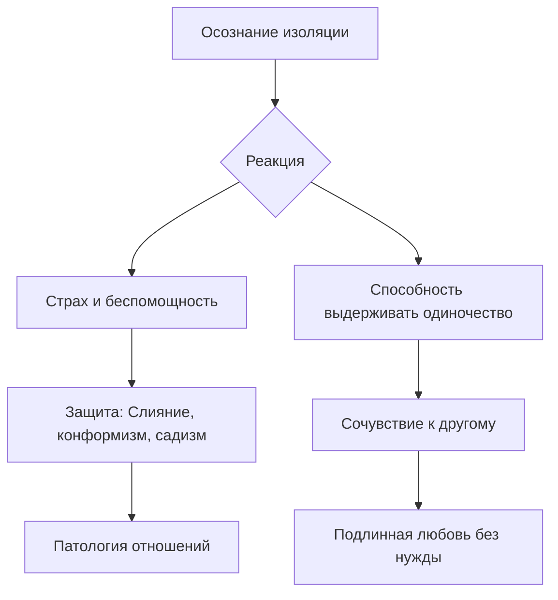

Бывали ли вы на шумной вечеринке, чувствуя себя при этом бесконечно одиноким? Иногда мы окружены людьми, но внутри сохраняется странное ощущение пропасти, которую не может заполнить ни одно знакомство. Кажется, что никто и никогда не сможет по-настоящему понять наш внутренний мир до конца.

Экзистенциальная изоляция — это непреодолимая пропасть между человеком и миром. Она помогает нам осознать, что каждый из нас приходит в этот мир один и так же в одиночестве покидает его *(Ялом, 2020)*. Понимание этой данности — не повод для отчаяния, а фундамент для построения честных и зрелых отношений с окружающими *(Ялом, 2020)*.

### Три лика одиночества: От нехватки навыков до бездны бытия

Ирвин Ялом выделяет три типа изоляции, чтобы помочь нам разобраться в природе наших чувств *(Ялом, 2020)*.

Межличностная изоляция — это социальное одиночество. Оно возникает из-за отсутствия навыков общения, географической удаленности или конфликтов с окружающими *(Ялом, 2020)*. В этом случае человек страдает от нехватки контактов *(Ялом, 2020)*.

Внутриличностная изоляция — это состояние разрыва с самим собой. Она возникает, когда человек отщепляет части своей психики, подавляет чувства или желания *(Ялом, 2020)*. Личность словно теряет контакт с собственной душой *(Ялом, 2020)*.

Экзистенциальная изоляция — это фундаментальная отделенность человека от мира. Она сохраняется даже при наличии идеального общения и полной внутренней гармонии *(Ялом, 2020)*. Это осознание того, что никто не может прожить нашу жизнь за нас или полностью разделить наш опыт *(Ялом, 2020)*.

### Бегство от пустоты: Механизмы защиты и размытие границ

Поскольку встреча с бездной одиночества пугает, психика изобретает способы защиты *(Ялом, 2020)*. Самый распространенный из них — **слияние**. Это процесс размытия границ собственного «Я» ради иллюзии безопасности в другом человеке или группе *(Ялом, 2020)*.

Люди часто используют близких как «щит» от экзистенциального ужаса *(Ялом, 2020)*. Например, пациентка Луиза настолько подстраивалась под нужды других, что перестала понимать, существует ли она вообще вне чужих потребностей *(Бьюдженталь, 2020)*. Другие могут защищаться через гнев *(Бьюдженталь, 2020)*. Пациент Фрэнк выстроил вокруг себя стену ярости, чтобы защититься от страха раствориться в других людях *(Бьюдженталь, 2020)*. В итоге он оказался в мучительном одиночестве *(Бьюдженталь, 2020)*.

*(Ялом, 2020)*

### Путь к исцелению: Почему одиночество необходимо для любви

Парадокс заключается в том, что способность быть одному является условием способности любить *(Ялом, 2020)*. Только тот, кто может выдержать свою изоляцию, строит отношения роста, а не выживания *(Ялом, 2020)*.

В терапии пациент сначала выстраивает глубокую связь со специалистом *(Ялом, 2020)*. Укрепившись этой встречей, он возвращается к переживанию своей изоляции, но уже без паники *(Ялом, 2020)*. Он принимает личную ответственность за свое одиночество и перестает требовать от партнера невозможного — спасения от самого факта бытия *(Ялом, 2020)*. Когда мы принимаем свою раздельность, мы начинаем ценить уникальность другого человека, а не использовать его как инструмент против страха *(Ялом, 2020)*.

> Человеческое существование предстает как вечный парадокс: каждый из нас одновременно неразрывно связан с другими людьми и абсолютно, навсегда отделен от них *(Бьюдженталь, 2020)*.

### Вывод и литература

Экзистенциальная изоляция — это неизбежная часть нашей жизни. Конфронтация с ней необходима для того, чтобы разрушить иллюзорные защиты и выстроить подлинные отношения *(Ялом, 2020)*. Только приняв бездну одиночества как данность, мы перестаем использовать других людей для заполнения внутренней пустоты *(Ялом, 2020)*. Признание своей отделенности — это первый шаг к способности опираться на самого себя *(Ялом, 2020)*.

**Литература:**
* Бьюдженталь, Дж. (2020). *Наука быть живым. Диалоги между терапевтом и пациентами*.
* Ялом, И. (2020). *Экзистенциальная психотерапия*.
* Ялом, И. (2020). *Лечение от любви и другие психотерапевтические новеллы*.

---

### Проверка понимания

**Микро-кейс для практики:**
Пациентка с паническими атаками описывает свои отношения с партнером следующим образом: «Когда мы вместе, всё остальное в мире мистическим образом исчезает. За исключением него, нет больше никого, и я чувствую себя живой только рядом с ним» *(Ялом, 2020)*. При угрозе расставания она испытывает непереносимый ужас и готова на любые унижения, лишь бы не оставаться одной *(Ялом, 2020)*.

**Задание:**
1. Какой защитный механизм психики здесь проявляется в ответ на страх экзистенциальной изоляции? *(Ялом, 2020)*.
2. Почему такая форма отношений, согласно Ирвину Ялому, мешает подлинной любви и познанию другого человека? *(Ялом, 2020)*.
3. Какое немедленное микро-действие (из техник, предложенных в материалах) могло бы помочь этой пациентке начать формировать способность опираться на собственное одиночество? *(Ялом, 2020)*.
