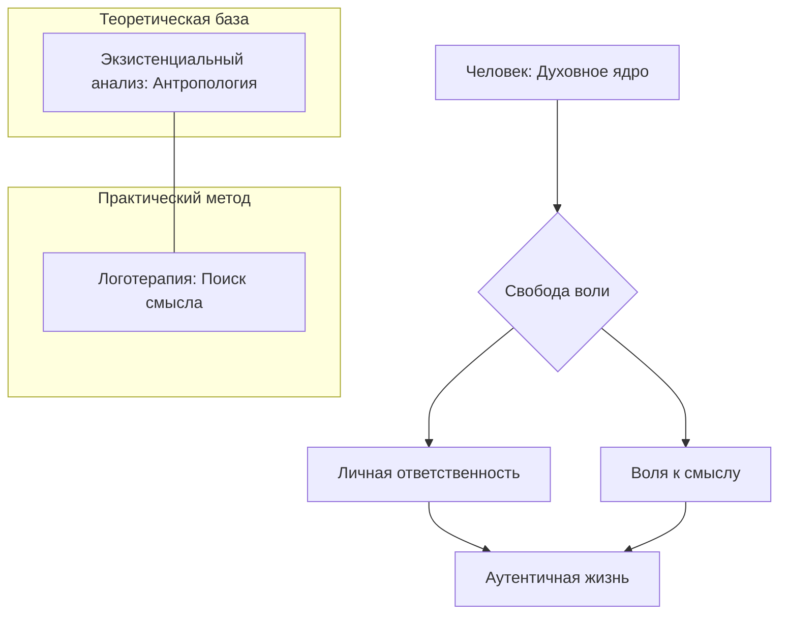
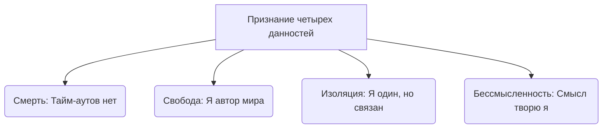

Бывало ли у вас чувство, что вы — лишь винтик в огромном механизме, а ваша жизнь движется по инерции? В моменты кризиса человек часто ощущает потерю связи с самим собой, словно он перестал быть хозяином собственной судьбы. Кажется, что мы стали пассивными жертвами прошлого или заложниками обстоятельств, над которыми у нас нет власти.

Экзистенциальный анализ — это направление психотерапии. Оно помогает людям, которым кажется, что они потеряли ориентиры или живут по чужому сценарию. Этот подход возвращает человеку авторство его судьбы и позволяет проживать каждый день с глубоким внутренним ощущением того, что ему нравится его деятельность. В этой статье мы изучим, как философская мудрость превращается в инструмент исцеления души и помогает найти опору в равнодушном мире.

### Суть и границы: Возвращение человечности в психологию

Экзистенциальный анализ стоит на страже человеческой свободы и уникальности. Без этого подхода психология рискует рассматривать человека лишь как биологический механизм или пассивную жертву инстинктов и детских травм. Такое упрощение полностью игнорирует духовную свободу и волю личности к обретению смысла.

С высоты птичьего полета экзистенциальный анализ предстает как единое мировоззренческое пространство. Здесь глубокая философская база о трагизме и величии человека сливается с практической клинической психологией. Ключевыми понятиями здесь выступают **свобода воли**, личная ответственность и четыре экзистенциальные данности: смерть, свобода, изоляция и бессмысленность. Эти факторы являются универсальными и неизбежными для каждого человека.

### Архитектура концепции: Философские корни и клинический метод

Краеугольным камнем подхода является **свобода воли**. Это способность человека занять осознанную духовную позицию по отношению к любым обстоятельствам. Если убрать свободу, рушится вся концепция личной ответственности и поиска смысла.

Виктор Франкл выделил две неразрывные части этого учения:
* **Экзистенциальный анализ** выступает как антропологическая теория. Она исследует саму сущность человека и отвечает на вопрос о том, что значит быть человеком.
* **Логотерапия** представляет собой метод терапевтического лечения. Он центрирован на поиске смысла и отвечает на вопрос о том, как именно помочь пациенту.

Логотерапия — это метод поиска смысла. Он помогает людям справиться с чувством апатии и внутренней пустоты. Терапевт в этом процессе выступает не как нейтральное зеркало, а как «катализатор», который помогает пациенту активировать его духовные силы.

### Универсальная матрица бытия: Четыре данности Ирвина Ялома

Концепция четырех данностей — это система неизбежных факторов существования. К ним относятся смерть, свобода, изоляция и бессмысленность. Конфронтация с ними составляет основу психического развития каждого человека.

Человеческая жизнь предстает как напряжение между двумя полюсами. С одной стороны, мы пытаемся выстроить иллюзорные защиты от ужаса небытия. С другой стороны, пограничные ситуации заставляют эти защиты рушиться, возвращая нам чувство абсолютной реальности. Если человек полностью вытесняет эти данности, терапия остается на уровне поверхностного лечения симптомов.

### Архитектура тревоги: Смерть как стимул к жизни

**Смерть** является центральной осью всей экзистенциальной динамики. Она выступает первичным источником тревоги, который всегда присутствует на краю нашего сознания. Без признания перспективы конца жизнь может обесцениться и стать мелкой игрой без ставок.

Физически смерть разрушает человека, но сама идея смерти спасает его *(Yalom, 2020)*. Конфронтация с конечностью времени напоминает, что тайм-аутов не бывает. Смерть выступает как **пограничная ситуация**. Она вытряхивает человека из банальности повседневности и заставляет его действовать аутентично. Например, пациенты с тяжелыми заболеваниями часто начинают острее ценить чудо жизни и находят мужество сделать то, что откладывали годами *(Yalom, 2020)*.

### Свобода и ответственность: Бремя отсутствия почвы

**Свобода** в экзистенциальном смысле означает отсутствие внешней структуры. В этой зоне человек сталкивается с пугающей «беспочвенностью», так как в мире нет заранее заданных гарантий. Человек является единственным творцом своего мира и его смыслов.

Принятие этого абсолютного авторства порождает тревогу. Часто люди бегут от свободы в конформизм или ищут «конечного спасителя». Психопатология возникает не из-за инстинктов, а как результат неэффективных защит от ужаса перед свободой. Терапия помогает человеку принять ответственность за свои поступки и перестать винить обстоятельства или прошлые травмы *(Yalom, 2020)*.

### Фундаментальная пропасть: Экзистенциальная изоляция

Экзистенциальная изоляция — это непреодолимая пропасть между индивидом и миром. Это осознание того факта, что мы приходим во вселенную одни и так же должны ее покинуть *(Yalom, 2020)*. Мы одновременно связаны с другими людьми и абсолютно отделены от них *(Bugental, 2020)*.

Люди часто панически бегут от этого одиночества. Они пытаются растворить свою идентичность в толпе или используют близких для подтверждения факта своей жизни.
* **Слияние:** размытие границ своего «Я» ради иллюзии безопасности *(Yalom, 2020)*.
* **Патологические отношения:** превращение партнера в инструмент для заполнения внутренней пустоты.

Конфронтация с изоляцией необходима для построения зрелых отношений, основанных на любви, а не на нужде. Способность быть в одиночестве является обязательным условием способности любить *(Yalom, 2020)*.

### Бессмысленность: От космической пустоты к вовлеченности

Бессмысленность — это четвертая данность экзистенции. Человек биологически нуждается в смысле, но оказывается в равнодушной вселенной, лишенной объективного замысла *(Yalom, 2020)*. Смысл помогает нам структурировать хаос и дает ощущение контроля над жизнью.

Утрата системы смыслов приводит к **экзистенциальному вакууму**. Это состояние проявляется через апатию и скуку *(Frankl, 1990)*. Одной из форм защиты является **нигилизм**. Это злобное обесценивание смыслов, в которые верят другие люди.

Исцеление происходит через механизм **вовлеченности**. Это процесс страстного погружения в реку жизни. Когда человек всем сердцем отдается творчеству, любви или делу, вопрос о глобальном смысле вселенной теряет свою болезненную остроту и исчезает *(Yalom, 2020)*.

### Механизм исцеления: Самодистанцирование и Самотрансценденция

Процесс изменений опирается на две уникальные способности человеческого духа.
* **Самодистанцирование** — это умение человека взглянуть на себя со стороны. Оно позволяет занять позицию по отношению к своим страхам, настроениям и симптомам.
* **Самотрансценденция** — это способность выйти за пределы своего «Я». Человек направляет внимание на другого человека или на смысл, который нужно воплотить в мире.

Терапевт помогает пациенту активировать эти способности через диалог. Важно, чтобы решение и обязательство действовать предшествовали абстрактному знанию *(May, 1958)*. Только так человек переходит из позиции «пассивного исполнителя» в роль «ответственного автора».

### Вывод и литература

Экзистенциальный анализ и логотерапия напоминают нам, что человек не является марионеткой обстоятельств. Принятие четырех данностей бытия — смерти, свободы, изоляции и бессмысленности — открывает путь к подлинному существованию. Физическая смерть разрушает нас, но осознание её неизбежности спасает нашу жизнь, возвращая ей вкус и смысл. Настоящая свобода начинается там, где заканчиваются оправдания и рождается личная ответственность за каждый прожитый миг.

**Литература:**
* Бьюдженталь, Дж. (2020). *Наука быть живым. Диалоги между терапевтом и пациентами*.
* Лукас, Э. (2019). *Учебник логотерапии. Представление о человеке и методы*.
* Молчанов, С. В. (2026). *Введение в экзистенциальный анализ. Лекции 1 и 2*.
* Мэй, Р. (1958). *Экзистенциальная психология*.
* Франкл, В. (1990). *Человек в поисках смысла*.
* Ялом, И. (2020). *Экзистенциальная психотерапия*.

---

### Проверка понимания

**Микро-кейс для практики:**
Клиент Андрей, 50 лет, переживает тяжелый кризис. Он говорит: «Я всю жизнь строил карьеру и обеспечивал семью. Теперь дети выросли, а я понял, что через 100 лет никто не вспомнит мой код или мои отчеты. Все мои труды уничтожит смерть. Какой смысл в этой суете, если мы все равно исчезнем в холодной вселенной?». Андрей перестал выходить на связь с друзьями и проводит выходные, глядя в потолок.

**Задания:**
1. Какие две конечные данности бытия по Ирвину Ялому столкнулись в конфликте Андрея?
2. Андрей склоняется к состоянию, которое С. Мадди называет **вегетативностью** (крайняя апатия). Какой механизм, согласно экзистенциальному анализу, поможет ему выйти из этого состояния: рациональный поиск логического ответа или «вовлеченность»? Объясните почему.
3. Используя понятие «галактической перспективы», объясните Андрею, почему его философский вывод об отсутствии космического смысла не должен мешать ему находить смысл в сегодняшнем дне.
4. Сформулируйте один вопрос для Андрея в технике «падающей стрелы», который поможет ему спуститься от абстрактных рассуждений о вселенной к его личному «свободному пространству» ответственности.
