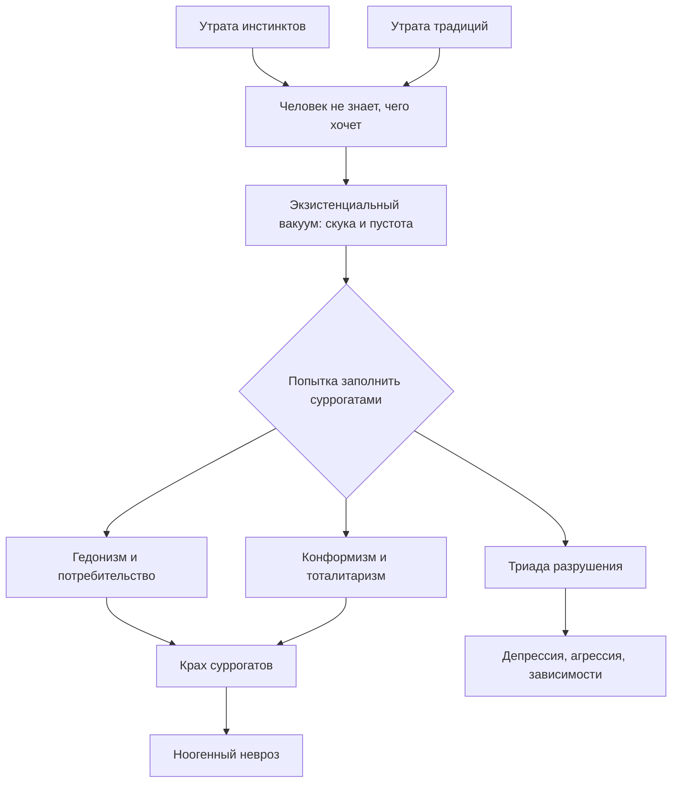

Человек приходит домой после работы. Квартира, зарплата, здоровье — всё на месте. Но внутри пусто. Скроллинг ленты не помогает. Покупки радуют на час. Алкоголь приносит короткое забытьё. Это ощущение хронической пустоты при внешнем благополучии психологи называют **экзистенциальным вакуумом** *(Франкл, 1990)*.

Виктор Франкл показал: вакуум — не просто скука. Без лечения он перерастает в клиническое расстройство и питает три разрушительных эпидемии — депрессию, агрессию и зависимости *(Франкл, 1990)*.

### Двойная утрата: почему человек остался без ориентиров

Человечество пережило два удара. Первый — эволюционный: люди утратили животные инстинкты, которые автоматически диктовали безопасное поведение. Второй — исторический: в эпоху индустриализации рухнули строгие религиозные и социальные традиции, которые веками подсказывали, как *следует* жить *(Франкл, 1990)*.

Результат — парадокс изобилия. Общество дало людям средства для жизни, но забрало то, ради чего стоит жить. Человек больше не знает, что он *должен* делать, и постепенно забывает, чего он *хочет* *(Франкл, 1990; Лукас, 2019)*.

### Воля к смыслу: главный двигатель, который заглох

Франкл определил **волю к смыслу** как главную мотивирующую силу человека. Люди нуждаются не в расслаблении, а в здоровом напряжении между тем, кто они есть, и тем смыслом, который они должны осуществить. Это напряжение Франкл назвал **ноодинамикой** *(Франкл, 1990)*.

Когда воля к смыслу фрустрируется, система рушится. Человек попадает в состояние перманентной скуки и апатии — экзистенциальный вакуум. Вакуум сам по себе — не болезнь. Он доказывает человечность: только духовное существо способно задаваться вопросом «зачем я живу?». Но если вакуум запустить, он перерастает в **ноогенный невроз** — расстройство, коренящееся не в психологических комплексах, а в духовной фрустрации *(Франкл, 1990; Лукас, 2019)*.

> Ноогенный невроз нельзя лечить транквилизаторами. Он требует логотерапии — переориентации человека на его уникальные жизненные задачи *(Франкл, 1990)*.

### Суррогаты смысла: три ложных пути из пустоты

Пустота требует заполнения. Не находя подлинного смысла, человек хватается за суррогаты *(Франкл, 1990)*.

| Суррогат | Механизм | Проявление |
|---|---|---|
| **Гедонизм и потребительство** | Воля к смыслу подменяется волей к удовольствию | Безутешная охота за ощущениями и покупками |
| **Конформизм и тоталитаризм** | Воля к смыслу подменяется волей к власти | Человек делает то, что делают другие, или то, что приказывают |
| **Триада разрушения** | Прямое выражение фрустрации | Наркомания, немотивированная агрессия, депрессия вплоть до суицида |

Суррогаты не работают в силу парадокса: удовольствие ускользает тем быстрее, чем активнее человек за ним гонится. Когда смысл жизни подменяется «комфортным самочувствием», человек становится пресыщенным, но глубоко несчастным *(Лукас, 2019)*.

### Воскресный невроз: репетиция вакуума

Франкл описал характерный феномен — **воскресный невроз**. Всю неделю человек напряжённо работает, спасаясь от мыслей о себе в рутине. Наступают выходные. Суета стихает. В воскресенье утром он внезапно ощущает абсолютную бессодержательность своей жизни — ему нечего хотеть и не к чему стремиться *(Франкл, 1990)*.

Этот микро-симптом приоткрывает завесу над глобальной проблемой: человек осознаёт себя шестерёнкой в бессмысленном конвейере. Если воскресную скуку не «лечить» обретением смысла, из неё со временем вырастает клиническая депрессия или алкоголизм *(Франкл, 1990)*.

### Клинические свидетельства: от концлагерей до наркомании

Связь между потерей смысла и разрушением подтверждена клинически *(Франкл, 1990)*.

**Наркомания и алкоголизм.** Исследования А. фон Форстмайер показали: 90% обследованных хронических алкоголиков страдали глубоким чувством бессмысленности. В исследованиях С. Криппнера среди наркоманов этот показатель составил 100% — все признавались, что «всё бессмысленно» *(Франкл, 1990)*.

**Капитуляция перед смертью.** Франкл описал феномен из концентрационных лагерей. Когда узник окончательно терял веру в будущее и смысл, он впадал в тотальную апатию. Однажды утром он просто отказывался вставать с нар. Ни угрозы, ни побои не помогали. Он доставал спрятанную сигарету и закуривал — менял жизнь на сиюминутное удовольствие. После этого умирал в течение 48 часов *(Франкл, 1990)*.

**Суициды от пресыщения.** Элизабет Лукас описала случаи молодых людей, покончивших с собой не от нужды, а от духовного вакуума. Школьник бросился под поезд, несмотря на отличные оценки, потому что видел после школы лишь «тупик». Двадцатилетняя девушка отравилась выхлопными газами, так как «не знала, что делать с собой и своей жизнью» *(Лукас, 2019)*.

**Агрессия и смысл.** В эксперименте К. Шериф агрессия между группами подростков прекратилась только тогда, когда им пришлось объединиться ради общей осмысленной цели — совместного вытаскивания застрявшей повозки с едой *(Франкл, 1990)*.

### Практика: встреча с пустотой

Организуйте для себя пятиминутную искусственную депривацию.

1. Сядьте в тихом месте. Отключите телефон, музыку, телевизор и любой фоновый шум.
2. Поставьте таймер на 5 минут. Просто сидите, не планируя дела и не анализируя прошлое.
3. Отследите момент, когда у вас возникнет острый зуд схватить смартфон, съесть сладкое или кому-то позвонить.
4. Осознайте этот импульс не как «скуку», а как автоматическую попытку вашей психики сбежать от вакуума в суррогатные удовольствия.

Умение выдержать эту тишину — первый шаг к тому, чтобы услышать подлинный зов ваших смыслов *(Франкл, 1990)*.

### Заключение и Литература

Экзистенциальный вакуум — не каприз и не лень. Это закономерный результат двойной утраты: инстинктов и традиций. Заполнить вакуум суррогатами невозможно — они лишь маскируют пустоту и ведут к ноогенному неврозу. Путь к выздоровлению лежит через осознание вакуума и обретение подлинного смысла — через творчество, любовь или мужественную позицию перед лицом неизбежного *(Франкл, 1990)*.

**Список литературы:**
* Лукас, Э. (2019). *Источники осознанной жизни. Преврати проблемы в ресурсы*. Москва: Никея.
* Лукас, Э. (2019). *Учебник логотерапии. Представление о человеке и методы*. Москва: Московский институт психоанализа.
* Франкл, В. (1990). *Сказать жизни да. Психолог в концлагере*. Москва: Прогресс.
* Франкл, В. (1990). *Человек в поисках смысла*. Москва: Прогресс.
* Ялом, И. (2020). *Экзистенциальная психотерапия*. Москва: Класс.

---

**Микро-кейс для практики**

Успешный маркетолог, 35 лет, получает высокую зарплату и живёт в комфортной квартире. Однако каждые выходные он испытывает необъяснимую тоску, скупает ненужную электронику и выпивает по бутылке вина за вечер. В понедельник на работе тоска отступает. Он не понимает, что с ним происходит, и обращается к психотерапевту с жалобой на «необъяснимую депрессию».

**Вопрос:** Используя понятия «экзистенциальный вакуум», «воскресный невроз» и «суррогаты смысла», объясните механизм страдания этого человека. Почему шопинг и алкоголь не устраняют пустоту? Какую ошибку совершит психотерапевт, если сведёт проблему маркетолога к «подавленному либидо» или «химическому дисбалансу мозга»?
