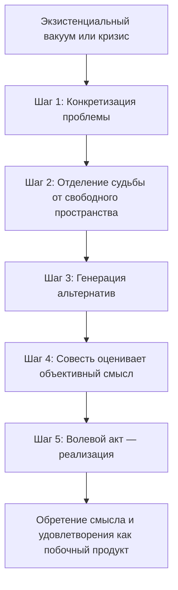

Человек сидит в выходной на диване. Ему ничего не хочется. Нет энергии, нет целей, нет интереса. Он ждёт, пока «появится вдохновение» или «вернётся желание жить». Логотерапия предупреждает: вдохновение не придёт само. Удовлетворение и радость почти никогда не предшествуют осмысленному действию — они являются его *побочным продуктом* *(Франкл, 1990)*.

Элизабет Лукас разработала **тренинг сенсибилизации смысла** — пошаговый алгоритм, который выводит человека из пустоты через конкретные действия, не дожидаясь вдохновения *(Лукас, 2019)*.

### Коперниковский переворот: жизнь спрашивает — вы отвечаете

Франкл предложил радикально изменить позицию: перестать спрашивать «Чего я хочу от жизни?» и начать отвечать на вопрос «Чего жизнь прямо сейчас требует от меня?». Это он назвал **коперниковским переворотом** *(Франкл, 1990)*.

Тренинг Лукас превращает этот философский принцип в конкретный инструмент повседневного применения. Его задача — «настроить» совесть человека как орган улавливания смысла, чтобы вернуть ему способность выступать автором своей жизни *(Лукас, 2019)*.

### Пять шагов: от проблемы к волевому акту

Алгоритм разворачивается в строгой последовательности. Каждый шаг выполняет свою функцию, и пропуск любого из них обрушивает всю конструкцию *(Лукас, 2019)*.

| Шаг | Вопрос | Функция |
|---|---|---|
| **1. Проблема** | В чём моя проблема? | Конкретизация тревоги, возвращение контроля |
| **2. Свободное пространство** | Где я свободен? | Разделение судьбы и свободы |
| **3. Альтернативы** | Какие варианты у меня есть? | Взлом туннельного мышления |
| **4. Совесть** | Что имеет наибольший смысл? | Ценностная оценка через «орган смысла» |
| **5. Воля** | Именно это я хочу осуществить! | Волевой акт, реализация без ожидания вдохновения |

**Шаг 1: «В чём моя проблема?»** Пока тревога остаётся смутной, к ней невозможно занять духовную позицию. Обозначение проблемы одним предложением возвращает человеку контроль *(Лукас, 2019)*.

**Шаг 2: «Где моё свободное пространство?»** Проблема жёстко разделяется на «данность судьбы» (то, что невозможно изменить) и «свободное пространство» (то, что подвластно человеку). Даже у парализованного человека остаётся свободное пространство — например, возможность поехать на прогулку в инвалидном кресле *(Лукас, 2019)*.

**Шаг 3: «Какие возможности выбора у меня есть?»** Фантазия генерирует все возможные варианты. Варианты пока не оцениваются на реалистичность — можно лежать в кровати, можно выпрыгнуть из окна, можно написать письмо. Этот шаг взламывает невротическую уверенность в том, что «выхода нет» *(Лукас, 2019)*.

**Шаг 4: «Какая из возможностей имеет наибольший смысл?»** На сцену выходит совесть — **орган смысла**. Она выявляет среди всех альтернатив ту, которая является объективным требованием момента. На этом этапе не учитывается, *хочется* ли пациенту это делать. Учитывается лишь объективная ценность действия *(Лукас, 2019)*.

**Шаг 5: «Именно это я хочу осуществить!»** Решающий экзистенциальный шаг. Внутреннее «Да будет так!». Человек приступает к действию вопреки отсутствию мотивации *(Лукас, 2019)*.

### Три фазы: от анализа к экзистенциальному акту

Весь процесс делится на три фазы *(Лукас, 2019)*.

**Аналитическая фаза (Шаги 1–2).** Инвентаризация реальности, отделение зёрен свободы от плевел судьбы.

**Эвристическая фаза (Шаги 3–4).** Расширение горизонта возможностей и ценностная оценка.

**Экзистенциальная фаза (Шаг 5).** Акт самотрансценденции — превращение потенциального в актуальное через волю.

> Лукас предостерегает: нельзя выдумывать смысл ради удобства. Это равносильно тому, чтобы вместо открытия жалюзи навстречу реальному солнцу нарисовать на полу жёлтые пятна краской и пытаться в них согреться. Смысл всегда транссубъективен — он ждёт нас во внешнем мире *(Лукас, 2019)*.

### Клинические свидетельства: от воскресной скуки к триумфу воли

**Спасение «воскресного невротика».** Лукас описала классический случай. Пациент всю неделю работает, а в субботу проваливается в апатию. **Шаг 1:** проблема — выходные, скука, отсутствие желаний. **Шаг 2:** данность — выходные наступили, желаний нет; свободное пространство — он может физически делать что угодно. **Шаг 3:** альтернативы — спать, курить, пойти в кафе, позвонить маме, написать письмо бывшему коллеге. **Шаг 4:** коллега давно звонил и ждал ответа; написать ему — объективно самое осмысленное. **Шаг 5:** пациент садится за стол без всякого желания. В процессе написания рождается тёплое послание, и тихое чувство довольства заполняет вакуум *(Лукас, 2019)*.

**Ловушка ожидания.** Если человек решает ждать, пока «появится желание» совершить осмысленный поступок, он может прождать всю жизнь. Удовлетворение редко предшествует действию. Иногда нужно начать исключительно потому, что это имеет смысл, — и удовлетворение «подтянется» само *(Франкл, 1990; Лукас, 2019)*.

**Фокус на свободном пространстве.** Больной или ограниченный в возможностях человек часто зациклен на том, что потеряно. Алгоритм жёстко переводит его взгляд на Шаг 2 — фокус на пространстве, которое *осталось*, потому что только там скрыт потенциальный смысл *(Лукас, 2019)*.

### Практика: экзистенциальный аудит тупика

Выберите одну конкретную проблему — конфликт с родственником, задачу, которую вы откладываете, или чувство вечерней скуки. Проведите её через 5 шагов на листе бумаги.

1. **Проблема:** запишите суть в одном предложении без эмоций.
2. **Свободное пространство:** проведите черту. Слева — 2 факта, которые вы *не можете* изменить. Справа — в чём вы *свободны* прямо сейчас.
3. **Альтернативы:** напишите 5 любых возможных действий (включая самые нелепые).
4. **Совесть:** задайте себе вопрос: «Чего эта ситуация требует от меня по совести ради высшего блага?». Обведите один вариант с наибольшим объективным смыслом.
5. **Акт воли:** прямо сейчас, не дожидаясь вдохновения, начните выполнять обведённый пункт хотя бы в течение 5 минут. Отследите, как чувство осмысленности начнёт вытеснять тревогу или скуку *(Лукас, 2019)*.

### Заключение и Литература

Тренинг сенсибилизации смысла по Лукас доказывает: для выхода из вакуума не нужно ждать вдохновения. Нужен конкретный алгоритм — от формулировки проблемы до волевого акта. Совесть безошибочно указывает на действие с наибольшим смыслом, а удовлетворение приходит как побочный продукт реализованного выбора *(Франкл, 1990; Лукас, 2019)*.

**Список литературы:**
* Лукас, Э. (2019). *Источники осознанной жизни. Преврати проблемы в ресурсы*. Москва: Никея.
* Лукас, Э. (2019). *Учебник логотерапии. Представление о человеке и методы*. Москва: Московский институт психоанализа.
* Франкл, В. (1990). *Человек в поисках смысла*. Москва: Прогресс.

---

**Микро-кейс для практики**

Женщина, 50 лет, вышла на пенсию после 25 лет работы учителем. Она просыпается утром и не знает, что делать. Каждый день похож на бесконечный выходной. Она пробует смотреть сериалы, покупать одежду в интернете и спать до обеда, но пустота не уходит. На вопрос психолога «Чего вы хотите?» она отвечает: «Ничего. У меня нет желаний».

**Вопрос:** Проведите ситуацию этой женщины через 5 шагов тренинга Лукас. Определите её «данность судьбы» и «свободное пространство». Объясните, почему сериалы и шопинг не заполняют вакуум, используя метафору «жёлтых пятен». Какое конкретное действие на Шаге 5 могло бы запустить процесс обретения смысла?
