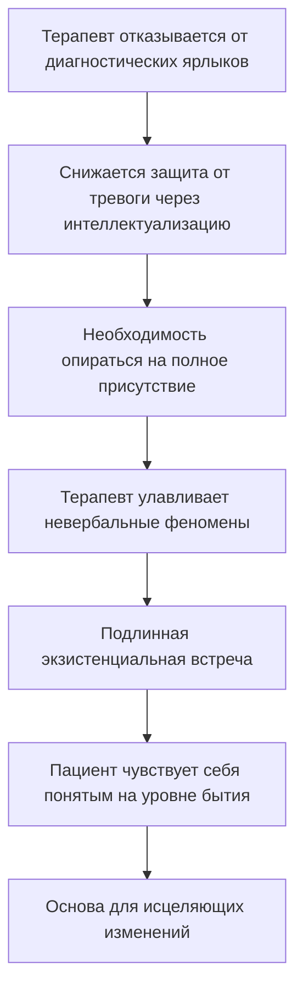

Пациентка садится в кресло и говорит: «Я не могу жить без мужа». Психоаналитик ищет корни в эдипальном комплексе. Когнитивный терапевт фиксирует иррациональное убеждение. Феноменолог делает нечто совершенно иное: он *останавливается*. Он откладывает все теории в сторону и смотрит на то, как обмякло её тело, как затих голос, как она конструирует свой мир прямо сейчас — мир, лишённый для неё собственных смыслов *(Бьюдженталь, 2020; Мэй, 1958)*.

Этот акт называется **Эпохе** (от греч. «воздержание от суждения») — феноменологическая редукция, при которой терапевт «выносит за скобки» все предварительные знания, диагнозы и гипотезы, чтобы увидеть пациента таким, каким он *является* в данную секунду *(Элленбергер, 1958)*.

### Дисциплинированная наивность: мужество не знать

Р. Мак-Леод назвал феноменологическую позицию **«установкой дисциплинированной наивности»** — способностью смотреть на мир глазами пациента, отказавшись от претензии на всезнание *(Мэй, 1958)*.

Это не стирание памяти и не отказ от клинических знаний. Знание патологии и методов предполагается. Но в момент сессии оно переводится в предсознание, чтобы на первый план вышло непосредственное переживание встречи «человека с человеком» *(Бьюдженталь, 2020; Мэй, 1958)*.

> Карл Ясперс предупреждал: «Что мы теряем! Какие возможности понимания мы упускаем, потому что в единственно решающий момент нам, несмотря на все наши знания, не хватило простой силы полного человеческого присутствия!» *(Элленбергер, 1958)*.

### Почему терапевты прячутся за теориями

Терапевты цепляются за диагнозы и методики не из лени, а из страха. **Техники защищают терапевта от собственной экзистенциальной тревоги** *(Мэй, 1958)*.

Встретиться с живым, непредсказуемым, полным трагизма субъективным миром другого — страшно. Намного безопаснее спрятаться за ярлыком «сопротивление», «неразрешённый эдипов комплекс» или «нарциссическое расстройство». Эпохе разоблачает эту психологическую защиту врача, заставляя его рисковать собой в контакте *(Мэй, 1958; Бьюдженталь, 2020)*.

Джеймс Бьюдженталь точно сформулировал проблему: «Слишком долго мы отбрасывали субъективное как эфемерное и малозначащее. В результате мы потеряли точку опоры и были притянуты к мелким гаваням и пустынным берегам безжизненной объективности» *(Бьюдженталь, 2020)*.

### Механизм Эпохе: от диагноза к резонансу

Феноменологическая редукция опирается на субъективность самого терапевта как главный инструмент. Терапевт использует **эмпатийный резонанс**: он постоянно спрашивает себя не «Под какую категорию из учебника попадает эта жалоба?», а «Что прямо сейчас происходит между мной и этим человеком?» *(Бьюдженталь, 2020)*.

Как слова пациента, его дыхание, его поза резонируют во внутреннем опыте терапевта? Терапевт позволяет форме бытия пациента отразиться в собственном сознании *(Мэй, 1958)*.

### Три координаты мира пациента

Когда теории вынесены за скобки, на чём фокусируется терапевт? Генри Элленбергер выделил три координаты для описания субъективного мира пациента *(Элленбергер, 1958)*.

| Координата | Вопрос терапевта | Что она раскрывает |
|---|---|---|
| **Темпоральность** | Как течёт время для этого человека? | Остановлено ли оно (депрессия) или мчится (мания)? |
| **Пространственность** | Как он ощущает мир вокруг? | Тесная клетка или бесконечная пустота без опор? |
| **Причинность** | Как он воспринимает свою способность влиять на мир? | Автор своей жизни или марионетка обстоятельств? |

### «Где Вы?» вместо «Как Вы?»

Ролло Мэй описал свою внутреннюю феноменологическую позицию. Когда пациент садится в кресло, Мэй внутренне спрашивает его не «Как Вы себя чувствуете?» (что приглашает к социальной банальности), а **«Где Вы?»** *(Мэй, 1958)*.

Этот вопрос направлен на постижение феномена: присутствует ли пациент здесь? Сбегает ли от тревоги? Прячется ли за вежливостью? Вопрос позволяет уловить реальность бытия до того, как в дело вступят технические интерпретации *(Мэй, 1958)*.

### Клинические свидетельства: феноменология в действии

**Хрипота как модус бытия.** Пациентка Мэя, миссис Хатчинс, приходила с непрекращающейся истерической хрипотой. Врач знал её историю (авторитарная мать) и результаты тестов. Но вместо поиска причин он применил Эпохе: вслушался в саму хрипоту, в ужас загнанного животного в её глазах. Симптом раскрылся не как поломка нервов, а как модус её бытия-в-мире: «Если я скажу то, что чувствую, я буду отвергнута. Лучше не говорить ничего» *(Мэй, 1958)*.

**Туман вместо присутствия.** Ирвин Ялом описал пациентку, которая постоянно жаловалась на «туманность» внутреннего опыта. Вместо поиска психоаналитических мотивов терапевт совершил Эпохе: он указал, что этот «туман» создаётся её собственным теоретизированием о себе, которым она заменяет подлинное присутствие в моменте *(Ялом, 2020)*.

**Внимание к невербальному.** Фриц Перлз никогда не слушал только содержание (историю пациента). Он брал в скобки сюжет и обращал внимание на то, *как* пациент существует в данную секунду: «Я замечаю, что твои глаза всё время смотрят в сторону. Ты можешь взять на себя ответственность за это?». Он заставлял пациента осознать свой феномен отстранения, а не анализировать его прошлые причины *(Ялом, 2020)*.

**Параллель с Фрейдом.** Элленбергер провёл блестящее сравнение. Фрейд требовал от *пациента* говорить всё без купюр. Феноменологи требуют подобного от *наблюдателя* — воспринимать всё без суждений. Как пациенту мешают сопротивления, так терапевту мешает его непреодолимое желание делать выводы. Задача феноменолога — выдержать неопределённость и дать феномену проявить себя *(Элленбергер, 1958)*.

### Ограничения: когда Эпохе опасно

Если феноменологический подход применяется без строгой клинической базы, он вырождается в «необдуманный эклектизм». Студент, игнорирующий знания о шизофрении или депрессии под прикрытием «экзистенциальной свободы», опасен для пациента *(Мэй, 1958)*.

Феноменология — не повод не изучать клиническую динамику. Это способ *превзойти* её в момент непосредственной встречи *(Мэй, 1958)*.

### Практика: аудит терапевтического резонанса

В ближайшие 30 минут общения — с коллегой, другом или клиентом — примените технику феноменологической редукции.

1. Слушайте собеседника. Как только поймаете себя на мысли «Я знаю, почему он это говорит» — скажите себе мысленно **«СТОП»**.
2. Поместите свой «диагноз» в воображаемые скобки: [он манипулирует]. Отложите его в сторону.
3. Задайте себе внутренний вопрос: **«Что прямо сейчас затрагивает лично меня в том, как этот человек существует передо мной?»**
4. Обратите внимание не на смысл слов, а на феноменологию: напряжение в скулах, темп дыхания, тоску в глазах, на то, как его голос отдаётся лёгкой тревогой в вашей собственной груди.

Перемещение фокуса с всезнающего разума на эмпатийный телесный резонанс — первый шаг к искусству Эпохе *(Мэй, 1958; Бьюдженталь, 2020)*.

### Заключение и Литература

Эпохе — это акт радикального профессионального мужества: отказ от позиции всезнающего гуру ради подлинной встречи с пациентом. Терапевт не стирает свои знания, а временно «подвешивает» их, чтобы увидеть не набор симптомов, а живое человеческое бытие-в-мире. Только через такую встречу — без ярлыков, без поспешных выводов — становится возможным подлинное исцеление *(Мэй, 1958; Бьюдженталь, 2020; Ялом, 2020)*.

**Список литературы:**
* Бьюдженталь, Дж. (2020). *Искусство психотерапевта*. Москва: Прогресс книга.
* Мэй, Р., Энджел, Э. и Элленбергер, Г. (Ред.). (1958). *Экзистенциальная психология*.
* Ялом, И. (2020). *Экзистенциальная психотерапия*. Москва: Класс.

---

**Микро-кейс для практики**

Психотерапевт ведёт первую сессию с новым пациентом — мужчиной 45 лет, направленным психиатром с диагнозом «тревожно-депрессивное расстройство». Терапевт заранее прочитал историю болезни и знает: авторитарный отец, развод, потеря бизнеса. Пациент садится в кресло, улыбается и спокойно говорит: «У меня всё нормально, просто врач сказал прийти». Но терапевт замечает, что руки пациента сжаты в кулаки, голос звучит чуть громче обычного, а взгляд ни разу не задержался на лице терапевта.

**Вопрос:** Объясните, какую ошибку совершит терапевт, если сразу начнёт работать с «авторитарным отцом» из истории болезни. Как бы выглядело применение Эпохе в данном случае? Используя координаты Элленбергера (темпоральность, пространственность, причинность), опишите, какие феномены «здесь-и-сейчас» терапевт должен заметить и как вопрос Мэя «Где Вы?» мог бы открыть подлинную встречу.
