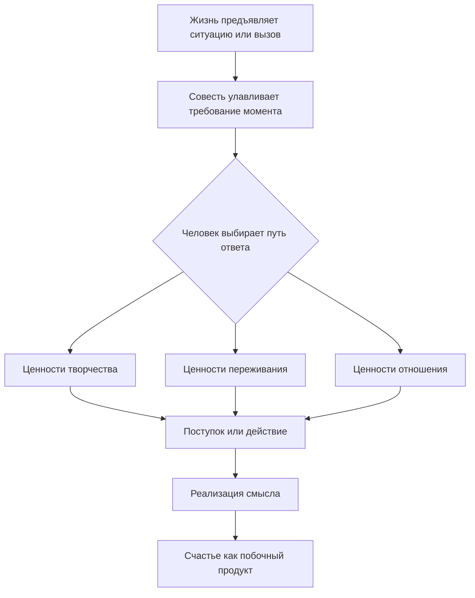

Многие люди переживают внутреннюю пустоту в кризисные периоды жизни. Психологи называют это состояние **экзистенциальным вакуумом** — ощущением бессмысленности, которое возникает после потери работы, близких или здоровья *(Франкл, 1990)*.

Виктор Франкл разработал систему навигации в этой пустоте. Она основана на иерархии смыслов и трёх группах ценностей, которые доказывают: жизнь сохраняет своё значение при любых обстоятельствах. В этой статье мы разберём каждый элемент этой системы и покажем, как она работает в реальных ситуациях — от кабинета психотерапевта до концентрационного лагеря *(Франкл, 1990)*.

### Смысл нельзя придумать: принцип самотрансценденции

**Самотрансценденция** — это способность человека выходить за пределы своего «Я» ради дела или другого человека. Это не абстрактная идея, а конкретный механизм обнаружения смысла *(Франкл, 1990)*.

Смысл не рождается внутри головы. Человек обнаруживает его во внешнем мире, отвечая на требования конкретной ситуации. Настоящий смысл всегда объективен. Если бы человек просто придумывал его для успокоения, он не был бы готов ради этого смысла жертвовать собой *(Лукас, 2019)*.

Жизнь постоянно задаёт нам вопросы через обстоятельства. Мы отвечаем на них не словами, а выбором конкретной ценности и поступком *(Франкл, 1990)*.

### Три уровня смысла: от секунды до мироздания

Психологи описывают три уровня смысла, вложенных друг в друга, как кадры в кинофильме *(Франкл, 1990)*.

1. **Смысл в жизни (микроуровень)** — требование конкретного момента «здесь и сейчас». Прямо сейчас жизнь может требовать завершить важный разговор, дописать работу или выслушать близкого человека *(Франкл, 1990)*.
2. **Смысл жизни (макроуровень)** — уникальная жизненная миссия человека. Мы не можем понять смысл всего фильма, пока не досмотрим его до конца. Так и общий смысл жизни складывается из тысяч маленьких смыслов каждого дня *(Франкл, 1990)*.
3. **Сверх-смысл (метауровень)** — глобальный замысел мироздания, недоступный человеческому разуму. Франкл сравнивал это с обезьяной в лаборатории. Ей больно от уколов, но она не может понять, что учёные создают вакцину для спасения тысяч жизней. Наш разум так же ограничен перед логикой эволюции *(Франкл, 1990)*.

> Когда дочь Франкла болела корью, он сказал ей, что Бог послал ей выздоровление. Она ответила: «Да, но сначала он послал мне корь». Предельный смысл всегда глубже обычной человеческой логики *(Франкл, 1990)*.

### Триада ценностей: три дороги к наполненной жизни

Франкл выделил три группы ценностей — три способа отвечать на запросы жизни *(Лукас, 2019)*.

| Тип ценностей | Ключевой вопрос | Пример реализации |
|---|---|---|
| **Творчество** | Что я даю миру? | Труд, созидание, уникальный поступок |
| **Переживание** | Что я беру от мира? | Любовь, красота природы, искусство |
| **Отношение** | Как я встречаю неизбежное? | Мужество перед болезнью или утратой |

**Ценности творчества** человек реализует через труд и созидание. В концлагере у Франкла отняли рукопись его первой книги. Высшим смыслом, который поддерживал его выживание, стала цель заново написать эту работу *(Франкл, 1990)*.

**Ценности переживания** открываются в способности впитывать мир: любить, наслаждаться искусством или красотой природы. В самый тяжёлый момент в Освенциме Франкл мысленно обращался к образу жены. Он понял: способность любить — даже не зная, жив ли любимый человек — это реализация высшей ценности, которая спасает от смерти *(Франкл, 1990)*.

**Ценности отношения** — это мужественная позиция перед лицом неизбежного страдания. Это «царская дорога» к смыслу, которая открывается, когда изменить судьбу невозможно. Пациент Э. Лукас потерял ногу в результате травмы. Как спортсмен, он мог погрузиться в отчаяние. Но в ходе терапии он понял: его главные смыслы — строить мосты, любить подругу, ходить в театр — ампутация не затронула. Когда его везли на операцию, он думал о том, что ему спасают жизнь, а не о том, что отрезают ногу *(Лукас, 2019)*.

> **Важно:** Если болезнь можно вылечить, а несправедливость — исправить, нужно действовать. Бессмысленное терпение того, что можно изменить, — это мазохизм, а не реализация ценностей *(Франкл, 1990)*.

### Двойная интеграция: от Абсолюта к поступку и от боли к торжеству

Система смыслов работает в двух направлениях одновременно *(Франкл, 1990)*.

**Сверху вниз.** На метафизическом уровне существует сверх-смысл — тотальный замысел бытия. Спускаясь ниже, мы видим уникальную миссию конкретного человека. На клиническом уровне эта миссия распадается на тысячи «требований момента». Психотерапия переключает фокус с абстрактного поиска Абсолюта на конкретный вопрос: «Что именно эта ситуация требует от меня прямо сейчас?» *(Франкл, 1990)*.

**Снизу вверх.** Пожилой терапевт обращается за помощью в тяжёлой депрессии после смерти жены. На микроуровне он не видит смысла в жизни без неё. Франкл переводит его фокус на ценность отношения: «Что было бы, если бы вы умерли первым? Ваша жена страдала бы так же. Вы избавили её от этой боли ценой своего горя». Это локальное изменение перспективы помогает мужчине подняться к осознанию глобального смысла своей жизни — любовь как жертва *(Франкл, 1990)*.

Так пилот в тумане следует корректировкам навигатора. Каждый конкретный поступок ведёт к цели, даже если весь маршрут не виден целиком *(Франкл, 1990)*.

### Пять вопросов к концепции: полный разбор

Чтобы понять логотерапию глубоко, полезно задать ей пять ключевых вопросов *(Лукас, 2019)*.

**Зачем нужно такое многообразие смыслов?** Чтобы гарантировать: жизнь не потеряет свой вес ни при каких обстоятельствах. Если у человека отнимают возможность работать или наслаждаться миром, у него всегда остаётся ценность отношения к неизбежному *(Франкл, 1990)*.

**Что такое смысл и каковы его границы?** Смысл — это уникальный объективный запрос, который конкретная ситуация предъявляет конкретному человеку. Он не универсален и не повторяется *(Лукас, 2019)*.

**Почему смысл нельзя выдумать?** Потому что истинный смысл транссубъективен. Если бы смысл был лишь субъективной выдумкой для снятия напряжения, человек не был бы готов ради него страдать и жертвовать собой *(Франкл, 1990)*.

**Как смысл реализуется на практике?** По принципу кинофильма. Мы не можем понять глобальный смысл всего фильма, пока не досмотрим его до конца. Но каждый кадр имеет свой конкретный смысл момента. Решая задачи каждой ситуации через труд, любовь или мужественное терпение, человек шаг за шагом выстраивает целостный смысл своей жизни *(Франкл, 1990)*.

**Что произойдёт, если система ценностей однобокая?** Если человек строит смысл только вокруг работы или только вокруг ребёнка, он уязвим. При выходе на пенсию или взрослении детей возникает экзистенциальный вакуум. Многообразие путей — это страховая сеть, а не излишество *(Лукас, 2019)*.

### Практика: Коперниканский переворот

Чтобы войти в состояние осмысленности, измените привычный вопрос «Чего я хочу от жизни?» на вопрос: **«Чего жизнь прямо сейчас ждёт от меня?»**. Выберите один путь ответа в течение ближайших 30 минут:

* **Творчество:** доведите до конца одну маленькую задачу, которую откладывали *(Франкл, 1990)*.
* **Переживание:** уделите 3 минуты тому, чтобы полностью впитать что-то красивое — музыку, вкус чая или взгляд близкого человека *(Лукас, 2019)*.
* **Отношение:** если вы испытываете боль или обиду, которую нельзя устранить, сознательно примите её с достоинством, не срываясь на окружающих *(Лукас, 2019)*.

Это действие мгновенно включает вас в ткань осмысленной реальности.

### Заключение и Литература

Иерархия смыслов и триада ценностей Франкла доказывают: у человека всегда есть путь. Если нельзя творить — можно любить. Если нельзя наслаждаться миром — можно проявить мужество. Многообразие путей к смыслу делает человеческий дух непобедимым перед лицом любых обстоятельств *(Франкл, 1990)*.

**Список литературы:**
* Лукас, Э. (2019). *Источники осознанной жизни. Преврати проблемы в ресурсы*. Москва: Никея.
* Лукас, Э. (2019). *Учебник логотерапии. Представление о человеке и методы*. Москва: Московский институт психоанализа.
* Франкл, В. (1990). *Человек в поисках смысла*. Москва: Прогресс.

---

**Микро-кейс для практики**

Учёный-биолог посвятил всю жизнь научным исследованиям. После инсульта он потерял способность читать сложные тексты и работать в лаборатории. Он говорит, что его жизнь закончилась, потому что единственной его ценностью было научное творчество. Он игнорирует поддержку семьи и отказывается от общения.

**Вопрос:** Используя триаду ценностей Франкла, объясните, какие альтернативные пути к смыслу остаются открытыми для учёного. Почему «односторонняя система ценностей» оказалась уязвимостью? Как именно ценности переживания и отношения могут дать ему новый «смысл в жизни» сегодня, и как метафора «пилота в тумане» поможет ему найти новый курс?
