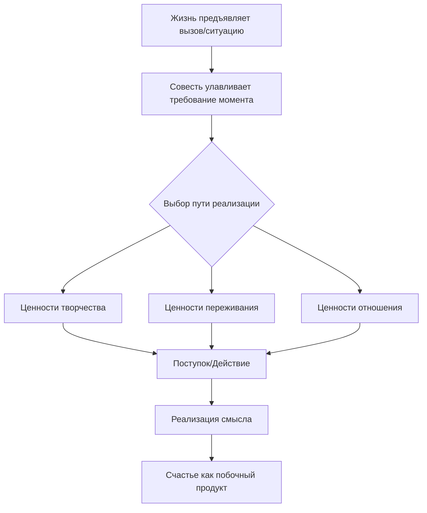

Многие люди в трудные периоды чувствуют внутреннюю пустоту. Это состояние психологи называют экзистенциальным вакуумом, когда жизнь кажется лишенной цели после потери работы, близких или здоровья *(Франкл, 1990)*.

Виктор Франкл разработал систему, которая помогает найти опору даже в самых тяжелых ситуациях. В этой статье мы разберем иерархию смыслов и три пути реализации ценностей, которые доказывают: жизнь сохраняет свою ценность до последнего вздоха *(Франкл, 1990)*.

### Навигация в тумане: Зачем нам нужна иерархия смыслов

Иерархия смыслов — это навигационная система для человеческой души. Она объясняет, как мы находим свое предназначение на разных этапах пути *(Лукас, 2019)*. Жизнь не является абстрактной загадкой, которую нужно решить умом. Это постоянный диалог, где мир задает нам вопросы через обстоятельства, а мы отвечаем на них своими поступками *(Франкл, 1990)*.

Если человек видит жизнь только как поиск удовольствия, он рискует сломаться при первой серьезной неудаче. Многообразие путей к смыслу защищает личность от отчаяния. Оно гарантирует, что даже если одна дорога закрыта, у человека остаются другие способы реализовать себя *(Франкл, 1990)*.

### Механика открытия: Почему смысл нельзя выдумать

Смысл не изобретается и не придумывается внутри головы. Человек обнаруживает его во внешнем мире через **самотрансценденцию** — способность выходить за пределы своего «Я» ради дела или другого человека *(Франкл, 1990)*. Настоящий смысл всегда объективен. Если бы мы просто выдумывали его для успокоения, мы бы не были готовы ради него жертвовать собой *(Лукас, 2019)*.

Процесс обретения смысла напоминает работу пилота в тумане. Пилот следует указаниям навигатора, чтобы достичь цели. Каждая корректировка курса — это ответ на текущую ситуацию в небе *(Франкл, 1990)*.

### Три уровня глубины: От мытья посуды до тайн мироздания

Психологи выделяют три уровня смысла, которые вложены друг в друга, как кадры в кинофильме:

1.  **Смысл в жизни (микроуровень).** Это требование конкретного момента «здесь и сейчас» *(Франкл, 1990)*. Например, прямо сейчас жизнь может требовать от вас дописать отчет или выслушать друга.
2.  **Смысл жизни (макроуровень).** Это ваше жизненное призвание или уникальная миссия *(Франкл, 1990)*. Мы не можем до конца понять смысл всего фильма, пока не досмотрим его до финала. Так и общий смысл жизни складывается из тысяч маленьких смыслов каждого дня.
3.  **Сверх-смысл (метауровень).** Это глобальный замысел мироздания, который недоступен человеческому разуму *(Франкл, 1990)*. Виктор Франкл сравнивал это с обезьяной в лаборатории. Обезьяне больно от уколов, и она не может понять, что ученые создают вакцину для спасения тысяч жизней. Ее интеллект не позволяет постичь смысл действий человека, как и наш разум не всегда может охватить логику эволюции *(Франкл, 1990)*.

### Три дороги к цели: Творчество, переживание и мужество

Франкл выделил три группы ценностей. Они показывают, как именно мы можем отвечать на запросы жизни.

**Ценности творчества** — это то, что мы даем миру. Человек реализует их через труд, созидание и уникальные поступки *(Франкл, 1990)*. Когда вы строите дом, лечите пациента или пишете книгу, вы вносите свою уникальность в ткань реальности.

**Ценности переживания** — это то, что мы берем от мира. Смысл можно найти в созерцании природы, наслаждении искусством или в познании другого человека через любовь *(Лукас, 2019)*. В концлагере Франкл выживал, мысленно обращаясь к образу своей жены. Даже не зная, жива ли она, он находил спасение в самой способности любить *(Франкл, 1990)*.

**Ценности отношения** — это мужественная позиция перед лицом неизбежного страдания. Это «царская дорога» к смыслу, которая открывается, когда человек не может изменить судьбу *(Франкл, 1990)*.

> **Важно:** Если болезнь можно вылечить, а социальную несправедливость — исправить, нужно действовать. Бессмысленное терпение того, что можно изменить, является мазохизмом, а не реализацией ценностей *(Франкл, 1990)*.

### Практика: Коперниканский переворот

Чтобы мгновенно войти в состояние осмысленности, попробуйте изменить привычный вопрос «Чего я хочу от жизни?» на вопрос: **«Чего жизнь прямо сейчас ждет от меня?»**. Выберите один путь для ответа:

* **Творчество:** доведите до конца одну маленькую задачу, которую откладывали *(Франкл, 1990)*.
* **Переживание:** уделите 3 минуты тому, чтобы полностью впитать красоту вокруг — музыку, вкус чая или взгляд близкого человека *(Лукас, 2019)*.
* **Отношение:** если вы испытываете боль или обиду, решите перенести это с достоинством, сохраняя внутренний покой *(Лукас, 2019)*.

---

### Заключение и Литература

Иерархия смыслов доказывает, что человек всегда свободен выбирать свой путь. Если мы не можем творить, мы можем любить. Если мы не можем наслаждаться миром, мы можем проявить мужество. Это делает человеческий дух непобедимым перед лицом любых обстоятельств.

**Список литературы:**
* Лукас, Э. (2019). *Учебник логотерапии. Представление о человеке и методы*. Москва: Московский институт психоанализа.
* Лукас, Э. (2019). *Источники осознанной жизни. Преврати проблемы в ресурсы*. Москва: Никея.
* Франкл, В. (1990). *Человек в поисках смысла*. Москва: Прогресс.

---

**Микро-кейс для практики**

Представьте успешного хирурга, который из-за травмы руки больше не может оперировать. Он считает, что его жизнь потеряла смысл, так как он больше не может «давать миру» свои навыки (ценности творчества). Он погружается в депрессию и игнорирует поддержку семьи.

**Вопрос:** Используя иерархию смыслов, объясните, на какие другие уровни и ценности он мог бы переключить свое внимание? Как метафора «пилота в тумане» поможет ему найти новый «смысл в жизни» в данной ситуации? Какую роль здесь может сыграть переход от ценностей творчества к ценностям отношения или переживания?
