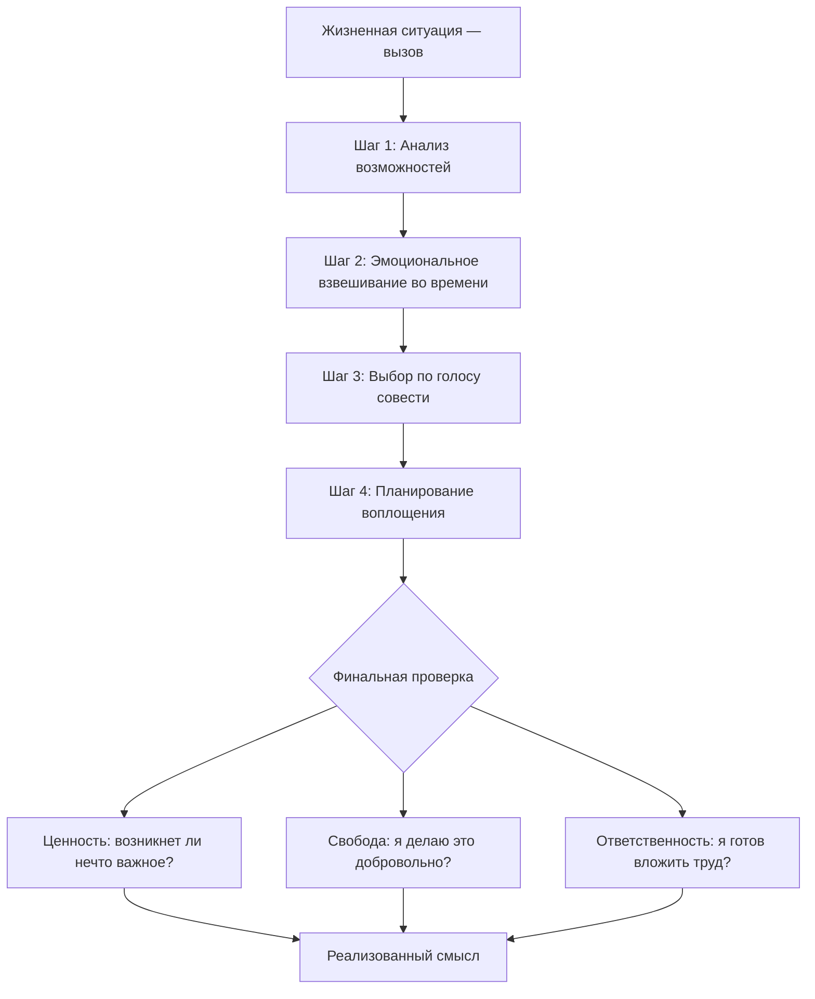

Человек годами не может решить: уйти с нелюбимой работы или остаться ради стабильности. Другой — расстаться с партнёром или терпеть. Третий — начать новый проект или не рисковать. Каждый из них застрял на перекрёстке, не в силах свернуть ни в одну сторону. Ирвин Ялом описал эту муку точно: на каждом повороте человек навсегда прощается с невыбранными дорогами *(Ялом, 2020)*.

Альфрид Лэнгле разработал структурированный алгоритм, который переводит человека из паралича амбивалентности к осмысленному действию. Он состоит из четырёх шагов и финальной проверки через триаду: **Ценность, Свобода и Ответственность** *(Лэнгле, 2026)*.

### Коперниковский переворот: жизнь задаёт вопросы

Франкл утверждал: величайшая ошибка — спрашивать жизнь, чего от неё ожидать. Правильная позиция — понять, что *сама жизнь* ежечасно задаёт нам вопросы, и мы обязаны отвечать на них поступками. Это **коперниковский переворот** сознания *(Франкл, 1990)*.

Алгоритм Лэнгле превращает этот философский принцип в практический инструмент. Философское долженствование становится конкретными вопросами к себе: «Что сейчас необходимо?», «Что требуется лично от меня?» *(Лэнгле, 2026)*.

### Четыре шага: от восприятия к действию

Алгоритм задействует человека целиком: интеллект, эмоции, совесть и физическое действие *(Лэнгле, 2026; Лукас, 2019)*.

| Шаг | Сфера | Ключевой вопрос |
|---|---|---|
| **1. Анализ ситуации** | Восприятие | Какие возможности открыты передо мной? |
| **2. Эмоциональное взвешивание** | Чувства | Как я буду чувствовать себя через месяц, если сделаю это (или не сделаю)? |
| **3. Выбор по совести** | Свобода | Что по совести было бы правильно? Я *сам* хочу этого? |
| **4. Продумывание воплощения** | Ответственность | Как я могу это сделать наилучшим образом? Ради кого? |

**Шаг 1: Анализ ситуации и возможностей.** Отказ от «туннельного зрения». Человек трезво описывает ситуацию и ищет возможности по трём франкловским векторам: *ценности переживания* (есть ли здесь что-то прекрасное?), *творческие ценности* (могу ли я создать что-то ценное?) и *ценности отношения* (как мне мужественно отнестись к тому, что изменить нельзя?) *(Лэнгле, 2026; Франкл, 1990)*.

**Шаг 2: Эмоциональное взвешивание.** Логики недостаточно. Необходимо пропустить возможности через сердце. Ключевые вопросы: «Как я буду чувствовать себя через день, неделю, месяц, если сделаю это? А если *не* сделаю?». Это отсекает сиюминутные гедонистические порывы и связывает эмоцию с долгосрочной перспективой *(Лэнгле, 2026)*.

**Шаг 3: Выбор наилучшего пути.** Обращение к совести — **органу смысла**. «Что по совести было бы правильно? Кем я буду выглядеть в своих глазах?». На этом этапе человек проверяет: говорит ли он «Я *сам* хочу этого» или действует под давлением невротических страхов и чужих ожиданий *(Лэнгле, 2026)*.

**Шаг 4: Продумывание воплощения.** Любое решение без действия — фантазия *(Ялом, 2020)*. Прагматичные вопросы: «Что может мне помешать? Как я могу сделать это наилучшим образом? Ради кого я это делаю?». Это экологическая проверка реальности *(Лэнгле, 2026)*.

### Боль решения: почему мы избегаем выбора

Слово «решение» происходит от латинского *decidere* — «отрезать», «убивать». Каждое решение требует отказа от всех остальных альтернатив. Некоторые пациенты так боятся этого отказа, что годами сидят на перекрёстке, лелея иллюзию, что обе дороги когда-нибудь сольются *(Ялом, 2020)*.

Чтобы человек не впадал в панику перед необходимостью «убить» другие варианты, ему нужен механизм, гарантирующий: выбранный путь — это действительно *его* глубоко осмысленный путь *(Ялом, 2020; Лэнгле, 2026)*.

### Триада проверки: ценность, свобода, ответственность

После принятия решения требуется финальная проверка. Истинный смысл держится только на трёх опорах *(Лэнгле, 2026)*.

**Ценность.** «Если я этого не сделаю, случится ли что-то плохое?» Если ответ «нет» — действие пустое и не принесёт удовлетворения.

**Свобода.** «Я делаю это, потому что меня заставили, или добровольно?» Если нет свободы, человек остаётся жертвой, и реализация смысла блокируется принуждением.

**Ответственность.** «Готов ли я вложить реальный труд?» Если нет готовности к усилию, решение не будет доведено до конца при первых трудностях *(Лэнгле, 2026)*.

> Опасно подменять объективный поиск смысла эгоцентричным «что мне выгодно». Смысл всегда подразумевает самотрансценденцию — нечто за пределами собственного «Я» *(Франкл, 1990)*.

### Клинические свидетельства: алгоритм в действии

**Иллюзия отсутствия свободы.** Пациент Ялома Билл не мог решить: прекратить ли отношения с помощницей Джин. Он утверждал, что «просто перегружен работой», а она «случайно» помогает. Терапевт вернул его к Шагу 3 (Свобода): Билл *сам* организовал рабочий кризис (сорвав дедлайн), чтобы иметь повод позвать Джин. Осознание скрытой свободы заставило его взять ответственность *(Ялом, 2020)*.

**Эмоциональное взвешивание через смертное ложе.** Женщина годами не могла решиться на развод из разрушительного брака. Решающим катализатором стал Шаг 2: терапевт попросил её представить себя на смертном одре. Её ответом было пронзительное чувство вины: «Сожаление о том, что я зря потратила свою жизнь». Это мгновенно прояснило ценность решения и дало энергию для действий *(Ялом, 2020)*.

**Спасение смыслом в лагере.** Двое узников планировали суицид — «им больше нечего было ждать от жизни». Франкл помог им осознать: *жизнь всё ещё чего-то ждала от них*. Одного ждал любимый ребёнок, другого — незаконченная научная работа. Осознание этой ценности вернуло им свободу жить и ответственность за будущее *(Франкл, 1990)*.

### Практика: экзистенциальный сканер

Выберите одно решение, которое вы откладываете. Пропустите его через триаду проверки Лэнгле.

1. **Ценность:** «Если я это сделаю, возникнет ли в мире или во мне самом нечто действительно важное? Случится ли что-то плохое, если я от этого откажусь навсегда?»
2. **Свобода:** «Заставляет ли меня кто-то, или я могу искренне сказать: *Я сам добровольно хочу этого*?»
3. **Ответственность:** «Готов ли я прямо сегодня вложить хотя бы 15 минут реального труда ради этой цели, понимая, ради кого или чего я это делаю?»

Если хотя бы на один вопрос ответ «нет» — решение требует пересмотра. Если на все три «да» — сделайте первый практический шаг в ближайший час *(Лэнгле, 2026)*.

### Заключение и Литература

Принятие решений — болезненный, но неизбежный акт. Алгоритм Лэнгле превращает хаос амбивалентности в структурированный процесс: от анализа возможностей через эмоциональное взвешивание к осознанному выбору и действию. Триада проверки (Ценность, Свобода, Ответственность) гарантирует, что решение является подлинно *вашим*, а не продуктом страха, давления или гедонизма *(Лэнгле, 2026; Ялом, 2020)*.

**Список литературы:**
* Лукас, Э. (2019). *Учебник логотерапии. Представление о человеке и методы*. Москва: Московский институт психоанализа.
* Лэнгле, А. (2026). *Экзистенциальный анализ: практическое руководство*.
* Франкл, В. (1990). *Человек в поисках смысла*. Москва: Прогресс.
* Ялом, И. (2020). *Экзистенциальная психотерапия*. Москва: Класс.

---

**Микро-кейс для практики**

Мужчина, 34 года, инженер, последние два года мечтает открыть собственную столярную мастерскую. У него есть навыки, небольшие сбережения и даже потенциальные первые заказы. Но он не увольняется: жена против, ипотека пугает, родители считают это «несерьёзным». На вопрос терапевта «Хотите ли вы этого сами?» он отвечает: «Не знаю. Наверное, да, но все вокруг говорят, что это глупо».

**Вопрос:** Проведите ситуацию инженера через четыре шага алгоритма Лэнгле. Определите, на каком шаге он «застрял» и почему. Примените триаду проверки: есть ли в его решении Ценность, Свобода и Ответственность? Объясните, какую ошибку он совершает, если путает голос совести с голосами окружающих, используя понятие «невротическое Сверх-Я».
