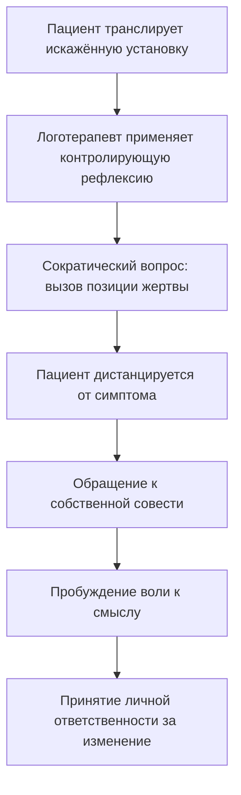

В классическом психоанализе терапевт молча сидит за кушеткой, играя роль нейтрального зеркала. Он не оценивает, не направляет и не спорит с пациентом. Логотерапия отвергает эту модель. Виктор Франкл и Элизабет Лукас создали принципиально иной стиль терапевтического диалога, в котором психотерапевт — не бесстрастный наблюдатель, а живой **катализатор**, пробуждающий в человеке ответственность за собственную жизнь *(Франкл, 1990; Лукас, 2019)*.

Такой подход требует от терапевта особой позиции: он открыто смотрит на боль, вину и смерть, но верит в уникальный духовный потенциал каждого пациента. Франкл назвал эту позицию **трагическим оптимизмом** *(Франкл, 1990)*.

### Офтальмолог, а не художник: принцип расширения поля зрения

Франкл сравнивал логотерапевта не с художником, который рисует для пациента свою картину мира, а с **офтальмологом**. Терапевт не навязывает свой смысл. Он «очищает хрусталик» пациента, чтобы тот сам увидел весь спектр ценностей и смыслов, ожидающих его во внешнем мире *(Франкл, 1990)*.

Стиль беседы в логотерапии проникнут педагогическим, философским и душепопечительским духом. Терапевт берёт на себя смелость быть **ценностно ненейтральным**. Он безусловно принимает личность пациента, но *не* принимает автоматически всё, что тот говорит — особенно если это снимает ответственность или ведёт к деградации *(Лукас, 2019)*.

> Если терапевт займёт позицию фаталиста и согласится с пациентом, что во всём виновато тяжёлое детство или инстинкты, возникнет ятрогенное повреждение. Пациент с радостью ухватится за это алиби и навсегда останется пассивной жертвой *(Франкл, 1990)*.

### Трагический оптимизм: вера сквозь боль

Позиция логотерапевта строится на двух пересекающихся осях *(Франкл, 1990; Лукас, 2019)*.

**Мировоззренческая ось — трагический оптимизм.** Терапевт видит **трагическую триаду** — боль, вину и смерть. Он не питает иллюзий о «безоблачном счастье». Но из этой трагичной картины он спускается к клинической работе как оптимист: даже если пациент парализован или смертельно болен, у него остаётся последнее свободное пространство — пространство выбора своей *установки* *(Франкл, 1990)*.

**Инструментальная ось — контролирующая рефлексия.** Терапевт отказывается от ценностного нейтралитета в пользу активного утверждения человечности. Он — адвокат душевного здоровья, а пациент — судья и присяжные *(Лукас, 2019)*.

### Контролирующая рефлексия: суд совести в кабинете терапевта

**Контролирующая рефлексия** — это метод, при котором терапевт не принимает деструктивные установки пациента на веру, а возвращает их на суд его собственной совести *(Лукас, 2019)*.

В Австрии 1930-х годов безработные пациенты приходили к Франклу и жаловались: «Я безработный, значит, я бесполезный, а моя жизнь бессмысленна». Классический аналитик, возможно, стал бы искать корни апатии в детских травмах. Франкл начинал с этой конкретной фразы и бросал ей вызов: «Вы стали жертвой двойной ошибочной идентификации! Безработный — не значит бесполезный. Ваша ценность не измеряется экономической конъюнктурой» *(Франкл, 1990)*.

Отталкиваясь от одной жалобы, терапевт поднимал пациента к высшему обобщению: человеческое достоинство безусловно и не зависит от социальной успешности *(Франкл, 1990)*.

### Риторика любви: четыре элемента беседы

Элизабет Лукас назвала стиль логотерапевта воплощением **«риторики любви»** — техники беседы, которая мертва без духа подлинного уважения к пациенту *(Лукас, 2019)*.

| Элемент | Принцип | Что делает терапевт |
|---|---|---|
| **Повышение ценности личности** | Любовь не пугает | Смещает фокус с «безоценочности» на активное подчёркивание сильных сторон пациента. Верит в него больше, чем тот верит в себя |
| **Способствование ясности** | Любовь не утаивает | Разрушает противоречия и скрытые намёки. Прямой призыв: «Помоги мне понять тебя!» |
| **Игра с альтернативами** | Любовь не сковывает | Использует воображение («Что было бы, если...»), расширяя свободное пространство пациента |
| **Нащупывание смысла** | Любовь не предъявляет заниженных требований | Следует за «кодовыми словами» пациента, которые выдают его скрытые ценности |

### Клинические свидетельства: катализатор в действии

**Смелость прервать жалобу.** Во время одного из выступлений Франкла пациентка начала бесконечно изливать свои страхи, тянущиеся из тяжёлого детства. Вместо того чтобы пассивно отражать её эмоции, Франкл задал неожиданный сократический вопрос: *почему же она не боится прямо сейчас выступать перед публикой?* Он мгновенно перевёл её на метауровень: можно испытывать страх, но одновременно быть смелой. Он не был зеркалом — он стал катализатором, поздравив её с победой, которую она сама не заметила *(Франкл, 1990)*.

**Паралич как трамплин.** Франкл приводил пример Джерри Лонга — юноши, парализованного ниже шеи после несчастного случая. Вместо погружения в отчаяние он стал изучать психологию, набирая текст специальной палочкой во рту. Его кредо: «Я сломал шею, но не сломился». Это живое доказательство «дерзкой силы человеческого духа», в которую верит логотерапевт-оптимист *(Франкл, 1990)*.

**Отказ от подыгрывания.** Если пациент с истерическим радикалом использует терапию для привлечения внимания, логотерапевт проявляет ценностную ненейтральность: «Смотри, я люблю тебя, но мне не нравится твоя истерия!». Терапевт не подыгрывает в сценарии пациента, если этот сценарий ведёт к духовной деградации *(Лукас, 2019)*.

### Практика: контролирующая рефлексия в разговоре

В ближайшие 30 минут, ведя разговор с коллегой, другом или даже внутренний монолог, откажитесь от роли «пассивного соглашателя».

1. Если вы услышите жалобу, снимающую ответственность (например: «У меня ничего не выходит, потому что все вокруг идиоты»), мягко, но твёрдо примените контролирующую рефлексию.
2. Задайте сократический вопрос, возвращающий авторство: *«Да, обстоятельства сложны, но как лично ты выбираешь на них реагировать прямо сейчас?»*
3. Или используйте призыв к ясности: *«Помоги мне понять: что из того, что ты сейчас делаешь, действительно приносит тебе пользу?»*

Это действие мгновенно переведёт коммуникацию с уровня пассивного нытья на уровень ответственности и поиска смысла *(Лукас, 2019)*.

### Заключение и Литература

Логотерапевт — не нейтральное зеркало, а живой катализатор смыслового пробуждения. Его позиция строится на трагическом оптимизме: он видит боль, вину и смерть, но верит в нетронутое духовное ядро каждого пациента. Контролирующая рефлексия и риторика любви позволяют терапевту не навязывать свои ценности, но «очищать хрусталик» пациента, чтобы тот сам обнаружил смысл и взял ответственность за свою жизнь *(Франкл, 1990; Лукас, 2019)*.

**Список литературы:**
* Лукас, Э. (2019). *Источники осознанной жизни. Преврати проблемы в ресурсы*. Москва: Никея.
* Лукас, Э. (2019). *Учебник логотерапии. Представление о человеке и методы*. Москва: Московский институт психоанализа.
* Франкл, В. (1990). *Сказать жизни да. Психолог в концлагере*. Москва: Прогресс.
* Франкл, В. (1990). *Человек в поисках смысла*. Москва: Прогресс.

---

**Микро-кейс для практики**

Пациент, 28 лет, программист, приходит к психотерапевту и заявляет: «Мне не нравится моя работа, но у меня ипотека. Я ненавижу понедельники. Наверное, я просто неудачник, и в моей семье все такие — отец тоже всю жизнь работал на нелюбимой работе. Это генетика, ничего не поделаешь». Терапевт молча кивает и записывает.

**Вопрос:** Используя понятия «контролирующая рефлексия», «ценностная ненейтральность» и метафору «офтальмолога», объясните, какую ошибку совершает терапевт, молча соглашаясь с пациентом. Какой сократический вопрос мог бы «очистить хрусталик» этого программиста и вернуть ему осознание свободы выбора?
