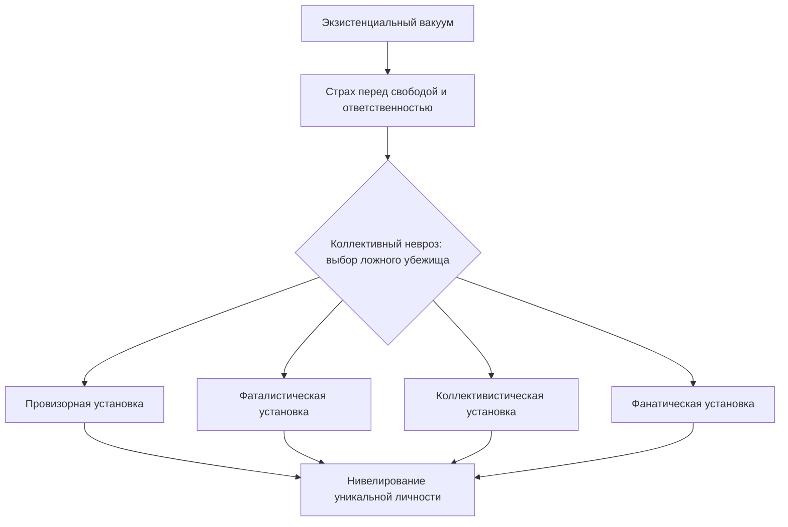

Современный человек обладает беспрецедентной свободой. Он выбирает профессию, место жительства, мировоззрение. Но вместо того чтобы пользоваться этой свободой, миллионы людей от неё бегут. Одни живут одним днём, другие отдают решения толпе, третьи прячутся за догмами. Виктор Франкл назвал это массовое бегство **коллективным неврозом** *(Франкл, 1990)*.

Коллективный невроз — это социокультурная патология, при которой общество системно избегает экзистенциальной свободы и личной ответственности через четыре деструктивные установки *(Франкл, 1990; Лукас, 2019)*.

### Корни бегства: почему свобода пугает

**Экзистенциальный вакуум** создаёт питательную среду для коллективного невроза. Когда традиции и инстинкты перестают подсказывать, как жить, человек оказывается один на один с пугающей необходимостью самостоятельно конструировать смысл *(Франкл, 1990)*.

Осознание своего авторства — тяжёлое бремя. Оно означает, что за каждый неверный выбор отвечает сам человек, а не судьба, общество или «плохие гены». Не выдерживая этого напряжения, люди массово прячутся в готовые социальные шаблоны и добровольно отказываются от ядра своей личности *(Франкл, 1990; Лукас, 2019)*.

### Четыре ложных убежища: анатомия массового бегства

Франкл выделил четыре деструктивные установки. Каждая из них нейтрализует конкретный пугающий аспект бытия *(Франкл, 1990; Лукас, 2019)*.

| Установка | Суть | От чего защищает | Цена |
|---|---|---|---|
| **Провизорная** | Жизнь одним днём без целей и планов | Тревога перед будущим | Утрата направления и стойкости |
| **Фаталистическая** | Вера в полную беспомощность перед судьбой | Тяжесть вины за неудачи | Утрата свободы воли |
| **Коллективистическая** | Растворение в толпе, отказ от «Я» | Ужас экзистенциального одиночества | Утрата индивидуальности |
| **Фанатическая** | Одержимость одной догмой, отрицание иных ценностей | Необходимость мыслить гибко | Утрата сострадания и психологической гибкости |

### Механизм самообмана: вычёркивание духовного измерения

Все четыре установки работают через одну операцию: человек вычёркивает своё **духовное (ноэтическое) измерение**. Он перестаёт считать себя свободным существом, которое способно занять осознанную позицию по отношению к обстоятельствам *(Франкл, 1990; Лукас, 2019)*.

**Фаталист** говорит: «От меня ничего не зависит, всё предрешено». Он сводит себя к биологическому автомату — продукту генетики и среды. **Конформист** оценивает себя и других не как свободных личностей, а как представителей типичных категорий: «южане ленивы», «экстраверты болтливы». **Человек, живущий одним днём**, отказывается от любых обязательств перед будущим. **Фанатик** цепляется за свою догму так крепко, что готов идти к цели «по трупам» *(Франкл, 1990; Лукас, 2019)*.

> Если наука поддерживает эти установки — например, утверждая, что человек всего лишь продукт среды и инстинктов, — она сама становится симптомом коллективного невроза *(Франкл, 1990)*.

### От духа времени к личному параличу: два направления невроза

**Сверху вниз.** На макроуровне культура порождает экзистенциальный вакуум. Общество больше не даёт чётких предписаний, ради чего жить. Эта культурная пустота предлагает лёгкие, но разрушительные пути: конформизм (делать то, что другие) или тоталитаризм (делать то, что приказывают). На микроуровне конкретный человек, столкнувшись с кризисом, вместо поиска смысла выбирает позицию: «От меня ничего не зависит, всё предрешено» *(Франкл, 1990)*.

**Снизу вверх.** Обычный человек проводит вечера в бесцельном скроллинге социальных сетей, не строя планов на будущее. Этот локальный микро-опыт рутины и скуки масштабируется: миллионы людей формируют общество, страдающее коллективным неврозом, где утрачивается способность к **самотрансценденции**, а свобода и ответственность воспринимаются как невыносимая угроза *(Франкл, 1990; Лукас, 2019)*.

### Клинические свидетельства: четыре лица бегства

**Фатализм: позиция жертвы.** Франкл подчёркивал опасность взгляда на человека как на простой продукт биологических и социальных условий. Такой невротический фатализм убеждает человека, что он — марионетка. Франкл собственным опытом в концентрационных лагерях доказал обратное: даже в условиях невообразимого ужаса у человека нельзя отнять свободу выбрать своё отношение к обстоятельствам. Фаталист же капитулирует ещё до начала борьбы *(Франкл, 1990)*.

**Жизнь одним днём: провизорное существование.** Отсутствие жизненных целей губительно для психики. Франкл описывал лагерную жизнь как «условное существование с неизвестным пределом», где человек, не видящий будущего, быстро терял духовную стойкость и погибал физически. В современном обществе эта установка проявляется как жизнь исключительно сегодняшним днём без долгосрочного смысла *(Франкл, 1990)*.

**Коллективизм: растворение в массе.** Человек отказывается от собственного «Я» ради безопасности толпы. В логотерапии это расценивается как мышление, при котором людей оценивают по групповой принадлежности, игнорируя уникальность каждого. Человек сливается с коллективом, чтобы не принимать собственных решений *(Франкл, 1990)*.

**Фанатизм: ригидность мышления.** Элизабет Лукас описала фанатиков — политических и религиозных, — которые одержимы торжеством своей догмы над всеми остальными. Они полностью утрачивают психологическую гибкость и способность к состраданию *(Лукас, 2019)*.

### Практика: аудит личной ответственности

Выберите одну нерешённую проблему в вашей жизни — конфликт на работе, низкий доход, отсутствие времени.

1. Честно проверьте: не используете ли вы одну из четырёх установок коллективного невроза?
2. Запишите на бумаге свою типичную отговорку. Например: *«Я ничего не могу достичь, потому что сейчас кризис и у меня плохая наследственность»* (фатализм).
3. Зачеркните эту фразу и перепишите её в форме ответственного выбора: **«Я сам выбираю оставлять всё как есть и не искать новые пути, потому что мне сейчас безопаснее ничего не менять»**.

Это действие мгновенно вырвет вас из коллективного невроза и вернёт в позицию свободного автора своей судьбы *(Франкл, 1990)*.

### Заключение и Литература

Коллективный невроз — это массовый иллюзорный щит, за которым общество прячется от бремени свободы. Четыре деструктивные установки — провизорность, фатализм, коллективизм и фанатизм — не защищают человека, а уничтожают его уникальность. Преодоление невроза начинается с простого, но мужественного шага: признать своё авторство и перестать перекладывать ответственность на судьбу, толпу или догму *(Франкл, 1990; Лукас, 2019)*.

**Список литературы:**
* Лукас, Э. (2019). *Источники осознанной жизни. Преврати проблемы в ресурсы*. Москва: Никея.
* Лукас, Э. (2019). *Учебник логотерапии. Представление о человеке и методы*. Москва: Московский институт психоанализа.
* Франкл, В. (1990). *Сказать жизни да. Психолог в концлагере*. Москва: Прогресс.
* Франкл, В. (1990). *Человек в поисках смысла*. Москва: Прогресс.

---

**Микро-кейс для практики**

Менеджер среднего звена, 40 лет, последние пять лет жалуется на работу, семейные проблемы и состояние здоровья. При этом он не предпринимает попыток изменить ситуацию. На вопрос «Почему вы не уходите с нелюбимой работы?» он отвечает: «В моём возрасте уже поздно что-то менять, да и с нынешней экономикой шансов нет». На вопрос о семейных конфликтах: «Такой уж у меня характер, наследственность — ничего не поделаешь».

**Вопрос:** Определите, какие установки коллективного невроза использует менеджер. Объясните, каким образом каждая из этих установок защищает его от тревоги и одновременно разрушает его уникальную личность. Что произойдёт, если терапевт поддержит его позицию и согласится, что «от него ничего не зависит»?
