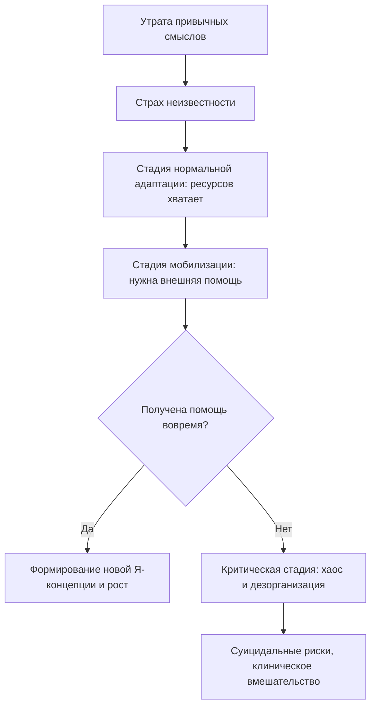

Человек теряет работу, отношения или здоровье. Мир, который казался прочным, распадается. Ответ на вопрос «Кто я?» исчезает вместе с привычной ролью. Впереди — неизвестность. Это состояние, когда старая жизнь рухнула, а новая ещё не родилась, психологи называют **экзистенциальным кризисом** *(Ушков, 2026)*.

Кризис — не конец. Это **пограничная ситуация**, которая разрушает устаревшие модели поведения и подталкивает к формированию новой, более сложной и зрелой Я-концепции *(Ушков, 2026; Ялом, 2020)*. Но этот путь проходит через три стадии, и каждая требует разных действий.

### Потеря идентичности: ядро кризиса

В центре любого экзистенциального кризиса лежат два процесса: **потеря личностной идентичности** и **страх перед неизвестностью** *(Ушков, 2026)*.

Идентичность — это ответ на вопрос «Кто я?». Человек определяет себя через профессию, отношения, социальную роль. Когда эта опора рушится, он оказывается в пустоте: не знает, кем стал и кем может стать *(Ушков, 2026)*.

Неизвестность парализует. Дискомфортная, но *известная* боль кажется безопаснее, чем пугающая *неизвестность* будущего. Именно поэтому люди так сопротивляются переменам: они предпочитают страдать по-старому, чем шагнуть в новое *(Ушков, 2026)*.

> Кризис — это не болезнь. Это доказательство того, что человек способен расти. Без столкновения с неизвестностью личность никогда бы не пересматривала свои ценности и не совершала бы духовного прорыва *(Лукас, 2019)*.

### Три стадии кризиса: от адаптации к хаосу

Кризис развивается через постепенное исчерпание внутренних ресурсов *(Ушков, 2026)*.

| Стадия | Состояние | Ресурсы | Задача |
|---|---|---|---|
| **Нормальная адаптация** | Баланс напряжения и релаксации, гибкость мышления | Достаточно собственных сил | Решить проблему самостоятельно |
| **Мобилизация** | Рост напряжения, собственных сил уже недостаточно | Истощаются, нужна внешняя поддержка | Обратиться за помощью |
| **Критическая** | Дезорганизация, безнадёжность, утрата смысла | Исчерпаны полностью | Остановить разрушение, получить клиническую помощь |

На критической стадии мышление теряет гибкость. Сознание сужается до чёрно-белого восприятия. Возникают суицидальные риски *(Ушков, 2026)*.

### Сверху вниз: от краха идентичности к параличу воли

На макроуровне человек сталкивается с разрушением своей Я-концепции. Мир раскалывается на «до» и «после». Это глобальное крушение спускается на микроуровень в виде **паралича воли**: человек не способен принять простейшее решение *(Ушков, 2026)*.

Сознание сужается. Человек совершает импульсивные, деструктивные поступки — резко бросает семью или работу — пытаясь найти хоть какую-то определённость. Но сломать старое — быстро, а на сборку нового уходят годы *(Ушков, 2026)*.

### Снизу вверх: от локальной неудачи к тотальному отчаянию

Человек теряет работу. Сначала он пытается найти такую же позицию — это микро-поведение избегания нового. Получая отказы, он испытывает страх перед новым коллективом и сменой сферы деятельности, так как это шаг в неизвестность *(Ушков, 2026)*.

Локальный страх постепенно накапливается. Ресурсы истощаются. Наступает стагнация. Через шесть месяцев этот локальный неуспех перерастает в глобальный экзистенциальный кризис с полной потерей профессиональной и личностной идентичности *(Ушков, 2026)*.

### Клинические свидетельства: анатомия разрушения и восстановления

**Иллюзия быстрого разрушения.** Человек, чьи старые смыслы утратили ценность, начинает импульсивно разрушать свою жизнь — изменяет партнёру, увольняется. Он считает, что новый мир построится сам собой. Но не сформировав новые связи и не найдя внутреннюю опору, он оказывается в полном вакууме и регрессирует *(Ушков, 2026)*.

**Хроническая безработица как паралич.** Потерявший работу человек панически боится шагнуть в новую сферу. Замирание и ожидание чуда приводят к тому, что после шести месяцев безработицы он полностью дезадаптируется. Ему уже требуется глубокое психологическое сопровождение для восстановления мотивации *(Ушков, 2026)*.

**Крик о потере человеческого.** Элизабет Лукас описала кадр из фильма: человек в состоянии глубочайшего кризиса кричит в отчаянии: «Я сдохну, как животное!». Этот крик обнажает ядро кризиса — страх потери человеческой идентичности. Только когда другой человек помогает ему увидеть шанс на восстановление человеческого в себе, наступает прозрение и начинается выход из критической стадии *(Лукас, 2019)*.

### Ошибки помощи: чего нельзя делать в кризисе

Если психолог просто советует «расслабиться» или «принять решение быстрее», это приводит к катастрофе. На критической стадии гибкость мышления утрачена. Задача специалиста — не давать готовых ответов, а поставить на паузу деструктивные порывы и дать инструменты саморегуляции *(Ушков, 2026)*.

Если на стадии мобилизации человек обращается за помощью, но получает безразличие, обесценивание или ответ «давай завтра», его запрос капсулируется. Мир раскалывается, и возврат к старой системе поддержки становится невозможным *(Ушков, 2026)*.

### Практика: инвентаризация ресурсов

В кризисе мышление становится туннельным: человек помнит только плохое *(Ушков, 2026)*. Чтобы замедлиться и вернуть осознанность, выполните технику **«Инвентаризация ресурсов»**.

1. Возьмите лист бумаги. Выберите текущую пугающую вас неопределённость.
2. Разделите лист пополам. В левой колонке напишите 3 внутренних качества (знания, навыки, черты характера) и 3 внешних фактора (люди, финансы, обстоятельства), которые помогли вам дойти до сегодняшнего дня.
3. В правой колонке напишите, какие из этих же ресурсов потребуются завтра, чтобы сделать один, самый маленький и безопасный шаг в неизвестность.

Это действие снижает критическое напряжение и возвращает чувство контроля *(Ушков, 2026)*.

### Заключение и Литература

Экзистенциальный кризис — это поворотная точка, а не тупик. Его ядро — потеря идентичности и страх неизвестности. Кризис развивается через три стадии, и на каждой из них человеку необходимы разные ресурсы. Ключ к выходу — не импульсивное разрушение старого, а постепенное движение в неизвестность с опорой на внутренние и внешние ресурсы *(Ушков, 2026; Лукас, 2019)*.

**Список литературы:**
* Лукас, Э. (2019). *Источники осознанной жизни. Преврати проблемы в ресурсы*. Москва: Никея.
* Ушков, Ф. (2026). *Экзистенциальное консультирование в кризисных ситуациях*.
* Ялом, И. (2020). *Экзистенциальная психотерапия*. Москва: Класс.

---

**Микро-кейс для практики**

Женщина, 42 года, после развода потеряла привычный уклад жизни. Она определяла себя через роль жены и матери. Дети-подростки всё больше времени проводят отдельно. Она не работала 15 лет и боится выходить на рынок труда. Вместо того чтобы искать новые возможности, она месяцами сидит дома, отклоняет предложения подруг и всё чаще говорит: «Моя жизнь закончилась».

**Вопрос:** Определите, на какой стадии кризиса находится эта женщина. Объясните, почему страх неизвестности удерживает её от поиска работы, несмотря на очевидную необходимость. Используя понятия «потеря идентичности» и «паралич воли», предложите, какой минимальный шаг мог бы стать для неё началом выхода из критической стадии.
