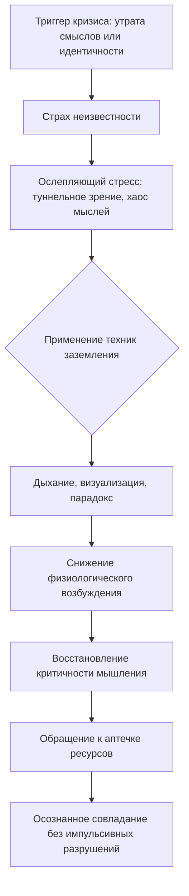

Человек узнаёт об увольнении. Или о диагнозе. Или о предательстве. Мир рушится. Мысли начинают скакать, как обезьяны с ветки на ветку. Дыхание перехватывает. Руки трясутся. Сознание сужается до чёрно-белого туннеля: всё плохо, выхода нет, будущего нет *(Ушков, 2026)*.

В этом состоянии философские поиски смысла бесполезны и даже опасны. Сначала нужно остановить панику. Методы **экстренной саморегуляции** — это тактические «якоря», которые связывают бушующий разум с телом и моментом «здесь и сейчас», возвращая человеку способность думать и действовать *(Ушков, 2026)*.

### Пауза как спасение: фундамент экстренной помощи

В основе всех техник лежит один принцип: **принудительная пауза**. Без остановки автоматических панических реакций невозможно вернуть критичность мышления *(Ушков, 2026)*.

В стрессе мышление теряет гибкость. Мысли превращаются в «мартышек, которые прыгают с ветки на ветку». Человек помнит только плохое и ослеплён эмоциями. Прямое логическое переубеждение не работает. Требуется физиологический «взлом» системы — через сенсорику и дыхание — чтобы в обход паникующего разума успокоить вегетативную нервную систему *(Ушков, 2026)*.

### Пять техник заземления: от тела к разуму

Методы первой помощи делятся на три функциональные категории *(Ушков, 2026)*.

| Категория | Техника | Механизм |
|---|---|---|
| **Телесно-соматическая** | Дыхание по квадрату | Ритмичное дыхание создаёт контролируемую гипоксию, замедляя сердечный ритм |
| **Телесно-соматическая** | Парадоксальная релаксация | Намеренное усиление тремора разрывает петлю страха |
| **Когнитивно-сенсорная** | Повседневная осознанность | Тотальное погружение в процесс (чистка зубов) заземляет в настоящем |
| **Когнитивно-сенсорная** | Визуализация «лимон» | Мысленный образ запускает реальный физиологический отклик |
| **Стратегическая** | Аптечка ресурсов | Заранее составленная карта опор для чтения в момент паники |

### Каждая техника в деталях

**Повседневная осознанность.** Утренняя чистка зубов с полным погружением в процесс — внимание направляется исключительно на текстуру пасты, её запах и движения щётки. Эта практика работает как мощная **дерефлексия**: она заземляет человека в настоящем моменте и отключает тревогу предвосхищения *(Ушков, 2026)*.

**Визуализация «лимон».** Человеку предлагают мысленно положить дольку лимона на язык, почувствовать её запах и кислоту. Физиологический отклик (слюноотделение) наступает мгновенно. Это доказывает мозгу: внутренний фокус внимания способен управлять физиологией, а значит, чувство опоры можно вернуть *(Ушков, 2026)*.

**Дыхание по квадрату.** Строго ритмичное дыхание (вдох — задержка — выдох — задержка, каждый этап по 4 секунды) создаёт эффект **контролируемой гипоксии**. Она принудительно замедляет сердечный ритм и снимает симпатическое возбуждение *(Ушков, 2026)*.

**Парадоксальная релаксация.** Работает по принципу «крутить руль в сторону заноса». Чтобы снять тремор или напряжение, нужно волевым усилием максимально их усилить. Это разрывает петлю страха ожидания: когда симптом вызывается намеренно, он исчезает *(Ушков, 2026; Франкл, 1990)*.

> Франкл иллюстрировал этот феномен случаем молодого врача, который панически боялся вспотеть на людях. Как только он решил: «Сейчас я покажу им, как с меня сойдёт десять литров пота!» — страх ожидания был разрушен, и потливость мгновенно прекратилась *(Франкл, 1990)*.

**Аптечка ресурсов.** Карта ресурсов (внутренних навыков и внешних опор), составленная *заранее* на листке бумаги, позволяет ослеплённому стрессом человеку буквально прочитать инструкцию по собственному спасению, когда его оперативная память отключена паникой *(Ушков, 2026)*.

### От глобальной катастрофы к вкусу зубной пасты

**Сверху вниз.** На макроуровне человек переживает крушение Я-концепции: потеря работы, разрушение семьи или утрата жизненного смысла. Ослепляющий ужас полностью парализует способность планировать. Техники саморегуляции спускают этот глобальный ужас на микроуровень: человеку запрещается думать о будущем. Его единственная задача — двухминутная концентрация на чистке зубов. Успешно контролируя эту крошечную реальность, человек доказывает своей психике: мир всё ещё осязаем и управляем *(Ушков, 2026)*.

**Снизу вверх.** В момент стрессового приступа руки предательски трясутся. Человек применяет парадоксальную релаксацию — заставляет руки дрожать ещё сильнее. Тремор исчезает. Из этой локальной физиологической победы рождается мощный инсайт: «Если я могу управлять своими симптомами, значит, я не беспомощная жертва обстоятельств» *(Ушков, 2026; Франкл, 1990)*.

### Клинические свидетельства: когда техника спасает жизнь

**Хроническая безработица.** Потерявший работу человек панически боится шагнуть в новую сферу. Замирание и ожидание чуда приводят к полной дезадаптации через шесть месяцев. Именно заранее составленная карта ресурсов — с выписанными прошлыми успехами, навыками и внешними опорами — позволяет найти точку опоры и выйти из оцепенения *(Ушков, 2026)*.

**Писчий спазм.** Бухгалтер страдал тяжёлым писчим спазмом — рука не могла писать. Стоило ему решить писать «как курица лапой» (парадоксальная релаксация), как спазм отступал *(Франкл, 1990)*.

**Разрушение без замены.** Если проигнорировать техники и позволить кризису развиваться стихийно, человек может импульсивно разрушить свою жизнь — уволиться, разрушить брак. Сломать старое — быстро. Собрать новое — годы. Пауза, созданная техниками саморегуляции, защищает от необратимых решений *(Ушков, 2026)*.

### Практика: сборка аптечки ресурсов

Составьте карту ресурсов *до* того, как наступит кризис.

1. Возьмите лист бумаги и ручку (письмо задействует моторику и заземляет).
2. Разделите лист на две колонки.
3. В левой колонке (**Внутренние ресурсы**) запишите 3 ваших качества, навыка или черты характера, которые в прошлом помогали вам выжить в сложной ситуации.
4. В правой колонке (**Внешние ресурсы**) запишите 3 внешних фактора, на которые вы можете опереться: конкретный друг, финансовая «подушка», безопасное место.
5. Сфотографируйте листок на телефон. В момент ослепляющего стресса, когда мысли начнут скакать, достаньте этот список и прочитайте его вслух. Это мгновенно вернёт критичность мышления *(Ушков, 2026)*.

### Заключение и Литература

Методы экстренной саморегуляции — это не замена глубинной терапии, а тактическая скорая помощь. Их задача — создать паузу между триггером и реакцией, вернуть человеку контроль над телом и разумом и не допустить импульсивных разрушений. Осознанность, дыхание, визуализация, парадоксальная релаксация и аптечка ресурсов — пять инструментов, которые превращают хаос паники в управляемый процесс *(Ушков, 2026; Франкл, 1990)*.

**Список литературы:**
* Лукас, Э. (2019). *Учебник логотерапии. Представление о человеке и методы*. Москва: Московский институт психоанализа.
* Ушков, Ф. (2026). *Экзистенциальное консультирование в кризисных ситуациях*.
* Франкл, В. (1990). *Человек в поисках смысла*. Москва: Прогресс.

---

**Микро-кейс для практики**

Мужчина, 38 лет, узнал, что его компанию закрывают и через месяц он останется без работы. Его ипотека, двое детей и жена в декрете. В момент получения новости он чувствует, как земля уходит из-под ног. Руки начинают дрожать. Мысли мечутся: «Нужно срочно устроиться хоть куда-нибудь», «Может, занять денег», «А если продать квартиру?», «Я не смогу прокормить семью». Он готов прямо сейчас отправить резюме на первую попавшуюся вакансию.

**Вопрос:** Определите, на какой стадии кризиса находится этот мужчина. Объясните, почему импульсивная отправка резюме в состоянии паники может навредить. Какие две техники из пяти вы применили бы в первые 10 минут и почему? Как заранее составленная «аптечка ресурсов» могла бы изменить его реакцию?
