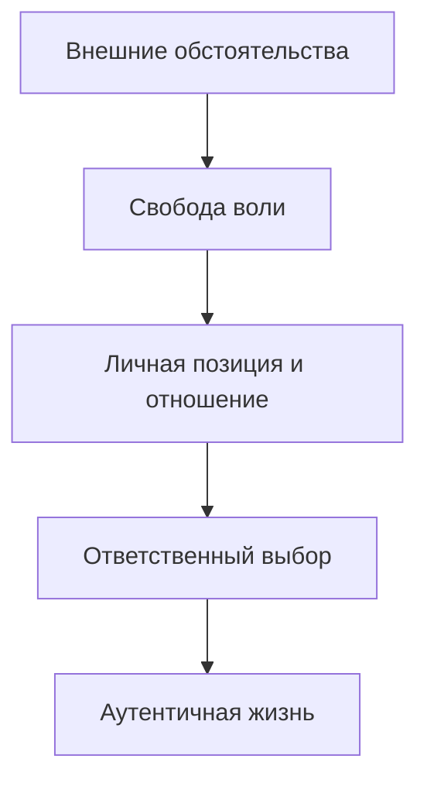

Многие люди часто чувствуют себя заложниками обстоятельств или жертвами прошлого опыта. Экзистенциальный анализ предлагает альтернативный взгляд: человек может стать свободным автором своей судьбы, если примет на себя ответственность за собственные выборы.

Этот подход помогает проживать каждый день с глубоким внутренним ощущением того, что вы делаете именно то, что вам нравится. В результате жизнь перестает быть механическим выполнением функций и наполняется личным смыслом.

## Суть подхода: Свобода воли и четыре данности

Экзистенциальный анализ — это направление психотерапии, которое помогает человеку прийти к аутентичному и эмоционально полному переживанию жизни *(Лэнгле; Ялом)*. Психологи рассматривают личность не как биологический механизм, а как духовное существо, способное выбирать свой путь. Специалисты выделяют четыре фундаментальные проблемы или «данности», с которыми сталкивается каждый: смерть, свобода, изоляция и бессмысленность *(Ялом)*.

Краеугольным камнем подхода считается **свобода воли**. Это способность человека занять осознанную духовную позицию по отношению к любым, даже самым тяжелым обстоятельствам. Если мы признаем, что у человека нет свободы, то вся концепция личной ответственности и поиска смысла разрушается.

## Теория и практика: Экзистенцанализ и Логотерапия

Виктор Франкл предложил разделять теоретическую и практическую части своего учения *(Франкл, 1959)*:
* **Экзистенциальный анализ** выступает как антропологическая теория. Она исследует саму сущность человека и ищет ответ на вопрос: «Что есть человек?».
* **Логотерапия** представляет собой конкретный метод терапевтического лечения. Этот метод центрирован на смысле и отвечает на вопрос: «Как именно помочь пациенту?».

## Динамика изменений: От тревоги к смыслу

Процесс работы в экзистенциальном подходе напоминает встречное движение от философских идей к реальному опыту.

1. **Движение сверху вниз.** Человек осознает свою «заброшенность» в мир и сталкивается с пугающей свободой или конечностью жизни. Психотерапия помогает перевести этот философский ужас в плоскость ежедневных поступков. Человек берет ответственность за мелкие действия, что парадоксально возвращает ему контроль над всей жизнью.
2. **Движение снизу вверх.** Часто люди обращаются за помощью из-за **«невроза выходного дня»**. Это состояние характеризуется чувством пустоты и апатии, когда привычная суета прекращается. Психолог видит в этом «экзистенциальный вакуум» и помогает пациенту открыть уникальные ценности, которые наполнят его бытие.

### Логика экзистенциального ответа

## Пять столпов экзистенциального анализа

Для понимания того, как работает этот метод, важно выделить его ключевые элементы:

* **Конечная цель.** Терапевт помогает преодолеть духовное отчаяние и возвращает человеку чувство витальности *(Бьюдженталь; Ялом)*.
* **Суть метода.** Это динамический подход, который фокусируется на текущих проблемах существования, а не на анализе причин из глубокого детства *(Ялом)*.
* **Обоснование.** Современный человек часто теряет смысл из-за отсутствия жестких традиций. Попытка лечить такое отчаяние только таблетками — это ошибка, так как она игнорирует здоровое духовное ядро личности *(Франкл; Лукас)*.
* **Механизм работы.** Терапия происходит через подлинную человеческую встречу (encounter). Психолог помогает активировать **самодистанцирование** (взгляд на себя со стороны) и **самотрансценденцию** (выход за пределы эго ради смысла или любви).
* **Ограничения.** Если терапевт оправдывает все проблемы пациента только плохим детством, он превращает его в «беспомощную марионетку». Реальные изменения требуют не просто разговоров, а решений и обязательств *(Мэй)*.

> **Главный инсайт:** Свобода — это не отсутствие ограничений, а способность выбирать свое отношение к ним.

---

## Практическое упражнение: Шаг к авторству жизни

В ближайшие 30 минут выберите одну рутинную задачу, которую вы обычно делаете автоматически (например, уборку или проверку почты). Остановитесь и задайте себе вопрос: **«Делаю ли я это сейчас как свободный автор своей жизни?»**.

Если чувствуете сопротивление, найдите в этой задаче свой личный смысл — ответьте на вопрос, ради кого или чего вы это делаете. Это мгновенно переключит вас из режима пассивного исполнителя в позицию ответственного создателя своей реальности.

## Заключение и Литература

Экзистенциальный подход доказывает, что человек всегда больше своего диагноза или прошлого. Принятие ответственности за свою жизнь — это трудный, но единственный путь к настоящей свободе.

* Бьюдженталь, Дж. (2020). *Искусство психотерапевта*. Питер.
* Лукас, Э. (2019). *Источники осознанной жизни. Преврати проблемы в ресурсы*. ТД Никея.
* Лукас, Э. (2019). *Учебник логотерапии. Представление о человеке и методы*. МИП.
* Мэй, Р. (1958). *Экзистенциальная психология*..
* Франкл, В. *Человек в поисках смысла*..
* Ялом, И. *Экзистенциальная психотерапия*..

---

**Контрольное задание для самопроверки:**

Прочитайте описание клинического случая:
*Пациент жалуется на хроническую скуку и отсутствие интереса к работе, несмотря на высокий доход. Он утверждает, что «так живут все» и у него нет сил что-то менять, потому что его родители всегда были депрессивными.*

**Вопрос:** Используя концепции самодистанцирования и свободы воли, объясните, как экзистенциальный аналитик поможет этому пациенту выйти из позиции «пассивной марионетки»? Какие «экзистенциальные данности» здесь могут быть затронуты?
