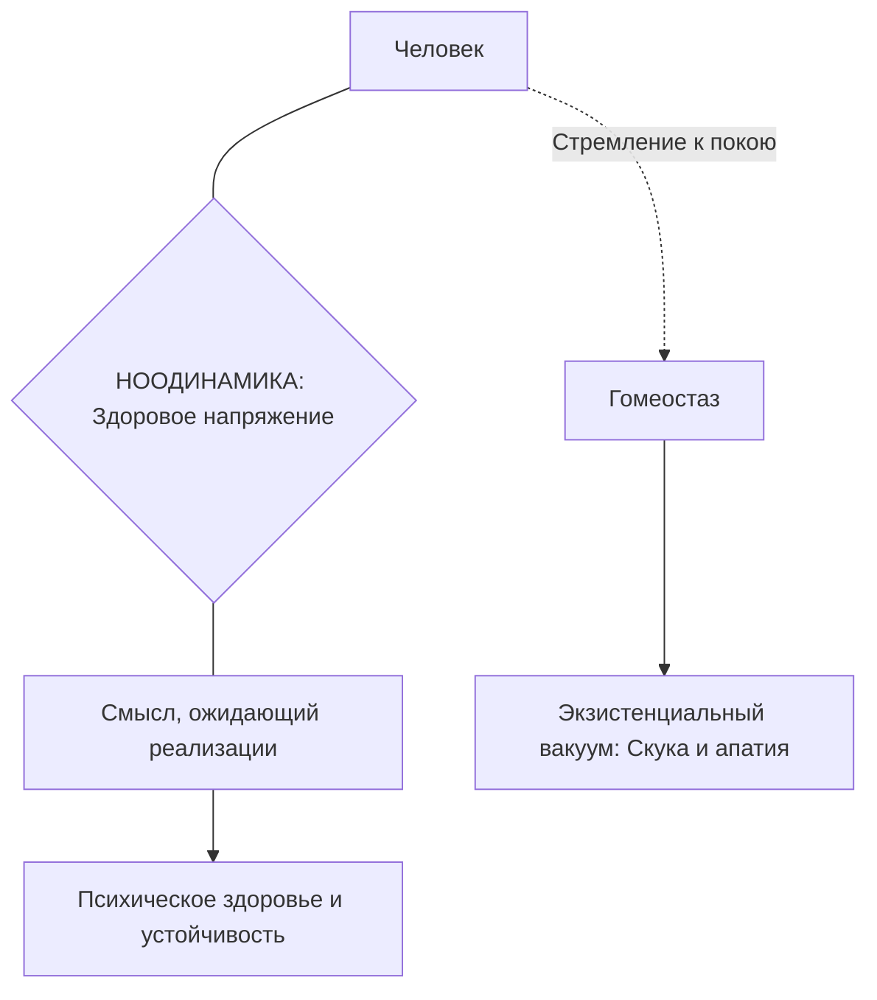

Многие люди годами ищут «смысл жизни», воспринимая его как далекую и абстрактную цель. Однако экзистенциальная психология утверждает: смысл — это не то, что человек придумывает сам, а то, что он обнаруживает в окружающем мире, отвечая на конкретные задачи каждого дня *(Франкл, 1990)*.

Понимание природы смысла помогает людям выбраться из состояния апатии и внутренней пустоты. В этой статье мы разберем, как совершить «коперниковский переворот» в сознании и научиться видеть требования реальности, которые жизнь предъявляет лично вам.

### Коперниковский переворот: Жизнь задает вопросы

Виктор Франкл предложил радикально изменить взгляд на отношения человека и мира. Часто люди спрашивают: «Чего мне ждать от жизни?». Логотерапия разворачивает этот вопрос на 180 градусов: жизнь сама постоянно ставит перед человеком задачи, на которые он обязан отвечать своими поступками *(Франкл, 1990)*.

Человек перестает быть пассивным ожидателем счастья. Он становится ответственным деятелем, который каждый час решает, как лучше поступить в текущей ситуации. Смысл здесь выступает как объективное требование момента, которое нужно не изобрести, а открыть во внешнем мире *(Франкл, 1990)*.

### Три грани смысла: Уникальность, время и объективность

Каждый человек находит свой смысл, который невозможно заменить чужим опытом. Психологи выделяют три ключевые характеристики этого процесса:

* **Уникальность.** Никто другой не может прожить вашу жизнь или выполнить вашу задачу за вас *(Франкл, 1990)*.
* **Относительность.** Смысл привязан к ситуации «здесь и сейчас». Он меняется каждый день и даже каждый час *(Франкл, 1990)*.
* **Транссубъективность.** Смысл — это не фантазия или каприз. Это объективная реальность внешнего мира, которую человек распознает как «лучшее из возможного» в данных обстоятельствах *(Лукас, 2019)*.

### Ноодинамика: Почему напряжение полезно для здоровья

В современной культуре часто пропагандируют стремление к полному расслаблению и покою. Психологи называют это состояние гомеостазом. Однако для человека полное отсутствие напряжения губительно, так как оно ведет к «экзистенциальному вакууму» — скуке и потере интереса к жизни *(Лукас, 2019; Франкл, 1990)*.

Человеку жизненно необходимо здоровое внутреннее напряжение, которое называют **ноодинамикой**. Это силовое поле, где на одном полюсе находится сам человек, а на другом — смысл, который он должен осуществить *(Франкл, 1990)*.

Инженер-архитектор знает, что для укрепления старой арки нужно увеличить нагрузку на нее. Так ее части крепче соединяются *(Франкл, 1990)*. Точно так же и человек обретает душевную устойчивость, когда берет на себя груз ответственности за конкретное дело или другого человека.

### Как люди открывают смысл: Метафора с кошками

Смысл невозможно произвести или выдумать специально. Элизабет Лукас объясняет это на примере поиска кошек на улицах города. Если человек идет искать кошек, его поиск не создает их из пустоты — они объективно существуют там и без него *(Лукас, 2019)*.

Задача человека — использовать свою совесть как компас, чтобы уловить «магнетизм» смысла и перевести его в действие. Счастье и самореализация при этом не могут быть прямой целью. Они приходят только как побочный эффект от выполнения задачи, которая находится за пределами интересов собственного «Я» *(Франкл, 1990)*.

> **Главный закон:** Тот, кто знает «зачем» жить, способен вынести почти любое «как» *(Франкл, 1990)*.

### Практика: Аудит «Требования момента»

Вам не нужно искать глобальный космический смысл прямо сейчас. Попробуйте выполнить небольшое упражнение в течение следующих 30 минут:

1.  **Оглянитесь вокруг.** Посмотрите на свою комнату, рабочее место или на людей, которые находятся рядом с вами.
2.  **Смените вопрос.** Вместо «Что эта ситуация может дать мне?», спросите: **«Какого конкретного действия или отношения прямо сейчас требует от меня жизнь?»** *(Франкл, 1990)*.
3.  **Выполните это.** Может быть, нужно помыть посуду, позвонить родителям или сосредоточенно закончить отчет.
4.  **Сфокусируйтесь.** Сделайте это действие с полной вовлеченностью. Вы заметите, как внутреннее напряжение превращается в спокойную уверенность.

### Заключение и Литература

Смысл жизни — это не конечная точка, а постоянный диалог человека с миром. Принимая вызовы реальности и отвечая на них действиями, люди находят опору даже в самые трудные времена.

**Список литературы:**
* Лукас, Э. (2019). *Источники осознанной жизни. Преврати проблемы в ресурсы*.
* Лукас, Э. (2019). *Учебник логотерапии. Представление о человеке и методы*.
* Франкл, В. (1990). *Сказать жизни да. Психолог в концлагере*.
* Франкл, В. (1990). *Человек в поисках смысла*.

---

**Микро-кейс для практики:**

Студент-медик готовится к сложному экзамену. Он чувствует сильную усталость и хочет бросить учебу, так как процесс подготовки лишает его комфорта и свободного времени.

**Вопрос:** Используя понятия «ноодинамика» и «гомеостаз», объясните, почему попытка студента бросить учебу ради отдыха может привести его к «экзистенциальному вакууму» в будущем? Как «коперниковский переворот» поможет ему найти силы продолжать подготовку прямо сейчас? Обоснуйте ответ, опираясь на транссубъективность смысла.
