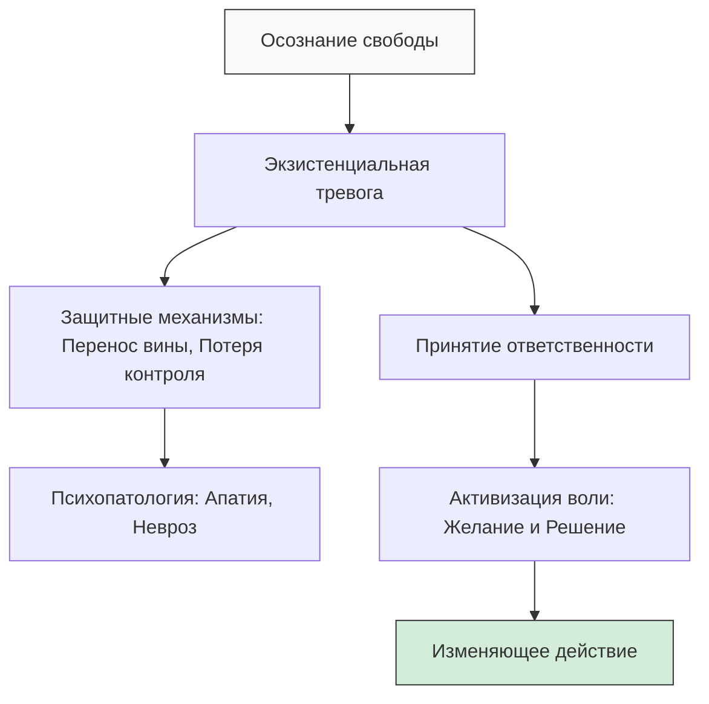

Многие люди чувствуют себя беспомощными марионетками в руках обстоятельств. Такая позиция делает невозможным любое психологическое исцеление или личностный рост. Экзистенциальный подход предлагает иной путь. Он возвращает человеку власть над собственной судьбой через осознание абсолютного авторства своей жизни *(Yalom, 2020)*.

Принятие свободы — это не политическая вольность, а признание того, что под нами нет твердой почвы. Мы сами должны выстраивать свой мир и наполнять его смыслом. Этот процесс часто вызывает тревогу, но именно в нем скрыта сила для реальных изменений *(Yalom, 2020)*.

### Панорама авторства: Свобода как отсутствие внешних опор

Свобода — это отсутствие изначально заданной внешней структуры бытия. В экзистенциальной терапии это понятие означает, что человек сам является неоспоримым создателем своего жизненного замысла *(Yalom, 2020)*. Ответственность же представляет собой бремя этого авторства. Мы отвечаем за свои поступки, чувства и даже за собственные страдания *(Yalom, 2020)*.

Концепция свободы возвращает человеку власть над его будущим. Лишь когда личность признает себя создателем собственных проблем, она обретает реальную силу их изменить *(Yalom, 2020)*. Если человек отрицает свою свободу, он превращается в безвольную марионетку. Он застревает в позиции невинной жертвы инстинктов, дурной наследственности или токсичного общества *(Bugental, 2020; Frankl, 1990)*.

### Архитектура выбора: Как осознание свободы порождает тревогу

Свобода воли — это способность человека занять осознанную духовную позицию. Личность может выбирать свое отношение к влечениям, наследственности и социальной среде *(Frankl, 2019)*. Сама свобода не означает отсутствие этих условий. Она дает право определять свою реакцию на них.

Однако осознание отсутствия внешнего плана часто вызывает экзистенциальную тревогу. Люди называют это чувство «ужасом пустоты» или беспочвенностью *(Yalom, 2020)*. Чтобы избежать этого дискомфорта, психика включает защитные механизмы. Человек отказывается от выбора или делегирует решение другим людям. Это приводит к развитию апатии и невроза *(Yalom, 2020)*. Здоровый путь требует принятия ответственности и активизации воли.

**Воля** — это способность человека к реализации намерений. Она состоит из двух последовательных этапов: желания и решения *(Yalom, 2020)*. Желание представляет собой образную игру с возможностями. Решение — это окончательный выбор, который отсекает другие альтернативы и ведет к действию *(Yalom, 2020; May, 2001)*.

### Векторы ответственности: От космической пустоты к решению в моменте

Человек заброшен во вселенную, где нет заранее написанного для него сценария. Мартин Хайдеггер называл это состояние «вброшенностью» *(Yalom, 2020)*. На макроуровне мы должны сами наполнять значением свой мир. Это рождает головокружительный страх.

Терапия переводит этот космический страх на уровень повседневности. Если внешний мир не диктует вам правил, то структура вашей жизни — это ваша собственная конструкция *(Yalom, 2020)*. Следовательно, вы свободны прямо сейчас изменить скучную работу или разрушительные отношения. Ссылки на непреодолимые препятствия часто служат лишь оправданием для бездействия *(Yalom, 2020)*.

Иногда люди используют даже физиологические привычки для саботажа своей жизни. Пациентка с лишним весом может использовать обжорство, чтобы заблокировать свои истинные желания *(Yalom, 2020)*. Она перекладывает ответственность за исцеление на врача. Тем самым она отказывается от своей свободы и остается в инфантильной позиции *(Bugental, 2020; Yalom, 2020)*.

### Пять столпов автономии: Почему мы сопротивляемся своей силе

Для успешной терапии пациент должен признать факт своего авторства. Без этого у него не появится мотивации и энергии для личностных изменений *(Yalom, 2020)*. Исследование автономии опирается на следующие принципы:

* **Конечная цель:** Возвращение человеку власти над его судьбой. Только автор собственных проблем может стать их решителем *(Yalom, 2020)*.
* **Суть и границы:** Свобода не означает всемогущество. Человек ограничен физическими законами и средой. Однако его психологический выбор остается безграничным *(Yalom, 2020)*. Даже в условиях концлагеря личность сохраняет способность выбирать свое отношение к обстоятельствам *(Frankl, 1990)*.
* **Причина сопротивления:** Люди боятся свободы, потому что она означает экзистенциальную изоляцию. Признать себя автором — значит понять, что ты абсолютно одинок в акте созидания *(Bugental, 2020; Yalom, 2020)*. Также возникает вина за годы, проведенные в саботаже собственного потенциала.
* **Механизм:** Переход к изменениям требует принятия решений. Каждое искреннее решение «убивает» другие возможности. Это напоминает нам о конечности жизни и смерти *(Yalom, 2020)*.
* **Искажения:** Если человек не выдерживает ужаса свободы, он изобретает защиты. Он имитирует «потерю контроля», становится компульсивным или делегирует свои решения лидерам или супругам *(Yalom, 2020)*.

> Культура активно поощряет детерминизм. Он позволяет человеку оставаться в комфортной позиции невинной жертвы обстоятельств *(Bugental, 2020)*.

### Клиническая реальность: Примеры возвращения контроля

Ирвин Ялом осознал свою конституирующую функцию во время плавания среди коралловых рифов. Он понял, что красивые рыбы не знают о своей красоте. Именно он наделял их этим смыслом. Это привело его к осознанию, что он сам творит свой мир из бессмысленной материи *(Yalom, 2020)*.

Виктор Франкл на опыте Освенцима доказал превосходство внутреннего решения над давлением среды. В одних и тех же условиях одни заключенные становились садистами. Другие же раздавали последний хлеб и сохраняли святость *(Frankl, 1990)*. Это доказывает, что личность — это результат решения, а не только среды.

На калифорнийских семинарах участников учили брать на себя полную ответственность. Когда участника ограбили под угрозой револьвера, ведущий указал на его выбор. Человек сам решил пойти на ту улицу и сам решил отдать кошелек ради сохранения жизни *(Yalom, 2020)*. Это экстремальный пример присвоения авторства любому опыту.

Другой пациент считал свою жизнь тюрьмой из-за семьи, работы и собак. Терапевт спросил его: «Почему бы вам не сменить имя и не переехать в Калифорнию?» *(Yalom, 2020)*. Этот вопрос прорвал защиты пациента. Он показал, что текущая жизнь — не бетонный бункер, а паутина из его собственных выборов *(Yalom, 2020)*.

### Вывод и литература

Свобода — это последняя человеческая способность выбирать свое отношение к обстоятельствам. Принятие ответственности за свою жизнь избавляет от позиции жертвы и дает силы для перемен. Каждое наше решение создает наше будущее и определяет, кем мы станем в следующий миг.

**Литература:**
* Бьюдженталь, Дж. (2020). *Искусство психотерапевта*. Питер.
* Бьюдженталь, Дж. (2020). *Наука быть живым. Диалоги между терапевтом и пациентами*.
* Мэй, Р. (2001). *Любовь и воля*.
* Франкл, В. (1990). *Сказать жизни да. Психолог в концлагере*.
* Франкл, В. (1990). *Человек в поисках смысла*.
* Ялом, И. (2020). *Экзистенциальная психотерапия*.
* Ялом, И. (2020). *Лечение от любви и другие психотерапевтические новеллы*.

---

### Проверка понимания

**Микро-кейс: Трансформация «не могу» в «не хочу»**

Представьте человека, который говорит: «Я не могу сменить профессию, потому что рынок труда сейчас очень сложный, а у меня нет нужных связей». Согласно экзистенциальному подходу, это заявление является защитным механизмом, скрывающим страх свободы.

**Задание:**
1. Попробуйте трансформировать это утверждение, используя технику смены формулировок Ирвина Ялома *(Yalom, 2020)*. Замените «Я не могу» на «Я сам добровольно выбираю не делать этого».
2. Какую «честную внутреннюю выгоду» может скрывать человек за фразой о сложном рынке труда?
3. Как такая лингвистическая правка помогает человеку вернуться в «кресло автора» своей жизни?
4. К какому этапу волевого акта (желание или решение) относится этот процесс?
