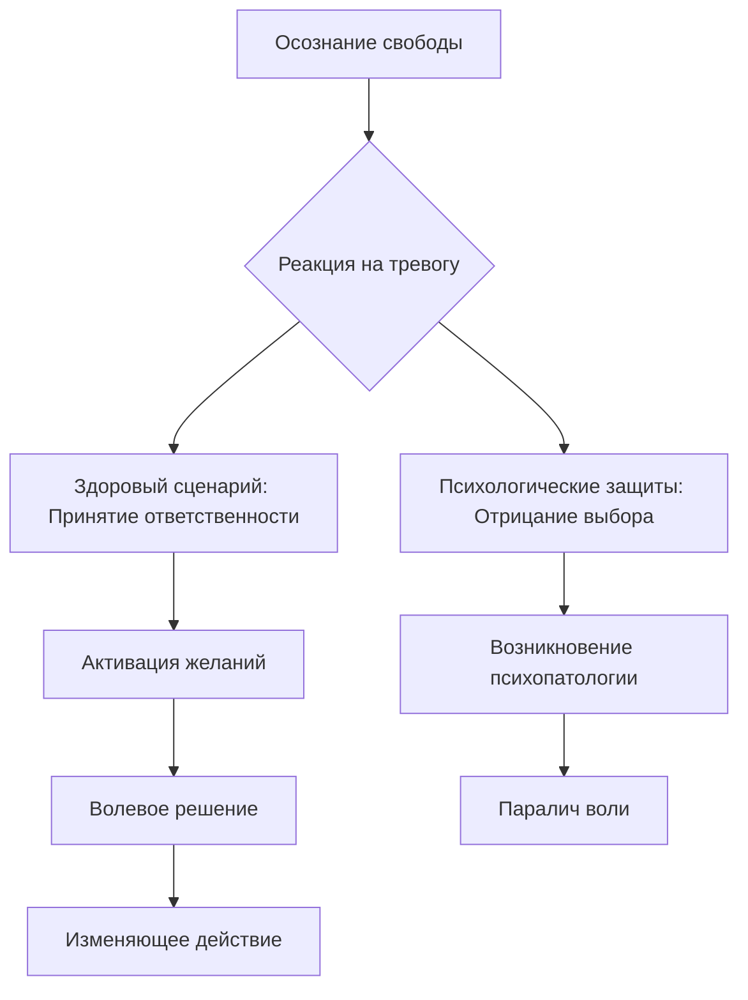

Многие люди часто чувствуют себя заложниками внешних сил: сложной наследственности, токсичного окружения или несправедливой судьбы. Экзистенциальная психология предлагает взглянуть на это иначе — человек является «неоспоримым автором» своего жизненного замысла, своих чувств и даже своих страданий *(Ялом, 2020)*.

Осознание абсолютной ответственности может пугать, но именно в нем скрыта ваша реальная власть. Только признав себя создателем собственных проблем, вы обретаете силу и возможность их изменить *(Ялом, 2020)*. В этой статье мы исследуем, как работает воля и как вернуть себе право выбора в любой ситуации.

### Панорама: Отсутствие внешней опоры и абсолютное авторство

В экзистенциальном подходе свобода и ответственность — это неразрывные данности нашего бытия. У человека нет заранее спроектированной внешней структуры жизни или готовой инструкции по применению *(Ялом, 2020)*. Если бы свободы выбора не существовало, люди навсегда остались бы пассивными марионетками инстинктов или социального окружения *(Мэй, 2001; Франкл, 1990)*.

Человеческая жизнь наполнена постоянным напряжением. С одной стороны, мы ощущаем тяжелое бремя осознания своей свободы, которое иногда перерастает в ужас перед «беспочвенностью» *(Ялом, 2020)*. С другой стороны, мы совершаем отчаянные попытки убежать в иллюзию предрешенности или в болезнь, чтобы не принимать сложные решения.

### Архитектура выбора: Структурная логика воли

Главным элементом человеческой воли является способность занять духовную позицию по отношению к биологическим и социальным факторам. Вы не свободны от инстинктов, наследственности или среды, но вы абсолютно свободны в своем ответе на эти условия *(Франкл, 1990)*. Процесс принятия решений всегда опирается на два полюса воли:

* **Желание:** Это эмоциональная игра с возможностями. Она дает воле теплоту, фантазию и направление.
* **Решение:** Это обязательство перед будущим. Решение отсекает все другие альтернативы и переводит простое желание в конкретное действие.

### Двунаправленная динамика: От космической бездны к рутине

Работа с волей в психологии происходит одновременно на двух уровнях:

1.  **Сверху вниз:** На философском уровне мы заброшены в равнодушную вселенную, где нет готовых смыслов. Человек обречен сам наполнять значением свой мир. Если ваша жизнь кажется «бетонной тюрьмой», важно помнить: она сплетена вами же. Вы свободны прямо сейчас изменить деструктивные отношения или карьеру, перестав оправдываться обстоятельствами.
2.  **Снизу вверх:** Даже банальные привычки могут быть формой бегства от свободы. Рассмотрим случай пациентки Бетти, которая планировала обьедаться сразу после сеанса терапевта *(Ялом, 2020)*. Через этот симптом она симулировала неспособность сопротивляться компульсии. Бетти пыталась переложить ответственность за свое исцеление на терапевта, цепляясь за статус беспомощной жертвы.

### Пять столпов: Глубокое исследование ответственности

Понимание ответственности строится на пяти важных принципах, которые объясняют наши действия:

1.  **Цель изменений:** Психолог возвращает вам ответственность, потому что изменение невозможно без волевого усилия. Пока вы верите, что причина бед лежит во внешнем мире, у вас нет мотивации менять себя *(Ялом, 2020)*.
2.  **Суть и границы:** Свобода — это не магическое всемогущество. Существуют объективные ограничения, такие как «коэффициент неблагоприятности» (например, инвалидность). Однако ваш психологический диапазон выбора — то, как вы относитесь к ограничению — остается безграничным.
3.  **Цена решения:** Каждое искреннее «Да» требует сказать «Нет» всем остальным вариантам. Это ставит человека лицом к лицу с одиночеством и виной за прошлые годы, когда потенциал был заблокирован.
4.  **Механизм работы:** Переход к изменениям происходит через инсайт. Вы должны осознать, что только вы можете изменить созданный вами мир, и у вас есть на это сила *(Ялом, 2020)*.
5.  **Искажения и защиты:** Если страх ответственности слишком велик, мозг изобретает защиты:
    * **Позиция невинной жертвы:** Отрицание своей роли в событиях и жалобы на «плохую судьбу».
    * **Перенос ответственности:** Попытки заставить других людей принимать решения за вас.
    * **Потеря контроля:** Оправдание действий состоянием аффекта или «бессознательным».
    * **Компульсивность:** Иллюзия, что вами управляет чуждая непреодолимая сила (например, трудовая одержимость).

> **Важное напоминание:** Принятие фундаментального решения всегда ставит человека в позицию экзистенциальной изоляции — вы одиноки в своем выборе, и никто не сделает его за вас.

### Доказательная база: Клиническая реальность и свидетельства

История и клиническая практика подтверждают, что авторство жизни возможно даже в самых суровых условиях:

* **Опыт концлагеря:** Виктор Франкл свидетельствовал, что даже в условиях Освенцима у людей оставалась свобода выбора. Одни опускались, другие утешали товарищей и отдавали последний кусок хлеба. Личность узника формировалась его внутренним решением, а не средой *(Франкл, 1990)*.
* **Иллюзия преград:** Пациент терапевта Отто Уилла жаловался на безвыходность жизни из-за семьи и работ. Терапевт спросил: «Почему бы вам не сменить имя и не переехать в Калифорнию?». Этот вопрос показал пациенту, что его жизнь — не ловушка, а конструкция, созданная его решениями *(Ялом, 2020)*.
* **Случай Дэйва:** Пациент жаловался на властную жену. В терапии выяснилось, что его собственная скрытность провоцировала окружающих на контроль. Он сам был архитектором своей «тюрьмы» *(Ялом, 2020)*.

### Практика: От «Не могу» к «Не буду»

Это упражнение помогает мгновенно переключить сознание из позиции жертвы в позицию автора *(Ялом, 2020)*.

1.  Выберите одну личную проблему, где вы чувствуете себя заложником обстоятельств. Например: «Я не могу поговорить с руководителем» или «Я не могу наладить режим сна».
2.  Напишите эту фраза на листе бумаги.
3.  Жестко зачеркните слова **«Я не могу»**.
4.  Перепишите фразу, приняв на себя абсолютное авторство: **«Я сам добровольно выбираю не делать этого, потому что...»**.
5.  Честно допишите вашу вторичную выгоду или страх. Например: «...потому что я выбираю избежать дискомфорта» или «...потому что мне сейчас выгоднее оставаться в стороне».

### Заключение и Литература

Свобода воли — это не дар, а тяжелый труд. Но именно принятие ответственности за каждый свой вдох и поступок делает человека по-настоящему живым и способным к росту.

**Список литературы:**
* Мэй, Р. *Любовь и воля*.
* Франкл, В. *Сказать жизни да. Психолог в концлагере*.
* Франкл, В. *Человек в поисках смысла*.
* Ялом, И. *Лечение от любви и другие психотерапевтические новеллы*.
* Ялом, И. *Экзистенциальная психотерапия*.

---

**Вопрос для самопроверки:**
Проанализируйте любую свою недавнюю жалобу на обстоятельства через призму «коэффициента неблагоприятности». Какие объективные ограничения в этой ситуации действительно существуют, а какая часть проблемы является вашим психологическим выбором (вашим отношением к этим ограничениям)? Опишите, какую вторичную выгоду вы получаете, оставаясь в позиции «невинной жертвы» в данном случае.
