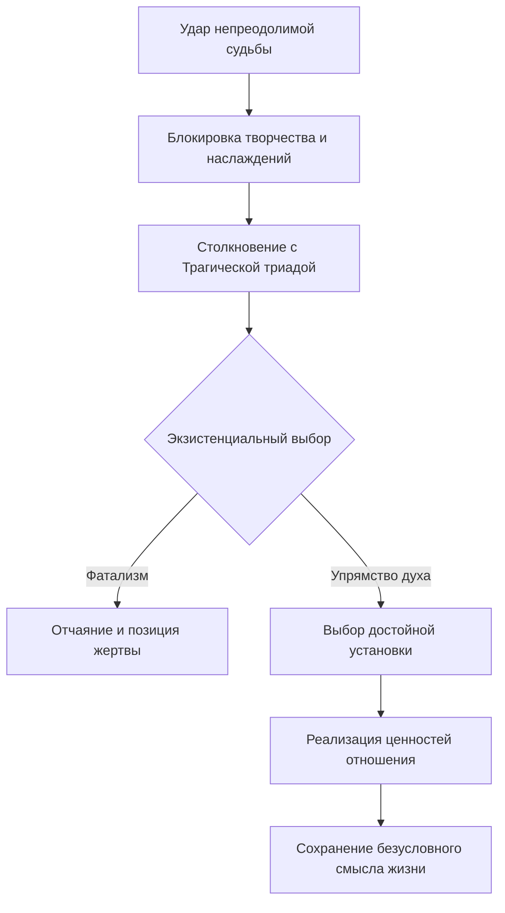

Человек узнаёт, что неизлечимо болен. Или теряет ногу. Или осознаёт, что совершил непоправимую ошибку. Если смысл жизни сводится только к успеху и удовольствию, то в этот момент она обесценивается. Виктор Франкл утверждал обратное: смысл **безусловен**. Жизнь сохраняет его даже перед лицом неизбежного страдания, непоправимой вины и неотвратимой смерти *(Франкл, 1990)*.

Франкл назвал это **трагическим оптимизмом** — способностью сказать жизни «Да», несмотря на боль, вину и смерть. Не вопреки трагедии, а *через* неё *(Франкл, 1990)*.

### Трагическая триада: три лица неизменимой судьбы

Судьба, которую нельзя изменить, проявляется в трёх ипостасях. Франкл назвал их **трагической триадой** *(Франкл, 1990)*.

| Элемент триады | Суть | Экзистенциальный вызов |
|---|---|---|
| **Страдание (Боль)** | Неотъемлемая часть жизни | Как нести этот крест с достоинством? |
| **Вина** | Невозможность изменить совершённые ошибки | Как превратить осознание вины в рост? |
| **Смерть** | Конечность существования | Как жить полноценно, зная о конце? |

> Франкл строго подчёркивал: реализация смысла через страдание возможна *только* когда страдание **неизбежно**. Если ситуацию можно изменить — вылечить болезнь, уйти от тирана — смыслом является действие. Страдание без необходимости — мазохизм, а не героизм *(Франкл, 1990)*.

### Упрямство духа: граница между судьбой и свободой

В основе концепции лежит **ноопсихический антагонизм** — способность здорового духовного ядра человека противостоять больному или детерминированному психофизическому аппарату. Именно здесь проходит граница между Судьбой и Свободой *(Лукас, 2019)*.

Человек не может разрушить стены, которые воздвигает судьба: болезни, катастрофы, старение. Но он обладает уникальным «упрямством духа», позволяющим подняться *над* ними. Смысл обретается не в изменении ситуации, а в изменении самого себя *(Франкл, 1990)*.

### Ценности отношения: царская дорога к смыслу

Когда внешняя ситуация загоняет в угол, человек обращается внутрь себя. Он задаёт вопрос: «Как я могу достойно нести этот крест?». Это реализация **ценностей отношения** — третьей и высшей группы ценностей в логотерапии *(Франкл, 1990)*.

Осознанно принимая боль ради чего-то большего — ради любви к близким, ради того, чтобы стать примером для детей, ради избавления любимых от этой боли — человек трансформирует пассивное претерпевание в активный нравственный акт. Страдание перестаёт быть слепым мучением и становится подвигом *(Франкл, 1990)*.

### Страдание: жертва ради любви

Пожилой врач впал в глубочайшую депрессию после смерти горячо любимой жены. Франкл не мог её воскресить — это была Судьба. Он задал вопрос, апеллирующий к Свободе: «Что было бы, если бы вы умерли первым, а ваша жена пережила бы вас?» *(Франкл, 1990)*.

Врач с ужасом ответил: для неё это было бы невыносимо. Франкл резюмировал: «Вы избавили её от этого страдания, но ценой того, что теперь вам приходится оплакивать её». Объективная Судьба осталась прежней. Но субъективная позиция изменилась кардинально: страдание обрело смысл жертвоприношения ради любимого человека *(Франкл, 1990; Ялом, 2020)*.

### Смерть: сокровищница прошлого

Смерть делает жизнь конечной, но не лишает её смысла. Франкл приводил метафору отрывного календаря. Пессимист с ужасом смотрит, как календарь (будущее) становится всё тоньше. Оптимист снимает каждый листок, делает на нём записи и складывает в архив *(Франкл, 1990)*.

В прошлом ничто не исчезает. Там реализованные возможности сохраняются навечно: пережитая любовь, созданные труды, достойно перенесённые муки. Смерть подводит черту, но не может стереть эту «сокровищницу» *(Франкл, 1990)*.

Умирающая 80-летняя пациентка (фрау Анастасия), осознав этот факт в беседе с Франклом, плакала от счастья: её достижения «никто не может вычеркнуть» *(Франкл, 1990; Ялом, 2020)*.

### Вина: свобода к искуплению

Выступая перед заключёнными тюрьмы Сан-Квентин, Франкл не стал оправдывать их преступления плохой социальной средой. Он заявил: «Вы были свободны совершить преступление, стать виновными. Однако сейчас вы ответственны за то, чтобы превозмочь вину, поднявшись над ней. Вырасти за свои пределы» *(Франкл, 1990)*.

Признание вины — парадоксальное признание свободы. Человек *имел* свободу совершить ошибку, и теперь у него *есть* свобода к искуплению и внутреннему изменению. Это обращение к свободе заключённых, а не к их обусловленности, заставило бывших уголовников организовать группу поддержки и радикально изменить свои жизни *(Франкл, 1990)*.

> Если мы скажем преступнику, что он не виноват, так как у него было тяжёлое детство и плохие гены, мы сведём его к уровню сломанного автомата. Признание вины — это признание достоинства *(Франкл, 1990; Лукас, 2019)*.

### Двойное страдание: ловушка «обязанности быть счастливым»

Э. Вайскопф-Джоэлсон указала на опасность культуры, которая диктует: «Ты обязан быть всегда счастлив». В такой культуре страдающий человек страдает вдвойне: от объективной боли и от ложного стыда за то, что он «неудачник», раз не может быть счастливым. Логотерапия разрушает этот стыд, возвращая страданию статус высочайшего человеческого достижения *(Франкл, 1990)*.

### Биология как судьба: выбор в пределах гипса

Элизабет Лукас привела простой пример диалектики. Юноша сломал локоть, и сустав перестал до конца разгибаться — это Судьба. Он мог занять позицию избегания: «Моя рука повреждена, я буду её беречь». Но он выбрал иную позицию: «Моя рука ослабла, значит, я должен её тренировать и носить тяжести именно ею». Судьба (перелом) была одинаковой. Благодаря выбору отношения рука полностью восстановилась *(Лукас, 2019)*.

### Практика: картография контроля

Вспомните ситуацию, которая вызывает острую фрустрацию или чувство бессилия. Возьмите лист бумаги и разделите его вертикальной чертой.

1. **Левая колонка («Область Судьбы»).** Выпишите жёсткие факты, которые вы не можете изменить никакими действиями. Спросите себя: «Могу ли я это изменить действием?». Если ответ «нет» — оставьте факт слева.
2. **Правая колонка («Моё Свободное Пространство»).** Переключите фокус: «Могу ли я изменить своё отношение?». Выпишите минимум три варианта того, как вы можете мужественно, с достоинством или творчески отреагировать на Судьбу.
3. **Волевой акт.** Выберите один вариант и примите внутреннее решение придерживаться этой установки до конца сегодняшнего дня.

Это немедленно выведет вас из позиции жертвы и вернёт контроль над единственным, что всегда принадлежит вам, — над вашей духовной свободой *(Франкл, 1990)*.

### Заключение и Литература

Трагический оптимизм — не наивная вера в «хэппи-энд». Это мужественное признание того, что жизнь включает боль, вину и смерть, и осознанный выбор найти смысл *внутри* этих неизменимых обстоятельств. Ценности отношения — царская дорога к смыслу, которая открывается именно тогда, когда все остальные дороги закрыты *(Франкл, 1990; Лукас, 2019)*.

**Список литературы:**
* Лукас, Э. (2019). *Источники осознанной жизни. Преврати проблемы в ресурсы*. Москва: Никея.
* Лукас, Э. (2019). *Учебник логотерапии. Представление о человеке и методы*. Москва: Московский институт психоанализа.
* Франкл, В. (1990). *Сказать жизни да. Психолог в концлагере*. Москва: Прогресс.
* Франкл, В. (1990). *Человек в поисках смысла*. Москва: Прогресс.
* Ялом, И. (2020). *Экзистенциальная психотерапия*. Москва: Класс.

---

**Микро-кейс для практики**

Женщина, 60 лет, узнала о неизлечимом заболевании суставов, которое лишит её возможности играть на фортепиано — единственном занятии, которое она считала смыслом жизни. Она говорит терапевту: «Если я не могу играть, моя жизнь не имеет смысла. Мне незачем больше вставать по утрам». При этом у неё есть внучка, которая обожает её и приходит каждую субботу.

**Вопрос:** Разделите ситуацию пациентки на «Область Судьбы» и «Свободное Пространство». Объясните, почему её убеждение «смысл = фортепиано» делает её уязвимой, используя понятие «ценности творчества». Какие конкретные «ценности отношения» и «ценности переживания» остаются для неё открытыми? Почему вопрос «Для чего мне это дано?» продуктивнее, чем «Почему это случилось со мной?»?
