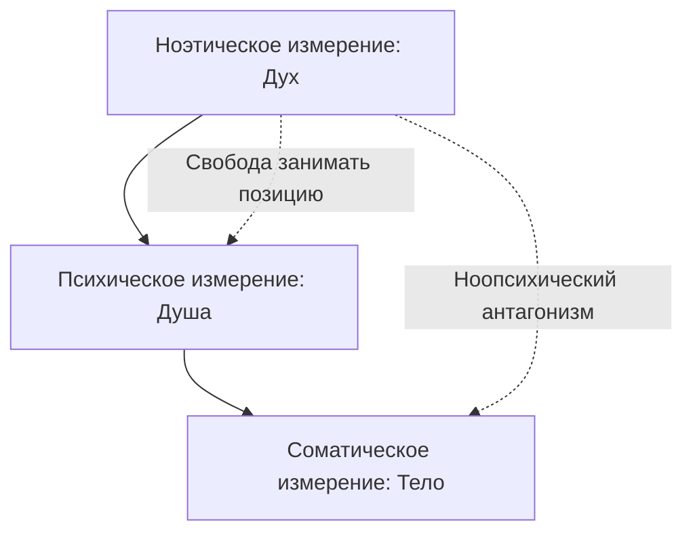

Многие современные науки описывают человека как сложную биологическую машину или набор инстинктов. Однако такой подход лишает нас главного — человеческого достоинства и свободы. Виктор Франкл предложил трехмерную модель, которая возвращает человеку его высшую суть.

Эта модель утверждает, что внутри каждого из нас есть абсолютно здоровая духовная инстанция. Она способна противостоять любым болезням и ударам судьбы *(Франкл, 1990)*. Понимание этого устройства помогает людям находить ресурсы для исцеления даже в самых тяжелых жизненных ситуациях.

### Три измерения: Единство тела, души и духа

Человек — это не просто «трехслойный пирог», а пространство, где три измерения пронизывают друг друга. Димензиональная онтология выделяет три уровня бытия человека:

* **Соматическое (тело):** Это физические и химические процессы, работа клеток и рефлексы.
* **Психическое (душа):** Сюда относятся наши эмоции, инстинкты, интеллект и привычки.
* **Ноэтическое (дух):** Это специфически человеческое измерение, которое включает совесть, любовь, свободу и волю к смыслу *(Лукас, 2019)*.

Низшие уровни (тело и психика) подчиняются жестким законам природы и могут болеть. Но высший уровень — дух — всегда остается нетронутым. Он выступает как высший арбитр, который ищет смысл в происходящем.

### Здоровое ядро: Дух по ту сторону болезни

Главный постулат модели гласит: духовное измерение всегда остается здоровым. Оно не может родиться, умереть или заболеть. Психологи часто сравнивают это с музыкой и музыкальным инструментом *(Лукас, 2019)*.

Если скрипка (тело) сломается или рассохнется, музыка будет звучать искаженно или совсем стихнет. Однако сама мелодия (дух) от этого не исчезает и не портится *(Лукас, 2019)*. Даже при тяжелых поражениях мозга, например, при деменции, духовная личность человека сохраняется. Она просто блокируется «сломанным аппаратом» тела.

> **Важный вывод:** Опора на здоровое духовное ядро позволяет «вытягивать» людей из тяжелых депрессий и зависимостей.

### Ноопсихический антагонизм: Сила упрямства духа

Человек обладает уникальной способностью — **ноопсихическим антагонизмом**. Это механизм, который позволяет духу осознанно сказать «нет» требованиям тела или психики ради высшего смысла *(Франкл, 1990)*.

Например, гневная мать может чувствовать импульс ударить ребенка. Ее психика требует разрядки аффекта. Но в последнюю секунду дух удерживает ее руку, потому что любовь и совесть для нее важнее сиюминутного гнева *(Лукас, 2019)*. В мире животных такая свободная блокировка инстинкта невозможна.

Франкл сравнивал дух со старым мудрым судьей, а инстинкты — с мускулистым обвиняемым. В драке судья проиграет, но решающее слово в иерархии власти всегда остается за ним.

### Ловушки редукционизма: Человек больше, чем его гены

Если психология игнорирует духовное измерение, она превращает человека в жертву судьбы. Это порождает две опасные ошибки:
1.  **Пандетерминизм:** Вера в то, что человек полностью зависит от гормонов, генов или среды.
2.  **Психологизм:** Попытки свести все духовные поиски и метания к детским травмам или комплексам.

Такие взгляды «обесчеловечивают» личность. Признание духовной свободы, напротив, возвращает человеку ответственность за свою жизнь.

### Практика: Как включить «упрямство духа»

Вы можете активировать свою духовную «мышцу» прямо сейчас. Эта практика выведет вас из состояния биологического автомата в позицию автора своей жизни.

1.  **Заметьте дискомфорт.** В ближайшие 30 минут обратите внимание на любой автоматический позыв: лень перед задачей, желание съесть лишнее при стрессе или раздражение.
2.  **Сделайте паузу.** Остановитесь на 10 секунд. Не подчиняйтесь импульсу автоматически.
3.  **Произнесите формулу:** Скажите себе: *«Мое тело сейчас хочет [X], но Я как духовная личность выбираю сделать [Y], потому что для меня имеет смысл...»*.
4.  **Действуйте.** Поступите вопреки импульсу, опираясь на свое решение.

---

### Заключение и Литература

Трехмерная модель напоминает нам: мы всегда больше, чем наши диагнозы или настроения. Наше духовное ядро — это неиссякаемый источник силы, который доступен в любой момент.

**Список литературы:**
* Лукас, Э. (2019). *Источники осознанной жизни. Преврати проблемы в ресурсы*.
* Лукас, Э. (2019). *Учебник логотерапии. Представление о человеке и методы*.
* Франкл, В. (1990). *Человек в поисках смысла*.

---

**Контрольное задание для закрепления:**

Представьте человека с алкогольной зависимостью. На соматическом (лесном) уровне его тело требует алкоголя из-за химических процессов. На психическом уровне он чувствует тревогу и подавленность.

**Вопрос:** Опираясь на концепцию ноопсихического антагонизма, объясните, какой ресурс может использовать этот человек, чтобы отказаться от выпивки? Опишите этот процесс, используя метафору «судьи и силача» или «скрипки и музыки».
