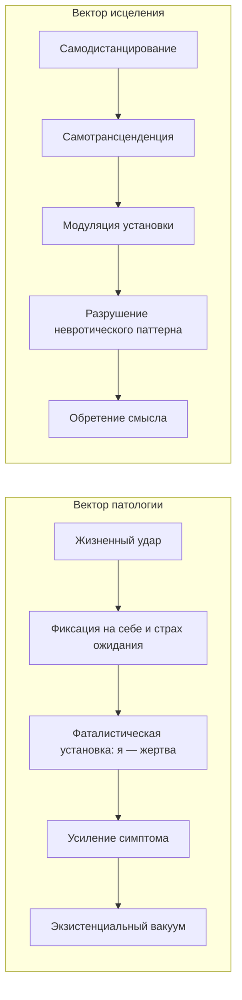

Человек боится выступать на публике — и потеет ещё сильнее от страха вспотеть. Человек мучительно пытается заснуть — и бессонница лишь усиливается от усилий. Человек считает себя жертвой обстоятельств — и остаётся парализованным в бездействии. Логотерапия Франкла предлагает три метода, которые разрывают эти порочные круги, обращаясь не к психике и не к телу, а к **ноэтическому (духовному) измерению** — здоровому ядру личности, которое остаётся свободным при любых обстоятельствах *(Франкл, 1990; Лукас, 2019)*.

Каждый из этих методов активирует одну из двух уникальных человеческих способностей: **самодистанцирование** (взгляд на себя со стороны) или **самотрансценденцию** (выход за пределы своего «Я» ради смысла) *(Франкл, 1990)*.

### Ноэтическое измерение: ядро, которое невозможно сломать

Все три метода опираются на одну аксиому: у человека есть духовное (ноэтическое) измерение, которое всегда остаётся здоровым. В отличие от тела (которое может заболеть) и психики (которая может впасть в невроз), дух «находится по ту сторону здоровья и болезни» *(Франкл, 1990)*.

Именно к этому здоровому ядру обращается логотерапевт. Он не ремонтирует «сломанную машину» — он пробуждает в человеке способность занять позицию по отношению к собственным страхам, симптомам и обстоятельствам *(Лукас, 2019)*.

### Два вектора: патология и исцеление

Болезнь и выздоровление движутся по двум противоположным траекториям *(Франкл, 1990; Лукас, 2019)*.

### Три метода: карта применения

Франкл и Лукас строго разделяют клинические инструменты в зависимости от типа проблемы *(Лукас, 2019)*.

| Метод | Опирается на | Применяется при | Механизм |
|---|---|---|---|
| **Парадоксальная интенция** | Самодистанцирование | Страхи и фобии | Пациент желает того, чего боится — страх теряет власть |
| **Дерефлексия** | Самотрансценденция | Навязчивое самонаблюдение | Фокус внимания переносится с «Я» на внешний мир |
| **Модуляция установок** | Сократический диалог | Столкновение с неизбежной судьбой | Оценка ситуации меняется — человек находит свободное пространство |

### Парадоксальная интенция: юмор против страха

**Парадоксальная интенция** — это приём, при котором пациент сознательно желает того, чего боится. Механизм прост: юмор — высшая форма самодистанцирования — «выбивает ветер из парусов» страха ожидания *(Франкл, 1990)*.

Возникает базовый **парадокс невроза**: чем сильнее человек боится чего-то, тем вероятнее это произойдёт. Чем больше он зациклен на достижении сна или удовольствия, тем дальше они ускользают. Прямое волевое усилие лишь усиливает спазм. Необходим обходной путь *(Франкл, 1990; Лукас, 2019)*.

Молодой врач панически боялся вспотеть на людях. Страх ожидания заставлял его потеть ещё сильнее. Франкл предложил ему перед следующим выступлением сознательно пожелать: «Раньше я потел на один литр, а сейчас выдам целых десять!». Пациент попытался — и обнаружил, что *не может* вспотеть. Петля страха была разрушена *(Франкл, 1990)*.

Элизабет Лукас описала пациента с жесточайшим неврозом навязчивых состояний — он панически боялся микробов. Терапевт обучила его парадоксальной интенции: открывая дверь в гостиную, он заявлял вслух: «Сейчас я наслажусь микробами этих людей, а остальных приберегу к ужину!». Юмор и дистанцирование от страха разрушили невроз за несколько месяцев *(Лукас, 2019)*.

### Дерефлексия: забыть о себе ради смысла

**Дерефлексия** — это перенаправление внимания с себя на внешний мир. Она применяется, когда человек мучительно наблюдает за собственными функциями — процессом засыпания, сексуальной потенцией или работоспособностью *(Лукас, 2019)*.

Эгоцентризм (**гиперрефлексия**) подобен попытке рассмотреть собственную сетчатку глаза: чем пристальнее смотришь, тем меньше видишь. Терапевт ставит «знак остановки» на самокопание и направляет вектор внимания на внешние ценности. Пациент забывает о себе — и психофизиологические функции восстанавливаются автоматически *(Франкл, 1990)*.

**Самотрансценденция** — сущностное свойство человеческого бытия: направленность на то, что не является тобой самим. Смысл всегда находится вовне — в служении делу, в любви к другому. Попытка сделать главной целью «самоактуализацию» или «поиск счастья» обречена на провал: счастье — лишь побочный эффект самотрансценденции *(Франкл, 1990)*.

### Модуляция установок: от жертвы к автору

**Модуляция установок** применяется, когда человек столкнулся с неизменимой данностью: хронической болезнью, утратой близкого, необратимым последствием *(Лукас, 2019)*.

С помощью **сократического диалога** терапевт разделяет жизнь пациента на «область, данную судьбой» (неизменное) и «свободную область». Он показывает: фатализм — это не правда о мире, а отказ использовать своё свободное пространство *(Лукас, 2019)*.

Пожилой врач впал в тяжёлую депрессию после смерти жены. Он находился в позиции жертвы судьбы. Франкл не стал лечить его антидепрессантами. Он задал вопрос: «Что было бы, если бы вы умерли первым, а ваша жена пережила бы вас?». Врач ответил: для неё это было бы невыносимым страданием. Франкл резюмировал: «Вы избавили её от этого страдания ценой своего горя». Факт остался неизменным — жена мертва. Но позиция пациента кардинально изменилась: его страдание обрело смысл как жертва ради любимого человека *(Франкл, 1990)*.

Пациентка Лукас была убита горем из-за смерти сестры-инвалида, считая годы ухода «напрасными». В ходе диалога она осознала: «Благодаря ей в нашей семье была любовь. Мы многим ей обязаны. Она жила не зря». Изменение установки мгновенно сняло горечь бессмысленности *(Лукас, 2019)*.

### Ограничения: когда методы опасны

Применение парадоксальной интенции при тяжёлых эндогенных депрессиях или психозах может нанести катастрофический вред, породив иррациональное чувство вины. При психозах пациент не ответственен за свой симптом. Задача логотерапии там — лишь помочь ему найти смысл в терпеливом перенесении неизбежного. Методы работают исключительно в психогенной или ноогенной (духовной) сфере *(Лукас, 2019)*.

> В концентрационном лагере выживали преимущественно те, кто обладал способностью к самотрансценденции — те, чьё внимание было устремлено к ожидающему смыслу: незавершённому труду или любимому человеку. Как только узник утрачивал смысл и погружался в фатализм, он погибал в течение 48 часов *(Франкл, 1990)*.

### Практика: картография свободы

Возьмите лист бумаги и запишите одну проблему, в которой вы чувствуете себя абсолютно бессильным.

1. Разделите лист вертикальной чертой на две колонки.
2. Левую колонку назовите **«Область, данная судьбой»**. Выпишите туда неизменные факты, объективно вне вашего контроля.
3. Правую колонку назовите **«Моё свободное пространство»**. Напишите минимум три варианта вашей личной реакции на эти факты. Как вы *можете* к этому отнестись?
4. Произнесите вслух выбранный проактивный вариант.

Это немедленно активирует способность к самодистанцированию и выведет вас из экзистенциального паралича *(Лукас, 2019)*.

### Заключение и Литература

Парадоксальная интенция, дерефлексия и модуляция установок — три инструмента, которые обращаются к здоровому духовному ядру человека. Они разрывают порочные круги страха, навязчивого самонаблюдения и фатализма, возвращая человеку авторство собственной жизни. Дух не может заболеть — и именно к нему обращается логотерапия *(Франкл, 1990; Лукас, 2019)*.

**Список литературы:**
* Лукас, Э. (2019). *Источники осознанной жизни. Преврати проблемы в ресурсы*. Москва: Никея.
* Лукас, Э. (2019). *Учебник логотерапии. Представление о человеке и методы*. Москва: Московский институт психоанализа.
* Франкл, В. (1990). *Сказать жизни да. Психолог в концлагере*. Москва: Прогресс.
* Франкл, В. (1990). *Человек в поисках смысла*. Москва: Прогресс.
* Ялом, И. (2020). *Экзистенциальная психотерапия*. Москва: Класс.

---

**Микро-кейс для практики**

Студентка, 22 года, готовится к защите диплома. Она панически боится, что во время выступления у неё задрожит голос и покраснеет лицо. Чем больше она думает об этом, тем сильнее тревога. На репетициях голос действительно дрожит. Она начинает избегать любых публичных ситуаций и всерьёз думает отказаться от защиты.

**Вопрос:** Определите, какой порочный круг (страх ожидания → симптом → усиление страха) действует в данном случае. Предложите формулировку парадоксальной интенции, которую студентка могла бы использовать перед выступлением. Объясните, почему юмор является ключевым элементом этого метода и почему прямое волевое усилие «не бояться» лишь усиливает симптом.
