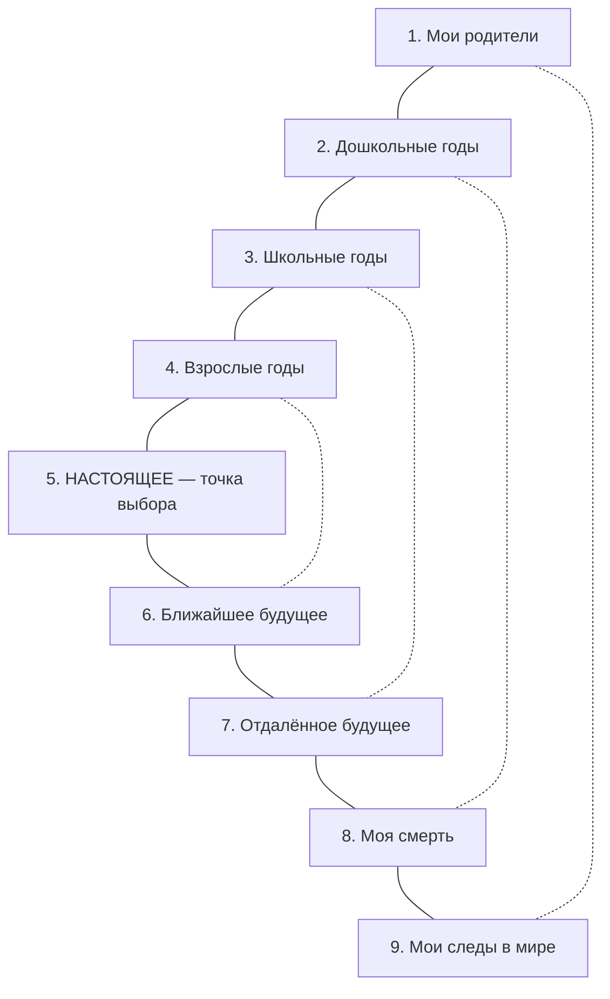

Немецкий поэт Фридрих Рюккерт написал: «Ты ничего не приносишь с собой, ты ничего не заберёшь — оставь золотой след в старой земле». Многие люди считают свои следы ничтожными или хотят их уничтожить. Они не замечают, что каждое слово, каждый поступок и каждое решение уже вплетается в ткань мира *(Лукас, 2019)*.

Элизабет Лукас разработала упражнение **«Опыт встречи с собой»** — структурированный анализ девяти стадий жизни, который помогает человеку интегрировать весь свой опыт в единую осмысленную картину и осознать себя свободным творцом своего уникального следа *(Лукас, 2019)*.

### Почему прямое самопознание невозможно

Лукас подчёркивает парадокс: «Я сам» не может быть прямым предметом познания. Это подобно астроному на Земле, который не может увидеть Землю в свой телескоп. Познать себя можно только через свою «привязку» к миру: через отношение к событиям, людям и периодам жизни *(Лукас, 2019)*.

Поэтому упражнение направлено не на психоаналитическое самокопание, а на экзистенциальный анализ жизненных этапов. Его цель — не найти виноватых, а через самопознание прийти к **самотрансценденции**: способности забыть о себе ради служения смыслу или другому человеку *(Лукас, 2019)*.

### Девять стадий: архитектура жизни

Лукас выстроила 9 глав автобиографии как концентрические круги, обрамляющие Настоящее *(Лукас, 2019)*.

| Контур | Стадии | Экзистенциальная тема |
|---|---|---|
| **Внешний** | 1. Мои родители / 9. Мои следы в мире | Биопсихическая основа и духовное завещание |
| **Второй** | 2. Дошкольные годы / 8. Моя смерть | Беспомощность и абсолютная конечность |
| **Третий** | 3. Школьные годы / 7. Отдалённое будущее | Чужие правила и собственные надежды |
| **Внутренний** | 4. Взрослые годы (прошлые) / 6. Ближайшее будущее | Зона активного действия и планирования |
| **Ядро** | 5. Моё настоящее | Единственный реальный момент, где вершится история |

Симметрия не случайна. На одном полюсе — абсолютная данность рождения (родители). На другом — духовное завещание миру (следы). В центре этой арки — острие Настоящего, где человек ежесекундно совершает выбор *(Лукас, 2019)*.

### Левая и правая страница: механика самодистанцирования

Работа ведётся на развороте тетради *(Лукас, 2019)*.

**Левая страница (Факты).** Пациент записывает хронологические события выбранной стадии: что происходило, кто был рядом, что запомнилось. Только факты и воспоминания, без оценок.

**Правая страница (Позиция и Смысл).** Духовная работа: «Что я чувствую по этому поводу?», «Какой смысл несёт этот опыт?», «Какое наилучшее из возможных решений я могу сформулировать с учётом фактов?». Эта работа переводит неосознанный аффект в осознанную позицию *(Лукас, 2019)*.

Затем текст читается в терапевтической группе. Обратная связь от других участников помогает автору обнаружить слепые зоны и скрытые смыслы *(Лукас, 2019)*.

### Экзистенциальное одиночество как портал к самотрансценденции

Фундамент процесса — встреча с **экзистенциальным одиночеством**. Только осознав свою тотальную уникальность и конечность (никто не проживёт эту жизнь вместо меня), человек обретает способность выйти за пределы эгоистических нужд и направить взгляд в мир *(Лукас, 2019)*.

Способность к **самодистанцированию** — когда человек может посмотреть на свои эмоции со стороны — зарождается в тишине. Человек должен встретиться со своей потерянностью один на один, чтобы внутри этой пустоты услышать зов совести *(Лукас, 2019)*.

### От боли к золотому следу: два направления

**Сверху вниз.** Человек созерцает свою смерть (8-я стадия) и своё духовное завещание (9-я стадия). Понимание того, что смерть неизбежна, а следы оставляются только собственными руками, девальвирует мелкие обиды. Человек прекращает ждать, пока мир сделает его счастливым, и начинает действовать «здесь и сейчас» *(Лукас, 2019)*.

**Снизу вверх.** Пациент заполняет левую страницу хронологией школьных лет: его унижали, он чувствовал себя отвергнутым. Это конкретная локальная боль. Переходя на правую страницу, он ищет смысл: чему научил его этот опыт? Читая текст в группе, получая уважение и новые интерпретации, он приходит к обобщению: его страдания выковали эмпатию, которая теперь помогает поддерживать других. Рана трансформируется в «золотой след» *(Лукас, 2019)*.

### Ловушка позиции жертвы

Если пациент отказывается принимать ответственность и продолжает искать оправдания на стадии «Мои родители», фокусируясь на том, что ему *недодали*, терапия заходит в тупик гиперрефлексии *(Лукас, 2019)*.

В этом случае терапевт радикально меняет фокус: просит оценить не то, что пациент *получил* от родителей, а то, чем он с ними *поделился*. Это мгновенно вырывает человека из позиции жертвы, возвращая субъектность и авторство *(Лукас, 2019)*.

> Исследование психолога Отмара Висмейера (1997) с участием 64 человек подтвердило эффективность метода. За девять месяцев работы с автобиографиями участники обрели уверенность: «За кулисами сцены жизни невидимая созидающая сила заботится о том, чтобы всё было правильно» *(Лукас, 2019)*.

### Практика: микро-сессия «Мои следы в мире»

Проведите 30-минутную сессию самодистанцирования по механике Лукас, сфокусировавшись на 9-й стадии.

1. Возьмите два листа бумаги, положив их рядом (левая и правая страницы).
2. **На левой странице (Факты):** выберите одно конкретное событие текущей недели — тяжёлый разговор, провал на работе или завершение проекта. Опишите его сухо, как хронику.
3. **На правой странице (Позиция и Смысл):** напишите: *«Что я чувствую по этому поводу?»*. Затем задайте вопрос: *«Какой след в мире или в душах других людей я прямо сейчас формирую этой ситуацией?»*.
4. Сформулируйте одно решение, которое позволит превратить этот опыт из пассивного страдания в ваш уникальный «золотой след».

Физическое разделение фактов и духовного отношения к ним мгновенно запустит самодистанцирование и вернёт вам власть автора над собственной историей *(Лукас, 2019)*.

### Заключение и Литература

Упражнение «Опыт встречи с собой» — это не психоаналитическое самокопание, а экзистенциальная архитектура. Девять стадий жизни образуют симметричную конструкцию, в центре которой стоит Настоящее — единственный момент, где человек совершает выбор. Через честный диалог «Я и Я», встречу с экзистенциальным одиночеством и работу на развороте тетради человек интегрирует боль прошлого в осмысленный опыт и осознаёт ответственность за свой «золотой след» в мире *(Лукас, 2019)*.

**Список литературы:**
* Лукас, Э. (2019). *Источники осознанной жизни. Преврати проблемы в ресурсы*. Москва: Никея.
* Лукас, Э. (2019). *Учебник логотерапии. Представление о человеке и методы*. Москва: Московский институт психоанализа.

---

**Микро-кейс для практики**

Мужчина, 55 лет, вышел на раннюю пенсию после сокращения. Всю жизнь он определял себя через профессию — он был «инженером-конструктором». Теперь он чувствует, что его жизнь прожита зря: дети выросли и уехали, жена занята своей работой, а он «никому не нужен». На стадии «Мои родители» он пишет только о том, что отец его не замечал. На стадии «Мои следы» он оставляет страницу пустой, заявляя: «Мне нечего оставить».

**Вопрос:** Объясните, почему фокусировка на «недоданном» от родителей удерживает этого мужчину в позиции жертвы. Какой приём предложила бы Лукас, чтобы вырвать его из гиперрефлексии? Используя симметрию 9 стадий, покажите, как работа со стадиями 8 (смерть) и 9 (следы) может помочь ему обнаружить смысл в текущем «Настоящем» и заполнить пустую правую страницу.
