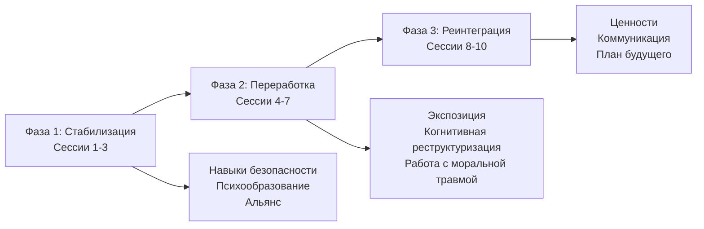

Возвращение с войны — это не только перемещение в пространстве. Комбатант приносит с собой опыт, который не вписывается в мирную жизнь: гипербдительность, вспышки гнева, кошмары, чувство вины. Система ценностей военной культуры — приказ, миссия, братство — вступает в конфликт с требованиями гражданского общества. Чтобы помочь ветерану пройти этот путь, нужна структурированная программа, учитывающая специфику боевой травмы.

Представленная ниже 10-сессионная интегративная модель разработана Е.В. Белоусовой (МГУ им. Ломоносова, 2026) и опирается на доказательные подходы: когнитивно-поведенческую терапию, экспозиционные методы, элементы EMDR, диалектико-поведенческую терапию (DBT) и терапию принятия и ответственности (ACT). Программа разбита на три классические фазы: стабилизация, переработка и реинтеграция. Каждая фаза имеет четкие цели, техники и домашние задания.

## Трехфазная модель: общая структура

## Фаза 1. Стабилизация и альянс (сессии 1–3)

Первые три встречи посвящены созданию безопасного пространства, диагностике и обучению клиента навыкам совладания. Без этого этапа попытка переработки травмы приведет к ретравматизации.

### Сессия 1: Установление контакта и диагностика

**Цели:**
- Установить терапевтический альянс.
- Собрать анамнез.
- Оценить симптомы ПТСР, суицидальный риск, моральную травму.

**Ключевые техники:**

1. **Культурный мост: из системы «война» в систему «терапия».**
   Терапевт вербализует конфликт ценностей:
   *«Я понимаю, что здесь, в кабинете, всё иначе, чем в части. Там были приказы, иерархия, задача любой ценой. Здесь нет начальников и подчиненных. Есть вы, ваш опыт, и я как специалист, который пытается помочь вам разобраться с последствиями того, через что вы прошли. Те навыки, что помогли вам выжить там — гипербдительность, контроль эмоций, подавление слабости — были абсолютно уместны и спасительны. Сейчас, в мирной жизни, они иногда срабатывают «вхолостую» и мешают. Наша задача — не обесценить их, а научиться включать осознанно, когда это нужно, и уметь «отдыхать». Я не буду давать вам приказы. Я буду предлагать гипотезы и техники. Вы — эксперт по своему опыту. Вместе мы будем проверять, что работает для вас. Вы в любой момент можете сказать, если что-то идет не так»*.

2. **Клиническое интервью с акцентом на ПТСР/К-ПТСР (по МКБ‑11).**
   Вопросы:
   - О событии: «Какое событие из пережитого сейчас беспокоит больше всего?»
   - О повторном переживании: «Бывают ли невольные яркие воспоминания, как будто вы снова там?»
   - Об избегании: «Что вы стараетесь не делать, чтобы не стало хуже?»
   - Об угрозе: «Чувствуете постоянную начеку?»
   - Для К-ПТСР: «Случаются ли неконтролируемые всплески гнева или периоды эмоциональной пустоты? Как изменилось мнение о себе? Чувствуете ли вы себя отчужденным от близких?»

3. **Инструменты скрининга:** PCL‑5 (для DSM‑5) и ITQ (для МКБ‑11).
   Обсуждение результатов: *«Это не «диагноз», а карта симптомов, от которой мы будем отталкиваться»*.

**Домашнее задание:**
- **Дневник симптомов.** Записывать дату, триггер, эмоцию, интенсивность (0–10). Цель — выявить закономерности и подготовить материал для обсуждения.

### Сессия 2: Психообразование и нормализация

**Цели:**
- Объяснить природу ПТСР и моральной травмы.
- Снизить стигму.
- Сформировать общее понимание путей работы.

**Ключевые техники:**

1. **Метафора «Травма как незаживающая рана»:**
   *«Представьте, что психическая травма — это глубокая физическая рана. Если ее сразу не обработать и не дать зажить в спокойных условиях, она воспаляется. Симптомы ПТСР — это признаки «воспаления»: боль (флешбеки), жар (гнев, тревога), попытка организма защититься (избегание, оцепенение). Наша терапия — это постепенная, аккуратная обработка этой раны»*.

2. **Модель «Окно толерантности» (Дэниел Сигел):**
   Рисуем схему (гипервозбуждение – окно – гиповозбуждение). Объясняем: *«В норме мы живем в «окне»: можем и чувствовать, и думать. Травма сужает это окно. Любой триггер может резко «выбросить» вас вверх (в панику, ярость) или вниз (в оцепенение, пустоту). Цель первых этапов — расширить окно, научиться замечать «выброс» и мягко возвращаться обратно с помощью навыков»*.

3. **Психообразование о моральной травме:**
   *«Моральная травма возникает, когда вы были вынуждены действовать или стали свидетелем действий, которые противоречат вашим глубинным ценностям. Это не «слабость», а тяжелый внутренний конфликт, который тоже можно переработать»*.

**Домашнее задание:**
- Прочитать адаптированные материалы о ПТСР и моральной травме (памятка).
- Продолжать дневник симптомов.

### Сессия 3: Навыки безопасности и саморегуляции

**Цели:**
- Обучить клиента конкретным техникам совладания с симптомами.
- Создать «копинг-карточку».
- Укрепить чувство контроля.

**Ключевые техники (выбираем 2–3 под запрос):**

1. **Заземление 5-4-3-2-1 (экстренный вариант):**
   *«Когда чувствуете, что начинается паника, флэшбэк или сильная дрожь, остановитесь и переключите внимание: назовите 5 вещей, которые видите; ощутите 4 вещи, к которым можете прикоснуться; прислушайтесь к 3 звукам; различите 2 запаха; осознайте 1 вкус. Это переключает мозг с реакции угрозы на восприятие реальности»*.

2. **Дыхательная техника «Сердечная когерентность 3-6-5» (Серван-Шрейбер):**
   Вдох 5 сек, выдох 5 сек (6 циклов в минуту). Практиковать 3 раза в день по 5 минут. *«Это как перезагрузка для внутренней «системы тревоги»*.

3. **Техника «Четыре стихии»:**
   - **Земля:** поставить стопы на пол, почувствовать опору, заметить 3 вещи вокруг.
   - **Вода:** обратить внимание на сухость во рту, намеренно увлажнить — активирует парасимпатику.
   - **Воздух:** сделать несколько циклов дыхания 4–2–4.
   - **Огонь:** визуализировать безопасное место или ресурсное воспоминание, добавить билатеральную стимуляцию (например, «объятия бабочки»).

4. **Безопасное место:**
   Клиент представляет место абсолютной безопасности (реальное или воображаемое). Детализирует ощущения, находит телесный якорь, придумывает кодовое слово для быстрого доступа.

5. **Контейнирование:**
   *«Представьте крепкий сейф с кодовым замком. Мысленно сложите туда все тяжелые мысли, картинки, ощущения, связанные с травмой. Закройте дверцу, поверните замок. Вы можете договориться с собой, что откроете его снова только на следующей сессии»*. Альтернатива — записать мысли на лист и убрать в ящик.

6. **Прогрессивная мышечная релаксация (ПМР) — адаптированный протокол:**
   Последовательно напрягать и расслаблять группы мышц снизу вверх. Важные адаптации: делать с открытыми глазами, избегать зон, связанных с травмой (например, шея), иметь наготове заземление. Для домашней практики выдается аудиозапись или бланк наблюдений.

7. **Упражнение с мячом для снижения стресса:**
   В недоминантную руку взять мячик, сильно сжать, представляя, что в него стекается всё напряжение. Затем разжать и убрать мяч. В доминантную руку взять ресурсный предмет, представляя, как он излучает благополучие.

**Домашнее задание:**
- Ежедневная 5–10-минутная практика выбранной техники (заземление или дыхание).
- Заполнять бланк наблюдений за ПМР (если практиковали).
- Принести на следующую сессию заполненный дневник симптомов.

## Фаза 2. Переработка травматических воспоминаний (сессии 4–7)

Когда клиент освоил навыки саморегуляции и чувствует опору, можно переходить к работе с памятью.

### Сессия 4: Идентификация триггеров и начало экспозиции in vivo

**Цели:**
- Выявить актуальные триггеры в повседневной жизни.
- Построить иерархию экспозиции.
- Начать с наименее пугающего шага.

**Ключевые техники:**

1. **Построение иерархии для экспозиции in vivo.**
   Совместно с клиентом составляем список ситуаций, которых он избегает (от менее пугающих к самым страшным). Например:
   - Прослушать запись звука салюта.
   - Выйти на улицу в час пик.
   - Посетить торговый центр.
   - Пойти на встречу с сослуживцами.

2. **Первое задание.**
   Выбирается самый легкий пункт. Терапевт объясняет принцип: *«Мы не будем нырять сразу в омут. Мы пойдем маленькими шагами, каждый раз используя навыки заземления. Ваша задача — просто побыть в этой ситуации, не убегая, и заметить, что уровень тревоги со временем снижается сам собой»*.

**Домашнее задание:**
- Выполнить первый пункт иерархии (например, прослушать запись).
- Записать в дневник уровень тревоги до и после.

### Сессия 5: Обработка травматического воспоминания (фокус на страхе)

**Цели:**
- Выбрать «индикаторное» событие.
- Снизить эмоциональный заряд конкретного воспоминания.

**Ключевые техники:**

1. **Выбор события.**
   Из множества травм выбираем одну, которая преследует больше всего, чаще снится, клиент считает корнем проблем.

2. **Экспозиция в воображении (пролонгированная) или EMD (упрощенный протокол EMDR).**
   Клиент подробно описывает событие в настоящем времени, фокусируясь на сенсорных деталях. Через каждые 30–60 секунд терапевт спрашивает уровень дистресса (SUD, 0–10). Повторяем 3–5 раз, пока SUD не снизится на 30–50 %.
   *Важно:* не уходить в диссоциацию — при первых признаках возвращать к заземлению.

   Для EMD используются быстрые движения глаз или постукивания, но без глубокой переработки — просто для десенсибилизации.

**Домашнее задание:**
- Прослушивать аудиозапись сессии (если делали запись) для привыкания.

### Сессия 6: Работа с когнициями и моральной травмой

**Цели:**
- Переработать чувство вины, стыда, долженствований.
- Скорректировать искаженные убеждения.

**Ключевые техники:**

1. **Техника «Пирог ответственности» (для вины выжившего, гиперответственности).**
   На примере гибели товарища:
   - Фиксируем убеждение: «Я виноват на 100 %».
   - Составляем список всех факторов, повлиявших на исход: решения клиента, приказы командования, действия противника, случайность, отказ техники, погода, сама война.
   - Рисуем круг-пирог и распределяем доли ответственности.
   - Анализируем: «Как теперь выглядит ваша вина? Вы несете свою долю, но она разделена с другими силами».
   - Формулируем новое убеждение: *«Я несу ответственность за свои решения в тех невыносимых условиях, но не могу нести ответственность за все факторы войны»*.

2. **Когнитивное реструктурирование типичных искажений:**
   - Катастрофизация: *«Если я услышу салют, я сойду с ума».* Поиск доказательств, что этого не случалось.
   - Чрезмерное обобщение: *«Я не смог спасти их, значит, я полный неудачник».* Поиск контрпримеров.
   - Долженствование: *«Я должен был предвидеть».* Вопрос: *«Были ли у вас все знания и возможности?»*

**Домашнее задание:**
- Заполнить бланк «Пирог ответственности» для ключевого события.
- Использовать бланк работы с мыслями (ситуация – мысль – эмоция – доказательства за/против – альтернатива).

### Сессия 7: Интеграция опыта, работа с горем и утратой

**Цели:**
- Признать потери.
- Найти смысл в пережитом.
- Интегрировать опыт в личную историю.

**Ключевые техники:**

1. **Техника «Письмо погибшему товарищу».**
   Клиент пишет письмо тому, кого потерял. В письме можно выразить благодарность, боль, рассказать, как изменилась жизнь, дать обещание (например, жить достойно). Это не отправляемое письмо, а способ выразить невысказанное.

2. **Обсуждение ценности служения.**
   Вопросы: *«Что значило для вас быть частью подразделения? Какие качества вы цените в себе и сослуживцах? Как это может жить дальше?»*

**Домашнее задание:**
- Закончить письмо.
- Провести личный ритуал прощания (например, сжечь письмо, закопать, сохранить в памятном месте).

## Фаза 3. Реинтеграция и восстановление идентичности (сессии 8–10)

Завершающий этап помогает клиенту выйти из роли «раненого воина» и найти новые смыслы в мирной жизни.

### Сессия 8: Восстановление идентичности и ценностей

**Цели:**
- Сместить фокус с симптомов на построение жизни.
- Определить личные ценности и маленькие шаги к ним.

**Ключевые техники:**

1. **Колесо ценностей (адаптированное для ветерана).**
   Рисуем круг, делим на 8 секторов: семья/отношения, дружба/братство, работа/профессия, здоровье, личностный рост, духовность/смысл, общественный вклад, досуг/творчество.
   Клиент оценивает текущую удовлетворенность (0–10) и желаемую.
   Обсуждаем:
   - *«Ценность взаимовыручки, которой вы научились там — как она может жить здесь? Может, через помощь другим ветеранам?»*
   - *«Раньше смысл был в защите, в выполнении задачи. Как теперь может звучать ваша личная миссия в мирной жизни?»*
   Выбираем 1–2 сферы и планируем одно маленькое действие на неделю, которое сдвинет их на 1 балл.

2. **Метафора «Автобуса» (Стивен Хейс, ACT).**
   *«Представьте, что вы — водитель автобуса «Ваша Жизнь». Вы хотите ехать в направлении своих ценностей. Но на дорогу выскакивают «монстры» — болезненные мысли, чувства, воспоминания. Вы пытаетесь с ними бороться, но автобус застревает. Секрет в том, чтобы впустить монстров в автобус. Посадить их на задние сиденья. Они будут кричать, но вы, как водитель, продолжаете медленно вести автобус в выбранном направлении»*.

**Домашнее задание:**
- Выполнить запланированное маленькое действие.
- Понаблюдать за «монстрами», не вступая с ними в борьбу.

### Сессия 9: Улучшение коммуникации и отношений

**Цели:**
- Подготовить клиента к более эффективному общению с близкими.
- Снизить социальную изоляцию.

**Ключевые техники:**

1. **Навык DEAR ADULT (адаптация DBT).**
   - **D (describe):** описать ситуацию фактами, без оценок.
   - **E (express):** выразить свои чувства (я-сообщения).
   - **A (assert):** четко попросить о том, что нужно.
   - **R (reinforce):** объяснить выгоду для обеих сторон.
   - **ADULT:** сохранять взрослый, спокойный тон.

   Пример для разговора с женой: *«Когда ты спрашиваешь, что со мной, а я молчу (D), я чувствую себя виноватым и злюсь (E). Я хотел бы, чтобы ты давала мне немного времени, прежде чем я смогу ответить (A). Это поможет мне не замыкаться, и нам будет легче говорить (R)»*.

2. **Ролевая игра сложного разговора.**
   Терапевт играет роль близкого человека, клиент пробует применить DEAR ADULT. Обсуждаем, что получилось, что мешало.

**Домашнее задание:**
- Применить навык DEAR ADULT в безопасной ситуации (например, в магазине или с друзьями).
- Записать впечатления.

### Сессия 10: Завершение, профилактика рецидивов

**Цели:**
- Консолидировать результаты.
- Составить план на будущее.
- Провести ритуал завершения.

**Ключевые техники:**

1. **Создание итоговой копинг-карточки.**
   На карточке (или в телефоне) клиент записывает:
   - Свои «красные флаги» (ранние признаки ухудшения).
   - Навыки, которые помогали (заземление, дыхание, контейнирование).
   - Список людей, к которым можно обратиться.
   - Контакты специалистов и телефоны доверия.

2. **План действий при возможном ухудшении (по шагам).**
   Используем бланк «План безопасности» из материалов:
   - Шаг 1: Мои сигналы (мысли, настроение, поведение).
   - Шаг 2: Внутренние стратегии.
   - Шаг 3: Люди и места, которые отвлекают.
   - Шаг 4: Люди, которых могу попросить о помощи.
   - Шаг 5: Специалисты и организации.
   - Шаг 6: Как сделать среду безопаснее.
   - Одна вещь, ради которой стоит жить.

3. **Письмо себе из прошлого.**
   *«Напишите короткое письмо тому себе, который только пришел на первую консультацию. Что бы вы сказали ему, зная весь пройденный путь? Какие слова поддержки?»* Зачитываем вслух (по желанию).

4. **Прощальный ритуал.**
   Например, символический жест, обмен небольшими подарками, сертификат о завершении программы.

**Домашнее задание:**
- Наметить личный план развития на 3 месяца (конкретные шаги в выбранных ценностях).
- Хранить копинг-карточку под рукой.

## Предостережения для терапевта

Работа с боевой травмой несет риск вторичной травматизации. Специалисту необходимо:
- Иметь контакты психиатра и супервизора.
- Отслеживать у себя симптомы: навязчивые мысли об историях клиентов, избегание работы, эмоциональное истощение, цинизм.
- Использовать техники самопомощи, например, **«Крюки Деннисона» («Перекрестная ходьба»)**:
  - Сесть, скрестить лодыжки.
  - Вытянуть руки, скрестить запястья, соединить ладони, переплести пальцы.
  - Поднести руки к груди, прижать язык к нёбу на вдохе, отпустить на выдохе. Дышать 1–2 минуты.
- Четко отделять рабочее время от личного, мысленно «закрывать кабинет». Помнить: вы — проводник, а не спаситель.

## Запомнить

- **Фазовая модель обязательна:** стабилизация предшествует переработке, реинтеграция завершает.
- **Каждая сессия имеет четкие цели, техники и домашнее задание.** Программа гибкая: при необходимости можно возвращаться на предыдущие фазы.
- **Культурный мост** помогает преодолеть разрыв между военной и терапевтической культурами.
- **Психообразование** снижает стигму и дает клиенту понимание механизмов травмы.
- **Навыки саморегуляции** (заземление, дыхание, контейнирование) — база для безопасной работы.
- **Переработка** фокусируется на «горячих точках» и когнитивных искажениях, особенно вине и стыде.
- **Реинтеграция** возвращает идентичность через ценности, коммуникацию и новый нарратив.
- **План безопасности** и профилактики рецидивов необходим для завершения терапии.
- **Самозабота терапевта** — не роскошь, а условие профессиональной устойчивости.
