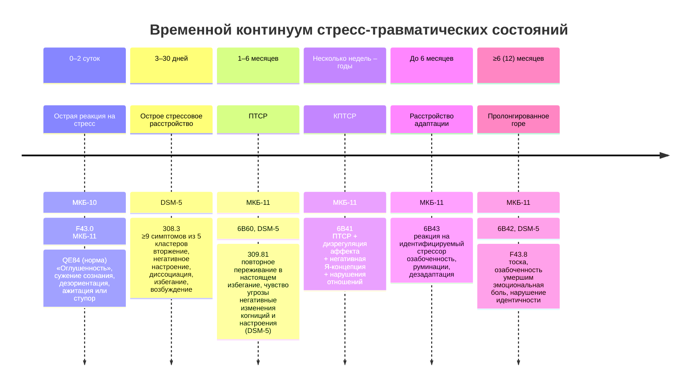

Клиент обращается через неделю после ДТП: «Я не могу спать, каждую ночь просыпаюсь в холодном поту, в машину садиться боюсь. У меня ПТСР?». Через месяц после гибели сына мать говорит: «Я не хожу в театр, не встречаюсь с подругами — я не имею права на радость, надо страдать». Это нормальное горе или уже расстройство? Коллега-психолог работает с жертвами насилия пятый год, стала раздражительной, избегает разговоров о работе, ей снятся кошмары с сюжетами клиентов — это выгорание или вторичная травма?

Дифференциальная диагностика стресс-травматических состояний требует точного знания **временных критериев, симптоматических кластеров и этиологических нюансов**. МКБ‑11 и DSM‑5 предлагают разные модели одного и того же континуума — от нормальной реакции до хронического изменения личности. Эта статья — подробный путеводитель по шести диагностическим категориям с полными критериями, дифференциальными признаками и практическими ориентирами.

---

## Острая реакция на стресс: норма, а не патология

### Определение и клиническая картина (МКБ‑10, F43.0)

**Острая реакция на стресс** — транзиторное расстройство значительной тяжести, развивающееся у лиц без видимого психического расстройства в ответ на исключительный физический или психологический стресс. Обычно проходит в течение нескольких часов или дней.

**Стрессоры:** угроза безопасности близкого, природная катастрофа, несчастный случай, война, преступление, изнасилование, резкое изменение социального положения, пожар, потеря многих близких.

**Симптомы включают начальное состояние:**

- «оглушенность» с сужением поля сознания и снижением внимания;
- неспособность адекватно реагировать на внешние стимулы, дезориентация;
- уход от ситуации (вплоть до диссоциативного ступора) либо ажитация и гиперактивность (реакция бегства, фуга);
- вегетативные признаки панической тревоги (тахикардия, потение, покраснение);
- частичная или полная амнезия стрессового события.

**Виды острых реакций** (перечень, не исчерпывающий):
1. Плач.
2. Агрессия.
3. «Истериодная» реакция.
4. Апатия.
5. Страх.
6. Психомоторное возбуждение.
7. Ступор.
8. Нервная дрожь.

**Условия лечения:** преимущественно амбулаторно; при тяжелой реакции возможна краткосрочная госпитализация.
**Принципы терапии:** стабилизация, релаксация. В большинстве случаев специального лечения не требуется. Фармакотерапия (анксиолитики, снотворные, антидепрессанты с седативным действием) применяется только при затяжном течении или углублении депрессивной симптоматики.

### Изменения в МКБ‑11 (QE84)

В одиннадцатом пересмотре классификации **острая реакция на стресс перестала быть расстройством**. Она отнесена в раздел «Факторы, влияющие на состояние здоровья населения и обращения в учреждения здравоохранения» (код QE84).

**Ведущие признаки:**
- аффективное сужение сознания;
- резкие нарушения поведения;
- непроизвольные пантомимические, вегетативные, экспрессивные проявления.

**Длительность:** от 3 дней до 1 месяца (начинается сразу или вскоре после травмы).

> **Практический вывод:** реакция на экстремальное событие в первые дни — норма. Задача психолога — не патологизировать, а стабилизировать, информировать и при необходимости направить к психиатру при затягивании или утяжелении симптомов.

### Профессиональные границы: работа с отказом от психиатра

В оферте (договоре с клиентом) желательно прописать право на отказ в терапии, если клиент нуждается в психиатрическом обследовании, но отказывается его проходить. Вопросы для мотивационного интервью:
«Что должно случиться, чтобы вы обратились к психиатру?»
«Какие симптомы станут для вас сигналом?»

Это принцип профессиональной компетентности: психолог обязан знать пределы своей компетенции и не вести клиента с тяжелой депрессией, психотическими симптомами или суицидальным риском без участия врача.

---

## Острое стрессовое расстройство (DSM‑5, 308.3)

В DSM‑5 сохранена категория, отсутствующая в МКБ‑11 как отдельный диагноз. **Острое стрессовое расстройство** — это патологическая реакция, длящаяся от 3 дней до 1 месяца и включающая не менее 9 симптомов из пяти кластеров.

**Критерий А** — воздействие фактической или угрожающей смерти, серьезной травмы, сексуального насилия одним из способов:
1. Непосредственное переживание.
2. Личное наблюдение за событиями с другими.
3. Узнавание о травме с близким членом семьи или другом (события должны быть насильственными или случайными).
4. Повторное или экстремальное воздействие отвратительных деталей (например, сбор человеческих останков, работа полиции с деталями насилия над детьми) — **не относится к СМИ, телевидению, фильмам, если это не связано с работой**.

**Критерий В** — 9 или более симптомов из 5 категорий, начавшихся или ухудшившихся после травмы:

1. **Симптомы вторжения**
   - Повторяющиеся, непроизвольные, навязчивые тягостные воспоминания.
   - Повторяющиеся тревожные сны (у детей старше 6 лет — пугающие сны без узнаваемого содержания).
   - Диссоциативные реакции (флешбэки), чувство или действие, будто событие повторяется (вплоть до полной потери осознания окружения).
   - Интенсивный или длительный дистресс при напоминаниях.
   - Выраженные физиологические реакции на напоминания.

2. **Негативное настроение**
   - Стойкая неспособность испытывать положительные эмоции (счастье, удовлетворение, любовь).

3. **Диссоциативные симптомы**
   - Измененное ощущение реальности окружения или себя (дереализация, деперсонализация, оцепенение, замедление времени).
   - Диссоциативная амнезия (неспособность вспомнить важный аспект травмы).

4. **Симптомы избегания**
   - Избегание тягостных воспоминаний, мыслей, чувств.
   - Избегание внешних напоминаний (людей, мест, разговоров, действий, объектов, ситуаций).

5. **Симптомы возбуждения**
   - Нарушение сна.
   - Раздражительное поведение, вспышки гнева.
   - Проблемы с концентрацией.
   - Преувеличенная реакция испуга.

**Критерий С** — длительность от 3 дней до 1 месяца.
**Критерий D** — клинически значимый дистресс или нарушение функционирования.
**Критерий Е** — нарушение не связано с эффектами вещества или другим медицинским состоянием и не объясняется кратковременным психотическим расстройством.

**Без лечения** острое стрессовое расстройство у значительной части пострадавших переходит в ПТСР.

---

## Посттравматическое стрессовое расстройство

### МКБ‑10 (F43.1)

ПТСР определяется как **отсроченный или затянувшийся ответ** на стрессовое событие (краткое или продолжительное) исключительно угрожающего или катастрофического характера, способное вызвать глубокий стресс почти у каждого.

**Критерии:**
- **А.** Воздействие стрессора.
- **Б.** Стойкие навязчивые воспоминания или «оживление» стрессора в реминисценциях, ярких воспоминаниях, повторяющихся снах, либо повторное переживание горя при обстоятельствах, напоминающих о стрессе.
- **В.** Избегание обстоятельств, напоминающих о стрессе.
- **Г.** Любое из двух:
  1. Психогенная амнезия (частичная или полная).
  2. Стойкие симптомы повышения психологической чувствительности/возбудимости (два из: нарушение сна, раздражительность, трудности концентрации, повышение уровня бодрствования, усиленный рефлекс четверохолмия).
- **Д.** Симптомы возникают в течение 6 месяцев после стрессора.

**Течение:** чаще выздоровление, возможна хронификация с переходом в стойкое изменение личности (F62.0).

### МКБ‑11 (6B60)

В одиннадцатом пересмотре **концепция ПТСР сужена**. Диагноз требует наличия **всех трех** признаков:

1. **Повторное переживание в настоящем времени** — не просто воспоминание, а именно переживание «здесь и сейчас»: яркие навязчивые воспоминания, флешбэки, кошмарные сновидения. Может быть в одной или нескольких сенсорных модальностях, сопровождается сильными эмоциями (страх, ужас) и выраженными телесными ощущениями.
2. **Избегание** мыслей, воспоминаний, деятельности, ситуаций, людей, напоминающих о событии.
3. **Постоянное чувство текущей повышенной угрозы** — сверхнастороженность, преувеличенная реакция вздрагивания.

**Длительность:** не менее нескольких недель.
**Нарушение функционирования** в личной, семейной, социальной, учебной, профессиональной сферах.

**Важно:** диагноз не ставится на основе неспецифических симптомов (тревога, депрессия, нарушения сна) — они могут быть, но не заменяют обязательных трех кластеров.

### DSM‑5 (309.81/F43.10)

Американская классификация сохраняет **четыре кластера** (критерии B–E), применимые для взрослых, подростков и детей старше 6 лет.

**Критерий А** — столкновение со смертью, угрозой смерти, серьезной травмой, сексуальным насилием (аналогично острому стрессовому расстройству, но без ограничения «не более месяца»).
**Критерий В** — вторжение (1 из 5 симптомов).
**Критерий С** — избегание (1 из 2).
**Критерий D** — негативные изменения в когнициях и настроении (2 из 7):
- диссоциативная амнезия;
- преувеличенные негативные убеждения о себе, других, мире;
- искаженные суждения о причинах и последствиях (самообвинение, обвинение других);
- постоянные негативные эмоции (страх, гнев, вина, стыд);
- снижение интереса к социальным мероприятиям;
- чувство оторванности или отчуждения;
- стойкая неспособность испытывать позитивные эмоции.

**Критерий Е** — изменения в возбуждении и реактивности (2 из 6):
- раздраженное поведение, вспышки гнева;
- безрассудное или аутоагрессивное поведение;
- сверхнастороженность;
- повышенный рефлекс четверохолмия;
- проблемы с концентрацией;
- нарушения сна.

**Критерий F** — длительность более 1 месяца.
**Критерий G** — клинически значимый дистресс или нарушение функционирования.
**Критерий H** — исключение веществ и медицинских состояний.

**Спецификаторы:**
- **Диссоциативный подтип** — упорные или повторяющиеся симптомы деперсонализации или дереализации.
- **С отсроченным началом** — полное соответствие критериям наступает не ранее 6 месяцев после травмы (хотя некоторые симптомы могут проявляться раньше).

---

## Комплексное ПТСР (МКБ‑11, 6B41)

**КПТСР** — новый диагноз, введенный в МКБ‑11, заменяющий категорию «стойкое изменение личности после переживания катастрофы» (F62.0) из МКБ‑10.

### Этиология
Развивается после воздействия **чрезвычайного или длительного стрессора**, от которого трудно или невозможно избавиться:
- геноцид;
- сексуальное насилие над детьми;
- нахождение детей на войне;
- жестокое бытовое насилие;
- пытки;
- рабство;
- другие формы хронической травматизации с невозможностью спасения.

### Диагностические требования
1. **Полное соответствие критериям ПТСР** (три кластера: повторное переживание, избегание, чувство угрозы).
2. **Дополнительно — три кластера нарушений, пронизывающих все сферы жизни:**

   **1. Нарушения в аффективной сфере**
   - Повышенная эмоциональная реактивность.
   - Отсутствие эмоций (эмоциональное оцепенение).
   - Диссоциативные состояния.

   **2. Негативная Я-концепция**
   - Стойкие негативные представления о себе как об униженном, побежденном, никчемном.
   - Глубокие, всепроникающие чувства стыда, вины, несостоятельности.
   - **Отличие от пограничного расстройства личности:** при КПТСР самооценка устойчиво-негативная, без колебаний от «я звезда» до «я ничтожество».

   **3. Нарушения в социальном функционировании**
   - Последовательное избегание или незаинтересованность в личных взаимоотношениях.
   - Трудности в поддержании близких отношений.
   - Социальная изоляция.

**Длительность:** обычно от нескольких недель до многих лет.
**Функционирование:** значительные нарушения во всех сферах жизни.

> **Дифференциальный диагноз:** ПТСР, расстройство адаптации, депрессия, пограничное расстройство личности. КПТСР может сочетаться с ПРЛ, но при чистом КПТСР нет импульсивности, страха покидания и нестабильной самооценки, характерных для ПРЛ.

---

## Расстройство адаптации (МКБ‑11, 6B43; DSM‑5, F43.20–25)

**Расстройство адаптации** — дезадаптивная реакция на идентифицируемый психосоциальный стрессор или множественные стрессоры.

**Стрессоры:** развод, болезнь, инвалидность, социально-экономические проблемы, конфликты в семье или на работе. Событие **не обязательно** угрожает жизни (в отличие от критерия А ПТСР).

**Временные рамки:**
- Симптомы возникают в течение **1 месяца** после воздействия стрессора.
- Продолжаются **не более 6 месяцев** после прекращения стрессора или его последствий (если стрессор сохраняется дольше, расстройство может хронифицироваться, но диагноз остается).

**Симптоматика:**
- Озабоченность стрессором или его последствиями (чрезмерное беспокойство).
- Повторяющиеся расстраивающие мысли о стрессе, руминации.
- Неспособность адаптироваться — нарушения в личной, семейной, социальной, учебной, профессиональной сферах.
- Симптомы не достигают порога ПТСР, депрессивного эпизода или другого специфического расстройства.

**Распространенность:** 5–21% в различных популяциях.

---

## Затяжная патологическая реакция горя (пролонгированное расстройство горя)

### МКБ‑11 (6B42)

**Затяжная патологическая реакция горя** — нарушение, возникающее после смерти близкого человека и характеризующееся:

- стойкой и всепоглощающей тоской по умершему;
- постоянной озабоченностью мыслями об умершем или обстоятельствами смерти;
- сильной эмоциональной болью (грусть, вина, гнев, отрицание, обвинение);
- чувством утраты части себя;
- неспособностью ощущать позитивные эмоции;
- эмоциональным оцепенением;
- затруднением вовлечения в социальную или иную деятельность.

**Временной критерий:** не менее **6 месяцев** после потери.
**Культурная норма:** реакция явно превышает принятые социальные, культурные или религиозные нормы. Если длительная реакция горя соответствует традициям (например, некоторые культуры предписывают многолетний траур), диагноз не ставится.

**Нарушение функционирования** обязательно.

### DSM‑5 (F43.8)

Критерии схожи, но с одним ключевым отличием:
**Смерть должна произойти не менее 12 месяцев назад** (для детей и подростков — не менее 6 месяцев).

**Симптомы (требуются 1 из B и 3 из C):**

**B.**
1. Сильная тоска по умершему.
2. Озабоченность мыслями или воспоминаниями об умершем.

**C.**
1. Нарушение самоидентификации (ощущение, что часть вас умерла).
2. Выраженное чувство неверия в смерть.
3. Избегание напоминаний.
4. Сильная эмоциональная боль (гнев, горечь, скорбь).
5. Трудности с реинтеграцией (общение, интересы, планы).
6. Эмоциональное оцепенение.
7. Ощущение бессмысленности жизни.
8. Сильное одиночество.

**Критерии D–F:** клинически значимый дистресс/нарушение, превышение культурных норм, не объясняется другим расстройством.

**Клинический пример и терапевтический вопрос:**
> Мать, потерявшая сына, не ходит в театр, не встречается с друзьями: «Я не имею права на удовольствие, надо страдать».
> **Противоядие:** «Если бы ваш сын мог вас услышать, чего бы он для вас хотел?»

## Сравнительная таблица стресс-травматических состояний

| Состояние                 | Длительность               | Обязательное событие                          | Ключевые симптомы                                                                 | Статус в МКБ‑11          |
|---------------------------|----------------------------|-----------------------------------------------|-----------------------------------------------------------------------------------|--------------------------|
| Острая реакция на стресс  | Минуты – 2–3 суток         | Экстремальный стрессор                       | Оглушенность, сужение сознания, дезориентация, ажитация/ступор, вегетативные реакции | Норма (QE84)            |
| Острое стрессовое расстройство | 3–30 дней                 | Угроза смерти, травмы, насилия (критерий А DSM‑5) | ≥9 симптомов из 5 кластеров: вторжение, негативное настроение, диссоциация, избегание, возбуждение | — (отсутствует)        |
| ПТСР                       | >1 месяца                 | То же                                        | Повторное переживание в настоящем, избегание, чувство угрозы (МКБ‑11); + негативные когниции/настроение, возбуждение (DSM‑5) | 6B60                    |
| КПТСР                      | Месяцы – годы              | Хронический, неконтролируемый стрессор       | ПТСР + дизрегуляция аффекта + негативная Я-концепция + нарушения отношений       | 6B41                    |
| Расстройство адаптации    | ≤6 месяцев                | Идентифицируемый психосоциальный стрессор    | Озабоченность, руминации, дезадаптация                                           | 6B43                    |
| Пролонгированное горе     | ≥6 мес (МКБ‑11), ≥12 мес (DSM‑5) | Смерть близкого                              | Тоска, озабоченность умершим, эмоциональная боль, нарушение идентичности         | 6B42                    |

---

## Запомнить

1. **Острая реакция на стресс в МКБ‑11 — не расстройство, а норма.** Патологизировать ее — ошибка. Задача психолога — стабилизация, информирование и отслеживание перехода в ПТСР.

2. **Временные критерии — главный дифференциальный инструмент.**
   - 0–2 суток: острая реакция.
   - 3–30 дней: острое стрессовое расстройство (DSM‑5).
   - >1 месяца: ПТСР.
   - >6 месяцев после утраты: пролонгированное горе.

3. **ПТСР в МКБ‑11 — три кластера, не больше.** Диагноз требует повторного переживания именно **в настоящем времени**, а не просто грустных воспоминаний.

4. **КПТСР требует трех дополнительных нарушений:** аффективная дизрегуляция, устойчиво-негативная Я-концепция, трудности в отношениях. Отличать от ПРЛ по стабильности самооценки.

5. **Расстройство адаптации — «остаточная» категория.** Ставится, когда событие не удовлетворяет критерию А ПТСР, а симптомы не дотягивают до других расстройств.

6. **Пролонгированное горе — не любая длительная печаль.** Необходимо превышение культурных норм и специфические симптомы: нарушение идентичности, неверие, избегание, бессмысленность.

7. **Профессиональная компетентность требует знать границы.** Если клиент нуждается в психиатрическом обследовании, но отказывается, психолог вправе отказать в терапии. Вопрос «Что должно случиться, чтобы вы обратились к психиатру?» помогает исследовать мотивацию.
