В «Макбете» врач говорит о леди Макбет: «Она больна не телом, но душою, / Чей мир смущают призраки». Шекспир описал флешбеки, соматический дистресс и невозможность «выполоть из памяти печаль» за четыре века до того, как психиатрия ввела термин «посттравматическое стрессовое расстройство». Тысячелетиями симптомы травмы объясняли одержимостью, карой богов или конституциональной слабостью. Только к концу XX века исследования ветеранов, выживших в катастрофах и жертв насилия сложились в стройную научную картину. Эта статья — хронология того, как менялось понимание психологической травмы: от первых упоминаний в древних текстах до нейровизуализации и концепции культурной травмы.

```mermaid
timeline
    title История исследования психологической травмы
    section Донаучный период
        Античность - XIX в. : Эпос о Гильгамеше, Гомер, Геродот<br>Религиозные трактовки (одержимость)
        ~1600         : Шекспир, «Макбет» — описание флешбеков и соматических симптомов
    section Зарождение научного подхода
        1766          : Доктор Мати, случай графа Лотарда
        1801          : Ф. Пинель — неврозы кровообращения и дыхания у солдат
        1867          : Э. Эриксен — «железнодорожная травма», спинальный менингомиелит
        1871          : Дж. М. да Коста — «синдром раздражённого сердца»
    section Первые теории
        1878          : А. Ойленбург — термин «психическая травма»
        1889          : Г. Оппенгейм — «травматический невроз»
        1880-е        : Ж.-М. Шарко — травма как триггер истерии
    section Психоаналитическая революция
        1889          : П. Жане — диссоциация и теория памяти
        1896          : З. Фрейд — теория соблазнения, позже — двухфазная травма, навязчивое повторение
        1893          : Й. Брейер — метод катарсиса
        1941          : А. Кардинер — физионевроз
        1963          : М. Хан — кумулятивная травма
    section Военные травмы и признание ПТСР
        1914–1918    : «Синдром тревожного сердца» (British Army, до 10% списаний)
        1939–1945    : Исследования узников концлагерей — флешбеки, диссоциация, эмоциональная холодность
        1980          : ПТСР включено в DSM-III (после Вьетнамской войны)
    section Современные подходы
        1963          : Г. Селье — общий адаптационный синдром (стадии тревоги, сопротивления, истощения)
        1966          : Р. Лазарус — когнитивная оценка стресса
        1986          : М. Горовиц — бифазная модель (отрицание ↔ интрузия)
        1989          : Э. Фоа и др. — модель эмоциональной обработки
        1998          : Г. Фишер, П. Ридэссэр — модель травматического процесса
        2000          : А. Эллерс, Д. Кларк — когнитивная модель ПТСР
        2001–…       : Нейробиология (гиппокамп, миндалина, префронтальная кора); коллективная и культурная травма (Дж. Александер)
```

## Донаучный период: от эпических героев до елизаветинской драмы

Первые письменные свидетельства травматических реакций обнаружены в шумерском эпосе о Гильгамеше (XXI–XVIII вв. до н. э.) и поэмах Гомера. Герои испытывают навязчивые образы погибших, ужас, отчуждение. Геродот описал воина, внезапно ослепшего после битвы при Марафоне — вероятно, одну из первых зафиксированных конверсионных реакций. Цицерон в «Тускуланских беседах» связывал длительную скорбь не с внешними событиями, а с «ложным мнением», предвосхищая когнитивные теории XX века.

В Средневековье симптомы, которые сегодня идентифицируются как ПТСР, интерпретировались в религиозном ключе. Ветераны крестовых походов с кошмарами, избеганием и гипервозбудимостью проходили обряды экзорцизма — травма считалась одержимостью демонами или божественным наказанием.

**Шекспир и клиническая интуиция.** В «Макбете» (1606) диалог врача и лорда содержит почти диагностическое описание травмы:

*Врач:* «Она больна не телом, но душою, / Чей мир смущают призраки».
*Макбет:* «Как выполоть из памяти печаль, / Как письмена тоски стереть в мозгу / И снадобьем ей дать забвенье...»

Здесь узнаваемы **флешбеки** («призраки»), соматический симптом («отягощённая грудь» — мышечное напряжение, ком в груди) и интуитивное понимание, что исцеление требует внутренней работы пациента («В этом может помочь себе лишь сам больной»). Более чем за триста лет до формализации психотерапии Шекспир отделил душевное страдание от телесной болезни.

## XIX век: железные дороги, войны и первые классификации

### Случай графа Лотарда (1766)

Доктор Мати опубликовал в четвёртом томе «Медицинских наблюдений и исследований» историю графа Лотарда. После падения с лошади у пациента развились параличи, потеря чувствительности, нарушения памяти — без органического поражения нервной системы. Мати расценил состояние как следствие «сильного испуга». Это первое документированное клиническое описание посттравматического симптомокомплекса в европейской медицине.

### Пинель и наследие Наполеоновских войн

Филипп Пинель, реформируя психиатрию во Франции, накапливал наблюдения за участниками революционных и наполеоновских войн. В 1801 году он выделил у комбатантов:

- идиотизм (вероятно, тяжёлые диссоциативные ступоры);
- манию (психомоторное возбуждение);
- меланхолию (депрессивную симптоматику);
- **неврозы кровообращения и дыхания** — функциональные нарушения без анатомического субстрата.

Позже эти два невроза признали предшественниками **травматического невроза**.

### Железнодорожная травма и спинальный менингомиелит

С развитием железных дорог участились иски о компенсации после крушений. Э. Эриксен в 1867 году выдвинул органическую гипотезу: нервные расстройства после аварий вызываются контузией спинного мозга, ведущей к прогрессирующему воспалению — **спинальному менингомиелиту**. Хотя теория оказалась ошибочной, она стимулировала систематическое изучение посттравматических состояний.

### «Синдром раздражённого сердца» Джекоба Мендеса да Косты

В 1871 году американский кардиолог описал солдат Гражданской войны с жалобами на тахикардию, боль в груди, одышку. Да Коста доказал отсутствие органической патологии миокарда. **«Болезненно чувствительное сердце»** — первое описание соматоформной вегетативной дисфункции, позже переименованной в «синдром усилия», а затем признанной вариантом травматического невроза.

## Первые теории: от термина к синдрому

**1878** — Альберт Ойленбург вводит понятие **«психическая травма»**, отделяя психогенные расстройства от органических.

**1889** — Герман Оппенгейм предлагает термин **«травматический невроз»**. В отличие от Эриксена, он настаивает на функциональной природе расстройства, связывая его с психическим шоком и микроскопическими изменениями мозга. Оппенгейм первым постулирует, что травма может вызывать долгосрочные изменения в психике даже при отсутствии видимых повреждений.

**Жан-Мартен Шарко и школа Сальпетриер.** Шарко рассматривал травму лишь как триггер, активирующий врождённую предрасположенность к истерии. Он не разрабатывал теорию травмы, но его ученики (Пьер Жане, Зигмунд Фрейд) заметили связь между сексуальным насилием в детстве и истерическими симптомами у взрослых — наблюдение, ставшее отправной точкой психоанализа.

## Психоаналитическая революция: бессознательное и диссоциация

### Пьер Жане: диссоциация как патогенетический фактор

В 1889 году Жане опубликовал дифференцированную теорию воздействия душевных травм на память и поведение. Он утверждал:

- перегрузка сознания травматическими событиями приводит к **диссоциации** — расщеплению психических содержаний;
- диссоциация — не просто защита, но и основной патогенетический механизм;
- диссоциированные воспоминания не интегрируются в автобиографическую память и продолжают автономно влиять на эмоции и поведение.

Жане разработал метод «психологического анализа» — прообраз современной травма-терапии, направленной на интеграцию диссоциированного опыта.

### Зигмунд Фрейд: от теории соблазнения к двухфазной травме

В 1896 году Фрейд выдвинул **теорию соблазнения**: этиология истерии — реальное сексуальное насилие в детстве. Под давлением критики и личных обстоятельств он заменил её моделью инфантильных фантазий, сместив акцент с внешнего события на внутренний конфликт. Несмотря на отказ от теории соблазнения, Фрейд ввёл две фундаментальные концепции:

1. **Двухфазность травмы.** Событие становится травматичным не в момент происшествия, а при повторном переживании (например, в пубертате, когда появляется способность к сексуальному пониманию).
2. **Навязчивое повторение.** Психика «переваривает» травму через повторные переживания во сне, фантазиях и действиях. Это попытка овладеть чрезмерным возбуждением постфактум.

Фрейд описал симптомокомплекс травматического невроза: страх, кошмарные сны, депрессию с руминациями, психологическую гиперактивность, повторяющиеся переживания события.

**Йозеф Брейер и катарсис.** Совместно с Фрейдом Брейер разработал метод катарсиса: отреагирование подавленного аффекта через гипноз и проговаривание. История Анны О. стала первым опубликованным случаем «лечения разговором».

### Развитие психоаналитических идей

- **Абрахам Кардинер (1941)** — ввёл понятие **«физионевроз»**, подчёркивая массивные соматические компоненты травматических реакций (хроническое мышечное напряжение, нарушения сна, вегетативную лабильность).
- **Рене Спитц (1967)** и **Джон Болби (1951)** — исследовали последствия ранней депривации и разлуки с матерью, заложив основы теории привязанности и понимания травмы развития.
- **Мазут Хан (1963)** — описал **кумулятивную травму**: множественные микротравмы в отношениях с заботящимся лицом, не достигающие остроты шоковой травмы, но деформирующие психическое развитие.

## XX век: мировые войны и легитимизация ПТСР

### Первая мировая война: «снарядный шок»

Масштаб психических потерь в войнах XX века сделал травму предметом государственной политики. У британских солдат фиксировали «синдром тревожного сердца» (учащённое сердцебиение, панические атаки), «снарядный шок» (shell shock) с мутизмом, ступором, контрактурами. До 10 % личного состава британской армии списывали по неврологическим причинам. Психиатры Ч. Майерс и У. Риверс разрабатывали методы дебрифинга и конфронтации с травматическими воспоминаниями.

### Вторая мировая война и Холокост

Исследования выживших в концлагерях выявили долгосрочные последствия:

- эмоциональная холодность и ангедония;
- хронические флешбеки и ночные кошмары;
- диссоциативные состояния;
- стойкие изменения личности (апатия, недоверие, чувство вины выжившего).

Работы Л. Эйнгера, У. Нидерланда и других легли в основу концепции **хронической травматизации** и подготовили почву для выделения ПТСР в отдельную диагностическую категорию.

### 1980: Рождение ПТСР в DSM-III

После Вьетнамской войны ветераны и психоаналитики (Р. Лифтон, Ч. Фигли) добились включения посттравматического стрессового расстройства в третье издание Диагностического и статистического руководства АПА. Критерии включали:

- наличие травматического события «вне обычного человеческого опыта»;
- навязчивое воспроизведение травмы;
- избегание и эмоциональное оцепенение;
- симптомы гипервозбуждения.

Включение ПТСР в DSM-III означало признание: травма — не преморбидная слабость, а этиологический фактор, способный вызвать расстройство у любого человека.

## Современные подходы: от стресса к нейробиологии

### Ганс Селье и общий адаптационный синдром

В 1963 году Ганс Селье сформулировал **неспецифическую теорию стресса**. Он выделил три фазы реакции организма:

1. **Тревога** — мобилизация ресурсов;
2. **Сопротивление** — адаптация к стрессору;
3. **Истощение** — срыв адаптации при длительном воздействии.

Хотя Селье изучал физиологический стресс, его трёхфазная модель стала основой для понимания динамики психической травматизации.

### Ричард Лазарус: когнитивная оценка

В 1966 году Лазарус предложил **транзактную модель стресса**. Реакция на событие опосредована когнитивной оценкой:

- **первичная оценка** — «это опасно / не опасно?»;
- **вторичная оценка** — «могу ли я с этим справиться?».

Дисбаланс между требованиями и воспринимаемыми возможностями вызывает стресс. Эта модель объясняет индивидуальные различия в реакции на идентичные события.

### Бифазная модель Марди Горовица

В 1986 году Горовиц описал динамику травматической реакции как смену двух фаз:

- **вытеснение (отрицание)** — избегание мыслей о травме, эмоциональное оцепенение;
- **интрузия** — навязчивые воспоминания, кошмары, флешбеки.

Цикл повторяется, пока травматический опыт не интегрируется. Длительность фаз варьирует. Модель Горовица повлияла на критерии ПТСР в DSM-IV и DSM-5.

### Когнитивно-поведенческие модели

- **Модель эмоциональной обработки** (Э. Фоа, М. Козак, 1986; Фоа, Стекити, Ротбаум, 1989): травма формирует в памяти структуры страха (fear structures), содержащие стимулы, реакции и их значение. ПТСР возникает, когда эти структуры генерализованы и легко активируются.
- **Модель травматического процесса** Г. Фишера и П. Ридэссэра (1998): травма — витальный дисбаланс между угрожающими обстоятельствами и возможностями совладания. Авторы ввели понятие **травматического процесса**, развёрнутого во времени и включающего предысторию, субъективную оценку, попытки преодоления и защитные факторы.
- **Когнитивная модель ПТСР** А. Эллерс и Д. Кларка (2000): хроническое ПТСР поддерживается двумя ключевыми процессами — негативной оценкой травмы и её последствий («со мной случилось это, значит, я слабый / мир опасен») и нарушениями автобиографической памяти (отсутствие контекста, сенсорная перцепция вместо нарратива).

### Нейробиология травмы

С 1990-х годов методы нейровизуализации подтвердили гипотезы, выдвинутые Жане и Фрейдом:

- **гиппокамп** (отвечает за контекстуальную память) у людей с ПТСР часто имеет сниженный объём; это объясняет фрагментарность травматических воспоминаний;
- **миндалевидное тело** (амигдала) гиперактивируется в ответ на стимулы, связанные с травмой, что коррелирует с интенсивным страхом;
- **медиальная префронтальная кора** (mPFC) и **передняя поясная кора** (ACC) демонстрируют сниженную активность и объём серого вещества, что затрудняет подавление реакций страха;
- **диссоциация** связана с нарушением интеграции между островковой долей, префронтальной корой и лимбической системой.

Эти данные привели к пониманию ПТСР как расстройства нейронных сетей прогнозирования (байесовский мозг), а не просто «поломки» отделов.

### Социокультурный контекст и коллективная травма

После терактов 11 сентября 2001 года активизировались исследования **коллективной травмы**. Профессор Джеффри Александер в книге «Культурная травма и коллективная идентичность» определил:

> Культурная травма формируется, когда социальная группа полагает, что пострадала от тяжёлого рокового события, которое «впечаталось» в их коллективное сознание, навеки влияя на воспоминания и трансформируя идентичность фундаментальным и непоправимым образом.

Коллективная травма изучается через репрезентации в медиа, архитектуре памятников, изменении законодательства. Она выходит за рамки индивидуальной психопатологии и становится предметом социологии, истории и культурных исследований.

## Запомнить

- **Первые описания травматических реакций** встречаются в эпосе о Гильгамеше, трудах Геродота и Цицерона, драмах Шекспира — за тысячелетия до научной психиатрии.
- **XIX век** сформировал три предпосылки: описание железнодорожной травмы (Эриксен), синдрома раздражённого сердца (да Коста) и термины «психическая травма» (Ойленбург) и «травматический невроз» (Оппенгейм).
- **Пьер Жане** впервые объяснил диссоциацию как патогенетический механизм травмы; **Зигмунд Фрейд** ввёл концепции двухфазности и навязчивого повторения.
- **Мировые войны** обеспечили массовый клинический материал и привели к включению ПТСР в DSM-III в 1980 году — официальному признанию травмы как самостоятельной этиологической единицы.
- **Ганс Селье** и **Ричард Лазарус** перенесли акцент с патологии на нормальные стрессовые реакции и их когнитивную оценку.
- **Современные модели** объединяют когнитивные, эмоциональные и нейробиологические механизмы; ПТСР рассматривается как нарушение процессов прогнозирования и интеграции памяти.
- **Коллективная и культурная травма** — новейшее направление, изучающее макросоциальные последствия катастроф.

Четыре тысячи лет наблюдений, ошибок и открытий привели к пониманию: травма — не личная слабость и не наказание, а закономерный ответ психики на обстоятельства, превышающие адаптационные возможности. История исследования травмы продолжает писаться нейробиологами, клиницистами и самими выжившими.
