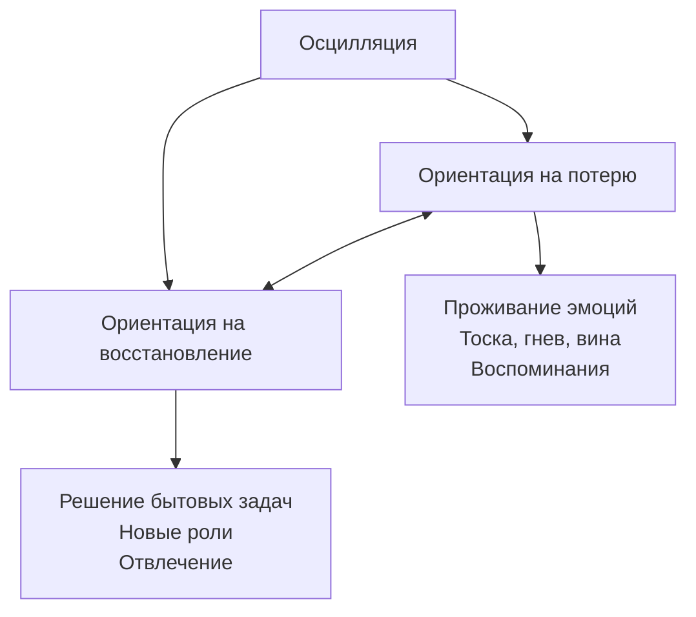

Переживание утраты — сложный и многомерный процесс, который не укладывается в простые линейные схемы. Современная психология предлагает несколько взаимодополняющих моделей, описывающих, какие задачи должен решить горюющий, какие факторы облегчают или затрудняют горевание и как выглядит успешная адаптация. В статье разбираем ключевые концепции Уильяма Вордена, Саймона Рубина, Маргарет Штрёбе и Хенка Шута, а также Джорджа Бонанно.

## Четыре задачи горя: модель Уильяма Вордена

Уильям Ворден (William Worden) предложил рассматривать процесс горевания не как пассивное прохождение стадий, а как активную работу, включающую четыре обязательные задачи. Если задача не решается, горе может осложниться или затянуться.

### Задача 1. Принятие реальности и необратимости утраты

Горюющий должен полностью осознать, что близкий человек умер и никогда не вернется. Это не просто интеллектуальное знание, а эмоциональное принятие.

**Если задача не решена:**
- Отрицание факта смерти (человек ведет себя так, словно умерший жив).
- «Мумификация» — сохранение комнаты и вещей в нетронутом виде, отказ от любых изменений.
- Отрицание значимости утраты («он был мне никем»).
- Отрицание необратимости (ожидание чуда, поиск знаков).

### Задача 2. Переработка боли, причиняемой горем

Необходимо прожить и выразить эмоциональную боль, связанную с утратой. Это касается не только печали, но и гнева, вины, тревоги.

**Если задача не решена:**
- Блокировка переживаний (избегание мыслей об умершем, подавление эмоций).
- Затягивание всего процесса — боль остается «замороженной» и может проявиться позже в виде психосоматических симптомов или отсроченных реакций.

### Задача 3. Приспособление к миру без умершего

Утрата требует адаптации на трех уровнях:
- **Внешний уровень:** научиться справляться с повседневными задачами, которые раньше выполнял умерший.
- **Внутренний уровень:** перестроить собственное «Я», найти новую идентичность (кто я теперь без супруга/ребенка/родителя?).
- **Духовный уровень:** пересмотреть ценности, убеждения, смыслы.

**Если задача не решена:**
- Человек не хочет жить полноценной жизнью, отрицает возможность нормального существования без близкого.
- Фиксация на факте потери, невозможность найти новые смыслы.

### Задача 4. Сохранить связь с умершим, приступая к построению новой жизни

В отличие от ранних теорий, требовавших «разорвать связь», современные подходы признают: здоровая адаптация включает сохранение внутренней связи с ушедшим, но в новой форме. Это позволяет продолжать любить, но не быть привязанным к страданию.

**Если задача не решена:**
- Фиксация на связи (человек живет только прошлым, не способен строить новые отношения).
- Избегание новых близких отношений или попытки разорвать уже имеющиеся.

## Медиаторы горевания: что влияет на процесс

Ворден также выделил факторы (медиаторы), которые определяют интенсивность и течение горя. Их понимание помогает оценить риски осложненного горевания.

1. **Степень родства.** Чем ближе был человек, тем острее переживания.
2. **Природа привязанности:** сила связи, эмоциональная безопасность, амбивалентность, наличие конфликтов, зависимость.
3. **Характер смерти:** внезапность, насилие, множественные утраты, предотвратимость, отсутствие тела (пропавшие без вести), стигматизируемые смерти (суицид, СПИД, передозировка).
4. **История горюющего:** предыдущие утраты, незавершенное горе, детский опыт привязанности.
5. **Личностные переменные:** возраст, пол, стиль копинга (активный/избегающий), стиль привязанности, когнитивный стиль, самооценка, картина мира.
6. **Социальные переменные:** поддержка окружения, вовлеченность в социальные роли, культурные и религиозные ресурсы.
7. **Сопутствующие утраты и стрессы.** Одновременные потери или накопление кризисов усложняют горевание.

### Факторы, затрудняющие решение задач

Ворден и другие исследователи особо выделяют обстоятельства, которые блокируют нормальное горевание:
- Амбивалентные или зависимые отношения с умершим.
- Нарциссический тип связи (умерший был продолжением горюющего).
- Насильственная, внезапная или «стыдная» смерть.
- Множественные утраты за короткое время.
- Неподтвержденная смерть (пропал без вести).
- Незавершенное горе в прошлом, небезопасная привязанность в детстве.

## Двухколейная модель Саймона Рубина

Саймон Рубин (Simon Rubin) предложил рассматривать переживание утраты в двух параллельных измерениях, которые он назвал «колеями» (tracks). Эти колеи взаимосвязаны и могут прорабатываться одновременно.

### Колея 1. Биопсихосоциальное функционирование

Эта колея отвечает на вопрос: **как человек живет после потери?** Она включает:
- Физическое здоровье (сон, аппетит, энергия, соматические симптомы).
- Эмоциональное состояние (тревога, депрессия, гнев, не связанные напрямую с образом умершего).
- Социальное функционирование (способность работать, общаться, выполнять обязанности).
- Самооценку и идентичность (изменение восприятия себя).

Цель на этой колее — восстановить способность жить и эффективно функционировать в настоящем и будущем.

### Колея 2. Связь с умершим

Эта колея отвечает на вопрос: **каковы отношения человека с памятью об умершем?** Она включает:
- Эмоции, связанные с умершим (тоска, любовь, гнев на него за уход, вина).
- Яркость и доступность образа покойного.
- Способность вспоминать как хорошие, так и плохие моменты.
- Мысли и фантазии о том, что могло бы быть.
- Пересмотр истории отношений и интеграцию ее в свою жизнь.

Цель на этой колее — найти новую, «переработанную» форму продолжения связи, которая позволяет жить дальше, не забывая.

Две колеи не изолированы: например, физическое истощение (колея 1) может усиливать тоску по умершему (колея 2), а проработка образа может давать ресурс для восстановления.

## Модель двойного процесса горевания (Штрёбе и Шут)

Маргарет Штрёбе (Margaret Stroebe) и Хенк Шут (Henk Schut) разработали модель, которая фокусируется на том, **как люди справляются с утратой**, а не только на последствиях. Они выделили два типа стрессоров и соответствующих им процессов совладания.

### Ориентация на потерю (loss-oriented coping)

Этот процесс включает:
- Проживание эмоций, связанных с утратой.
- Проработку горя, тоску, плач.
- Принятие реальности потери.
- Погружение в воспоминания.

### Ориентация на восстановление (restoration-oriented coping)

Этот процесс связан с:
- Поиском новых способов функционирования.
- Возвращением к обычной жизни.
- Адаптацией к жизни без ушедшего.
- Освоением новых ролей и навыков.
- Отвлечением от горя (например, через работу или хобби).

Ключевая идея модели — **осцилляция**. Горюющий не может постоянно находиться в одном процессе. Он колеблется между встречей с болью и отдыхом от нее, между погружением в утрату и восстановлением повседневности. Эта осцилляция естественна и адаптивна. Застревание в любой из ориентаций ведет к осложнениям: постоянное пребывание в ориентации на потерю истощает, а полное избегание горя (только ориентация на восстановление) блокирует переработку.

## Модель психологического благополучия Джорджа Бонанно

Джордж Бонанно (George Bonanno), профессор Колумбийского университета, на основе многолетних лонгитюдных исследований показал, что представления о неизбежности тяжелой депрессии после утраты ошибочны. Люди демонстрируют разные траектории переживания горя, и многие из них оказываются устойчивыми.

### Ключевые положения модели Бонанно

- Горевание — индивидуальный процесс, нет единого «нормального» пути.
- Не все люди страдают от депрессии после потери.
- Существует здоровый способ справиться с горем, и **психологическая устойчивость (resilience)** — основной компонент реакции на утрату.
- Отсутствие ярких симптомов горя или травмы не является патологией, а, напротив, благоприятный исход.
- Нет стадий, которые нужно обязательно пройти.
- Устойчивость можно развивать.

### Четыре основных паттерна реакции на утрату

Бонанно и коллеги выделили четыре типичные траектории, которые описывают динамику психологического благополучия до и после утраты.

1. **Устойчивое благополучие (Resilience)**
   - Сохранение стабильного эмоционального состояния.
   - Способность адаптироваться без серьезных нарушений.
   - Быстрое восстановление после кратковременного шока.
   — Встречается чаще, чем принято думать (до 35–65% случаев).

2. **Обычное горевание (Recovery)**
   - Временное снижение психологического благополучия.
   - Постепенное восстановление в течение одного–двух лет.
   - Возвращение к прежнему уровню функционирования.

3. **Депрессивное состояние (Chronic Depression)**
   - Значительное и длительное ухудшение настроения.
   - Сохраняющаяся депрессия, сложности с возвращением к нормальной жизни.
   - Часто связано с предшествующими проблемами психического здоровья.

4. **Хроническое горевание (Chronic Grief)**
   - Длительные периоды отчаяния, постоянные мысли об утрате.
   - Невозможность двигаться дальше, фиксация на умершем.
   - Отличается от депрессии фокусом именно на утрате.

### Факторы устойчивости

Бонанно выделяет три группы факторов, способствующих успешному совладанию с утратой:

- **Личностные:** оптимизм, эмоциональная стабильность, высокая самооценка.
- **Социальные:** поддержка близких, прочные социальные связи, чувство принадлежности.
- **Когнитивные:** способность находить смысл, гибкость мышления, умение позитивно переоценивать ситуацию.

## Завершение горевания

Горевание не имеет четкой временной границы, но есть признаки, указывающие на то, что основные задачи решены и человек адаптировался к утрате.

**Главный признак завершения** — способность думать об умершем без острой боли. Воспоминания могут вызывать светлую грусть, но не разрушающую тоску.

Другие признаки:
- Пробуждение интереса к жизни, появление надежды на получение удовольствия.
- Освоение новых ролей и восстановление повседневного функционирования.
- Способность строить планы на будущее, включая новые отношения.

Важно понимать: завершение не означает забвения или отказа от любви. Как писал Зигмунд Фрейд в письме к другу, потерявшему сына:

> «Мы находим место для того, кого потеряли. Хотя мы знаем, что острое горе после утраты однажды пройдет, мы также знаем, что останемся безутешными и никогда не найдем замену. Чем бы мы ни заполнили образовывающуюся пустоту, даже если мы заполним её полностью, это все-таки будет чем-то иным. Это единственный способ продлить любовь, от которой мы не желаем отречься».

Современная метафора, отражающая этот взгляд, — **мы растем вокруг своего горя** (grow around grief). Горе не исчезает, но жизнь расширяется, и боль перестает занимать все пространство.

## Запомнить

1. **Четыре задачи горя по Вордену:** принять реальность утраты, пережить боль, адаптироваться к жизни без умершего и сохранить внутреннюю связь с ним, строя новую жизнь.
2. **Медиаторы горевания** — факторы, влияющие на процесс: характер отношений, обстоятельства смерти, личность, социальная поддержка, история утрат.
3. **Двухколейная модель Рубина** рассматривает функционирование горюющего и его связь с умершим как два взаимосвязанных измерения.
4. **Модель двойного процесса (Штрёбе и Шут)** описывает осцилляцию между ориентацией на потерю (проживание эмоций) и ориентацией на восстановление (адаптация к жизни).
5. **Бонанно показал,** что устойчивость — частая реакция на утрату, и выделил четыре траектории: устойчивое благополучие, обычное горевание, хроническая депрессия и хроническое горе.
6. **Завершение горевания** — не исчезновение любви, а способность думать об умершем без боли, осваивать новые роли и находить место для утраты в своей жизни.
7. **Главная метафора:** мы не заменяем ушедших, а растем вокруг горя, включая его в обновленную жизнь.
