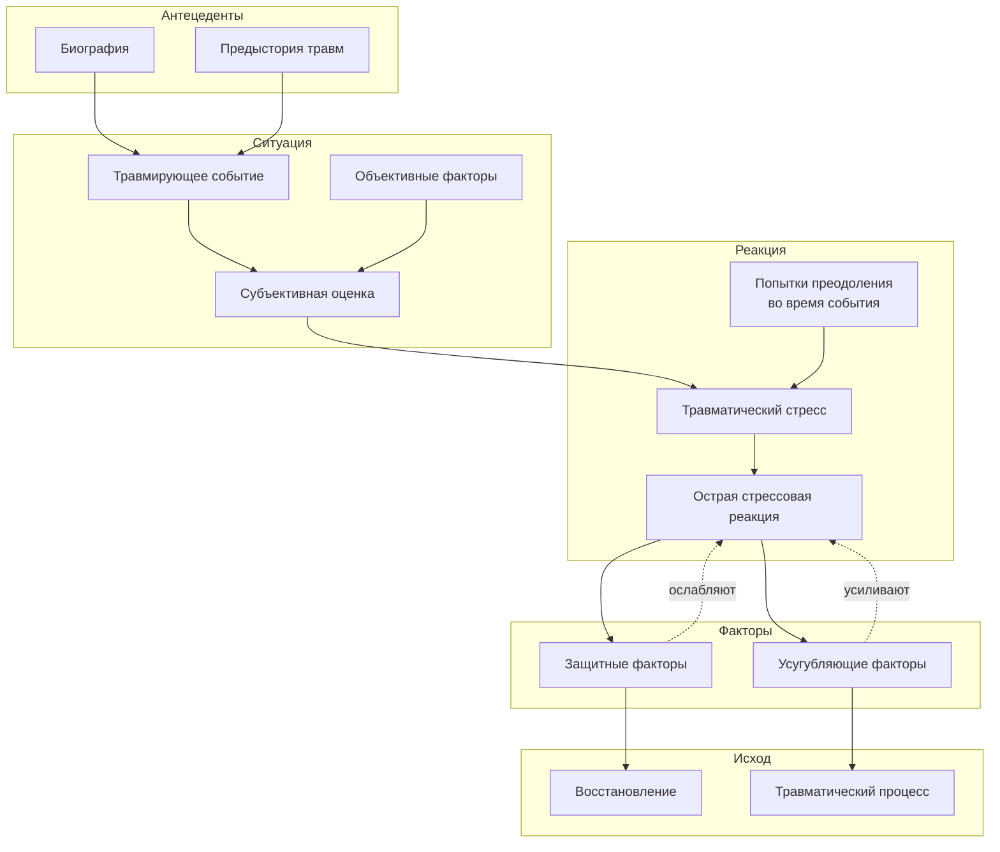

«Травматическое воздействие может оказать любое событие, которое вызывает мучительное чувство ужаса, страха, стыда, душевной боли — и от восприимчивости пострадавшего зависит вероятность того, что это происшествие приведет к значению травмы». Зигмунд Фрейд, конец XIX века.

Спустя столетие мы все еще ищем точную формулировку. Психоанализ говорит о вытесненном конфликте, бихевиоризм — об условном рефлексе страха, когнитивная психология — о дисфункциональных схемах. Каждая школа права в своих координатах. Но практикующему психологу нужна интегративная модель, которая свяжет событие, индивидуальную историю, нейробиологию и терапевтические мишени. Эта статья — карта семи теоретических подходов к определению травмы и единая модель, объясняющая, как событие становится травматическим процессом.

## Три грани определения: событие, последствие и процесс

В истории изучения травмы сформировались три способа отвечать на вопрос «что это?».

**Травма как событие.** Герман Оппенгейм, введший термин «травматический невроз», писал: «Эмоциональное потрясение мы назвали самым важным моментом. Страшное возбуждение, возникающее в момент несчастного случая, обычно настолько велико, что вызывает стойкое психическое изменение». В этом подходе травма — то, что происходит с человеком: авария, насилие, смерть близкого, катастрофа.

**Травма как последствие.** Жан-Мартен Шарко считал иначе: событие — лишь катализатор, проявляющий врожденную предрасположенность. Травма — не происшествие, а конституциональная уязвимость, активированная внешним толчком. Сегодня этот взгляд критикуют за виктимблейминг, но его зерно сохранилось в исследованиях генетической предрасположенности к ПТСР.

**Травма как процесс.** Современное определение, предложенное Фишером и Ридэссэром в 1999 году, объединяет событие и последствие в динамическую модель:

> Травма — это витальное переживание дисбаланса между угрожающими обстоятельствами и индивидуальными возможностями побороть их, сопровождающееся чувством беспомощности и незащищенности и вызывающее длительное потрясение в понимании себя и мира.

Здесь травма — не точка в прошлом и не пожизненный приговор, а процесс, который можно развернуть во времени и в котором есть узлы для терапевтического вмешательства.

## Травма как событие: критерии и перечни

### Что делает событие травматическим?

В «Практическом руководстве по психологии посттравматического стресса» под редакцией Тарабриной (2007) травматические ситуации определяются через четыре признака:

1. Сверхэкстремальный, критический характер события.
2. Мощное негативное воздействие, ситуация угрозы.
3. Требование экстраординарных усилий по совладанию.
4. Нарушение чувства безопасности — собственной или значимых близких.

Эти ситуации могут быть **краткими, но чрезвычайно интенсивными** (от минут до часов: нападение, изнасилование, катастрофа, свидетельство преступления) и **пролонгированными** (плен, концлагерь, трудовые лагеря с рабским трудом, регулярное домашнее насилие, тюремное заключение).

### Список событий — всегда неполный

Коэн в исследовании социальной поддержки и стресса приводит перечень событий, вызывающих **фокальный (очаговый) стресс**:

- смерть в семье;
- развод;
- операция или госпитализация ребенка;
- тяжелое соматическое или психическое заболевание члена семьи;
- серьезная болезнь ребенка;
- самоубийство члена семьи;
- жизненный кризис у родителя (работа, любовная связь);
- рождение младшего брата или сестры;
- разлука с родителями или опекуном;
- перемена места жительства.

Важно: этот перечень не исчерпывающий. Белоусова в лекциях подчеркивает: «Всегда спрашивайте у клиентов, есть ли братья или сестры — это важно, и травма от их появления или болезни может быть больше, чем от родителей».

### Социальная шкала реорганизации

Исследователи относят психические травмы к **критическим жизненным событиям** с тремя обязательными свойствами:

1. **Датируемость** — событие можно привязать ко времени.
2. **Структурная реорганизация** — меняется система «индивид — окружающий мир».
3. **Выраженные аффективные реакции** — психика перегружена необходимостью адаптации.

Шкала социальной реорганизации (Social Readjustment Rating Scale) насчитывает 43 таких события — от смерти супруга до отпуска и праздников. Дистресс вызывают не только негативные, но и позитивные перемены.

## Травма как последствие: возраст, предрасположенность и кумуляция

### Возраст травмы определяет симптоматику

Пьер Жане заметил феномен, впоследствии подтвержденный исследованиями: люди с психологической травмой фиксируются в возрасте, когда травма произошла. Возраст травматизации влияет на профиль симптомов:

- **ранняя травма** (дошкольный возраст) коррелирует с депрессивной симптоматикой;
- **травма в подростковом возрасте** — с диссоциативной симптоматикой.

Это не жесткое правило, но диагностический ориентир: за депрессией у взрослого может стоять травма трех-четырех лет, за диссоциацией — травма 12–15 лет.

### Конституциональная предрасположенность

Шарко ошибался, сводя травму исключительно к «почве», но полностью исключать индивидуальную уязвимость нельзя. Полиморфизмы гена транспортера серотонина, особенности темперамента, предыдущий травматический опыт — все это модулирует реакцию. Однако, согласно критериям МКБ-10 и DSM-5, предрасположенность не является необходимой или достаточной причиной ПТСР. Любой человек при достаточной интенсивности воздействия получит травму.

### Кумулятивная травма: капля камень точит

Термин, введенный Мазутом Ханом (1963), описывает эффект накопления: множественные «маленькие» травмы, каждая из которых не достигает порога шоковой, суммарно деформируют психику. Ежедневные унижения, хроническое пренебрежение, жизнь с непредсказуемым родителем — это не одно событие, а тысячи микро-событий, формирующих травму развития.

## Травма как процесс: модель Фишера и Ридэссэра

В 1998 году Готтфрид Фишер и Петер Ридэссэр предложили модель, которая стала рабочим инструментом для тысяч травма-терапевтов. Ее преимущество — интеграция объективных и субъективных факторов, событийных и процессуальных компонентов.

**Ключевые элементы модели:**

1. **Антецедентные компоненты** — биография и предыстория. Человек входит в травматическую ситуацию не «чистым листом», а с историей предыдущих травм, ресурсов, стилей привязанности и копинг-стратегий.

2. **Ситуационные компоненты** — объективные параметры события (длительность, угроза жизни, возможность бегства) и его субъективная оценка. Одна и та же авария может быть оценена как «я чуть не погиб» и «я классно справился».

3. **Острая стрессовая реакция (ОСР)** — нормальный, универсальный ответ на ненормальные обстоятельства. Она возникает всегда. Вопрос не в ее наличии, а в дальнейшей траектории.

4. **Защитные и усугубляющие факторы** — критический узел модели.
   - Защитные: немедленная психологическая помощь, работа социальных служб, уважительное отношение руководства к комбатантам, поддержка близких.
   - Усугубляющие: одиночество, отсутствие помощи, стигматизация, вторичная травматизация при разбирательствах.

5. **Восстановление или травматический процесс** — исход, определяемый балансом этих факторов.

Модель снимает ложную дихотомию «слабый/сильный». Травматический процесс развивается не потому, что человек «сломался», а потому, что баланс сил сложился не в его пользу.

## Семь подходов к терапии травмы: сравнительная таблица

В файле «Понятие травмы» семь психологических школ формулируют собственное определение травмы, механизм, последствия и цель терапии. Ни одна из них не является исчерпывающе верной — каждая подсвечивает свою грань.

| Подход | Определение травмы | Причина и механизм | Ключевые концепции | Последствия | Цель терапии |
|--------|-------------------|-------------------|-------------------|------------|--------------|
| Психоанализ (Фрейд, Кляйн) | Вытесненный внутренний конфликт. Событие, которое психика не может переработать. | Поток возбуждения слишком силен → вытеснение в бессознательное. | Вытеснение, повторение навязчивости, бессознательное, перенос. | Тревога, фобии, неврозы, психосоматика. | Осознать и интегрировать вытесненное (интерпретация свободных ассоциаций, сновидений, переноса). |
| Бихевиоризм (Уотсон, Скиннер)* | Результат классического обусловливания. | Нейтральный стимул совпадает с пугающим событием и сам начинает вызывать страх. | Классическое обусловливание, генерализация, избегание. | Паника на триггеры, избегание ситуаций. | Угасить условную реакцию (систематическая десенсибилизация, экспозиция). |
| Гуманистическая (Роджерс, Маслоу) | Опыт, противоречащий Я-концепции, столкнувшийся с условиями ценности. | Человек отрицает подлинные переживания, чтобы заслужить любовь → неконгруэнтность. | Я-концепция, условия ценности, неконгруэнтность. | Тревога, чувство фальши, низкая самооценка, блок самоактуализации. | Создать условия для роста (безусловное принятие, эмпатия, конгруэнтность). |
| Когнитивная (Бек, Эллис) | Сформированные дисфункциональные убеждения и схемы. | Травма обрабатывается искаженно → устойчивые негативные убеждения о себе, мире, будущем. | Дисфункциональные схемы, автоматические мысли, когнитивные искажения. | ПТСР, депрессия, гипербдительность, вина, стыд. | Реструктурировать мышление, оспорить дисфункциональные убеждения, развить адаптивные копинги. |
| Культурно-историческая (Выготский) | Разрыв в системе знаков, кризис социальной ситуации развития. | Отсутствие психологических орудий (слов, символов) для осмысления опыта. | Опосредование, интериоризация, социальная ситуация развития. | Диссоциация, социальная дезадаптация, обеднение внутреннего мира. | Восстановить культурные орудия (новые знаки через диалог, игру, искусство). |
| Экзистенциальный (Франкл, Мэй) | Столкновение с данностями (смерть, свобода, изоляция, бессмысленность). | Травма обнажает незащищенность бытия, разрушает иллюзии безопасности. | Экзистенциальные данности, тревога как онтология, вакуум, пограничная ситуация. | Экзистенциальная тревога, абсурд, опустошенность, вина за нереализованность. | Помочь найти смысл в страдании, принять ограничения, взять ответственность. |
| Гештальт-терапия (Перлз) | Незавершенная ситуация, незакрытый гештальт. | Травма прерывает цикл контакта → фиксация на моменте, энергия связана в прошлом. | Незавершенный гештальт, цикл контакта, фигура/фон, здесь-и-сейчас. | Хроническое напряжение, невозможность быть в настоящем, проекции прошлого, психосоматика. | Завершить гештальт (выразить сдержанные чувства, интегрировать опыт в «здесь-и-сейчас»). |

*В исходном файле бихевиоризм ошибочно подписан именами Фрейда и Кляйн. Исправлено в соответствии с исторической точностью.

## Универсальные условия развития посттравматического стресса

Независимо от теоретической ориентации, исследования выделяют два общих условия, без которых посттравматический стресс не развивается:

**1. Восприятие невозможности эффективного противодействия.** Человек не может ни бороться, ни бежать. Эмоциональная энергия не высвобождается — наступает оцепенение. Это состояние «ловушки» — ключевой предиктор ПТСР.

**2. Отсутствие социальной поддержки и эмоциональной связи.** Изоляция в травме и сразу после нее — второй мощнейший предиктор. Поддержка друзей, семьи, коллег, формальных служб выступает буфером между острой реакцией и хроническим процессом.

## Современная модель: байесовский мозг и травма как ошибка предсказания

Нейробиологические исследования последних десятилетий привели к формулировке, которая органично дополняет модель Фишера-Ридэссэра. Белоусова (2025) описывает ее через метафору **мозга как активного предсказателя**.

В норме мозг непрерывно строит прогнозы о мире на основе прошлого опыта («априорные убеждения») и сверяет их с сенсорными данными. Ошибка прогноза невелика — убеждения гибко обновляются.

**Травма — катастрофическая ошибка предсказания:**

- До травмы: «Я контролирую ситуацию», «Мир предсказуем».
- Во время травмы: хаос, беспомощность, угроза смерти.
- Результат: мозг в панике создает новые, ригидные убеждения для выживания.

Эти убеждения — не «поломка», а работа системы в режиме сверхосторожности:
- «Мир смертельно опасен» → гипербдительность.
- «Я беспомощен / виноват» → вина и стыд.
- «Напоминания = угроза» → избегание и флешбеки.

Терапия с этой точки зрения — научно обоснованный процесс **перенастройки чувствительности** системы через безопасное накопление нового опыта. Именно это обеспечивают процедуры экспозиции в КПТ и переработки в EMDR.

## Запомнить

1. **Травма — это не событие, а процесс.** Событие становится травматическим, когда витальный дисбаланс между угрозой и возможностями совладания не восстанавливается, а закрепляется под влиянием усугубляющих факторов.

2. **Возраст травмы определяет симптоматический профиль.** Ранняя травма (дошкольный возраст) чаще связана с депрессией, травма подросткового возраста — с диссоциацией.

3. **Два универсальных предиктора ПТСР:** восприятие невозможности бегства/борьбы и отсутствие социальной поддержки.

4. **Семь определений травмы — семь терапевтических мишеней.** Бессознательный конфликт, условный рефлекс, неконгруэнтность, дисфункциональные убеждения, дефицит знаков, экзистенциальный кризис, незавершенный гештальт — каждая школа предлагает рабочий инструмент, а не конкурирующую истину.

5. **Модель Фишера и Ридэссэра интегрирует факторы.** Биография, объективные обстоятельства, субъективная оценка, попытки преодоления и баланс защитных/усугубляющих факторов — все это звенья, в которые можно вмешиваться.

6. **Байесовская модель объясняет ригидность убеждений.** ПТСР — не дефект, а адаптация к ненормальному опыту. Система прогнозирования «застыла» в режиме угрозы. Задача терапии — предоставить мозгу новый, безопасный опыт для обновления прогнозов.
