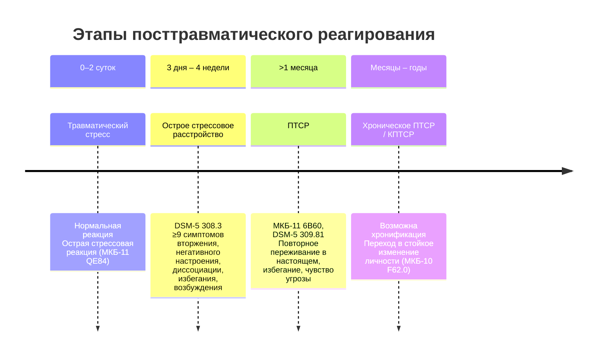

В первые минуты после обрушения купола «Трансвааль-парка» 14 февраля 2004 года среди выживших преобладали острая стрессовая реакция, ступор, двигательное возбуждение. У 28 погибших травма стала фатальной, у 201 пострадавшего — психической. Через месяц у части из них сформировалось **посттравматическое стрессовое расстройство (ПТСР)**. У других — депрессия, паническое расстройство, генерализованная тревога. Третьи не обнаруживали психической патологии.

ПТСР — не единственный и не самый частый исход травмы, но именно вокруг него построена основная масса исследований и диагностических инструментов. В этой статье — данные о распространенности, факторах риска, нейробиологических изменениях и проверенный алгоритм диагностики, от скрининговых шкал до клинических интервью.

## Временной континуум: от травмы до хронического расстройства

Реакции на травматическое событие закономерно сменяют друг друга. Границы между состояниями определяются **временем** и **симптоматической нагрузкой**.

**Травматический стресс** и **острая стрессовая реакция** — не патология. Это адаптивные механизмы, мобилизующие организм. **Острое стрессовое расстройство** (DSM-5) — уже клинический синдром, требующий вмешательства. **ПТСР** диагностируется, когда симптомы сохраняются более месяца и вызывают значительное нарушение функционирования.

## Эпидемиология ПТСР: кого, когда и после чего

### Распространенность

Данные популяционных исследований варьируют в широких пределах в зависимости от характера травмы и контингента:

| Категория                    | Распространенность ПТСР       |
|------------------------------|-------------------------------|
| Свидетели травматического события | 10%                         |
| Тяжелопострадавшие           | до 95%                       |
| Общая популяция              | 1–3%                         |
| Комбатанты                  | 15–54%                       |
| После несчастных случаев     | 7,6%                         |
| После боевых действий        | 38,8%                        |

*Источник: Смулевич А.Б., 2012; данные обобщены по материалам лекции.*

### Какие события наиболее травматичны?

Исследование Спенс и др. (2011) ранжировало причины ПТСР по частоте провоцирования:

1. **Физическое насилие**
2. Сексуальное насилие, изнасилование
3. Смерть любимых
4. ……
   Природные катастрофы занимают **последнее место**.

**Почему?**
- Травмы, причиненные человеком, вызывают **чувство вины**, **оценку контроля** («я мог предотвратить»).
- Жертва межчеловеческого насилия чаще остается **один на один** с переживанием.
- Природные катастрофы затрагивают многих, распределяют ответственность, реже ведут к самообвинению.

**Фактор переселения** (transportation) также значимо повышает риск ПТСР.

## Коморбидность ПТСР: правило, а не исключение

ПТСР редко существует изолированно. Крупное исследование выживших после физической травмы (12 месяцев) показало:

| Диагноз                                  | Распространенность |
|------------------------------------------|--------------------|
| Депрессия                                | 16%               |
| Генерализованное тревожное расстройство  | 11%               |
| Злоупотребление психоактивными веществами| 10%               |
| ПТСР                                     | 10%               |
| Агорафобия                              | 10%               |
| Социальная фобия                        | 7%                |
| Паническое расстройство                 | 6%                |
| ОКР                                      | 4%                |

*Bryant RA, O'Donnell ML, Creamer M, et al. Am J Psychiatry, 2010.*

**Важно:** после физической травмы спектр расстройств шире, чем только ПТСР. **Легкая черепно-мозговая травма (ЧМТ)** удваивает риск развития ПТСР, панического расстройства, агорафобии и социальной фобии. Последствия ЧМТ и психологический стресс взаимно усиливают друг друга.

## Нейробиология ПТСР: структурные и функциональные изменения

Современные методы нейровизуализации позволили идентифицировать устойчивый **патологический контур ПТСР** (PTSD circuit, Insel, 2009).

### Структурные различия

У пациентов с ПТСР обнаруживается **снижение объема серого вещества** в:
- **Передней поясной коре (ACC)** — ответственна за переключение внимания, эмоциональный контроль.
- **Гиппокампе** — контекстуальная память, различение угрозы и безопасности.
- **Медиальной префронтальной коре (mPFC)** — торможение реакций страха, угашение условно-рефлекторного страха.

### Функциональные изменения

- **Гиперактивация дорсальной зоны передней поясной коры (dACC)** — этот регион участвует в формировании **эмоциональной боли** (Van Rooij et al., 2014).
- **Снижение синхронизации** между орбитофронтальной корой и лимбической системой — нарушение регуляции эмоций.
- **Повышенная реактивность миндалины (амигдалы)** — не подтверждается как тотальная, но наблюдается избирательная гиперактивация при обработке угрожающих стимулов.

### Когнитивные последствия

Умеренно острый неконтролируемый стресс вызывает **быструю и значительную потерю префронтальных когнитивных способностей** (Arnsten, 2009). Пациенты с ПТСР демонстрируют:
- ухудшение исполнительных функций;
- нарушение способности к эмоциональной обработке;
- уклонение от эмоционально-негативных стимулов.

Эти данные обосновывают применение **экспозиционных методов** и **когнитивной реструктуризации**: терапия должна помочь мозгу «переучить» реакции страха и восстановить тормозной контроль префронтальной коры.

## Диагностика ПТСР: принципы и пошаговый алгоритм

### Четыре принципа диагностики (по материалам лекции)

1. **Единство диагностики и психологической помощи** — диагностика не самоцель, а первый этап интервенции.
2. **Отказ от наращивания арсенала методик** — использовать валидные, краткие, бесплатные инструменты.
3. **Направленность на ресурсы** — выявлять не только дефициты, но и сильные стороны, стратегии самопомощи.
4. **Исследование человека в развитии** — учитывать историю, верить в возможность позитивного исхода.

### Этапы диагностики ПТСР и КПТСР

**1 ЭТАП: Знакомство и сбор анамнеза**
Клиническое интервью, оценка травматического опыта, жалоб, контекста.

**2 ЭТАП: Скрининг-диагностика**
При подозрении на ПТСР используются:
- **LEC-5 (Life Events Checklist)** — контрольный список травматических событий.
- **PCL-5 (PTSD Checklist for DSM-5)** — опросник симптомов ПТСР (20 пунктов).
- **ITQ (International Trauma Questionnaire)** — скрининг ПТСР и КПТСР по МКБ-11.

**3 ЭТАП: Углубленная диагностика**

*При подтверждении ПТСР:*
- **CAPS-5 (Clinician-Administered PTSD Scale)** — «золотой стандарт» клинического интервью, длительность 1–1,5 часа.
- **SCID (Structured Clinical Interview for DSM)** — структурированное интервью для оценки психических расстройств.
- **Опросник перетравматической диссоциации (ОП/Д)**, **Шкала диссоциации DES**.

*При подозрении на КПТСР:*
- **ACE (Adverse Childhood Experiences)** — опросник тяжелого детского опыта (применять с осторожностью, риск ретравматизации).
- **Опросник эмоциональной дисрегуляции** (Польская Н.А., Разваляева А.Ю.).
- **Анкета «Ранний опыт отношения в семье»** (перевод А. Коган, Ю. Локковой, Ю. Малик, 2013).

## Диагностические инструменты: характеристики и рекомендации

### PCL-5 (PTSD Checklist for DSM-5)

**Назначение:** самоотчетная шкала для скрининга и мониторинга изменений симптомов ПТСР.
**Пункты:** 20 симптомов, соответствующих критериям DSM-5.
**Оценка:** 5-балльная шкала Лайкерта (0 — «Совсем нет», 4 — «Чрезвычайно»).
**Диапазон баллов:** 0–80.
**Доступность:** бесплатно, переведена на русский язык (лаборатория ИП РАН, 2016).

**Три формата применения:**
1. Без оценки критерия А (если травматическое событие уже установлено).
2. Со встроенной оценкой критерия А (респондент выбирает худшее событие, кратко описывает его).
3. С полным LEC-5 и расширенным описанием критерия А.

> PCL-5 — рекомендуемый инструмент для routine clinical use благодаря психометрической надежности и краткости.

### ITQ (International Trauma Questionnaire)

**Назначение:** скрининг ПТСР и КПТСР в соответствии с МКБ-11.
**Структура:** 18 вопросов:
- 6 — симптомы ПТСР (повторное переживание, избегание, чувство угрозы);
- 6 — нарушения Я-организации (дизрегуляция аффекта, негативная Я-концепция, нарушения отношений);
- 6 — оценка нарушений функционирования.

Разработан Cloitre и соавт., позволяет проводить кросс-культурные исследования.

### PC-PTSD-5 (Primary Care PTSD Screen for DSM-5)

**Назначение:** сверхкраткий скрининг для первичного звена.
**Вопросы:** 5 вопросов типа «да/нет» за последний месяц:

1. Были ли у вас кошмары о событии(ях) или вы думали о событии(ях), когда не хотели этого?
2. Старались ли вы не думать о событии(ях) или избегать ситуаций, напоминающих о событии(ях)?
3. Были ли вы постоянно начеку, настороже или легко пугались?
4. Чувствовали ли вы себя оцепеневшим или отстраненным от людей, деятельности или окружения?
5. Чувствовали ли вы себя виноватым или не могли перестать винить себя или других?

**Порог:** 3 положительных ответа — вероятное ПТСР, требуется углубленная диагностика.
**Надежность:** очень хорошая тест-ретестовая надежность.

### CAPS-5 (Clinician-Administered PTSD Scale)

Структурированное клиническое интервью, оценивающее частоту и интенсивность 20 симптомов ПТСР по DSM-5, а также дистресс, нарушение функционирования, диссоциативный подтип, отсроченное начало. Длительность — 45–90 минут. Используется в исследованиях и экспертных оценках.

### Дополнительные методы

**MMPI и шкала РК (Keane–Monroe)**
MMPI-2/MMPI-3 — комплексный личностный опросник. Шкала РК (PK) разработана специально для оценки ПТСР, считается «золотым стандартом» среди самоотчетных шкал в рамках MMPI.

**Проективные методы**
- **Тест Роршаха** — оценка когнитивных и перцептивных искажений, связанных с травмой.
- **ТАТ (Тематический апперцепционный тест)** — выявление травматических тем, отношений, защит.
- **Рисуночная методика «Дом. Дерево. Человек» (ДДЧ)** — особенно в интерпретации Р. Бернса: порядок рисования символизирует иерархию ценностей (первым рисуется дерево — приоритет жизненной энергии; дом — безопасность/успех).

**Важно:** проективные методы не заменяют валидизированные опросники и клинические интервью, но могут дать дополнительную информацию о внутренней картине травмы, особенно при работе с детьми и в случаях диссоциации.

## Клинический пример: обрушение «Трансвааль-парка»

14 февраля 2004 года в 19:13 купол аквапарка обрушился. Погибли 28 человек (8 детей), 12 получили тяжелые увечья, 189 — ранения различной степени тяжести. Это событие — пример **коллективной травмы**, затронувшей тысячи очевидцев, родственников, спасателей.

Диагностика ПТСР у пострадавших и свидетелей проводилась в разные временные периоды:
- в первые дни — оценка острых реакций (плач, ступор, ажитация, нервная дрожь);
- через месяц — скрининг с помощью PCL-5, клиническое интервью;
- в отдаленном периоде — выявление хронического ПТСР и коморбидных расстройств.

**Вывод:** любой массовый инцидент требует не только экстренной психологической помощи, но и последующего диагностического скрининга.

## Профессиональные границы и этика диагностики

Диагностика ПТСР — зона **междисциплинарного взаимодействия**. Психолог:
- проводит скрининг и предварительную оценку;
- выявляет признаки, требующие психиатрического вмешательства (суицидальный риск, психотические симптомы, тяжелая депрессия);
- направляет к психиатру для верификации диагноза и назначения фармакотерапии.

**В оферте (договоре) целесообразно прописать право на отказ в терапии при отказе клиента от консультации психиатра.**
Мотивирующие вопросы:
«Что должно случиться, чтобы вы обратились к психиатру?»
«Какие симптомы станут для вас сигналом?»

## Запомнить

1. **ПТСР развивается не у всех.** Распространенность варьирует от 1–3% в популяции до 95% у тяжелопострадавших. Наибольший риск — после межчеловеческого насилия.

2. **Коморбидность — правило.** Депрессия, тревожные расстройства, злоупотребление ПАВ часто сочетаются с ПТСР и требуют дифференциальной диагностики.

3. **Нейробиологический профиль ПТСР** — снижение объема гиппокампа, ACC, mPFC; гиперактивация dACC; нарушение префронтально-лимбической синхронизации.

4. **Диагностика начинается со скрининга.** PC-PTSD-5 (5 вопросов), PCL-5 (20 вопросов), ITQ (18 вопросов) — быстрые, бесплатные, валидные инструменты.

5. **«Золотой стандарт»** — клиническое интервью CAPS-5. MMPI-2 со шкалой РК — надежный дополнительный метод.

6. **Ресурсный подход.** Диагностика должна выявлять не только симптомы, но и сильные стороны клиента, стратегии совладания, социальную поддержку.

7. **Проективные методы** могут использоваться ограниченно, с пониманием их ограничений, особенно при работе с детской травмой и диссоциацией.

8. **Помните о границах компетенции.** Психолог не ставит медицинский диагноз, но обязан своевременно направить клиента к психиатру.
