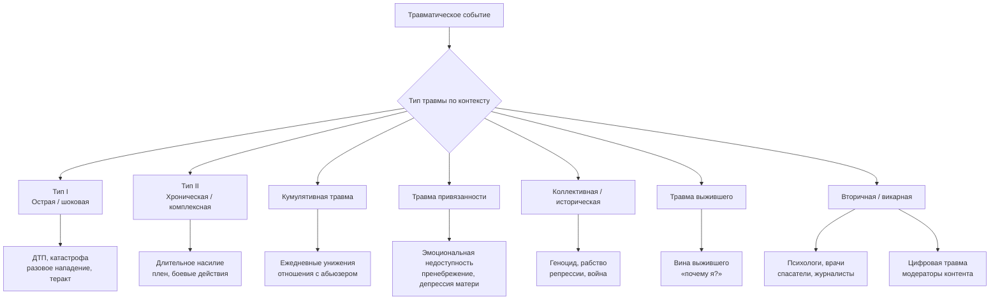
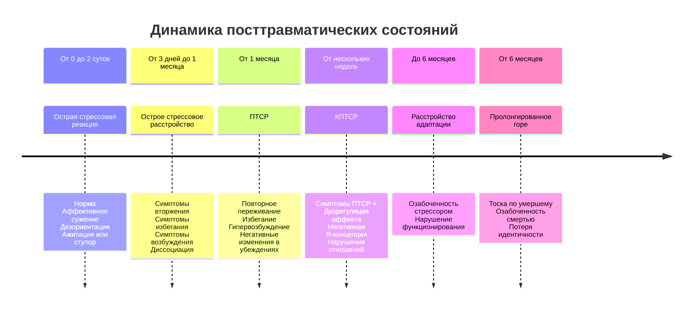

В 1766 году доктор Мати описал случай графа Лотарда — после падения с лошади у пациента развились параличи и нарушения памяти без органического поражения. Сегодня мы назвали бы это **острой стрессовой реакцией** или **диссоциативным расстройством**. Но два с половиной века потребовались, чтобы систематизировать знания о том, какие события приводят к травме и как различаются состояния, возникающие после них.

Не всякое стрессовое событие становится травматическим. И не всякая травматическая реакция достигает порога расстройства. Классификация нужна не для навешивания ярлыков, а для выбора адекватной помощи: экспозиционная терапия при ПТСР, работа с убеждениями при расстройстве адаптации, фармакотерапия при острой реакции, многолетняя интеграция при комплексной травме.

Эта статья — карта двух классификаций: **этиологической** (что случилось?) и **диагностической** (какие симптомы и как долго?). Они дополняют друг друга и необходимы каждому практикующему психологу.

## Две большие линии: возраст и контекст

Прежде чем делить травмы по содержанию событий, нужно ответить на два вопроса:

1. **Когда** произошла травма?
2. **Однократная** она или **повторяющаяся**, была ли возможность спастись?

### По возрасту возникновения

| Тип травмы | Краткое описание |
|-----------|------------------|
| **Травма развития (детская травма)** | От 0 до 18 лет. Возникает в критические периоды формирования нервной, эмоциональной и когнитивной систем. Наиболее разрушительна, поскольку деформирует саму архитектуру личности. Биография ребенка мала, способы совладания еще не сформированы. |
| **Взрослая травма** | Возникает у сформировавшейся личности. Даже будучи крайне тяжелой, оставляет больше внутренних ресурсов для переработки. |

Это различие определяет стратегию терапии. С детской травмой нужен комплексный, часто многолетний подход, включающий коррекцию привязанности, работу с убеждениями о себе и телесно-ориентированные методы. Взрослая травма при сохранном преморбидном фоне часто хорошо отвечает на краткосрочные протоколы (EMDR, пролонгированная экспозиция).

### По этиологии: семь типов травматического контекста

Этиологическая классификация отвечает на вопрос «**что именно произошло?**». Тип события предсказывает клиническую картину и прогноз.

**1. Травма типа I (острая, шоковая).** Результат одного, четко ограниченного во времени события. Человек знает дату и час, когда это произошло. Примеры: ДТП, землетрясение, разовое нападение, теракт. Даже если у человека было два разных ДТП — каждое считается отдельной травмой типа I.

**2. Травма типа II (хроническая, комплексная).** Повторяющиеся или продолжительные травмирующие события, от которых трудно или невозможно спастись. Человек находится в ситуации ловушки. Примеры: длительное физическое, сексуальное или эмоциональное насилие в детстве (травма развития), домашнее насилие, пребывание в зоне боевых действий, плен.

**3. Кумулятивная травма.** Термин Мазута Хана (1963). Множественные «небольшие» стрессы, каждый из которых по отдельности не достигает порога шоковой травмы, но накапливаясь, деформируют психику. Примеры: ежедневные унижения на работе, многолетнее нахождение в отношениях с нарциссической личностью, хроническое микро-пренебрежение в детстве.

**4. Травма привязанности.** Подвид комплексной травмы, возникающий в отношениях с человеком, обеспечивающим уход (caregiver), в детстве. Нарушает базовое чувство безопасности и доверия к миру. Примеры: пренебрежение потребностями ребенка, эмоциональная недоступность родителей, хроническая болезнь или зависимость матери (например, затяжная послеродовая депрессия).

**5. Коллективная / историческая травма.** Травма, пережитая большой группой — нацией, этносом, культурной группой. Передается через поколения (трансгенерационная травма). Примеры: геноцид (Холокост, геноцид армян), рабство, массовые репрессии, войны, крупные теракты.

**6. Травма выжившего (вина выжившего).** Возникает у людей, переживших катастрофу, в которой погибли другие. Центральный симптом — вопрос «почему я?» и связанные с ним вина и стыд. Примеры: выжившие в концлагерях, природных катастрофах, боевых действиях.

**7. Вторичная (викарная) травма.** Возникает у специалистов в результате эмпатического контакта с жертвами травмы и их историями. Примеры: синдром выгорания и ПТСР у психологов, врачей, спасателей, журналистов, освещающих зоны конфликтов. Особая форма — **цифровая травма** у модераторов контента, вынужденных просматривать сцены насилия, жестокости, смерти.

## Классификация по клиническим последствиям: что говорит МКБ-11 и DSM-5

Этиологическая классификация отвечает на вопрос «**почему?**». Диагностическая — на вопросы «**какие симптомы?**» и «**как долго?**». Это разные уровни описания. Человек может пережить хроническое насилие в детстве (этиология — травма типа II) и на момент обращения соответствовать критериям ПТСР, КПТСР, расстройства адаптации или не соответствовать ни одному диагнозу, но нуждаться в помощи.

### Эволюция диагностических систем: от МКБ-10 к МКБ-11 и DSM-5

| МКБ-10 | МКБ-11 | DSM-5 |
|--------|--------|-------|
| F43.0 Острая реакция на стресс | QE84 (не расстройство) | 308.3 Острое стрессовое расстройство |
| F43.1 ПТСР | 6B60 ПТСР | 309.81 (F43.10) ПТСР |
| F43.2 Расстройство приспособительных реакций | 6B43 Расстройство адаптации | F43.20-25 Расстройство адаптации |
| F43.8 Другие реакции на тяжелый стресс | 6B6Y Другие уточненные расстройства, связанные со стрессом | F43.8 Другие уточненные травматические и стрессовые расстройства |
| F43.9 Неуточненные травматические и стрессовые расстройства | 6B6Z Нарушения, связанные со стрессом, неуточненные | F43.9 Неуточненные травматические и стрессовые расстройства |
| F62.0 Стойкое изменение личности после переживания катастрофы | 6B41 Комплексное ПТСР | — |
| F43.8 Пролонгированное расстройство горя | 6B42 Затяжная патологическая реакция горя | F43.8 Пролонгированное расстройство горя |
| F94.1 Реактивное расстройство привязанности | 6B44 Реактивное расстройство привязанности | 313.89 Реактивное расстройство привязанности |
| F94.2 Расстройство расторможенной социальной вовлеченности | 6B45 Нарушение социального участия | 313.89 Расстройство расторможенной социальной вовлеченности |

**Ключевые изменения в МКБ-11:**
- Острая реакция на стресс выведена из раздела расстройств — это нормальный ответ на ненормальные обстоятельства.
- Введена категория **комплексного ПТСР (КПТСР)** как отдельный диагноз, а не просто «хроническое ПТСР».
- **Затяжная патологическая реакция горя** (пролонгированное расстройство горя) выделена в самостоятельную категорию.
- Уточнены критерии расстройства адаптации.
- ПТСР получил более узкое определение, исключающее неспецифические симптомы.

## Временная линия: от минут до десятилетий

Разные диагностические категории отличаются прежде всего **временем начала** и **длительностью** симптомов.

### 1. Острая стрессовая реакция (МКБ-10: F43.0; МКБ-11: QE84)

**Длительность:** от нескольких минут до 2–3 суток.

**Статус в МКБ-11:** не расстройство, а нормальная реакция на экстремальный стресс. Отнесена в раздел «Факторы, влияющие на состояние здоровья населения и обращения в учреждения здравоохранения».

**Клиническая картина:**
- «Оглушенность», сужение поля сознания, снижение внимания.
- Неспособность адекватно реагировать на внешние стимулы, дезориентация.
- Возможен уход от ситуации (диссоциативный ступор) или, напротив, ажитация и гиперактивность (реакция бегства).
- Вегетативные признаки панической тревоги: тахикардия, потение, покраснение.
- Частичная или полная амнезия стрессового события.

**Редкие формы:** пуэрилизм (инфантильное, ребячливое поведение взрослого человека — детские жесты, манеры, речь), синдром «одичания» (крайняя степень регресса).

**Условия лечения:** преимущественно амбулаторно. При тяжелых реакциях — кратковременная госпитализация. Фармакотерапия: анксиолитики, снотворные, антидепрессанты с седативным действием. Психотерапия: релаксация, когнитивно-бихевиоральная поддержка.

### 2. Острое стрессовое расстройство (DSM-5: 308.3)

**Длительность:** от 3 дней до 1 месяца.

В МКБ-11 отдельной категории нет — состояния этой длительности классифицируются как острая стрессовая реакция (если не набраны полные критерии) или ПТСР (если симптомы сохраняются более 2–4 недель). DSM-5 сохраняет эту категорию.

**Критерий А:** Воздействие фактической или угрожающей смерти, серьезной травмы, сексуального насилия (непосредственно, как свидетель, через близких, через экстремальное воздействие отвратительных деталей — кроме медиа, если это не связано с работой).

**Критерий В:** Наличие 9 и более симптомов из 5 категорий:

1. **Симптомы вторжения** — навязчивые воспоминания, тревожные сны, диссоциативные реакции (флешбэки), дистресс при напоминаниях.
2. **Негативное настроение** — стойкая неспособность испытывать положительные эмоции.
3. **Диссоциативные симптомы** — дереализация, деперсонализация, диссоциативная амнезия.
4. **Симптомы избегания** — избегание мыслей, чувств, внешних напоминаний.
5. **Симптомы возбуждения** — нарушения сна, раздражительность, проблемы с концентрацией, гипертрофированная реакция испуга.

**Важно:** острая стрессовая реакция может быть у любого человека. Острое стрессовое расстройство — уже патологический процесс, требующий вмешательства. Без лечения у значительной части развивается ПТСР.

### 3. Посттравматическое стрессовое расстройство (МКБ-11: 6B60; DSM-5: 309.81)

**Длительность:** более 1 месяца.

**МКБ-11 — три кластера симптомов:**

1. **Повторное переживание в настоящем времени.** Не просто воспоминание, а именно переживание «здесь и сейчас» — флешбэки, кошмары, сильные телесные ощущения, страх или ужас. Важно: повторное переживание должно быть именно в настоящем, а не просто грустные мысли о прошлом.
2. **Избегание.** Активное уклонение от мыслей, воспоминаний, людей, мест, ситуаций, напоминающих о травме.
3. **Постоянное чувство текущей угрозы.** Гипернастороженность, преувеличенная реакция вздрагивания. Человек живет в режиме «опасность рядом».

**DSM-5 — четыре кластера:**
- Вторжение (критерий В)
- Избегание (критерий С)
- Негативные изменения в когнициях и настроении (критерий D)
- Изменения в возбуждении и реактивности (критерий Е)

В DSM-5 добавлен **диссоциативный подтип** (деперсонализация/дереализация) и **подтип с отсроченным началом** (полная симптоматика проявляется не ранее 6 месяцев после травмы).

### 4. Комплексное посттравматическое стрессовое расстройство (МКБ-11: 6B41)

**Длительность:** от нескольких недель, обычно годы.

**Этиология:** воздействие стрессора, от которого трудно или невозможно спастись — хроническое сексуальное насилие в детстве, пытки, рабство, геноцид, длительное домашнее насилие, пребывание на войне в детском возрасте.

**Диагноз требует выполнения трех кластеров ПТСР (повторное переживание, избегание, чувство угрозы) плюс три дополнительных:**

1. **Нарушения регуляции аффекта.** Повышенная эмоциональная реактивность, отсутствие эмоций, диссоциативные состояния. Человек «не держит аффект» — может неконтролируемо рыдать от воспоминаний.
2. **Негативная Я-концепция.** Стойкие убеждения о себе как об униженном, побежденном, никчемном. Глубокие, всепроникающие чувства стыда, вины, несостоятельности.
3. **Нарушения в отношениях.** Трудности в поддержании близких связей, избегание отношений, незаинтересованность в социальной вовлеченности.

**Дифференциальный диагноз с пограничным расстройством личности (ПРЛ):**
- При КПТСР нет характерной для ПРЛ «шатающейся» самооценки — от «я звезда» до «я ничтожество». Самооценка при КПТСР устойчиво негативная.
- ПРЛ включает импульсивность и выраженный страх покидания, что не является центральным для КПТСР.
- Возможна коморбидность.

### 5. Расстройство адаптации (МКБ-11: 6B43; DSM-5: F43.20-25)

**Длительность:** до 6 месяцев после прекращения стрессора (или его последствий).

**Этиология:** идентифицируемый психосоциальный стрессор — развод, болезнь, экономические проблемы, конфликты. Событие может не быть «угрожающим жизни» в смысле критерия А ПТСР.

**Клиническая картина:**
- Озабоченность стрессором или его последствиями.
- Чрезмерное беспокойство, повторяющиеся удручающие мысли, руминации.
- Неспособность адаптироваться — нарушения в личной, семейной, профессиональной сферах.
- Симптомы не достигают порога ПТСР или депрессивного эпизода.

**Важно:** если стрессор сохраняется дольше 6 месяцев, расстройство может продолжаться, но диагноз остается.

**Распространенность:** от 5 до 21% в различных популяциях.

### 6. Затяжная патологическая реакция горя (пролонгированное расстройство горя) (МКБ-11: 6B42; DSM-5: F43.8)

**Длительность:** не менее 6 месяцев (для детей — не менее 6 месяцев; в DSM-5 для взрослых — не менее 12 месяцев).

**Этиология:** смерть близкого человека.

**Клиническая картина:**
- Стойкая тоска по умершему.
- Постоянная озабоченность мыслями об умершем или обстоятельствами смерти.
- Сопровождается сильной эмоциональной болью: грусть, вина, гнев, отрицание, обвинение.
- Ощущение утраты части себя.
- Трудности с позитивными воспоминаниями, эмоциональное оцепенение.
- Нарушения идентичности и социального функционирования.

**Дифференциация от нормального горя:** реакция явно превышает ожидаемые социальные, культурные и религиозные нормы для данной культуры.

**Клинический пример и интервенция:**
> Женщина не ходит в театр после смерти сына, объясняя: «Я не имею права на удовольствие, надо страдать».
>
> **Противоядие:** «Если бы сын мог вас услышать, чего бы он для вас хотел?»

## Эпидемиология и коморбидность

**Распространенность ПТСР:**
- В популяции: 1–3%.
- Среди комбатантов: 15–54%.
- Среди тяжелопострадавших в катастрофах: до 95%.
- В зависимости от типа травмы: от 7,6% (несчастные случаи) до 38,8% (боевые действия).

**Крупное исследование выживших после физической травмы (12 месяцев):**
- Депрессия — 16%
- ГТР — 11%
- Злоупотребление ПАВ — 10%
- ПТСР — 10%
- Агорафобия — 10%
- Социальная фобия — 7%
- Паническое расстройство — 6%
- ОКР — 4%

**Вывод:** ПТСР — преобладающее расстройство после травм, связанных с насилием. После физических травм спектр расстройств шире.

**ЧМТ и ПТСР:** у пациентов с легкой ЧМТ вероятность развития ПТСР, панического расстройства, агорафобии и социальной фобии в два раза выше. Последствия ЧМТ взаимодействуют со стрессом травматического повреждения.

## Практический алгоритм: как не запутаться

При работе с клиентом необходимо последовательно ответить на четыре вопроса:

1. **Было ли событие травматическим?** (критерий А — угроза жизни/целостности, субъективная или объективная)
2. **Как давно оно произошло?** (минуты, дни, месяцы, годы)
3. **Какие симптомы и сколько их?** (вторжение, избегание, возбуждение, диссоциация, нарушения Я-концепции)
4. **Есть ли повторяющиеся/хронические травмы, невозможность спасения?**

**Дифференциальные подсказки:**
- Если прошло меньше месяца — смотрим на количество симптомов и наличие диссоциации, чтобы отличить ОСР от острой реакции.
- Если больше месяца и есть полный набор симптомов трех кластеров — ПТСР.
- Если больше месяца, есть история хронической травмы и нарушения в трех дополнительных сферах — КПТСР.
- Если симптомы сосредоточены вокруг потери и тоски по умершему, длятся более полугода — пролонгированное горе.
- Если событие не угрожало жизни, но вызвало дезадаптацию, и прошло менее 6 месяцев — расстройство адаптации.

## Запомнить

1. **Этиологическая классификация описывает контекст.** Травма типа I (однократная, шоковая) и типа II (хроническая, комплексная) — базовое различие, предсказывающее клиническую картину и терапевтическую стратегию.

2. **Травма развития (до 18 лет) — особая категория.** Она деформирует формирующиеся системы мозга и личности, требует комплексного подхода и редко поддается краткосрочным протоколам.

3. **Временной критерий — главный дифференциальный инструмент.** Минуты-часы — острая реакция (норма). 3–30 дней — острое стрессовое расстройство. Более месяца — ПТСР. Более полугода после утраты — пролонгированное горе.

4. **КПТСР — отдельный диагноз, а не тяжелое ПТСР.** Три дополнительных кластера: дизрегуляция аффекта, негативная Я-концепция, нарушения отношений. От ПРЛ отличается устойчиво-негативной, а не колеблющейся самооценкой.

5. **В МКБ-11 острая реакция на стресс — не расстройство.** Это норма. Патологизация нормальных реакций на ненормальные события вредит.

6. **Одно событие — разные диагнозы.** Травма — причина, но не приговор. ПТСР развивается не у всех, а при сочетании восприятия невозможности бегства и отсутствия социальной поддержки.

7. **Дифференциальная диагностика обязательна.** Расстройство адаптации, депрессия, ПРЛ, биполярное расстройство, нарциссическое расстройство — каждое из этих состояний может маскироваться под ПТСР или сочетаться с ним.
